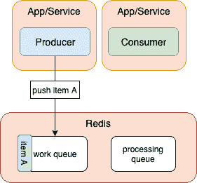
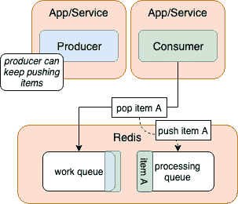
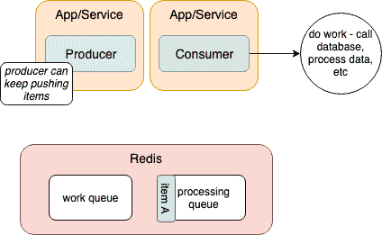
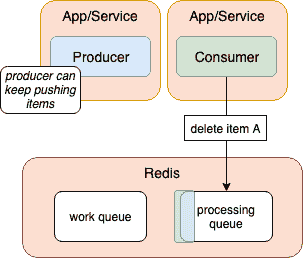

# 了解如何在节点中设计队列

> 原文：<https://dev.to/ccleary00/understand-how-to-approach-designing-queues-in-node-4dgk>

***原载于 [coreycleary.me](https://www.coreycleary.me/understand-how-to-approach-designing-queues-in-node/)** 。这是我的内容博客的交叉帖子。我每一两周发布一次新内容，如果你想直接在收件箱里收到我的文章，你可以[注册我的时事通讯](https://www.coreycleary.me/about/)！我也定期发送备忘单和其他赠品。*

一个您以前可能没有遇到过的新场景:您有一个长时间运行的任务(比如保存到一堆不同的数据库，或者处理视频),需要一段时间来处理，这导致您的 REST API 响应时间对于最终用户来说太慢了。

经过一些研究之后，您意识到在您的体系结构中添加一个队列可以解决您的问题。

唯一的问题是，弄清楚队列*实际上是如何工作的*会让**迷惑**。

您知道如何构建 REST API，这在您的经验和知识范围内。您以前已经构建过 API...

但是排队？你可能会觉得自己在盲目飞行。

如果您使用 Redis 来实现队列，您可能想知道 Redis 是如何作为队列的底层系统工作的...

但是，如果您理解相关的设计模式，并且能够利用 Redis 来构建生产质量的队列，会怎么样呢？

有了这些知识，除了构建基本的 REST API 之外，您还可以将架构模式添加到您的工具箱中。

除了让你的应用程序对调用你的 API 的任何东西做出更快的响应之外，能够在架构层面工作通常是让一个开发者成为高级开发者的原因。

在本帖中，我们将回顾队列如何工作的架构(使用可靠的队列模式),这样你就可以准确地完成这些事情。

### 什么是可靠的队列模式？

首先，让我们描述一个“正常”的队列。正常队列是生产者将消息/工作项推入队列，消费者将它从队列中取出并完成工作。

这很有效，但是并不可靠，也就是说信息可能会丢失。例如，当消费者从队列中取出消息时，如果出现网络故障，或者消费者在从队列中取出消息后崩溃，但还没有处理它/完成工作。

这就是可靠队列的用武之地。使用这种模式，消费者从队列中弹出，并立即将其推送到“处理”队列。所以这种模式下总会有两个队列。把它想象成一个备份。

当消费者处理完消息/处理完项目时，它会将它从处理队列中删除。

### 这在**图中是什么样子的**

上面的描述可能不会点击，直到你看到它用图表描述。让我们现在过一遍。

[](https://res.cloudinary.com/practicaldev/image/fetch/s--V01ja_us--/c_limit%2Cf_auto%2Cfl_progressive%2Cq_auto%2Cw_880/https://www.coreycleary.me/wp-content/uploads/2019/04/queue-architecture-01.png) 
首先，生产者将一个工作项推送到工作队列中。**工作**队列将包含待处理的项目。

在这里，我们使用 FIFO(先进先出)队列，所以项目将按顺序弹出队列。

请注意，“工作项目”是关于要处理的作业的元数据。可以把它想成“足够消费者接受并完成工作的信息”。

还要注意，如图所示，生产者和消费者通常是独立的服务。它们可以存在于同一个服务中，但是你会失去一些可靠性的好处。

可以有多个生产者和多个消费者，而不仅仅局限于一个生产者和一个消费者。

[](https://res.cloudinary.com/practicaldev/image/fetch/s--aX3bSK0c--/c_limit%2Cf_auto%2Cfl_progressive%2Cq_auto%2Cw_880/https://www.coreycleary.me/wp-content/uploads/2019/04/queue-architecture-02.png) 
记住队列是异步的，这很重要。但是我指出这一点是为了说明生产者可以在消费者处理商品的同时继续将商品推送到**工作**队列。(队列可以一直被填满)。

当生产者正在做它的事情时，消费者将从**工作**队列中取出下一个项目，并将其推入**处理**队列。

[](https://res.cloudinary.com/practicaldev/image/fetch/s--jGbjhINj--/c_limit%2Cf_auto%2Cfl_progressive%2Cq_auto%2Cw_880/https://www.coreycleary.me/wp-content/uploads/2019/04/queue-architecture-03.png) 
从那里，消费者将处理工作项。

[](https://res.cloudinary.com/practicaldev/image/fetch/s--Wi9WK1tN--/c_limit%2Cf_auto%2Cfl_progressive%2Cq_auto%2Cw_880/https://www.coreycleary.me/wp-content/uploads/2019/04/queue-architecture-04.png) 
物品被成功处理后，只有*然后*才会将其从**处理**队列中移除。我们将在查看代码时讨论这个问题，但是它将使用 Redis 命令 [`lrem`](https://redis.io/commands/lrem) 来删除它。该命令不会将项目从队列中弹出，而是将其完全删除。

### 这在**代码**中是什么样子

既然您已经从体系结构的角度了解了队列系统的工作原理，那么让我们来看看它在代码中是什么样子的。

在这个例子中，我们将把项目推到一个工作队列中，然后消费它们并将它们保存到一个数据库中。

### 生产者代码

让我们来看看我们将用来将项目推入队列的函数:

```
const pushToQueue = async (queueName, data) => {
  try {
    await lpush(queueName, data) // lpush comes from the Redis module
  } catch(e) {
    console.error(`Error pushing to queue: ${e}`)
  }
} 
```

`pushToQueue`函数将条目推入的队列名和推入队列的实际数据作为参数。

注意:我们使用 Redis 列表作为队列。Redis 中没有正式的队列数据类型，但是列表实际上只是队列。

`lpush`是一个 Redis 命令，用于将项目推到队列的左侧。稍后，我们会将它们从队列的右侧弹出，因此它充当 FIFO 队列。

然后我们使用这个函数将项目推入队列:

```
for (let i = 1; i <= 20; i++) {
  await pushToQueue(WORK_QUEUE, JSON.stringify({
    itemNum: i,
    isbn: 'default',
    timestamp: Date.now()
  }))
} 
```

出于演示的目的，我们在这里只是使用一个 For 循环来推送项目，但是在您的应用程序中，您将只是从任何产生稍后要做的工作的函数中调用`pushToQueue`。

我们将它作为一个字符串存储在 Redis 队列中，因为我们不能存储 JavaScript 对象。我们将在以后实际获取项目时`JSON.parse()`它。

### 消费者代码

现在我们已经讨论了生产者代码，让我们看看消费者代码。

消费者有几项主要义务:

1)监控工作队列中的新工作
2)从队列中获取工作数据
3)执行工作

我们将首先讨论职责 2 和 3，然后回到如何监控工作队列

### 获得并完成工作

我们获取和完成工作的函数如下:

```
const getWork = async (workQueue, processingQueue) => {
  try {
    // this removes from work queue
    return await rpoplpush(workQueue, processingQueue)
  } catch(e) {
    throw new Error(e)
  }
}

const doWork = async (workItem, processingQueue) => {
  const {itemNum, isbn} = JSON.parse(workItem)

  try {
    await insert('books', itemNum, isbn)
    await lrem(processingQueue, 1, workItem)
  } catch(e) {
    throw new Error(e)
  }
} 
```

当我们从工作队列中获取工作项目时，我们使用 Redis' `rpoplpush`命令从工作队列中弹出项目，并立即将其推送到处理队列中进行跟踪。`getWork`函数完成这项工作，并返回工作项数据本身。这样一来，当开始工作时，我们已经有数据在手。

`doWork`函数获取工作项数据，将其解析回一个对象，并析构我们需要的数据。

从这里，我们将该工作项的数据插入到数据库中，然后从处理队列中删除该项。这项工作已经完成，我们对这项工作的跟踪也完成了！

注意，我们可以使`doWork`函数更加通用，将指定要完成的工作的实际函数作为参数。如果你愿意，这是一个小的改进。

### 移除项目与弹出项目

[`lrem`](https://redis.io/commands/lrem) ，我们在`doWork`函数中用来移除项的，是一个 Redis 命令，用于**从队列中移除**项，而不是**从队列中弹出**项。

此时，我们已经成功地完成了工作/处理了数据，因此从处理队列*中弹出该项将会*移除它，但是还会将数据返回给我们。不过，这些数据现在已经没有用了，所以我们可以保存这一步，只需完全删除该项目。

### 监控工作队列

现在，为了监视要完成的工作的工作队列，需要几个步骤:

1)检查工作队列是否仍有项目要处理
2)如果工作队列中有项目，获取工作并执行工作

我们来看代码:

```
const checkQueueHasItems = async (queueName) => {
  return !!(await lrange(queueName, 0, -1)).length
} 
```

这里我们使用 Redis' `lrange`命令来检查仍然在队列中的项目。这个命令返回一个数组，所以我们检查这个数组是否有长度。如果它是空的，我们返回 false。如果它仍然有项目，我们返回真。

```
const run = (async() => {  
  let workQueueHasItems = await checkQueueHasItems(WORK_QUEUE)

  while (workQueueHasItems) {
    // not necessary, just to be able to see the console logging output more easily
    await sleep(500)

    let workItem

    try {
      workItem = await getWork(WORK_QUEUE, PROCESSING_QUEUE)
    } catch(e) {
      console.error(`Error getting work item from ${PROCESSING_QUEUE} queue: ${e}`)
    }

    try {
      await doWork(workItem, PROCESSING_QUEUE)
      console.log(`completed work item: ${workItem}`)
    } catch(e) {
      console.error(`Error doing work from ${PROCESSING_QUEUE} queue: ${e}`)
    }

    workQueueHasItems = await checkQueueHasItems(WORK_QUEUE)
  }

  process.exit()
})() 
```

最后，我们使用 while 循环来检查工作队列是否还有条目，然后我们调用上面提到的`getWork`和`doWork`函数。

在一个生产应用程序中，您会希望保持对工作项的轮询(可能在一个`setInterval()`上)，但是为了演示的目的，我们在这里只使用一个 while 循环。当工作队列中的所有项目都处理完后，流程将退出。

为了让您更直观地了解它是如何运行的:

[](https://res.cloudinary.com/practicaldev/image/fetch/s--7A1Pgp2U--/c_limit%2Cf_auto%2Cfl_progressive%2Cq_66%2Cw_880/https://www.coreycleary.me/wp-content/uploads/2019/04/queue.gif)

### 还有一件事，监视失败的处理队列

请记住，可靠队列模式的要点是可靠。如果我们最终遇到了本文开头描述的失败之一，该怎么办？即消费者在获取工作后崩溃或在工作处理期间失败？

幸运的是，通过我们这里的设计，这些项目将作为备份保留在处理队列中。

但是我们需要监控处理队列，以防一些项目在那里滞留一段时间。如果它们已经存在了一段时间，这意味着我们在更早的时候遇到了消费者故障，需要“重新排队”这些项目。

让我们来看看这段代码:

```
const peek = async (queueName) => {
  // returns first item data without popping it
  const item = await lrange(queueName, 0, 0)

  if (item.length) {
    // lrange returns array of one item, so we need to return the item, not the array
    const itemFromArray = item[0]
    return JSON.parse(itemFromArray)
  }

  return null
} 
```

`peek`允许用户查看队列最前面的项目，而无需将其弹出/从队列中移除。这是必要的，以便我们可以检查该项目的时间戳，并确定它已经存在了多长时间！但是显然我们还不想删除它，我们只是想检查它已经存在了多长时间，以防我们需要对它重新排队。

因为我们正在轮询这个队列，所以只检查第一个项目来查看它是否过时是可以的。因为它是“最老”的，所以它会是第一个变得陈旧的。如果它*是*陈旧的，在我们重新查询它之后，我们将检查下一个最老的项目。这样就可以清空队列了。

```
const requeue = async (workQueue, processingQueue, workItem) => {
  const stringifiedWorkItem = JSON.stringify(workItem)

  try {
    await client
      .multi()
      .lpush(workQueue, stringifiedWorkItem)
      .lrem(processingQueue, 1, stringifiedWorkItem)
      .exec()
  } catch(e) {
    throw new Error(e)
  }
} 
```

`requeue`会将项目推回**工作队列**，这样我们就可以重新开始这个过程。这只是在我们在**处理队列**中遇到一个陈旧的项目的情况下(例如，消费者崩溃，数据库插入失败，等等。).

注意，这里使用 Redis' `multi`命令，它允许原子操作。这个操作需要是原子的，因为我们需要推到工作队列并从处理队列中移除，而不会受到可能连接的任何其他 Redis 客户端(即任何其他消费者)的干扰。

否则，我们可能会以两个消费者中断进程而告终，当项目已经被推送到工作队列时，他们试图再次将项目推送到工作队列，但是在它被从处理队列中移除之前。

```
const checkStales = async (workQueue, processingQueue, timeout) => {
  const processingQueueItem = await peek(processingQueue)

  if (!processingQueueItem || !processingQueueItem.timestamp) return null

  const timeSpentInQueue = Date.now() - processingQueueItem.timestamp

  if (timeSpentInQueue > timeout) {
    // if it fails, next consumer will try again, no try/catch needed
    return await requeue(workQueue, processingQueue, processingQueueItem)
  }

  return null
} 
```

`checkStales`函数检查进程队列中是否有项目已经存在太长时间。它将队列前面的项目的时间戳与我们作为参数指定的超时进行比较。如果它在那里的时间超过了超时时间，我们就对它重新排队。

### 我们改进的监控/运行功能

然后，我们只需要修改 monitoring/run 函数，以便在 polling / while 循环中检查过时的项目。这只是调用`checkStales`函数的问题，但是我将在这里展示整个函数:

```
const run = (async() => {  
  let workQueueHasItems = await checkQueueHasItems(WORK_QUEUE)

  while (workQueueHasItems) {
    // first, check stale items in processing queue
    await checkStales(WORK_QUEUE, PROCESSING_QUEUE, 120000) // 2 minute stale time

    // not necessary, just to be able to see the console logging output more easily
    await sleep(500)

    let workItem

    try {
      workItem = await getWork(WORK_QUEUE, PROCESSING_QUEUE)
    } catch(e) {
      console.error(`Error getting work item from ${PROCESSING_QUEUE} queue: ${e}`)
    }

    try {
      await doWork(workItem, PROCESSING_QUEUE)
      console.log(`completed work item: ${workItem}`)
    } catch(e) {
      console.error(`Error doing work from ${PROCESSING_QUEUE} queue: ${e}`)
    }

    workQueueHasItems = await checkQueueHasItems(WORK_QUEUE)
  }

  process.exit()
})() 
```

### 包扎

下一次当您面临需要卸载以供以后处理的繁重/较长的操作时，请将此作为实现队列的起点。你将不仅有一个更好的起点，你将能够理解更多的架构。

只是一个注释队列设计可以根据应用程序的需求而变化。分布式、故障转移，可能需要您稍微不同地设计您的队列，但是这将使您起步并运行。

感觉您还没有完全掌握 Node 中的架构概念？或者想知道您是否遵循了最佳实践？我每一两周发布一次关于 JavaScript 和 Node 的新帖子，包括日志、测试和架构。再次点击链接订阅我的时事通讯！