# Fullstack React.js 开发者路线图

> 原文：<https://dev.to/javinpaul/the-2019-react-developer-roadmap-54ca>

*披露:这篇文章包括附属链接；如果您从本文提供的不同链接购买产品或服务，我可能会收到报酬。*

[React JS](https://reactjs.org/)或简称为 [React](https://reactjs.org/) 是开发 web 应用前端或 GUI 的领先 JavaScript 库之一。

在脸书的支持下，React.js 近年来突飞猛进，成为基于组件的 GUI 开发的事实上的库。

虽然有其他前端框架，如 [Angular](http://javarevisited.blogspot.sg/2018/01/10-frameworks-java-and-web-developers-should-learn.html) 和 [Vue.js](http://bit.ly/2ngYICV) 可用，但 sets 与其他框架不同的地方可能是它只专注于基于组件的 GUI 开发，而没有侵入其他领域。

例如， [Angular](https://javarevisited.blogspot.com/2018/06/5-best-courses-to-learn-angular.html) 是一个完整的框架，为您提供了许多开箱即用的特性，如[依赖注入](https://javarevisited.blogspot.com/2015/06/difference-between-dependency-injection.html)，路由系统，表单处理，HTTP 请求，动画，i18n 支持，以及一个强大的模块系统，具有轻松的延迟加载功能。

所以，如果你已经有库来做这些事情，或者你可能不需要它们，那么 React.js 是一个很好的选择，但是学习 React 并不容易，特别是如果你是 web 开发的新手。

今年开始学 [React JS](https://javarevisited.blogspot.com/2018/08/top-5-react-js-and-redux-courses-to-learn-online.html) 的时候，有一些 web 开发的背景，之前用过 [HTML](http://www.java67.com/2018/02/5-free-html-and-css-courses-to-learn-web-development.html) 、 [CSS](http://javarevisited.blogspot.sg/2018/01/top-10-udemy-courses-for-java-and-web-developers.html) 、 [JavaScript](http://bit.ly/2QlikCB) ，对前端开发也略知一二，但是学 React JS 也是费尽周折。其实我还在学。

当我在做一些关于如何正确学习 React JS 的研究时，我看到了[这个](https://github.com/adam-golab/react-developer-roadmap/blob/master/roadmap.png)优秀的 React 开发者路线图，它概述了什么是必须的，什么是应该知道的，以及作为 React 开发者你可以学习的一些额外的东西。

这个 React 开发者路线图是由[亚当-戈拉布](https://github.com/adam-golab/react-developer-roadmap/blob/master/roadmap.png) 创建的，它概述了成为 React 开发者你可以选择的途径和你想要学习的库。

所以，如果你想知道作为一名 React 开发人员，你下一步应该学什么？那么这个路线图可以帮助你。

与令人敬畏的 [Web 开发者路线图](https://hackernoon.com/the-2019-web-developer-roadmap-ab89ac3c380e)和 [DevOps 路线图](https://hackernoon.com/the-2018-devops-roadmap-31588d8670cb?gi=1490c6cb9f25)类似，React JS 路线图也非常适合探索 React，你可以利用它成为更好的 React 开发者。

但是，如果你想知道在哪里学习这些强制性的技能，那么不要担心，我也分享了一些免费和付费的在线课程，你可以学习这些技能。

## React 开发者路线图

无论如何，这是我所说的 React 开发者路线图:

[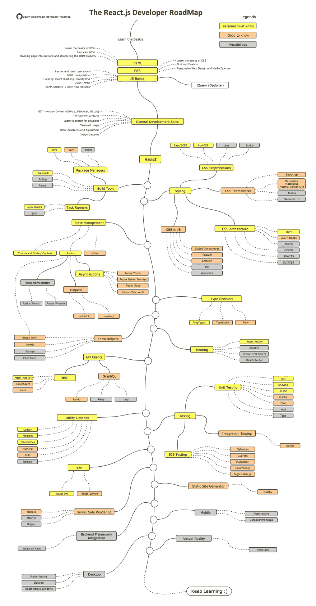](https://res.cloudinary.com/practicaldev/image/fetch/s--QnGMUmJN--/c_limit%2Cf_auto%2Cfl_progressive%2Cq_auto%2Cw_880/https://dev-to-uploads.s3.amazonaws.com/i/bbkej165zj1jrhy7w5f4.png)

图片来源:[https://github . com/Adam-golab/react-developer-roadmap/blob/master/roadmap . png](https://github.com/adam-golab/react-developer-roadmap/blob/master/roadmap.png)

现在，让我们一步一步地浏览路线图，了解如何学习成为 React 开发人员的基本技能:

### 1。基础

无论你学习哪个框架或库进行 web 开发，你都必须知道基础知识，我说的基础知识是指 [HTML](https://medium.com/javarevisited/10-best-html-and-css-courses-for-beginners-in-2021-6757eec00032) 、 [CSS](https://javarevisited.blogspot.com/2020/09/top-5-css-cascading-style-sheet-courses-for-beginners.html) 和 [JavaScript](https://medium.com/javarevisited/10-best-online-courses-to-learn-javascript-in-2020-af5ed0801645) ，这三者是 web 开发的三大支柱。

HTML \
它是网页开发者的第一支柱之一，也是最重要的技能，因为它为网页提供了结构。

如果你想学习 HTML，可以在 Udemy 上查看[用 HTML5 和 CSS3](http://bit.ly/2DCAqNE) 课程构建响应式真实世界网站。

[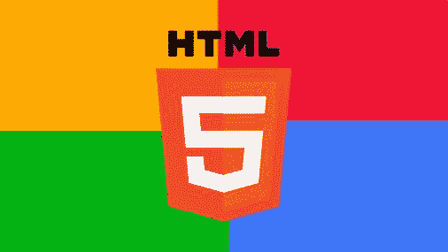](http://bit.ly/2DCAqNE)

[用 HTML5 和 CSS3 构建响应迅速的真实世界网站](http://bit.ly/2DCAqNE)

如果你不介意从免费资源中学习，那么你也可以看看我的免费 HTML 课程列表。

CSS \
它是网页开发的第二大支柱，用来设计网页的样式，使它们看起来更好。如果你想学习 CSS，你可以在我的[免费网络开发课程](http://www.java67.com/2018/03/top-5-free-courses-to-learn-web-development.html)列表中找到一些免费的 CSS 课程。

这是网络开发的第三个支柱，用于使你的网页具有交互性。这也是 React 框架背后的原因，因此在尝试学习 React JS 之前，您应该了解 JavaScript 并很好地了解它。

如果你想从零开始学习 JavaScript，我建议加入[完整的 JavaScript 课程:构建真实项目！](http://bit.ly/2DAthxz)课程。简直牛逼。

[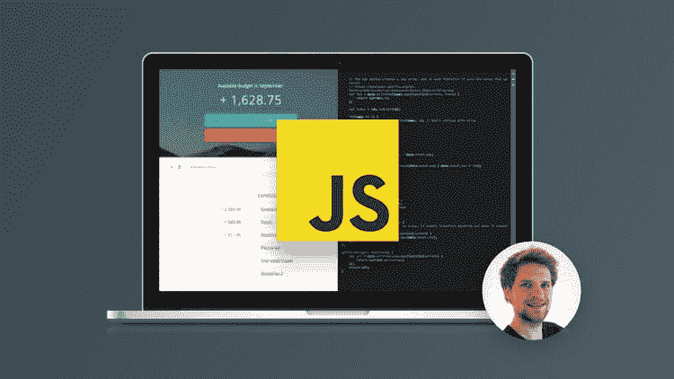](http://bit.ly/2DAthxz)

首先，你也可以看看我的免费 JavaScript 课程列表。

顺便说一句，与其单独学习这些技术，不如参加一个完整的网络开发课程，比如柯尔特·斯蒂尔的**网络开发训练营，它会教你成为网络开发人员所需的所有基本技能。**

 **[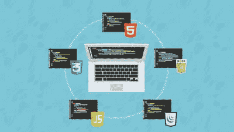](https://click.linksynergy.com/fs-bin/click?id=JVFxdTr9V80&subid=0&offerid=323058.1&type=10&tmpid=14538&RD_PARM1=https%3A%2F%2Fwww.udemy.com%2Fthe-web-developer-bootcamp%2F)

* * *

### 2。一般发展技能

无论你是前端开发人员还是后端开发人员，甚至是全栈软件工程师，都无关紧要。你必须知道一些通用的开发技巧才能在编程世界生存，下面是其中一些技巧的列表

2.1 学习 GIT \
如果你想成为一名软件开发人员，你必须绝对了解 [Git](https://javinpaul.medium.com/top-10-free-courses-to-learn-git-and-github-best-of-lot-967aa314ea) 。尝试在 Github 上创建几个库，与他人共享您的代码，并学习如何在您喜欢的 IDE 上从 GitHub 下载代码。

如果你想学习，那么[Git Complete:Git](http://bit.ly/2C0O0cH)的明确的、一步一步的指南是一个很好的课程。

如果你需要更多的选择，并且不介意从免费资源中学习，那么你也可以探索我的免费课程列表来学习 Git 。

**2.2 了解 HTTP(S)协议** \
如果你想成为一名 web 开发人员，那么了解 HTTP 并熟知它是绝对必须的。

我不是要求你阅读规范，但你至少应该熟悉常见的 HTTP 请求方法，如 [GET](http://javarevisited.blogspot.sg/2012/03/get-post-method-in-http-and-https.html) 、 [POST](https://javarevisited.blogspot.com/2016/04/what-is-purpose-of-http-request-types-in-RESTful-web-service.html) 、 [PUT](https://javarevisited.blogspot.com/2016/10/difference-between-put-and-post-in-restful-web-service.html) 、补丁、删除、选项，以及 HTTP/HTTPS 的一般工作方式。

* * *

**2.3。学习终端** \
虽然前端开发人员并不一定要学习 Linux 或者终端，但是我强烈建议你熟悉终端，配置你的 shell (bash，zsh，csh)等等。如果你想学习终端和 bash，那么我建议你看看 Udemy 上的这个 [Linux 命令行基础](http://bit.ly/2QJoTzn)课程。

如果你需要更多的选择，你也可以探索我为开发者提供的免费 Linux 课程列表。

**2.4。算法和数据结构** \
这也是一项通用的编程技能，不一定需要成为一名 React 开发人员，但绝对需要成为一名程序员。

要学习数据结构和算法，你要么读几本书，要么参加一个好的课程，如[算法和数据结构第 1 部分和第 2 部分](https://pluralsight.pxf.io/c/1193463/424552/7490?u=https%3A%2F%2Fwww.pluralsight.com%2Fcourses%2Fads-part1)。

如果需要更多选择，还可以查看我的[免费数据结构与算法课程](https://javarevisited.blogspot.com/2018/01/top-5-free-data-structure-and-algorithm-courses-java--c-programmers.html)列表。

而且，如果你爱书胜过爱课程，这里有一份每个开发者都应该阅读的 [10 本算法书](http://www.java67.com/2015/09/top-10-algorithm-books-every-programmer-read-learn.html)的清单。

**2.5。学习设计模式** \
就像算法和数据结构一样，[学习设计模式](https://www.java67.com/2022/03/top-5-free-courses-to-learn-design.html)并不是成为 React 开发人员的必要条件，但是通过学习它，你会对自己大有裨益。

> 设计模式是软件开发中常见问题的屡试不爽的解决方案。

了解它们将有助于你找到一个经得起时间考验的解决方案。你可以阅读一些关于设计模式的书籍来学习它们，或者参加一个综合课程，比如[设计模式库](https://pluralsight.pxf.io/c/1193463/424552/7490?u=https%3A%2F%2Fwww.pluralsight.com%2Fcourses%2Fpatterns-library)。

[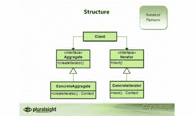](https://pluralsight.pxf.io/c/1193463/424552/7490?u=https%3A%2F%2Fwww.pluralsight.com%2Fcourses%2Fpatterns-library)

如果你需要更多的选择，你也可以查看[我的 OOP 和设计模式课程清单](https://javarevisited.blogspot.com/2018/08/5-object-oriented-programming-and-design-courses-for-Java-programmers.html)来获得更多的想法。

* * *

### 3。学习反应 JS

现在，这是**主交易**。要成为一名 React 开发人员，你必须学习 React 并学好它。[学习 React](https://medium.com/javarevisited/6-best-websites-to-learn-react-js-coding-for-free-ba7ec5c43433) 的最好地方是官方网站，但作为初学者，它可能会让你有点不知所措。

这就是为什么我建议你参加一些课程，比如 Max 的 React 大师班或 Stephen Grider 的 React 和 Redux，以学习如何更好地做出反应。这两门课是我最喜欢的 React 课程，也受到了成千上万 web 开发人员的信任。

如果你对你的反应技能很认真，我强烈建议你去看看这些课程。

*   [React 16-Max 的完整指南](https://click.linksynergy.com/fs-bin/click?id=JVFxdTr9V80&subid=0&offerid=508237.1&type=10&tmpid=14538&RD_PARM1=https%3A%2F%2Fwww.udemy.com%2Freact-the-complete-guide-incl-redux%2F)
*   斯蒂芬·格里德的《现代反应与还原》

而且，如果你不介意从免费资源中学习，那么你也可以看看这个免费 React JS 课程列表。

[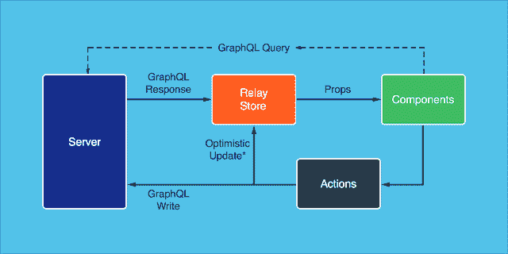](https://click.linksynergy.com/fs-bin/click?id=JVFxdTr9V80&subid=0&offerid=508237.1&type=10&tmpid=14538&RD_PARM1=https%3A%2F%2Fwww.udemy.com%2Freact-the-complete-guide-incl-redux%2F)

* * *

### 4。了解构建工具

如果你想成为一名专业的 React 开发人员，那么你应该花一些时间来熟悉你作为一名 web 开发人员将要使用的工具，比如构建工具、单元测试工具、调试工具等等。

首先，这里是路线图中提到的一些构建工具:

**包管理器**

*   [npm](https://javarevisited.blogspot.com/2021/12/top-5-courses-to-learn-npm-and-webpack.html)
*   故事
*   pnpm
*   任务执行者
*   npm 脚本
*   吞咽
*   网络包
*   到达
*   包裹

Btw，这些工具学不学都不重要，初学者只学 npm 和 Webpack 应该就够了。一旦您对 web 开发和 React 生态系统有了更多的了解，您就可以探索其他工具了。

如果你想学习 Webpack，那么 [**Webpack 2:完整的开发者指南**](http://bit.ly/2QEJlB8) 是一个很好的起点。

### 5。式样

如果你的目标是成为像 React 开发人员那样的前端开发人员，那么了解一点风格不会有什么坏处。尽管路线图提到了很多东西，比如 CSS 预处理程序、CSS 框架、CSS 架构和 JS 中的 CSS。

我建议你至少学习 Bootstrap，这是你最终会不时用到的最重要的 CSS 框架。如果你需要一门课程，从零开始的 5 个项目的引导是一门很方便的课程。

而且，如果你想学习 bootstrap，如果你想领先一步，你也可以学习 Materialize 或者 Material UI。

* * *

### 6。状态管理

这是 React 开发人员需要关注的另一个重要领域。路线图提到了需要掌握的以下概念和框架:

*   组件状态/上下文 API
*   Redux
*   异步操作(副作用)
*   [Redux Thunk](https://www.java67.com/2021/09/what-is-redux-thunk-in-reactjs-example.html)
*   Redux 最好的承诺
*   Redux 传奇
*   重复可观察
*   助手
*   复赛
*   重新选
*   数据持久性
*   Redux 持续
*   Redux 凤凰
*   冗余形式
*   MobX

如果这对你来说听起来太多了，我建议你只关注 Redux，它很棒，Stephen Grider 有一个很棒的课程，可以很好地学习 Redux 框架。

Max 的 [**React 16-完全指南**](https://javarevisited.blogspot.com/2018/08/top-5-react-js-and-redux-courses-to-learn-online.html) 和 Stephen Grider 的 [Modern React with Redux](https://click.linksynergy.com/fs-bin/click?id=JVFxdTr9V80&subid=0&offerid=323058.1&type=10&tmpid=14538&RD_PARM1=https%3A%2F%2Fwww.udemy.com%2Freact-redux%2F) 课程也非常详细地涵盖了 React 和 Redux 中的状态管理。

[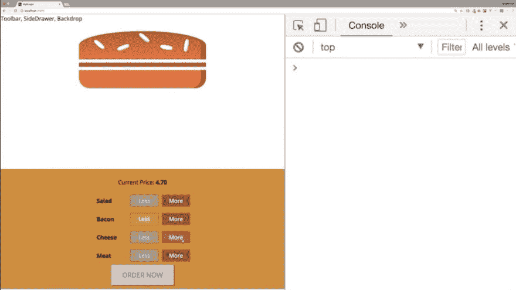](https://javarevisited.blogspot.com/2018/08/top-5-react-js-and-redux-courses-to-learn-online.html)

[**反应过来 16-完整指南**](https://javarevisited.blogspot.com/2018/08/top-5-react-js-and-redux-courses-to-learn-online.html)

### 7。类型检查器

由于 [JavaScript](https://medium.com/javarevisited/12-free-courses-to-learn-javascript-and-es6-for-beginners-and-experienced-developers-aa35874c9a32) 不是一种强类型语言，你没有足够的编译器来捕捉那些与类型相关的错误。

随着你的应用程序的增长，你可以通过类型检查发现很多错误，特别是如果你可以使用像 Flow 或 [TypeScript](https://javarevisited.blogspot.com/2018/07/top-5-courses-to-learn-typescript.html) 这样的 JavaScript 扩展来对你的整个应用程序进行类型检查。

但是，即使您不使用这些，React 也有一些内置的类型检查功能，学习它们可以帮助您尽早发现错误。

由于 Angular 也使用 TypeScript，我认为值得学习 TypeScript 和 JavaScript，如果你也这样认为，那么你可以在 Udemy 上查看[**Ultimate TypeScript**](https://javarevisited.blogspot.com/2018/07/top-5-courses-to-learn-typescript.html#axzz5QyVwWVg3)课程。

[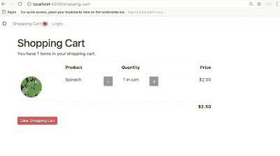](https://javarevisited.blogspot.com/2018/07/top-5-courses-to-learn-typescript.html#axzz5QyVwWVg3)

[**终极打字稿**](https://javarevisited.blogspot.com/2018/07/top-5-courses-to-learn-typescript.html#axzz5QyVwWVg3)

而且，如果你需要更多的选择，并且不介意从免费资源中学习，那么你也可以看看我为 web 开发人员提供的免费类型脚本课程列表。

**8。表单助手** \
除了类型检查器，学习像 Redux Form 这样的表单助手也很好，它提供了在 [Redux](https://javarevisited.blogspot.com/2018/08/top-5-react-js-and-redux-courses-to-learn-online.html) 中管理表单状态的最佳方式。除了 Redux Form，您还可以看看 Formik、Formsy 和 Final form。

**9。路由组件是 React 强大的声明式编程模型的核心，路由组件是任何应用程序的重要组成部分。**

React Router 提供了一组导航组件，这些组件以声明方式与您的应用程序组合在一起。

无论您是想要为您的 web 应用程序提供可添加书签的 URL，还是想要在 React Native 中以可组合的方式导航，React Router 都可以在 React 渲染的任何地方工作。

除了 React-Router，您还可以看看 Router 5、Redux-First 路由器和 React 路由器。

马克斯的 [**React 16 -完全指南**](https://javarevisited.blogspot.com/2018/08/top-5-react-js-and-redux-courses-to-learn-online.html) 和斯蒂芬·格里德的 [Modern React with Redux](https://click.linksynergy.com/fs-bin/click?id=JVFxdTr9V80&subid=0&offerid=323058.1&type=10&tmpid=14538&RD_PARM1=https%3A%2F%2Fwww.udemy.com%2Freact-redux%2F) 课程也详细介绍了 React 路由器。

[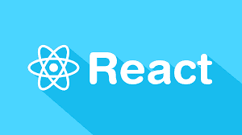](https://click.linksynergy.com/fs-bin/click?id=JVFxdTr9V80&subid=0&offerid=323058.1&type=10&tmpid=14538&RD_PARM1=https%3A%2F%2Fwww.udemy.com%2Freact-redux%2F)

[现代反应与还原](https://click.linksynergy.com/fs-bin/click?id=JVFxdTr9V80&subid=0&offerid=323058.1&type=10&tmpid=14538&RD_PARM1=https%3A%2F%2Fwww.udemy.com%2Freact-redux%2F)

### 10。API 客户端

在今天的世界里，你很少会构建一个孤立的 GUI，相反，你更有可能会构建一些使用 API 如 [REST](https://click.linksynergy.com/fs-bin/click?id=JVFxdTr9V80&subid=0&offerid=508237.1&type=10&tmpid=14538&RD_PARM1=https%3A%2F%2Fwww.udemy.com%2Frest-api%2F) 和 [GraphQL](https://click.linksynergy.com/fs-bin/click?id=JVFxdTr9V80&subid=0&offerid=508237.1&type=10&tmpid=14538&RD_PARM1=https%3A%2F%2Fwww.udemy.com%2Fgraphql-with-react-course%2F) 与其他应用程序通信的东西。

幸运的是，React 开发人员可以使用许多 API 客户端，下面是其中的一个列表:

**休息**

*   取得
*   超级代理
*   阿克斯

**图表 QL**

*   阿波罗
*   继电器
*   urql

Apollo Client 是我最喜欢的，它提供了一种使用 GraphQL 构建客户端应用程序的简单方法。该客户端旨在帮助您快速构建一个使用 GraphQL 获取数据的 UI，并且可以与任何 JavaScript 前端一起使用

Btw，如果你不知道 GraphQL 和 REST，我建议你花点时间学习它们。如果你需要课程，以下是我的建议:

*   [GraphQL with React:完整的开发者指南](https://click.linksynergy.com/fs-bin/click?id=JVFxdTr9V80&subid=0&offerid=508237.1&type=10&tmpid=14538&RD_PARM1=https%3A%2F%2Fwww.udemy.com%2Fgraphql-with-react-course%2F)
*   [REST API 设计、开发&管理](https://click.linksynergy.com/fs-bin/click?id=JVFxdTr9V80&subid=0&offerid=508237.1&type=10&tmpid=14538&RD_PARM1=https%3A%2F%2Fwww.udemy.com%2Frest-api%2F)

[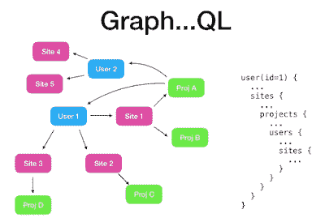](https://click.linksynergy.com/fs-bin/click?id=JVFxdTr9V80&subid=0&offerid=508237.1&type=10&tmpid=14538&RD_PARM1=https%3A%2F%2Fwww.udemy.com%2Fgraphql-with-react-course%2F)

### 11。实用程序库

这些是使你的工作更容易的库。React 开发人员可以使用许多实用程序库，如下所示:

*   洛达什
*   瞬间
*   同班同学
*   数字
*   RxJS
*   拉姆达

我不建议你学习所有这些，路线图也是如此。如果你仔细看，只有 Lodash、Moment 和 Classnames 是用黄色画出来的，说明你应该从它们开始。

**12。测试** \
现在，这是 React 开发人员经常被忽视的重要技能之一，但如果你想在竞争中保持领先，那么你应该专注于学习[库](https://javarevisited.blogspot.com/2018/01/10-unit-testing-and-integration-tools-for-java-programmers.html)，这将在测试中帮助你。这里也有用于单元测试、集成测试和端到端测试的库。

下面是路线图中提到的库列表:\
**单元测试**

*   玩笑
*   酶
*   不然呢
*   摩卡
*   柴
*   自动话频警报器(automatic voice alarm)ˌ视听教具(audiovisual aids)
*   磁带

**端到端测试**

*   [Selenium，Webdriver](https://javarevisited.blogspot.com/2018/02/top-5-selenium-webdriver-with-java-courses-for-testers.html)
*   柏树
*   操纵木偶的人
*   cumber.js
*   守夜人. js

**集成测试**

*   因果报应

你可以学习你想要的库，但是推荐 Jest 和 Enzyme。 [**完整的 React Web 开发者课程(带 Redux)**](https://click.linksynergy.com/fs-bin/click?id=JVFxdTr9V80&subid=0&offerid=508237.1&type=10&tmpid=14538&RD_PARM1=https%3A%2F%2Fwww.udemy.com%2Freact-2nd-edition%2F) 还包括测试 React 应用，涵盖 Jest 和 Enzyme。

[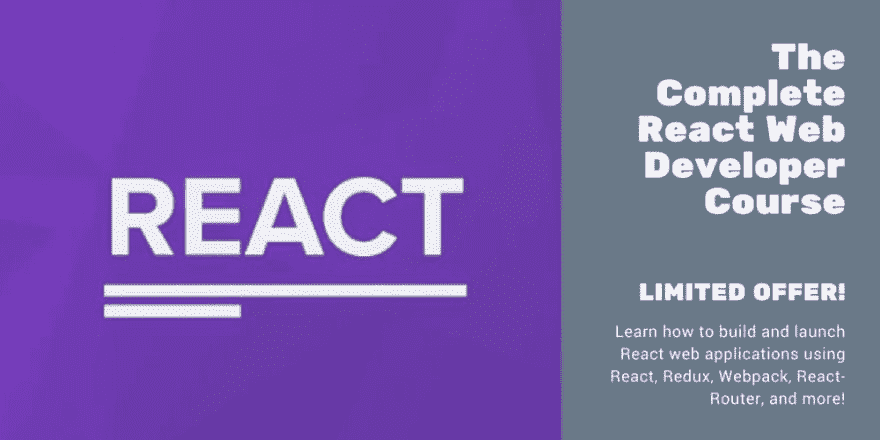](https://click.linksynergy.com/fs-bin/click?id=JVFxdTr9V80&subid=0&offerid=508237.1&type=10&tmpid=14538&RD_PARM1=https%3A%2F%2Fwww.udemy.com%2Freact-2nd-edition%2F)

13。国际化 \
这是开发全球通用的前端的另一个重要课题。您可能需要支持日本、中国、西班牙和其他欧洲国家的本地 GUI 版本。

路线图建议您学习以下技术，但了解这些技术是有好处的:

*   国际反应
*   下一步反应 i18

这两个库都提供了 React 组件和 API 来格式化日期、数字和字符串，包括复数和处理翻译。

**14。服务器端渲染** \
你可能会想，服务器端渲染和客户端渲染有什么区别，在讨论支持 React 服务器端渲染的库之前，让我们先搞清楚这一点。

在客户端渲染中，你的浏览器下载一个最小的 HTML 页面。然后，它呈现 JavaScript 并向其中填充内容。

而在服务器端呈现的情况下，React 组件在服务器上呈现，输出的 HTML 内容被交付给客户机或浏览器。

路线图建议使用以下服务器端渲染:

*   [Next.js](https://www.java67.com/2020/07/top-5-courses-to-learn-nextjs-in-2020.html)
*   After.js
*   流氓

但是，我建议学习 Next.js 应该足够了，谢天谢地，Max 的 [**React 16 -完整指南**](https://click.linksynergy.com/fs-bin/click?id=JVFxdTr9V80&subid=0&offerid=508237.1&type=10&tmpid=14538&RD_PARM1=https%3A%2F%2Fwww.udemy.com%2Freact-the-complete-guide-incl-redux%2F) 也涵盖了 Next.js 的基础知识，应该足够好了。

15。静态站点生成器\
Gatsby . js 是一个现代的静态站点生成器。您可以使用 Gatsby 创建一个个性化的登录体验网站。它们将您的数据与 JavaScript 结合起来，创建格式良好的 HTML 内容。

16。后端框架集成 \
React on Rails 将 Rails 与脸书 React 前端框架(的服务器渲染)集成在一起。它提供服务器渲染，通常用于 SEO 爬虫索引和 UX 性能，而不是由 rails/webpacker 提供。

**17。移动** \
这是学习 React 可以真正受益的另一个领域，因为 [React Native](https://medium.com/javarevisited/top-5-react-native-courses-for-mobile-application-developers-b82febdf8a46) 正迅速成为用具有本地外观和感觉的 JavaScript 开发移动应用程序的标准方式。

路线图建议您学习以下库:

*   反应自然
*   科多瓦/PhoneGap

但是，我认为，仅仅学习母语就足够了。

值得庆幸的是，也有一些学习 React Native 的好课程，如 Stephen Grider 的 [**完整的 React Native 和 Redux**](https://click.linksynergy.com/fs-bin/click?id=JVFxdTr9V80&subid=0&offerid=508237.1&type=10&tmpid=14538&RD_PARM1=https%3A%2F%2Fwww.udemy.com%2Fthe-complete-react-native-and-redux-course%2F) 课程，它将教你如何以惊人的速度构建完整的 React Native 移动应用程序！

18。桌面 \
也有一些基于 React 的框架来构建桌面 GUI，比如 [React Native](https://hackernoon.com/top-5-react-native-courses-for-mobile-application-developers-b82febdf8a46) Windows，它允许你用 React 构建原生的 UWP 和 WPF 应用。

该框架建议使用以下库:

*   质子原生
*   电子
*   反应本机窗口

但是，它们都是为了高级探索。如果你已经掌握了 React，你可以看看它们。

**19。虚拟现实** \
如果你对构建基于虚拟现实的应用感兴趣，那么你也有一些像 React 360 这样的框架，它允许你使用 React 获得令人兴奋的 360°和 VR 体验。如果你对那个领域感兴趣，可以进一步探索 React 360。

这就是关于完整的 React 路线图的全部内容。它确实非常全面，很有可能你今年不会学到所有这些，但是不要担心，所有的技术在未来几年仍然有效，你可以有效地利用它作为未来几年成为一名合格的 React 开发人员的指南。

其他**编程文章**你可能喜欢的
[完整的 Java 开发者路线图](https://javarevisited.blogspot.com/2019/10/the-java-developer-roadmap.html#123)
[学习 Python 编程语言的 10 个理由](https://javarevisited.blogspot.com/2018/05/10-reasons-to-learn-python-programming.html)
[你可以学习的 10 种编程语言](http://www.java67.com/2017/12/10-programming-languages-to-learn-in.html)
[10 个工具每个 Java 开发者都应该知道的](http://www.java67.com/2018/04/10-tools-java-developers-should-learn.html)
[学习 Java 编程语言的 10 个理由](http://javarevisited.blogspot.sg/2013/04/10-reasons-to-learn-java-programming.html)
[10 个框架 Java 和 Web 开发者应该学习的](http://javarevisited.blogspot.sg/2018/01/10-frameworks-java-and-web-developers-should-learn.html)
[成为更好的 Java 开发者的 10 个技巧 Java 框架学习](http://javarevisited.blogspot.sg/2018/05/10-tips-to-become-better-java-developer.html)
[10 测试库每个 Java 开发者都应该知道](https://javarevisited.blogspot.sg/2018/01/10-unit-testing-and-integration-tools-for-java-programmers.html)
[devo PS 高级开发者路线图](https://hackernoon.com/the-2018-devops-roadmap-31588d8670cb)

### 期末备注

感谢您阅读本文。你可能会想，有这么多东西要学，有这么多课程要参加，但你不需要担心。

很有可能你已经知道了大部分内容，也有很多有用的免费资源可供你使用，我还在这里和那里链接了它们以及最好的资源，它们当然不是免费的，但完全值得你花时间和金钱。

我是 Udemy 课程的特别粉丝，不仅仅是因为当你购买课程时我会得到佣金，还因为它们非常实惠，并且以很小的金额提供很多价值，但你可以自由选择你想要的课程。

说到底，你应该对这里提到的事情有足够的知识和经验。

祝你的 React JS 之旅好运！当然**不会很容易**，但是通过遵循这个路线图和指南，你离成为你一直想要成为的 React 开发者更近了一步

如果你想在每篇新文章发布时都得到通知，请考虑订阅这个博客，并且不要忘记在 Twitter 上关注[**javarevited**](https://twitter.com/javarevisited)和 [javinpaul](https://twitter.com/javinpaul) 。

祝你的 React 之旅一切顺利！！

* * *

### 附:如果你不介意从免费资源中学习，那么你也可以查看我的[免费 React JS 课程列表](http://www.java67.com/2018/02/5-free-react-courses-for-web-developers.html)开始你的旅程。**