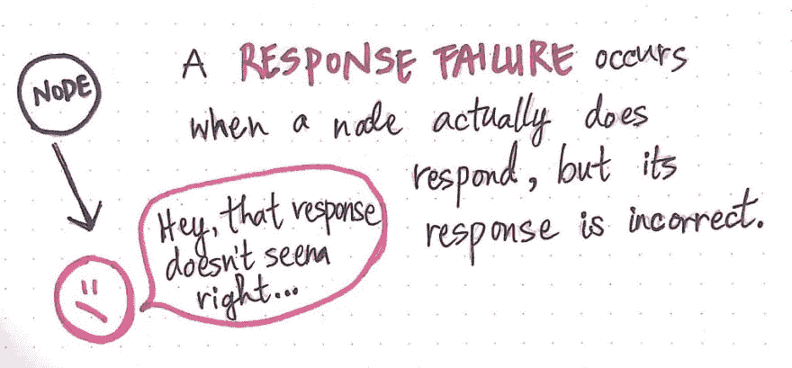
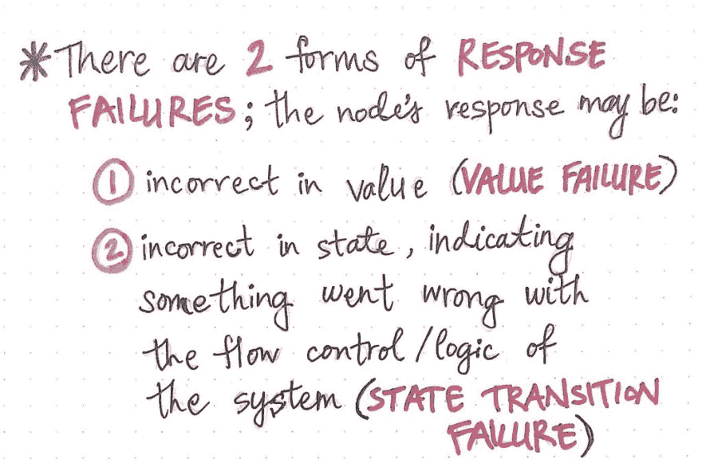
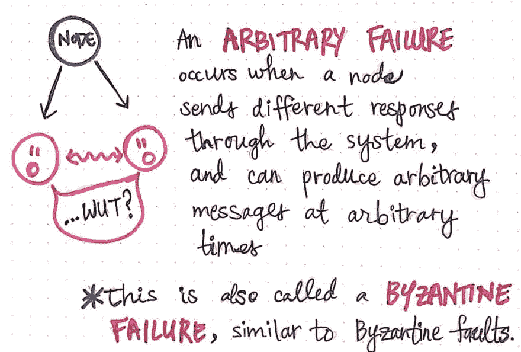
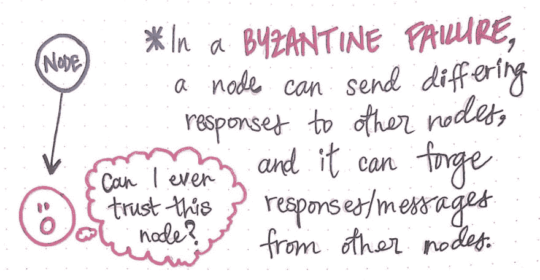
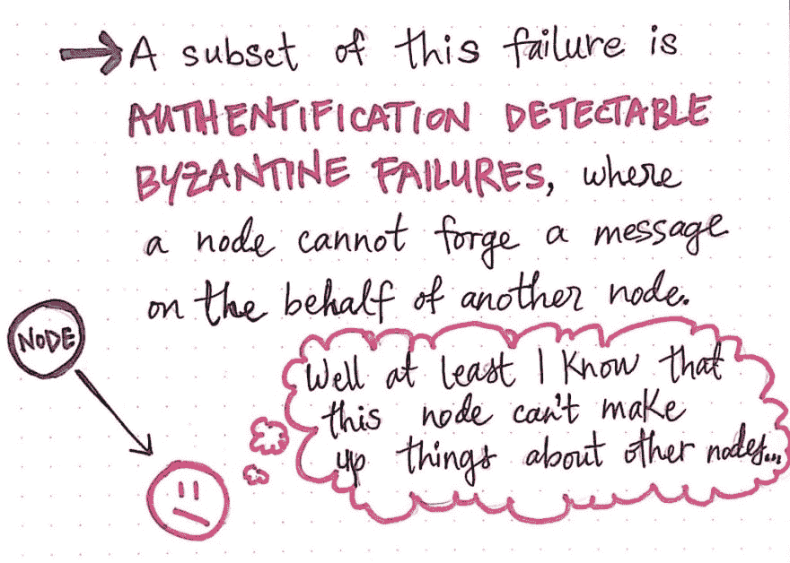

# 故障模式(第二部分)

> 原文：<https://dev.to/vaidehijoshi/modes-of-failure-part-2-544h>

一个人对失败的世界研究得越多，分布式系统中如此多的不同部分会失败就变得越明显。随着系统变得越来越复杂，越来越多的节点相互通信，这是事实，但对于更小的系统也是如此！

正如我们在这个由两部分组成的系列文章的第一部分中了解到的，不同的故障模式，我们的系统可能发生故障的方式在强度上有所不同。性能失败没有遗漏失败糟糕，遗漏失败也没有崩溃失败可怕。当然，如果我们知道我们的系统可能失败的*方式*，我们就可以试着为那些不测事件做计划。然而，有一些失效模式在本质上更加复杂；最终，它们只是任何分布式系统的现实——特别是非常大的系统。

当谈到处理复杂的故障时，我们必须仔细考虑如何为它们做计划。到目前为止，我们所看到的失败是相当简单的，但是现在，这种情况将会改变！让我们深入一些更棘手的失败，并尝试找出是什么让他们难以应对。

#### 回复全错

当谈到 ***性能*** 、 ***遗漏*** 和 ***崩溃*** 故障(这三种故障我们已经[了解过](https://dev.to/vaidehijoshi/modes-of-failure-part-1-4db1))时，有一个共同的线索:当一个节点向另一个节点请求一些回复时，响应不会在适当的时间内到达——有时它甚至不会出现！但是，即使响应出现较晚，它的值仍然是正确的。

> 换句话说，对于所有这三种故障，我们可以确定，如果来自节点的响应确实到达，那么它的内容将是正确的。

然而，正如我们可以想象的那样，一个节点可能会发送一个包含不正确内容的响应。那又怎样？嗯，在这种情况下，我们实际上是在处理一种完全不同的失败；这被称为响应失败。 ***响应失败*** 是指节点成功发送响应，但该响应的值是错误的或不正确的。

<figure> 

<figcaption>响应分布式系统中的故障。</figcaption>

</figure>

对于我们中的一些人来说，响应失败可能是我们在分布式系统中第一次真正遇到失败。例如，web 开发人员肯定见过很多响应失败的情况。如果一个 web 开发人员在后端编写了一些有问题的代码，他们的 web 服务器向前端返回了一个意外的(read: *incorrect* )值，他们会在代码的浏览器/客户端看到一个意外的值。当然，实际发生的是，代码中有一个 bug 是软件( ***故障*** )，产生了[意外结果](https://dev.to/vaidehijoshi/ready-and-available-distributed-systems-bck)(即 ***错误*** )，这在来自服务器的响应中表现为不正确的响应(即 ***故障*** )。

<figure> 

<figcaption>响应失败的两种不同形式:价值失败和状态转换失败。</figcaption>

</figure>

需要注意的是，响应失败本身有两种不同的形式。节点的响应可能在两个不同的方面不正确。当一个节点的响应就其实际值而言是错误的，我们称之为 ***值故障*** 。

但是，如果节点响应时状态不正确，我们称之为 ***状态转移失败*** 。在这种响应失败的情况下，我们应该能够看到节点进入了不正确的状态，这通常表明节点以某种方式转换到了意外的状态，并且该节点内部的逻辑或流控制可能有问题。

分布式系统中的其他节点以类似的方式感知到*值*响应失败和*状态转换*失败:当它们从试图通信的节点接收到响应时，它们会注意到响应在某些方面是错误的。理想情况下，当我们制作一个分布式系统时，我们应该以这样一种方式来构建它，即我们可以考虑潜在的失败；最好的方法是实现错误处理，这为我们的系统提供了一种方法来捕获任何“不正确”的响应，这些响应可能来自以这种方式失败的节点。

总的来说，响应失败不太好处理，但是我们可以经常尝试处理来自节点中“意外”响应的错误。此外，我们中的许多人甚至可能从经验中知道，处理“不正确”的响应意味着必须调试错误来自的节点。然而，尽管响应失败令人恼火，但这还不是最糟糕的。

#### 随机的、不可预测的故障

无论一个节点崩溃、不响应、超级慢还是返回不正确的响应，有一点是肯定的——当它持续失败时非常好。

> 当事情总是以同样的方式失败时，调试失败并试图理解它们会容易得多。

但是在有些情况下，我们甚至不能相信我们的失败是*一致的*，这使得处理它们更加困难。这种故障被称为任意故障。

*任意故障是当系统的部分与节点通信时，节点以不同的响应进行响应而发生的故障。在这种特殊类型的故障中，当系统的一部分与节点通信时，节点可能以一种方式响应，而当系统的另一部分试图与之通信时，节点可能以完全不同的方式响应；换句话说，节点可以在完全任意的时间用任意的消息进行响应。*

 *<figure> 

<figcaption>分布式系统中的任意故障(又名拜占庭故障)。</figcaption>

</figure>

任意故障也被称为 ***、拜占庭故障*** ，我们或许可以猜测，这些故障源自[拜占庭故障](https://dev.to/vaidehijoshi/fantastic-faults-and-what-to-call-them-2djb)。由于我们以前遇到过拜占庭错误，我们将回忆起，具有拜占庭错误的节点每次都以不同的(错误的)内容做出响应，并且它向系统中与它对话的不同节点提供的响应类型不一致。同样，拜占庭式的失败是拜占庭式错误的表现。

<figure> 

<figcaption>拜占庭失败的烦恼！</figcaption>

</figure>

拜占庭故障可能是分布式计算中最难处理的故障。事实上，拜占庭容错仍然是一个正在被深入研究的话题，原因很简单，就是没有一个关于如何处理它的显而易见、简单明了的答案。但是到底是什么让它如此困难呢？为了回答这个问题，我们需要更多地考虑拜占庭失败和故障的不确定性对我们分布式系统的其余部分意味着什么。

#### 信任失败

拜占庭失败如此难以处理的原因之一是，它们与我们所看到的其他失败如此不同。与性能、遗漏和崩溃故障(都是一致的故障)不同，拜占庭故障是不一致的故障。 ***一致故障*** 是指所有接收“服务用户”——例如，与分布式系统的某个部分通信的另一个节点或服务——以相同的方式察觉到故障。与崩溃的节点通信的所有服务用户节点将感知到相同的情况:它们都将看到它们试图与之对话的节点已经崩溃。因此，他们以同样的方式感知崩溃失败。

然而，拜占庭式的失败则大不相同；这是一个*不一致的故障，其中系统中的一些“服务用户”对情况的看法与其他人不同。换句话说，发生故障的节点的行为方式在整个系统中可能会有所不同。正如我们可以想象的那样，调试、解释和处理不一致的故障是非常困难的(正如我前面提到的，人们仍然在研究这类故障，试图解决这方面的问题)。*

 *在本系列的后面部分，我们将更深入地探讨拜占庭故障以及围绕它们的问题，但是现在，需要记住的重要一点是，不一致的故障很难处理——不仅对于设计分布式系统的人来说如此，对于系统中存在的其他节点来说也是如此。

当一个节点的行为不一致时，系统中的其他节点可能不知道如何处理这种不一致。例如，假设我们有一个具有拜占庭故障的节点 X。节点 X 可能告诉节点 A 某个值(v)是真的，但是可能告诉节点 B 同一个 v 是假的。现在，节点 A 和 B 可能会互相交谈，并对值 v *实际上是什么值*感到困惑！显然，节点 A 和 B 对节点 X 的信任度会有所下降，并认为有可疑的事情正在发生！研究拜占庭容错的人试图提出算法来尝试协调像这样不一致的响应。

这里另一个增加的复杂性是，节点 X 还能够告诉系统中的其他节点它所知道的事情。例如，也许节点 A 向*出错的*节点 X 询问一些关于节点 B 的信息。节点 X 可以告诉节点 A 一些关于节点 B 的*真实*的信息，或者它可以告诉它一些完全错误的信息！这又是一个不能相信一个节点所说的话的例子——特别是当它对系统中的*和其他*节点说了不正确的话。

<figure> 

<figcaption>认证(哎呀，我在图中拼错了！)可检测的拜占庭故障</figcaption>

</figure>

考虑到最后一种情况，一些分布式系统也有可能经历*另一种*失败:认证可检测的拜占庭失败。这些失败实际上是拜占庭失败本身的一个子集，但有一点需要注意。

在一个 ***认证可检测拜占庭失败*** 中，一个节点发送的任意消息不可能是他们伪造另一个节点行为的消息。这意味着，虽然一个节点可以以不一致的方式响应其他节点，但它只能在涉及到自己的事实和节点本身拥有的知识时才会这样做。换句话说，节点不能对其他节点的事实“撒谎”。至少，认证可检测到的拜占庭失败比拜占庭失败稍微好对付一点——但是它们绝不容易！

但即使如此，当设计一个分布式系统时，我们也要考虑所有的失败(即使是不太复杂的失败)。识别系统中可能出现的不同故障是解决如何计划和处理这些故障的第一步。失败是必然会发生的，而且大多是我们无法控制的。然而，我们如何处理它们，是我们有更多自主权的事情。

但那是另外一个故事了！

#### 资源

如果我们想了解系统失效的不同方式，这是至关重要的。如果你想继续学习不同的失效方式，有很多资源可以提供；在我看来，以下是一些最好的开始。

1.  [分布式系统中的容错](https://www.slideshare.net/sumitjain2013/fault-tolerance-in-distributed-systems)，Sumit Jain
2.  [分布式系统中的故障模式](http://alvaro-videla.com/2013/12/failure-modes-in-distributed-systems.html)，阿尔瓦罗·维德拉
3.  [分布式系统:容错](https://www.cs.helsinki.fi/webfm_send/1262)，Jussi Kangasharju 教授
4.  了解容错分布式系统
5.  [故障模式和模型](https://ti.tuwien.ac.at/cps/teaching/courses/dependable_systems-ss08/dcs_slides/dcs-2007-p5.pdf)，Stefan Poledna
6.  [容错系统](http://www-itec.uni-klu.ac.at/~laszlo/courses/DistSys_BP/FaultTolerance.pdf)，拉斯洛·伯什罗姆尼

* * ***