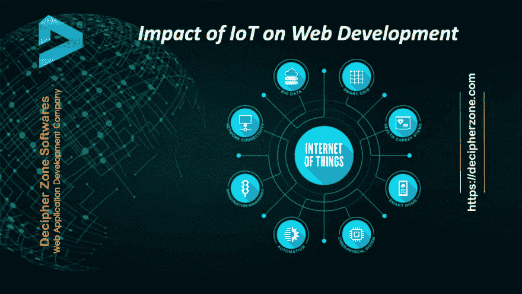

# 物联网在移动应用开发中的作用

> 原文：<https://dev.to/decipherzonesoft/role-of-iot-in-mobile-application-development-53pa>

物联网或物联网通过少量创新改变了人机之间的界面和连接，从而连接了真实和先进的世界。目前，物联网正在颠覆网站改进领域。使用户界面和网络通信更加智能，这一创新在创建明智和自然的网站功能方面承担了值得注意的工作。物联网通过协调不同的网络发展思想和运营模式，利用其广泛的网络密集度和机械化的理性凸显，来理解客户需求，建立正确的管理。

物联网对 Web 应用开发的影响

点击此处阅读全文:[https://www . decipherzone . com/blog-detail/The-Impact-of-IoT-on-Web-Development](https://www.decipherzone.com/blog-detail/The-Impact-of-IoT-on-Web-Development)