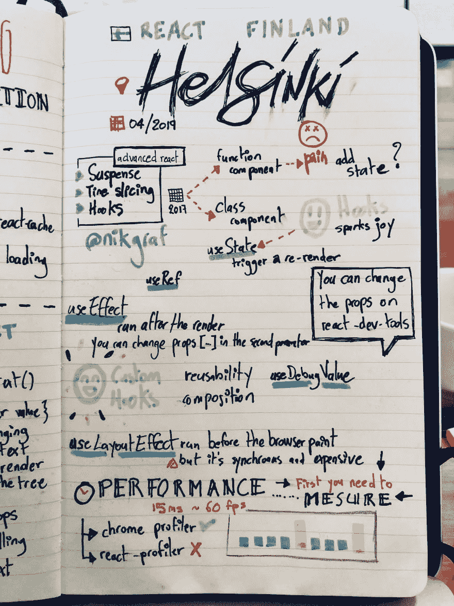
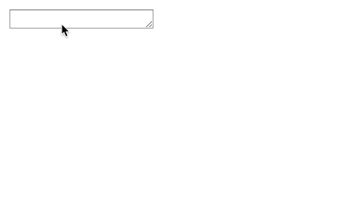
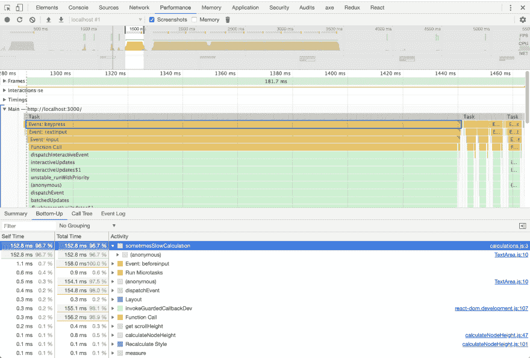
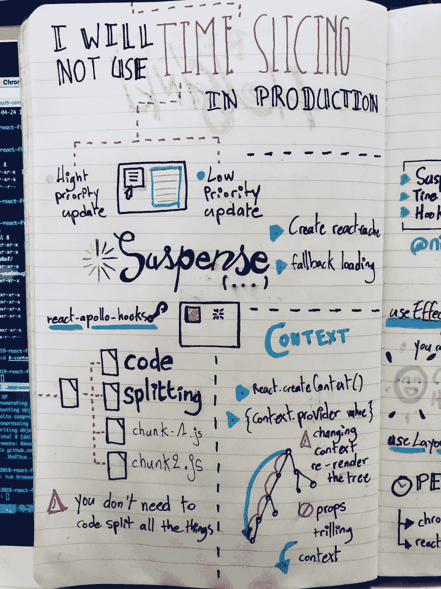
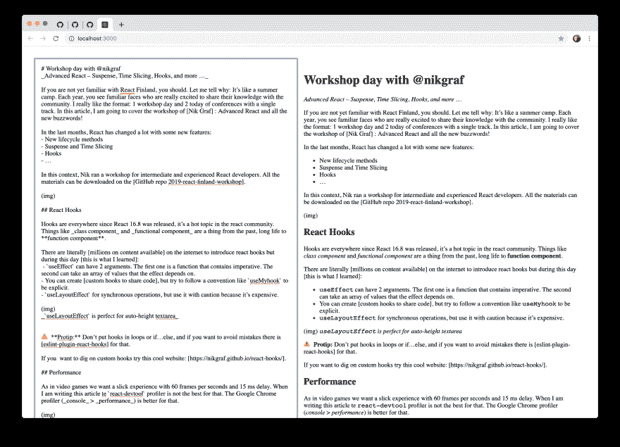
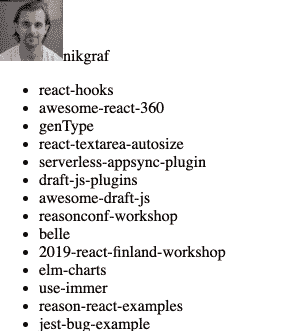
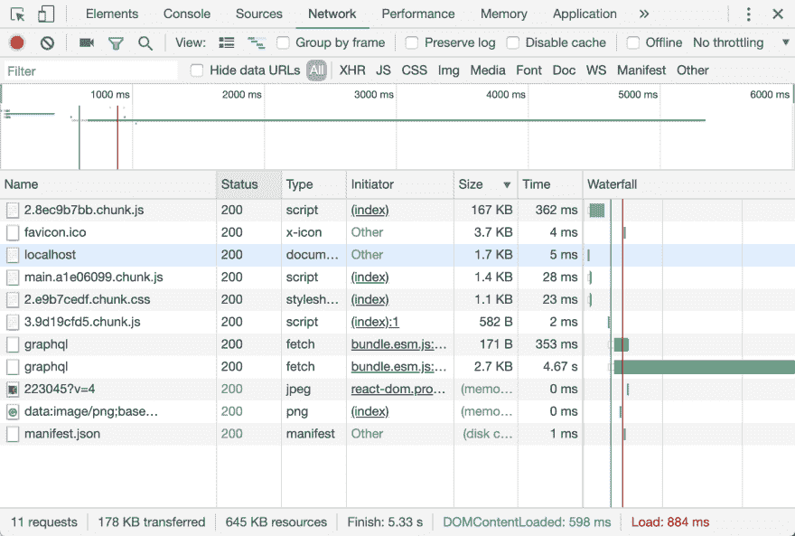
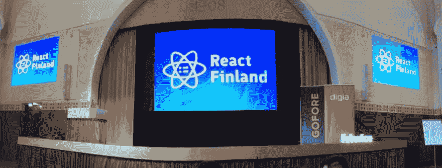

# 我在与尼克·格拉芙一起参加 React 芬兰研讨会时学到了什么

> 原文：<https://dev.to/flexbox/what-i-learned-at-react-finland-workshop-with-nik-graf-30oe>

<figure>[](https://res.cloudinary.com/practicaldev/image/fetch/s--hdk8atTu--/c_limit%2Cf_auto%2Cfl_progressive%2Cq_auto%2Cw_880/https://cdn-images-1.medium.com/max/1024/1%2AbT6jmte7_xz_IjPnTeTWmg.jpeg) 

<figcaption>那是我们正在看的钩子吗？([尼克·图林宁](http://nicktulinen.com) )</figcaption>

</figure>

*高级反应——悬疑、时间片、钩子等等*

如果你还不熟悉[反应芬兰](https://react-finland.fi)，你应该。我来说说为什么:这就像一个夏令营。每年，你都可以看到熟悉的面孔，他们非常兴奋地与社区分享他们的知识。我喜欢这种形式:在一条赛道上一天研讨会，两天会议。

在这篇文章中，我将涵盖尼克格拉芙的研讨会:**先进的反应与所有新的流行语**！

#### 做出反应——彻底改造

在过去的几个月里，React 做了很大的改变，增加了一些新特性(并不是所有的特性都已经发布了):

*   新的生命周期方法
*   悬疑和时间切片——即将推出的功能
*   钩住
*   更多

在这种背景下， [Nik Graf](https://medium.com/u/ff3f225e7f5c) 为中级和有经验的 React 开发人员举办了一个研讨会。

> 所有材料均可在[GitHub repo 2019-react-Finland-workshop](https://github.com/nikgraf/2019-react-finland-workshop)上下载。

<figure>[](https://res.cloudinary.com/practicaldev/image/fetch/s--Ls9IX6-E--/c_limit%2Cf_auto%2Cfl_progressive%2Cq_auto%2Cw_880/https://cdn-images-1.medium.com/proxy/1%2AuSjSv-_UCTWkJfK64_UZbw.jpeg) 

<figcaption>Sketchnote 与 React 挂钩并在 React 中表现( [David Leuliette](https://davidl.fr) )</figcaption>

</figure>

#### 反应钩

钩子到处都是。自从 React 16.8 发布以来，它一直是 React 社区的热门话题。像*类组件*和*功能组件*都是过去式了，基于**功能的组件**万岁。

互联网上有数百万的内容介绍 react hooks，但这一天[我了解到的情况如下](https://github.com/flexbox/2019-react-finland-workshop/commit/543a040c37c1a97171fa3f8ddea8e93b86b1d087):

*   useEffect 可以有两个参数。第一个是包含命令式的函数。第二个可以接受效果所依赖的值的数组。
*   您可以创建[自定义钩子来共享代码](https://github.com/flexbox/2019-react-finland-workshop/commit/fc0df85d734a37d618f53696254e1e9956076b1f)，但是要尽量遵循像 useMyhook 这样的约定，这样才显式。
*   对同步操作使用 LayoutEffect，但要小心使用，因为它会阻止渲染，并且昂贵的操作会导致糟糕的体验。

<figure>[](https://res.cloudinary.com/practicaldev/image/fetch/s--nZNgpPe2--/c_limit%2Cf_auto%2Cfl_progressive%2Cq_66%2Cw_880/https://cdn-images-1.medium.com/max/445/1%2AaUegfx5bsqZic-JOFFrvwQ.gif)

<figcaption>*useLayoutEffect 非常适合自动高度 textarea*</figcaption>

</figure>

> ⚠️ **专业建议:**不要把钩子放在圈里或者其他地方。为了避免错误，有[eslint-plugin-react-hooks](https://www.npmjs.com/package/eslint-plugin-react-hooks)来解决这个问题。

如果你想挖掘定制挂钩 [Nik Graf](https://medium.com/u/ff3f225e7f5c) 建立了这个很酷的网站来收集它们:

[React 钩子的集合](https://nikgraf.github.io/react-hooks/)

#### 表现

就像在视频游戏中一样，我们想要每秒 60 帧和 15 毫秒延迟的流畅体验。当我写这篇文章时，react-devtool 分析器并不是最好的。谷歌浏览器分析器(*控制台* > *性能*)在这种情况下更好。

[](https://res.cloudinary.com/practicaldev/image/fetch/s--e0mmiOZz--/c_limit%2Cf_auto%2Cfl_progressive%2Cq_auto%2Cw_880/https://cdn-images-1.medium.com/proxy/1%2AL41HwaDJC1yDSZoXdlaY4A.png)

在这个例子中，我们发现了我们的性能敌人:函数 sometimesSlowCalculation。

> ⚠️ **专业建议:**当你开始挖掘性能时，通过衡量你在做什么来开始你的旅程。

<figure>[](https://res.cloudinary.com/practicaldev/image/fetch/s--78Eri7rN--/c_limit%2Cf_auto%2Cfl_progressive%2Cq_auto%2Cw_880/https://cdn-images-1.medium.com/proxy/1%2AN_98xbNXO-iuzWJLGiv8uw.jpeg) 

<figcaption>带时间切片、悬念和语境的速写</figcaption>

</figure>

#### 异步反应

在研讨会的第二部分，我们使用了一些不稳定的 API。如果你想走这条路，跟着我重复三遍下一句话:

> 我不会在生产中使用时间片
> 
> ——React 俱乐部的第一条规则

#### 时间切片

<figure>[](https://res.cloudinary.com/practicaldev/image/fetch/s--oHuu9OMV--/c_limit%2Cf_auto%2Cfl_progressive%2Cq_auto%2Cw_880/https://cdn-images-1.medium.com/proxy/1%2A08fYfKRwrGCUutnuDfY_rg.png) 

<figcaption>牛逼 react markdown 预览应用</figcaption>

</figure>

假设您需要创建一个 CMS 应用程序。2 列布局，并且您希望为用户提供具有实时反馈的良好的写作体验。

在左边，你可以编辑降价内容，在右边，我们有实时预览。对于，我们需要有一个快速的体验。另一方面，我们可以推迟预览，因为内容太多会很慢。

首先，我们需要创建一个新函数**deferredPreviewUpdate**

```
<TextArea
  value={text}
  onChange={value => {
    setText(value);
**deferredPreviewUpdate(value);**
  }}
/> 
```

Enter fullscreen mode Exit fullscreen mode

用 unstable_LowPriority 调用函数，可以让渲染部分有一点延迟。请记住，这段代码目前是实验性的，但是它是对时间片概念的一个很好的介绍。

```
function deferredPreviewUpdate(text) {
  **unstable\_runWithPriority(unstable\_LowPriority, function() {**
    **unstable\_scheduleCallback(unstable\_LowPriority, function() {**
      const content = markdownToReact(text);
      setPreview(content);
    **});  
  });**  
} 
```

Enter fullscreen mode Exit fullscreen mode

查看第[部分 5-时间片](https://github.com/nikgraf/2019-react-finland-workshop/blob/master/5-time-slicing/solution/src/App.js)中的完整示例。

如果你想深入了解用户界面中的时间安排，我推荐菲利普·斯皮斯的这篇文章:

[调度在反应](https://philippspiess.com/scheduling-in-react/)

#### React .懒，React。焦虑

悬念 API 允许组件在渲染之前“等待”一些东西。当我写这篇文章时，悬念只适用于一种场景:[用](https://reactjs.org/docs/code-splitting.html#reactlazy) [React.lazy](https://reactjs.org/docs/code-splitting.html#reactlazy) 动态加载组件。

将来，悬念将支持其他用例，如数据获取。

在这个练习中，我使用了 react-apollo-hooks，它看起来很有希望。而不是用这个经典的加载状态来这样显示加载:

```
if (loading) {
  return <div>Loading …</div>;
} 
```

Enter fullscreen mode Exit fullscreen mode

你可以做两件事。首先，向 GraphQL 查询添加另一个参数:

```
const { data, error } = useQuery(profileQuery **, { suspend: true }** ); 
```

Enter fullscreen mode Exit fullscreen mode

其次，添加一个回退加载组件:

```
<React.Suspense **fallback={<div>Loading...</div>}** >
  <Profile />
</React.Suspense> 
```

Enter fullscreen mode Exit fullscreen mode

你可以在 GitHub 上查看练习的差异:

[添加悬念 flexbox/2019-react-芬兰-workshop @ 63 dbbc](https://github.com/flexbox/2019-react-finland-workshop/commit/63ddbbc084a97cf689afd6a684c486a0cb8152ea)

<figure>[](https://res.cloudinary.com/practicaldev/image/fetch/s--cy_n-T_4--/c_limit%2Cf_auto%2Cfl_progressive%2Cq_66%2Cw_880/https://cdn-images-1.medium.com/max/295/1%2A-ptecCNTf4gZBrKqD3pQLQ.gif) 

<figcaption>级联加载体验</figcaption>

</figure>

> ⚠️ **专业提示:**这个特性还不能用于服务器端渲染。

#### 代码拆分

对你的应用进行代码拆分可以帮助你“延迟加载”用户当前需要的东西，这可以极大地提高你的应用的性能。

—摘自 https://reactjs.org/docs/code-splitting.html

在这个练习中，我们使用了代码分割特性来减少应用程序包的大小。

[](https://res.cloudinary.com/practicaldev/image/fetch/s--YVAC1VzM--/c_limit%2Cf_auto%2Cfl_progressive%2Cq_auto%2Cw_880/https://cdn-images-1.medium.com/proxy/1%2Aw6CsWeO_HD2fagH-AVVUng.png)

> ⚠️ **专家提示:**你不需要对所有事情都进行代码拆分。有时一个大文件的 HTTP 请求就足够了。

#### 上下文

context API 可以作为你的全局存储，也就是说你不需要 Redux 做任何事情。也就是说，跳槽前最好先了解一下利弊。

> 查看 Nik 在 React Finland 上对此有何评论。

以个人资料页面为例。对于当前已认证的用户，头像不经常更新。这是使用上下文的完美用例，因为它解决了道具颤动的经典问题。

在上下文练习中，我们对 React 应用程序进行了主题化。首先，你需要创建一个类似于 **ThemeContext** :
的上下文

```
//ThemeContext.js

import React, { **createContext** } from "react";

export const themes = {
  dark: {
    foreground: "#fff",
    background: "#666"
  },
  light: {
    foreground: "#222",
    background: "#eee"
  }
};

**const ThemeContext = createContext({**
  theme: themes.dark,
  toggleTheme: () => {}
**});**

export default ThemeContext; 
```

Enter fullscreen mode Exit fullscreen mode

之后，在这个例子中，我们使用钩子来使用上下文。

```
// Toolbar.js

import React, { **useContext** } from "react";
import Button from "./Button";
import ThemeContext from "./ThemeContext";

function Toolbar() {
  **const { toggleTheme } = useContext(ThemeContext);**

return (
    <>
      <Button onClick={ **toggleTheme** }>Toggle Theme</Button>
    </>
  );
}
export default Toolbar; 
```

Enter fullscreen mode Exit fullscreen mode

> ⚠️ **专业提示:**记住当使用 **useContext** 时，上下文存储中的每一个变化都会触发所有使用它的组件的重新呈现。

[](https://res.cloudinary.com/practicaldev/image/fetch/s--x_XrORgR--/c_limit%2Cf_auto%2Cfl_progressive%2Cq_auto%2Cw_880/https://cdn-images-1.medium.com/max/1024/1%2AgrO0wWbtWOBhaVtxyI3pCA.jpeg)

我真的很喜欢所有不同的练习。这是一次很棒的研讨会，现在我对 React 中钩子的使用更有信心了。

简要回顾一下，下面是练习列表:

1.  **使用效果**和**用户参考**
2.  自定义钩子和 **useDebugValue**
3.  **useLayoutEffect**
4.  表演
5.  时间分片
6.  焦虑
7.  代码拆分
8.  语境

你可以克隆回购[https://github.com/nikgraf/2019-react-finland-workshop](https://github.com/nikgraf/2019-react-finland-workshop)来做功课。🙂

如果您有兴趣提升您在 React 生态系统中的知识水平，[请订阅新闻简报，以便获得下一版本的预售早期信息](https://react-finland.fi)。

> 👋明年见！

* * *