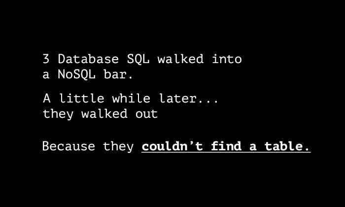

# 用 diskdb、Node 和 Express 在 5 分钟内完成 REST API

> 原文：<https://dev.to/lennythedev/quick-database-with-node-express-and-diskdb-in-5-minutes-1jjj>

在[第 1 部分](https://dev.to/lenmorld/quick-server-with-node-and-express-in-5-minutes-17m7)和[第 2 部分](https://dev.to/lenmorld/quick-rest-api-with-node-and-express-in-5-minutes-336j)之后，我们有了一个工作的服务器，但是当服务器重新启动时，更改丢失了😠。那糟透了，所以现在该去**资料库了，呃...数据！**💾🙂🥫
(🥫< -这应该是一个数据库)

# NoSql 数据库

与具有表和行的 SQL 数据库相比，NoSql 具有集合和文档:

```
database > collections > documents 
```

Enter fullscreen mode Exit fullscreen mode

例如:

```
(database) data_db > 
  (collection) movies: [{}, {}, {}] > 
    (document) movie: { "id": "tt0110357", "name": "The Lion King", "genre": "animation"}, 
```

Enter fullscreen mode Exit fullscreen mode

我有没有提到*没有桌子*？
T3T5】

关于整个 **SQL vs NoSql** 的细节，请看这篇文章:

[](/flippedcoding) [## SQL 和 NoSQL 数据库之间的差异

### 米利西亚

#webdev #beginners #database #sql](/flippedcoding/differences-between-sql-and-nosql-databases-3ml4)

# 什么是`diskdb`？

Diskdb 允许您使用基于文件的数据库和类似 mongodb 的 API。想想 mongo 的 SQLite。但是为什么呢？

*   快速，简单，快速-没有更多的安装或配置文件；非常适合用一些持久性来鞭笞原型服务器
*   db 与您的代码一起存储在常规的 JSON 文件中，因此无需额外工具即可轻松维护
*   不需要注册——不再需要注册和收到大量的电子邮件

为什么不呢？

*   非常简单，API 功能有限
*   真的不是为了生产

声明一下，我喜欢 mLab，因为它简单、快速并且免费高达 500MB。但最近被 MongoDB 收购，换成了 Atlas。*我也会用 Atlas 为基于云的数据库写一篇单独的文章。*

### 领先

在这里，我们将使用上一课中的基本服务器文件:
[带有 Node + Express 的 Quick REST API](https://github.com/lenmorld/devto_posts/tree/master/quick_node_express)

我们开始吧！

## 1。创建数据库文件

创建`/data/movies.json`。
*数据*将是我们的数据库，*电影*将是我们的收藏。

```
...
data/
    /movies.json
server.js
... 
```

Enter fullscreen mode Exit fullscreen mode

用空数组
初始化`movies.json`

```
[] 
```

Enter fullscreen mode Exit fullscreen mode

## 2。从 Nodemon 中排除数据文件

如果您使用的是 nodemon，那么您不会希望服务器在数据库文件发生每次更改时都重新启动，也就是说，无限地重新启动服务器😵

将`nodemonConfig`加到`package.json`上，命令忽略`/data`。

```
"scripts": {...},
"nodemonConfig": { "ignore": [ "data/*" ] },
... 
```

Enter fullscreen mode Exit fullscreen mode

## 3。安装`diskdb`

```
$ npm install diskdb 
```

Enter fullscreen mode Exit fullscreen mode

## 4。导入并连接到数据库

语法是:
`db.connect('/path/to/db-folder', ['collection-name']);`

```
// server.js
...
// diskdb connection
const db = require('diskdb');
db.connect('./data', ['movies']); 
```

Enter fullscreen mode Exit fullscreen mode

这有效地创建了到“数据”数据库和“电影”集合的连接。

## 4。添加一部电影来测试连接

```
// server.js
...
// add first movie
if (!db.movies.find().length) {
   const movie = { id: "tt0110357", name: "The Lion King", genre: "animation" };
   db.movies.save(movie);
}
console.log(db.movies.find()); 
```

Enter fullscreen mode Exit fullscreen mode

简单又好看！
`db.[collection].save(object)`新增一张单据
`db.[collection].find()`获取当前所有单据

只有当数据库最初为空时，我们才添加这部电影，
，否则我们将会有很多不同`_id`的`Lion King`😨
🦁🦁🦁🦁🦁🦁🦁

这应该会给你这样的东西

```
Successfully connected to : ./data
[ { id: 'tt0110357',
    name: 'The Lion King',
    genre: 'animation',
    _id: 'fed8db042fac4892bb96fd72ad13290e' } ] 
```

Enter fullscreen mode Exit fullscreen mode

注意，它向我们的项目添加了一个`_id`，像在 mongodb 中一样用作全局 id。

## 5。CRUD 到 REST 到 DB

现在您已经看到了*创建*和*读取所有*，下面是每个 CRUD - REST 路由处理程序的 diskdb 语法中 db 操作的完整摘要。

有关 REST - HTTP 表和路由处理程序的详细信息，请查看 [prev post](https://dev.to/lenmorld/quick-rest-api-with-node-and-express-in-5-minutes-336j) 。

还要注意，这里的`collection`是我们例子中的**电影**。

| CRUD 操作 | 休息操作 | Diskdb 操作 |
| --- | --- | --- |
| 创造 | 帖子`/items` | `db.[collection].save(object)` |
| 红色的 | 获取`/items/:id` | `db.[collection].find(query)` |
| 亲爱的大家 | 获取`/items` | `db.[collection].find()` |
| 更新 | 放`/items/:id` | `db.[collection].update(query, data, options)` |
| 删除 | 删除`/items/:id` | `db.[collection].remove(query, multi)` |

## 6。更改为 diskdb 操作

使用该表，我们现在可以用 db 等价物替换所有基于内存的操作。

### 一、创建➕

```
server.post("/items", (req, res) => {
   const item = req.body;
   console.log('Adding new item: ', item);
   // add new item to db
   db.movies.save(item);
   // return updated list
   res.json(db.movies.find());
}); 
```

Enter fullscreen mode Exit fullscreen mode

### 二世。读一读🕵️

```
server.get("/items/:id", (req, res) => {
   const itemId = req.params.id;
   const items = db.movies.find({ id: itemId });
   if (items.length) {
      res.json(items);
   } else {
      res.json({ message: `item ${itemId} doesn't exist` })
   }
}); 
```

Enter fullscreen mode Exit fullscreen mode

### 三世。通读🕵️

```
server.get("/items", (req, res) => {
   res.json(db.movies.find());
}); 
```

Enter fullscreen mode Exit fullscreen mode

### 四世。更新✏️

```
server.put("/items/:id", (req, res) => {
   const itemId = req.params.id;
   const item = req.body;
   console.log("Editing item: ", itemId, " to be ", item);

   db.movies.update({ id: itemId }, item);

   res.json(db.movies.find());
}); 
```

Enter fullscreen mode Exit fullscreen mode

### v。删除

```
server.delete("/items/:id", (req, res) => {
   const itemId = req.params.id;
   console.log("Delete item with id: ", itemId);

   db.movies.remove({ id: itemId });

   res.json(db.movies.find());
}); 
```

Enter fullscreen mode Exit fullscreen mode

## 测试出来

添加一个新的。

```
$ curl -X POST -H "Content-Type: application/json" --data '{"id": "tt0109830", "name": "Forrest Gump", "genre": "drama"}' http://localhost:4000/items 
```

Enter fullscreen mode Exit fullscreen mode

全部取出。
来自浏览器:[http://localhost:4000/items](http://localhost:4000/items)

拿一个来。
来自浏览器:[http://localhost:4000/items/TT 0110357](http://localhost:4000/items/tt0110357)

更新一下。也许你认为《阿甘正传》是一部动作片，因为里面有很多战争镜头和奔跑。🔫🎖️🏃‍♂️

```
$ curl -X PUT -H "Content-Type: application/json" --data '{"genre": "action"}' http://localhost:4000/items/tt0109830

...{"id":"tt0109830","name":"Forrest Gump","genre":"action"}... 
```

Enter fullscreen mode Exit fullscreen mode

删除它。

```
curl -X DELETE http://localhost:4000/items/tt0468569 
```

Enter fullscreen mode Exit fullscreen mode

#### 有人清理🧹

Db 在工作！现在我们可以删除不需要的静态数据文件:`data.js`。
不要忘记从`server.js`中删除导入它的行

~~let data = require('。/data’)；~~

### 这里是完整的代码

[使用 Node + Express + diskdb 的快速数据库](https://github.com/lenmorld/devto_posts/tree/master/quick_node_express_diskdb)

[](https://i.giphy.com/media/gGuOldphm6vzW/source.gif)

## *“好的，那很好。但是我能用这个做什么呢？”*

✅提供 HTML 文件
✅ REST API
✅数据库持久性

现在，这是一个小项目的实际服务器。添加更多的路线，通过 API 请求在数据库中保存一些数据。而当你想重置 db 时，只需将`movies.json`重置为[]。

## 接下来:

(进行中):**使用带有 Node 和 Express 的云数据库**

这篇文章是我正在撰写的 Node+Express 系列文章的一部分。

与此同时，如果您对 Node+Express 还不满意🤓，
查看我的节点研讨会(Gihub repo 和幻灯片):

## /[节点 _ 车间](https://github.com/lenmorld/node_workshop)

### 使用 Node、Express 和 MongoDB 为您的下一个 web 应用程序构建服务器和 API

<article class="markdown-body entry-content container-lg" itemprop="text">

# 节点车间

> 为您的下一个 web 应用程序创建一个 server + REST API！

在本次研讨会中，我们将讨论概念并通过活动将它们付诸实践，所有这些都是关于 web 服务器的。这里的代码和概念将是您下一个 web 项目的良好基础。主题包括但不限于:

*   使用 Node 和 Express 构建 web 服务器和 REST API
*   了解路由、请求和响应
*   用 HTTP 方法实现 CRUD
*   使用模板构建服务器渲染的网站
*   连接到云 NoSQL 数据库:MongoDB Atlas DB
*   使用会话、cookies 和令牌进行用户身份验证
*   使用外部 API，如 Github Jobs、Giphy、Spotify

## 以前的事件

*   [节点研讨会-2020 年 8 月 27 日](https://www.facebook.com/events/1125391177830448/)

    *   [欠邮](https://dev.to/lennythedev/node-workshop-free-online-workshop-by-scs-concordia-3dc5)
*   [节点研讨会-2020 年 7 月 16 日](https://www.facebook.com/events/751112552346326/)

    *   [欠邮](https://dev.to/lennythedev/node-workshop-part-2-free-online-workshop-by-scs-concordia-4e37)

# 材料

预览幻灯片: [Google Drive 文档](https://drive.google.com/file/d/11-HTDPgCY-ZNEIqddwQbn_4PDCa14C2R/view?usp=sharing)

素材:[观念链接](https://www.notion.so/lennythedev/Node-workshop-Homepage-56f2822d63e549b286c76102e6ea6b28)

# 密码

### 参加研讨会:

```
$ git checkout dev
$ node server.js 
```

### 到最新开发

```
$ git checkout master
$
```

…</article>

[View on GitHub](https://github.com/lenmorld/node_workshop)

这里我们讨论了:

*   使用节点和 Express
*   路由、请求和响应
*   构建 REST API
*   服务器呈现的模板
*   连接到 NoSQL (mongo)数据库
*   使用外部 API，如 Spotify
*   还有更多！

* * *

发球快乐！🤓

现在，如果我能为数据库找到一个比🥫