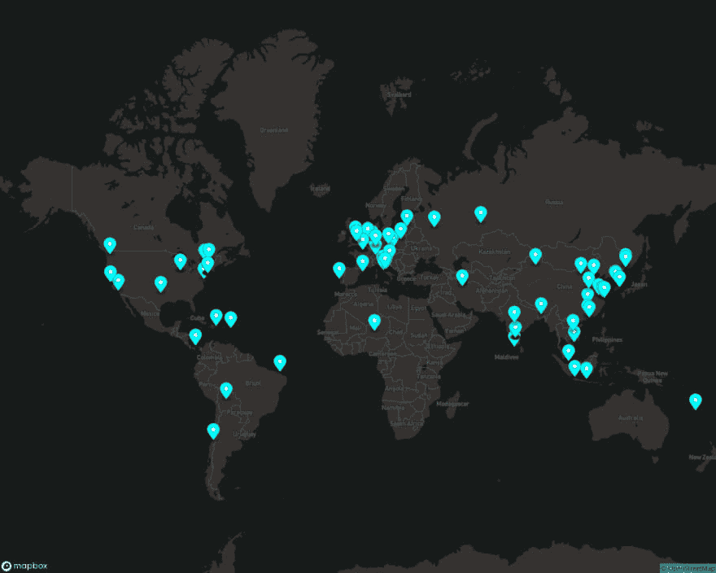

# 你好，虫子！:用 bash 脚本映射 SSH 探针

> 原文：<https://dev.to/lbonanomi/hello-worm-mapping-ssh-probes-with-a-bash-script-3if7>

*请注意，这比严肃的安全建议更有趣*

向 [TLDR 页面](http://tldr-pages.github.io)投稿给我介绍了大量有趣而有用的命令，比如`lastb`，它显示了失败登录尝试的细节。当然，你不可能为不熟悉的材料写出好的说明，所以我在我的一个 AWS 虚拟机上运行了`lastb -iw`，得到了一个相当令人不快的惊喜:

```
AWS_VM: sudo lastb -iw | wc -l 
967 
```

967 次登录失败？我知道这不是我，因为我用公钥授权。我怀疑这是一次有针对性的攻击，因为这台虚拟机没有售后 CNAME 或公开的 IP 地址。飞机上真的有这么多僵尸网络吗？

来自 GCP 的好心人免费提供了一个无字符串的微型虚拟机，让我们提供一个，看看它在探测 SSH 之前能不受干扰地呆多久

```
GCP_VM: uptime 22:21:47 up 5 min,  1 user,  load average: 0.00, 0.00, 0.00
GCP_VM: lastb | wc -l 
2 
```

这是一个严峻的发展:距离第一次 SSH 探测还有 5 分钟。我想看看这些人是从哪里来的，但不想把我(非常)有限的资源浪费在一个专用的蜜罐上；让我们在已经运行的虚拟机上尝试轻量级数据收集。

### 选择你的武器

bash 和 awk 可以被认为是 Linux 领域的一部分。

【curl 在交互式虚拟机上相当普遍。

[https://map box . io](https://mapbox.io)慷慨地提供了一个带有自由层的 SVG 映射 API。

[https://ipstack.com](https://ipstack.com)提供了一个 IP 地址地理定位 API 和一个自由层。

为了避免压倒这些 API 提供者的善意，我们将把我们的查询限制在过去 24 小时内探测我们虚拟机的 IP 上。

```
#!/bin/bash

# Set token data here. Because requests want a token in the URL,
# a .netrc file can't be used to store credentials
#
IPSTACK_TOKEN=""
MAPBOX_TOKEN=""

# Get a timestamp of 24 hours ago in epoch seconds
#
STANDOFF=$(date -d "24 hours ago" +%s)

# Capture failed logins with a timestamp < 24-hours-ago to a buffer file
#
sudo lastb -i | awk '{ print $3,$5,$6,$7 }' | while read ip datum
do
  [[ "$(date -d "$datum" +%s)" -gt "$STANDOFF" ]] && echo -e "$ip"
done > /tmp/LASTB_IP_BUFFER

# Get the top 150 IPs by connection count
sort /tmp/LASTB_IP_BUFFER | uniq -c | sort -rnk1 | awk '{ print $2,$1 }' | head -150 | while read IP time do
    # Get Lat/Long data
    curl -s "http://api.ipstack.com/$IP?access_key=$IPSTACK_TOKEN&fields=longitude,latitude" | python -m json.tool | awk '/longitude|latitude/ { printf $NF" " }' | tr -d "," | awk '$1 != "null" { print "pin-s+0FF("$2","$1")," }'

# Smush all coordinates into a string to make a single call to Mapbox.io
done | tr -d "\n" | sed -e 's/,$//g' > /tmp/coords

curl -s "https://api.mapbox.com/styles/v1/mapbox/dark-v10/static/"$(cat /tmp/coords)"/0,40,1.35,0/1280x1024?access_token=$MAPBOX_TOKEN" > worms.png

rm /tmp/LASTB_IP_BUFFER /tmp/coords 
```

这里我们有一个漂亮的世界地图，在每个探测僵尸网络的源 IP 位置都插上了大头针，适合用来陷害或吓唬你的老板。

[](https://res.cloudinary.com/practicaldev/image/fetch/s---E8wl2GE--/c_limit%2Cf_auto%2Cfl_progressive%2Cq_auto%2Cw_880/https://thepracticaldev.s3.amazonaws.com/i/vsy3sg6ts4ww67ogosmn.png)