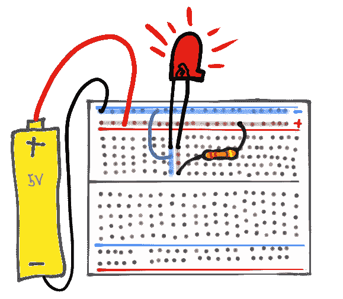
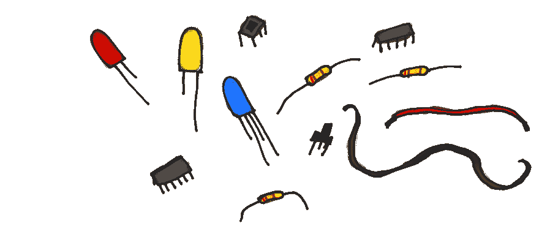

# 基础电子学和电路入门

> 原文：<https://dev.to/erikaheidi/a-primer-on-basic-electronics-and-circuits-n3e>

对于以前没有机会接触硬件的人来说，电子产品看起来肯定令人生畏。但不用担心:对我们来说幸运的是，有一大块电子产品业务都是针对爱好者和那些只想在家中玩一些闪烁、嗡嗡作响或自动化的小发明的人。

最终，通过学习基础电子学，你将利用你目前的软件工程技能，为你的爱好项目开辟一个新的可能性空间。摆弄电子设备和硬件也是更好地理解计算机工作原理的好方法。

本指南是基础电子学的初级读本，面向那些想尝试 Arduino 和其他原型开发平台但不知道从哪里开始的开发人员。

让我们从电、电路、元件和什么是*试验板*开始。

## 通电

用最基本的术语来说，电就是电子的流动。在某些方面，电看起来类似于水:电子总是试图“跑”向阻力最小的路径，就像水一样。很久以前，你可能在学校学过一些关于导电性的知识……是的，每样东西，每件物体，甚至生物，它们都有不同程度的导电性和电阻。当你光着脚站在地板上时，你正在创造一条通往地面的路径，电流可能会在这条路径中流动。这就是为什么我们被告知在使用有令人震惊的危险的东西时要穿鞋子。如果我们不这样做，我们的身体会成为一个导电的路径，关闭一个接地电路(GND)。但是什么是电路呢？

## 电路

电路基本上是电流流动的路径。电路需要电源和传导电流的东西。组件连接到电路以获取电流并做事情，如点亮、发出嗡嗡声、收集环境信息...你说吧。

像 [Fritzing](http://fritzing.org/home/) 这样的工具可以用来设计电路，让电路更容易共享。像这样:

## 组件

元件是电子产品的组成部分。发光二极管、电阻器、二极管、按钮、电容器……以正确的方式组合在一起，它们可以创造出令人惊叹的东西。一旦你掌握了一个或两个组件的窍门，你会发现事情都遵循一定的模式，你将能够使用几乎任何组件，只要它有良好的文档记录。原型总是需要大量的研究，但是如果你是一个程序员，你会习惯的。使用一个新的组件就像使用一个新的库:首先你要研究它是否能做你认为它能做的事情，以及启动和运行它有多复杂:如果有依赖关系，它期望什么样的输入，产生什么样的输出。从那里，您将看到您是否需要任何其他库(组件)以及您如何将它连接到项目的其余部分。

大多数元件至少有两条“腿”，一条用于电源，另一条用于 GND(地)。一些元件不关心哪条“腿”连接到电源或 gnd，这意味着电流可以向任何方向流动。其他元件，如二极管和发光二极管(实际上是发光二极管)，将要求电流沿特定方向流动。在这种情况下，您必须知道哪条腿是哪条腿——这些信息将在元件规格中提供。普通的发光二极管通常有一个较短的引脚，表示 GND 引脚。

## 使用试验板

试验板是您的沙箱，是试验电路和尝试新元件和电路板的最简单方式。不需要焊接，你只需要插上电线来连接各排并构建你的电路。

在主试验板区域，轨迹水平排列在编号的**行**中，每一行都包含许多由字母标识的穿孔。施加在 **A1** 上的电流将流经 **B1** 、 **C1** 、 **D1** 和 **E1** 。

试验板的两侧通常各有两条垂直轨迹，分别代表正极(电流)和负极(GND)。使用这些供电轨向整个电路板分配电源和 GND 是一种常见的做法。

## 进一步阅读

要更全面地了解本入门指南中讨论的主题，您可以参考 Sparkfun 的以下资源:

*   [什么是电？](https://learn.sparkfun.com/tutorials/what-is-electricity)
*   [什么是电路？](https://learn.sparkfun.com/tutorials/what-is-a-circuit)
*   [如何使用试验板](https://learn.sparkfun.com/tutorials/how-to-use-a-breadboard)

在本系列的下一部分，我们将学习一些创建玩具项目所需的物理工具:发光二极管、电阻、按钮、微控制器、电路板、电线、烙铁...所以敬请期待；)