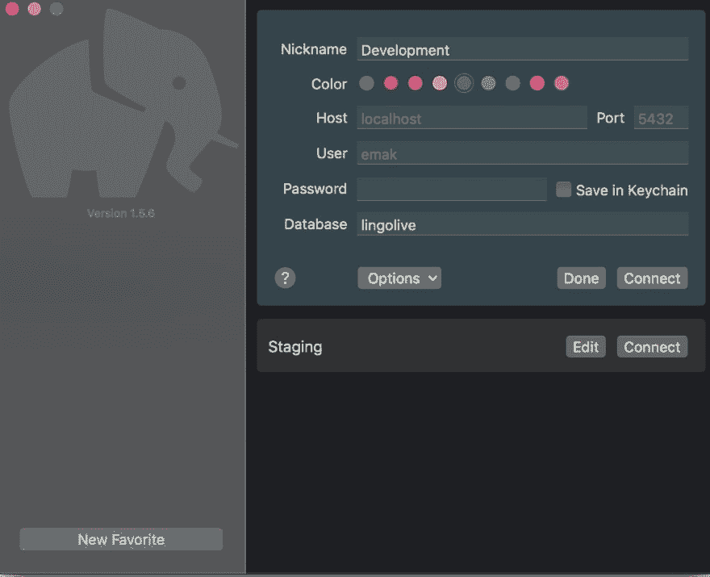
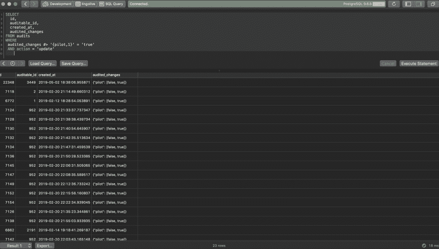
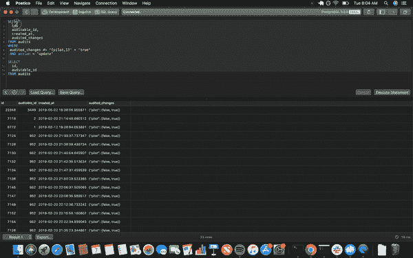

# 使用 Postico 增强您在 MacOSX 上的 PostgreSQL 实践

> 原文：<https://dev.to/edwinthinks/enhance-your-postgresql-practice-on-macosx-with-postico-2g97>

## 简介

#### 免责声明- Postico 仅受 MacOSX 支持。

我在许多场合注意到，开发人员可能会在使用默认交互终端练习或使用 PostgresSQL 数据库时遇到更多困难。诚然，我也是这些开发人员中的一员，直到我的老板给了我一个选择。他建议使用 PostgresSQL 客户端 [Postico](https://eggerapps.at/postico/) ，从那以后我一直愉快地使用它。当然，有[几个 PostgresSQL 客户端](https://postgresapp.com/documentation/gui-tools.html)可用，它们有各自的优点&缺点。

就简单性、易用性、极简主义而言，我相信 [Postico](https://eggerapps.at/postico/) 非常适合初学者或只想快速清除一些查询的基本用户。以下是我的一些理由:

*注意——我与 Postico 的成功没有财务上的联系。我只是一个觉得这样可以帮助别人的 web 开发者:)。*

## 免费版有用

Postico 的免费版本提供了足够有用的实用程序，而且不会超级烦人。市场上有一些产品，让他们的免费版作为一种销售策略非常讨厌。Postico 的免费版确实有局限性，但不会让你想拔毛。

以下是他们的[常见问题](https://eggerapps.at/postico/)中的限制:

我觉得对于大多数用例来说，这些限制并不是最烦人的。另外，你可以想用多久就用多久！

*如果您有办法，请购买他们的许可证来支持他们:)*

## 他们的极简 UI

他们最大的卖点是他们产品中的极简 UI。在第一次加载时，您会看到一些直观且易于导航的选项。

添加和保存用于访问本地或部署数据库的配置轻而易举。

编辑器和查询结果的用户界面清晰直观。

## 保存&加载查询

这是不言自明的，但是在这些客户端工具中，轻松保存和加载查询的能力是必须具备的。没有什么比构建一个超级棒的查询然后丢失它更糟糕的了！

## 执行 SQL+‘执行语句’热键的选择突出显示部分

有时候我发现自己想同时处理多个查询。我发现有多个标签和窗口会让人分心。因此，能够写出多个查询并有选择地运行它们完全改变了游戏规则！

下面是这个功能的一个快速 gif 图(按 CMD + Return 触发热键“执行语句”):

## 结论

很明显，我非常喜欢使用 Postico。但这并不意味着这永远是每个人的正确工具。你可能会发现有其他工具更符合你的需求，你应该去用它！无论您是否决定使用 Postico，我希望您已经被鼓励去寻找能够改善您作为开发人员使用 SQL 的体验的工具。

#### 我们的工作已经够困难的了，而且充满了复杂性，这里一点点的方便，那里一点点的方便，都大有帮助。

谢谢！