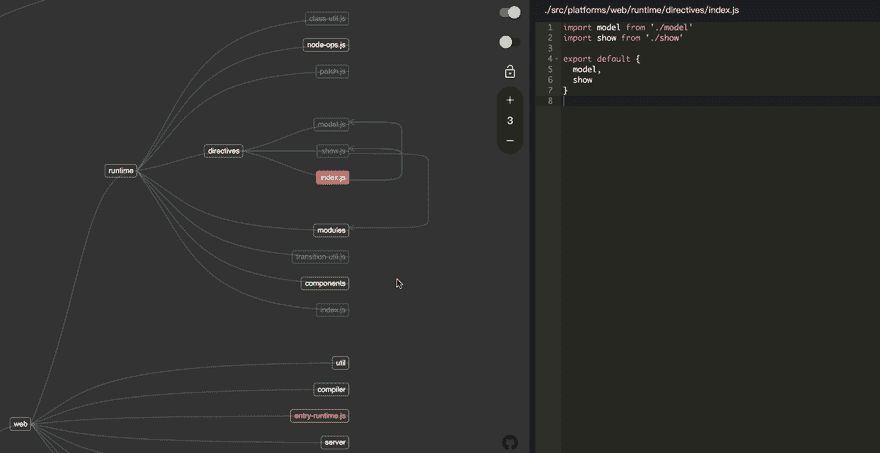

# CodeRoad，让代码更容易阅读

> 原文：<https://dev.to/waningflow/coderoad-make-it-easier-to-read-code-59bf>

当我要去读 vuejs 的源代码的时候。因为复杂的依赖关系，让我很沮丧。因此，我想做一个工具来解决这个问题，使它更容易阅读代码，无论是结构还是细节。

我找到了一些像马奇一样的关于依赖分析的解决方案。然而，他们中的许多人只是制作了一个依赖关系图。当项目很大时，图表会变得很混乱。我需要一种互动的方式来优化这一点。然后我把这个 cli 工具做成了“coderoad”。下面是预览。而且这里有一个[现场演示](https://coderoad.waningflow.com/)(是项目本身的代码库)。

我将其描述为“一种基于依赖分析查看代码库的方法”。它支持 JavaScript，TypeScript，ES6，CommonJS，AMD。用“依赖-巡洋舰”分析依赖关系，用“d3”画图。前端用“react”搭建。它现在支持几个基本功能，例如调整依赖图的深度和切换显示依赖项或从属项。你可以在演示中试试。

我会进一步努力使它变得更好。非常感谢您的反馈。

在[回购](https://github.com/waningflow/CodeRoad)中找到更多信息

