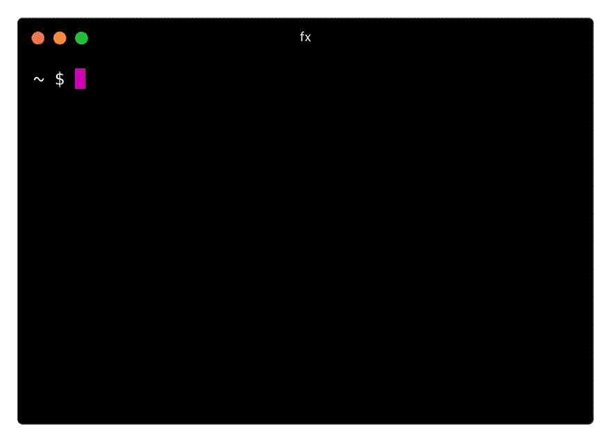
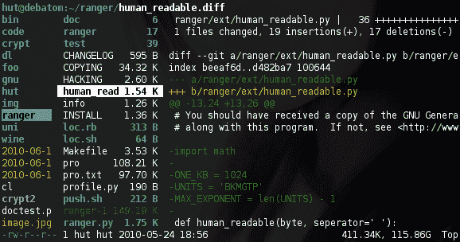

# 5 个 CLI 实用程序来提高您的工作效率

> 原文：<https://dev.to/_darrenburns/5-cli-utilities-to-boost-your-productivity-3ae8>

这里是我最近发现的 5 个命令行工具，它们可以加快你的工作流程。

## `fx`，一个命令行 JSON 处理工具

`fx` ( [GitHub](https://github.com/antonmedv/fx) )是一个用 JavaScript 编写的 CLI 工具，允许你使用终端处理 JSON。

[](https://res.cloudinary.com/practicaldev/image/fetch/s--KhDDt9d2--/c_limit%2Cf_auto%2Cfl_progressive%2Cq_66%2Cw_880/https://thepracticaldev.s3.amazonaws.com/i/xib6bmqvh44347z7nv6f.gif)

您可以使用普通 JavaScript 的小片段来探索和修改 JSON，并使用光标深入结构。对于`fx`提供的所有功能，查看[文档](https://github.com/antonmedv/fx/blob/master/DOCS.md)。

### 安装`fx`

*   `brew install fx`

## `http-prompt`，用于与 API 交互

`http-prompt` ( [网站](http://http-prompt.com/))对于探索和与 HTTP APIs 交互很有用。它带有自动完成和语法高亮功能。

[](https://res.cloudinary.com/practicaldev/image/fetch/s--IfGMaURv--/c_limit%2Cf_auto%2Cfl_progressive%2Cq_66%2Cw_880/https://thepracticaldev.s3.amazonaws.com/i/fr1nejgr4ugiwfjbcyw3.gif)

`http-prompt`是用 Python 编写的，构建在本系列前面介绍过的 [HTTPie](https://httpie.org/) 之上。

### 安装`http-prompt`

*   `pip install --user http-prompt`

## `fselect`，用于使用类似 SQL 的语法查询文件

( [GitHub](https://github.com/jhspetersson/fselect) )是搜索文件系统的另一种方法。它允许您使用类似于 SQL 的语法来查找您想要的内容。例如，查找`/home/user/`中所有`.cfg`和`.tmp`文件的大小和路径:

`fselect size, path from /home/user where name = '*.cfg' or name = '*.tmp'`

`fselect`还支持聚合函数，类似于 SQL:

`fselect "MIN(size), MAX(size), AVG(size), SUM(size), COUNT(*) from /home/user/Downloads"`

上面的查询将找到最小文件大小、最大文件大小、平均文件大小、总文件大小以及您的`Downloads`文件夹中的文件数量。

是用 Rust 编写的，它能做的远不止上面的例子。它有大量的[文档](https://github.com/jhspetersson/fselect)。

### 安装`fselect`

*   `brew install fselect`

## `ranger`，命令行文件管理器

`ranger` ( [GitHub](https://github.com/ranger/ranger) )是一个用 Python 编写的命令行文件管理器，它可以让你使用类似 Vim 的按键绑定来浏览和操作你的文件系统。

[](https://res.cloudinary.com/practicaldev/image/fetch/s--IZAk6Dy---/c_limit%2Cf_auto%2Cfl_progressive%2Cq_auto%2Cw_880/https://thepracticaldev.s3.amazonaws.com/i/h5ng3h3obd2vekxen6s4.png)

它提供了多栏显示，预览文件的能力，并让您执行常见的文件操作(如创建、删除、chmod、复制等。)从 ranger 接口内部。

您可以通过安装一些 Python 包来扩展`ranger`,这些包允许它预览图像、HTML 文档和 PDF 文件。下面的图片是发布在 Ranger 网站上的[图库](https://ranger.github.io/screenshots.html)上的一个例子，展示了图片预览功能。

[](https://res.cloudinary.com/practicaldev/image/fetch/s--ksC5jqA3--/c_limit%2Cf_auto%2Cfl_progressive%2Cq_auto%2Cw_880/https://thepracticaldev.s3.amazonaws.com/i/p8a57yo2wruw0r2sluo4.png)

Ranger 是一款拥有无数功能的深度软件，不在本文讨论范围之内。更多信息可在[官方用户指南](https://github.com/ranger/ranger/wiki/Official-user-guide)中找到。

### 安装`ranger`

*   `brew install ranger`

## `tokei`，查看对您代码的统计

`tokei` ( [GitHub](https://github.com/XAMPPRocky/tokei) )让你通过分解你所使用的语言来查看你的项目的代码统计。它是用铁锈写的，这有助于使它非常快。

下面是在我的[降临代码](https://adventofcode.com/)文件夹中运行`tokei`的输出示例:

```
-------------------------------------------------------------------------------
 Language            Files        Lines         Code     Comments       Blanks
-------------------------------------------------------------------------------
 Markdown                1          165          165            0            0
 Rust                   13         1071          854           51          166
 Plain Text             17         4032         4032            0            0
 TOML                    1           11           10            0            1
-------------------------------------------------------------------------------
 Total                  32         5279         5061           51          167
------------------------------------------------------------------------------- 
```

### 安装`tokei`

*   `brew install tokei`

## 结论

感谢阅读！希望你在这个页面上找到了你感兴趣的东西。如果你对更多类似的内容感兴趣，请在 [Twitter](https://twitter.com/_darrenburns) 和 [DEV](https://dev.to/_darrenburns) 上关注我！