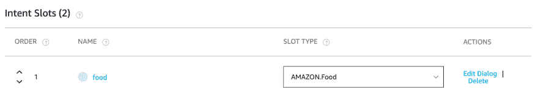
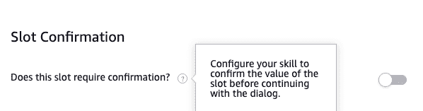
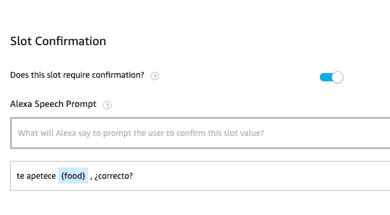
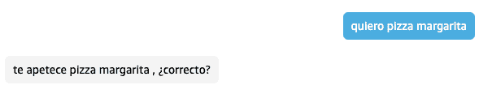
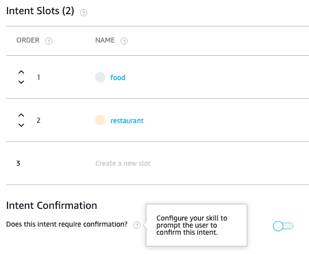
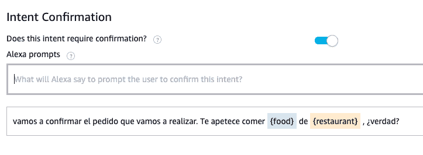
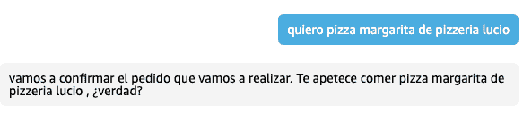

# Alexa 中的对话管理:确认插槽和意图

> 原文：<https://dev.to/kini/dialog-management-en-alexa-confirmando-slots-e-intents-3jj6>

如果您不知道对话管理的这方面内容，我建议您先阅读[我关于概念和一些基本资源的帖子](https://dev.to/kini/dialog-management-en-alexa-introduccion-y-referencias-2dpb-temp-slug-1175086):)

* * *

对于某些技能，与用户确认用户提供的信息可能很重要。想象一下一种在家点菜的技巧，在那里用户说想吃什么，在哪里点菜。最好在下订单前有一个概要，用户可以验证它，甚至，如果我们只是想验证食品或餐馆。

通过对话管理，我们可以对我们的技能进行插槽级和意图级的控制。此外，[将对话自动委托给 Alexa](https://kinisoftware.com/dialog-management-slots-obligatorios/#delegar-el-di-logo-a-alexa)我们可以使用 Alexa 开发者控制台，一切都很简单。

## 插槽级确认

让我们以在家点菜的技巧为例。对于这种技能，我们可以有一个意图，订单意图，它收集食物和餐馆的价值。

假设我们有兴趣与用户验证 Alexa 所理解的“点菜”信息。我们可以从插槽编辑窗口执行所有必要的操作。从特定目的插槽列表中的“编辑对话框”选项访问此窗口。

一旦在插槽编辑窗口中，我们必须先启用“插槽填充”选项，然后再启用“插槽确认”选项。强制性插槽部分我们已经在[另一篇帖子](https://kinisoftware.com/dialog-management-slots-obligatorios/)中看到了。

启用此选项后，我们必须向 Alexa 提供您将告诉用户的确认短语。我们可以将插槽名称添加到这些句子中，以便 Alexa 包含用户收集的值。

与强制性插槽的短语一样，您可以输入多个短语，Alexa 将随机选择。

## 意向级确认

继续使用相同的使用案例，让我们来看看在发送回之前是否要完全确认订单意图。

为此，必须启用“目的编辑”屏幕中的选项。

在本例中，我们可以使用的短语遵循与确认插槽相同的注意事项，但有一个优点，即您可以在此访问用户为每个必需插槽指定的所有值。

眼睛！眼睛！在这里，我们必须特别注意我们创建的提示。Alexa 只能使用在确认意图时“完成”的提示。这是:

*   不使用插槽值进行合成的提示将始终适用于 Alexa。例如:“好吧，我们已经有了你的订单的所有信息，∞了吗？”
*   可完成其所有插槽值的提示。例如，上图提示要求" food "和" restaurant "必须符合 Alexa 的资格。

* * *

一如既往，对于[插槽确认](https://developer.amazon.com/docs/custom-skills/define-the-dialog-to-collect-and-confirm-required-information.html#enable-slot-confirmation)和[意向确认](https://developer.amazon.com/docs/custom-skills/define-the-dialog-to-collect-and-confirm-required-information.html#intent-confirmation)均有正式文件。从控制台执行此操作相当简单，无需在后端拖动一行代码。为了在不连接到现有后端的情况下测试这些型号的东西，如前一篇文章所述，我建议使用，