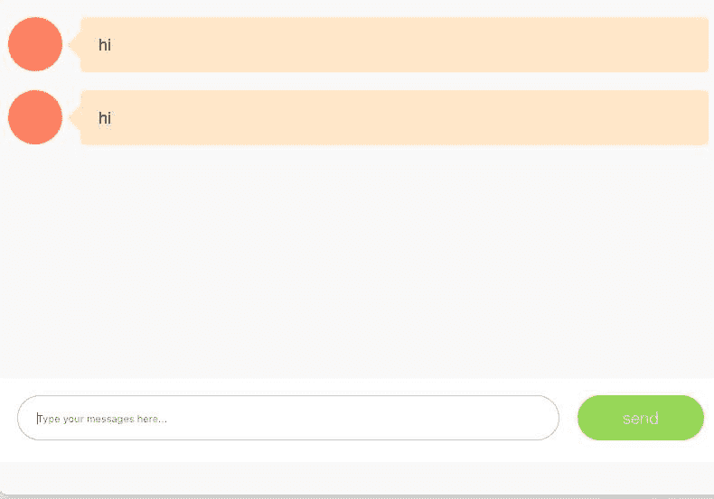
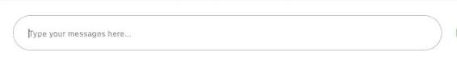
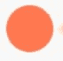
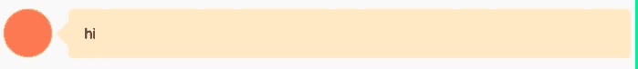
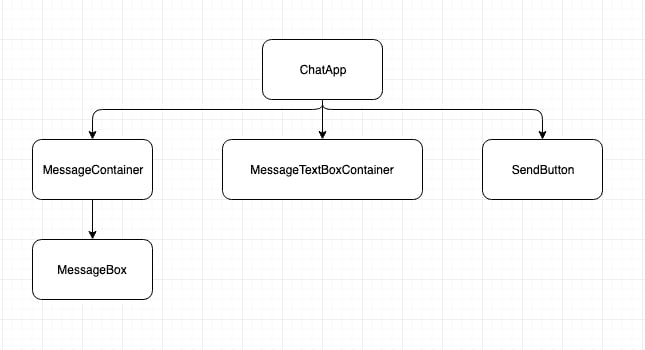

# 通过建立一个聊天前端来学习反应

> 原文：<https://dev.to/bhavaniravi/learn-reactjs-by-building-a-chat-frontend-24oi>

使用 ReactJs 从头开始构建聊天应用程序

### react js 是什么？

> React 是一个用于构建用户界面的 JavaScript 库。它由脸书和一个由个人开发者和公司组成的社区维护。—维基百科

简单来说，HTML + JS + CSS = React

### 为什么是 ReactJS？

1.  我最近换了一个角色，完全用 Python 做后台。虽然我更喜欢它，但我不想让我的 JS 技能白白浪费。
2.  我的大多数朋友都是前端开发人员，所以了解他们的语言(包括反应和他们说的话)有点同龄人的压力。
3.  我想用 Gatsby 建立我自己的投资组合网站,这个网站是用 React 建立的。
4.  额外收获:和我一起工作的前端开发人员不能只是说，*“这在 react 中做不到”*然后就这样离开。

### 先决条件

你需要了解前端技术，比如 HTML、CSS 和 JS。你不需要全部掌握。如果你知道如何把它们放在一起并创建一个网页，你就可以开始了。

### ReactJs —基本认识

```
React = Component + props + state 
```

作为初学者，你会遇到三个基本术语:组件、状态和道具。除此之外，我还听到一些好听的名字，比如*、*、【反应钩】、等等。，它们在我的列表中，但不在我的博客中。

### 从哪里开始？

我是一个文档狂。我花了大量的时间在文档上，只有在它不起作用的时候才寻找其他资源/教程。

React 的[文档教程](https://reactjs.org/tutorial/tutorial.html)带你浏览一个井字游戏，并教你如何组织你的组件，以及如何玩它的状态和道具。虽然我完成了教程，但我不知道如何将它应用到我的项目中。

最终对我起作用的是[在反应中思考](https://reactjs.org/docs/thinking-in-react.html)。它通过分割网页组件来教你如何在它们之间干预状态和道具。

这个教程的伟大之处在于它非常贴近现实。前端开发人员总是有一个设计要处理。所以像在井字游戏中那样从空白开始反应并没有多大帮助。

### 我们在建造什么？

我用普通的 HTML、CSS 和 JS 构建了这个通用的前端聊天模块。这是我构建和玩聊天机器人的模板。我的大多数聊天机器人爱好项目都有这个前端。

我的最终目标是实现一个聊天前端，向后端 API 发送和接收消息。你可以直接在我的 GitHub 库中跳转代码。

[](https://res.cloudinary.com/practicaldev/image/fetch/s---0oefOzS--/c_limit%2Cf_auto%2Cfl_progressive%2Cq_auto%2Cw_880/https://cdn-images-1.medium.com/proxy/0%2AEId7ur6Ot-g2ygiF.jpg)

### 思维中的成分

开始的第一步是定义单独的 UI 组件。你可能会问是什么意思？

在上图中，我们可以看到大约 4-5 个 UI 元素。这些被包装成称为组件的独立实体。

#### 发送按钮

[](https://res.cloudinary.com/practicaldev/image/fetch/s---14Sgtju--/c_limit%2Cf_auto%2Cfl_progressive%2Cq_auto%2Cw_880/https://cdn-images-1.medium.com/max/127/1%2ApKTb3_vUZwIQC-JXP1eEBg.png)T3】

```
class SendButton extends Component{
    render(){
      return (
         <div className="send\_message" 
              <div className="text">send</div>
         </div>);
    }
} 
```

#### TextBox

[](https://res.cloudinary.com/practicaldev/image/fetch/s--U0pj3hQT--/c_limit%2Cf_auto%2Cfl_progressive%2Cq_auto%2Cw_880/https://cdn-images-1.medium.com/max/566/1%2AHhzMGosT1PcHArhfm4MFiw.png)T3】

```
class MessageTextBoxContainer extends Component{
  render(){
    return(
      <div className="message\_input\_wrapper">
        <input id="msg\_input" 
               className="message\_input" 
               placeholder="Type your messages here..."/> 
      </div>
    );
  }
} 
```

#### 头像

<figure>[](https://res.cloudinary.com/practicaldev/image/fetch/s--YTFTnsoL--/c_limit%2Cf_auto%2Cfl_progressive%2Cq_auto%2Cw_880/https://cdn-images-1.medium.com/max/71/1%2AuCJ8MoNfVEyI80YEdn7ofw.png) 

<figcaption>为 DP 的占位符。</figcaption>

</figure>

头像是个人资料图片所在的位置。现在，我们将坚持不同的背景。

```
class Avatar extends Component {
  render(){
    return(
      <div className="avatar"/>
    );
  }
} 
```

#### 消息

MessageBox 组件中有一个 Avatar 组件。对于每条消息，我们将遍历并创建 N 个组件。

[](https://res.cloudinary.com/practicaldev/image/fetch/s--Jiw3632B--/c_limit%2Cf_auto%2Cfl_progressive%2Cq_auto%2Cw_880/https://cdn-images-1.medium.com/max/699/1%2AN9sxyG3-FuKy40ocDbO-Aw.png)T3】

```
class MessageBox extends Component{
  render(){
    return(
      <li className={`message ${this.props.appearance} appeared`}>
        <Avatar></Avatar>
        <div className="text\_wrapper">
            <div className="text">{this.props.message}</div>
        </div>
      </li>
    );
  }
} 
```

#### 整个 App

类似地，我们通过将这些组件绑定在一起来整合整个 UI。它有一个列出消息的 MessageContainer、TextBox 和 SendButton。现在，忽略 this.state 或 this.handleClick

```
class ChatApp extends Component {
render() {
    return (
      <div className="chat\_window">
        < **MessagesContainer** messages={this.state.messages}/>
        <div className="bottom\_wrapper clearfix">
          < **MessageTextBoxContainer/** >
          < **SendButton** handleClick={this.handleClick}/>
        </div>
      </div>
    );
  }
} 
```

### 事件捕捉

在继续讨论组件的状态和属性之前，让我们看看需要处理哪些事件。

1.  按下发送按钮时的 Send_message。
2.  按回车键时发送消息。

在这个模块中，我们将探索如何捕获事件按下回车键和发送按钮点击事件

<figure>[](https://res.cloudinary.com/practicaldev/image/fetch/s---14Sgtju--/c_limit%2Cf_auto%2Cfl_progressive%2Cq_auto%2Cw_880/https://cdn-images-1.medium.com/max/127/1%2ApKTb3_vUZwIQC-JXP1eEBg.png) 

<figcaption>从 app 发送按钮</figcaption>

</figure>

让我们回到 SendButton 组件，并附加一个方法来处理点击。类似地，我们可以向 textbox 添加一个 onKeyPress 事件并捕获这些事件。

```
class SendButton extends Component{
**handleClick(){  
        console.log("I am captured");  
    }**  

render(){
      return (
         <div className="send\_message" 
**onClick={this.props.handleClick}>**
              <div className="text">send</div>
         </div>);
    }
} 
```

### 事件处理

现在我们已经捕获了按钮点击和按键事件。让我们看看如何处理这些事件。这是我最纠结的部分。

*点击发送或按回车键，* *文本框中的当前消息将作为* *MessageComponent 添加到* *MessageContainer 组件中。*

现在，让我们看一下每个组件，看看我们需要哪些数据来填充所需的信息。该数据由组件的状态和属性定义。

#### 衍生状态和道具

让我们来看看每个组件，它需要哪些数据来完成它的工作。

1.  ***发送按钮*** —需要访问用户正在键入的当前消息，以便将其发送到聊天机器人。
2.  ***MessageTextBox*** —需要在用户键入当前消息(状态)并按 enter 键将其发送到聊天机器人时维护和更新当前消息
3.  ***message container—***需要维护来自机器人和用户的所有消息的列表来填充它。

为了在 MessageContainer 中填充当前消息，我们需要知道用户在 ***MessageTextBox*** 中输入的当前消息。

MessageContainer 还需要跟踪到目前为止已经输入/接收的所有消息。因此，它将 messages 数组作为其属性。

```
class TextBox extends Component{

constructor(props){
    this.state.current\_message = ""
}

**onChange(e) {  
    this.setState({  
      current\_message: e.target.value;      
    });   
    if(e.key === "Enter"){  
      // We need to add a new message to MessageContainer component  
    }**  

**}**
render(){
    return(
      <div className="message\_input\_wrapper">
        <input ... 
             value={this.props.current\_message} 
             onChange={this.props.onChange}/>
      </div>
    );
  }
} 
```

现在您可以看到，最初，current_message 是一个空字符串和 onChange，因为我们在 TextBox 组件中键入了文本。但是您在 TextBox 组件中所做的更改对 MessageContainer 是不可见的

在 React 中，共享状态是通过将它移动到需要它的组件的最近的公共祖先来完成的。这就是所谓的“提升状态”。

#### 解除状态上升

现在的问题是，我们应该将控件移动到哪个组件？让我们画一个简单的组件树，看看什么适合。

[](https://res.cloudinary.com/practicaldev/image/fetch/s--jm94QKNl--/c_limit%2Cf_auto%2Cfl_progressive%2Cq_auto%2Cw_880/https://cdn-images-1.medium.com/max/645/1%2AmBJmsZaaXKA_NxLqiukVMA.png)

很明显，所有子组件都需要访问当前消息和机器人已经看到的消息列表。幸运的是，我们只有一个父 ChatApp，它会将的所有状态和事件处理要求委托给相应的子组件

我们的 ChatApp 组件现在会变得有点混乱。首先，让我们定义我们需要的所有函数，然后在需要时将它们附加到事件上。

```
**addMessageBox** (enter=true){
  let messages = this.state.messages;
  let current\_message = this.state.current\_message;
  if(current\_message && enter){
    messages = [...messages, {"message":current\_message}];
}

**handleClick** (){
  this.addMessageBox();
}

**\_handleKeyPress** (e) {
  let enter\_pressed = false;
  if(e.key === "Enter"){
    enter\_pressed = true;
   }
   this.addMessageBox(enter\_pressed)
}

render() {
  return (
    <div className="chat\_window">
      <MessagesContainer messages={this.state.messages}/>
      <div className="bottom\_wrapper clearfix"> . 
       <**MessageTextBoxContainer   
           \_handleKeyPress={this.\_handleKeyPress}**   
           onChange={this.onChange}
           message={this.state.current\_message}> .      
       </MessageTextBoxContainer>

      <SendButton **handleClick={this.handleClick}/>**  
</div>
    </div>
);} 
```

正如您在代码片段中看到的，我们在父组件级别定义了 event_handlers 和 state & props，并将其委托给子组件。

从一个讨厌 frontend 和 Javascript 的人到一个用它开发了 ChatApp 的人，相信我，我喜欢 JS 只是因为 React。向前发展，如果你看到我建立任何前端，它将与反应。