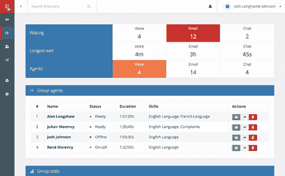
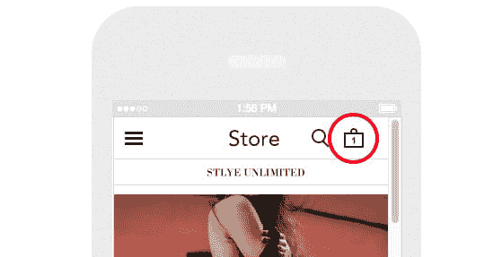
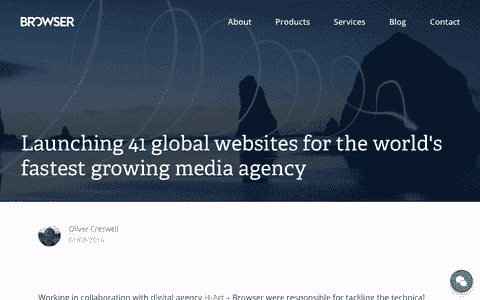

# 如何用过渡改进用户体验设计

> 原文：<https://dev.to/browserlondon/how-to-improve-user-experience-design-with-transitions-i77>

“流动性”和“即时性”这两个词在历史上并不用于描述网站和网络应用的用户体验设计。更有可能的是，它们是你在讨论本地应用，尤其是移动应用时会用到的形容词。

## 进入转场

转换(两种状态之间的动画)在我们的移动设备上无处不在，我们几乎不会注意到它们，但是如果有人删除它们，用户体验的变化将是如此不和谐，整个平台将会感觉笨重和缓慢。两种状态之间转换的力量永远不应该被忽视，我相信这是用户体验设计的一个基本部分，可以使 web 应用程序成为本机应用程序的一个更好的替代方案。

## 用户的问题

无论是导航菜单的“打开”和“关闭”状态之间的转换，还是当用户滚动时新内容进入页面的方法；过渡能够让用户放心，他们正在使用的网站正在按预期运行。

这听起来可能很奇怪，但是无过渡网站的副产品是用户错过了他们期望的改变。如果一个按钮被按下，这是一个完全合理的期望，看到一些事情发生。然而，如果变化是瞬时的，它可能会在雷达下滑动，导致用户重复该操作，从而导致糟糕的用户体验。

<figure> 

<figcaption>导航系统内的转场有助于让用户放心产品正在正确工作</figcaption>

</figure>

我在使用电子商务网站时经常遇到这个问题。想象一下这样的场景:你在自己选择的服装网站上滚动浏览一长页的产品。感兴趣的东西引起了你的注意，你选择按下熟悉的“添加到购物车”按钮。在大多数情况下，此时您的购物车旁边会显示一个“1”。

<figure> 

<figcaption>微妙的过渡通过强化保证帮助改善用户体验</figcaption>

</figure>

这是一个如此微妙的状态变化，它经常会被忽略，并且不必要地重复这个动作——特别是在移动设备上，那里的“购物车”区域通常位于页面的标题区域。对我来说，这是一个完美的过渡。当然，有一个突出的购物车区域，它会随着你的滚动而持续，这将是一个显著的改进，但是通过添加一个简单的过渡到“添加到购物车”按钮，例如，会给用户他们需要的保证。

状态的变化越微妙，转换的用例就越多。

## 使用有效转场

过渡也是一种有效的用户体验设计工具，用来表示在网站或应用程序中的“位置”。例如，如果您正在完成一个多页注册表单，新页面从右侧滑入，而前一页滑向左侧，用户可以在表单中“放置”他们的位置。如果当用户按下“下一页”时，状态立即改变，用户几乎不知道他们输入的数据发生了什么，以及他们在表单中的新位置。但是通过一个简单的转换，避免了用户之间的混淆。

链接到同一页面的按钮也是如此，比如“跳到内容”或“回到顶部”按钮。如果当用户按下按钮时，浏览器平滑地滚动到页面的一个新区域，那么相对于页面的其余内容来说，识别新位置是很容易的——如果按钮被错误地按下，用户需要返回到先前的位置时，这尤其有用。

<figure> 

<figcaption>我们过去曾在博客上使用转场向用户展示他们正在文章间导航。</figcaption>

</figure>

## 总结

像大多数新技术和新功能一样，当用户界面开发人员可以使用过渡时，它们会被稍微滥用——[视差滚动](https://www.awwwards.com/30-great-websites-with-parallax-scrolling.html)可能属于这一类——然而，我觉得当它们以一种深思熟虑的方式使用时，它们会模糊网络感知的“沉闷”和本地“平滑”之间的区别。这种思维方式继续影响着我们如何为客户开发数字工具和应用程序，通过[用户测试](https://www.browserlondon.com/blog/2016/04/30/real-people-real-feedback-user-testing-digital-products/)，我们发现[用户界面设计](https://www.browserlondon.com/blog/2018/02/20/research-discovery-shape-ui-thinking/)中这个经常被忽视的领域在改善用户的整体在线体验方面发挥着关键作用。

* * *

帖子[如何通过过渡改进用户体验设计](https://www.browserlondon.com/blog/2016/10/03/how-we-improve-user-experience-with-transitions/)首先出现在[浏览器伦敦](https://www.browserlondon.com)上。