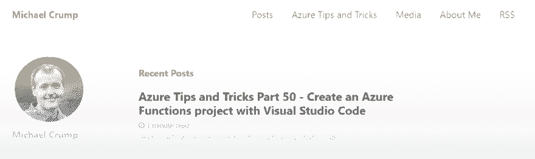
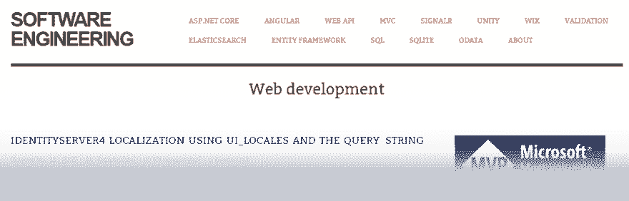
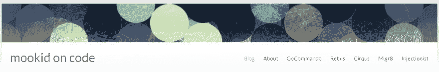
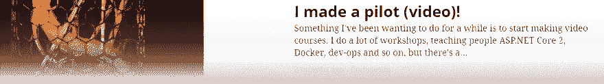
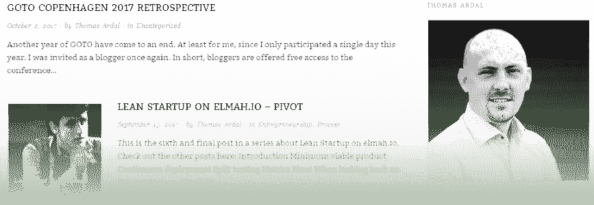

# 。要关注的网络博客-终极列表

> 原文：<https://dev.to/thomasardal/net-blogs-to-follow-the-ultimate-list-4g1g>

过去，书籍是获取知识的唯一途径。我记得在书店和当地图书馆花了数百个小时，挖掘关于编程的旧书。快进到 2017 年，我的注意力几乎完全转移到了博客上。以下是我个人对……的建议。网络博客跟进。

* * *

## [斯科特·汉森](https://www.hanselman.com/blog/)

真的不需要任何介绍。斯科特的博客是最好的资源之一。NET 开发人员。除了写博客。Scott 也写了很多关于生产力的有趣的帖子。

* * *

## [迈克尔·克伦普](https://www.michaelcrump.net/)

凭借他的 *Azure 提示和技巧*系列(目前有 50 篇帖子)，迈克尔的博客充满了关于微软 Azure 的好东西。

* * *

## [特洛伊狩猎](https://www.troyhunt.com/)

和 Hanselman 一样，Troy 也是一个著名的博客作者。NET 开发人员。如果您还没有开始研究安全性，Troy 的博客是一个很好的起点。除了博客，特洛伊还是许多伟大工具的创始人，比如[我被邀请了吗](https://haveibeenpwned.com/)和 [ASafaWeb](https://asafaweb.com/) 。

* * *

## [共同意见](https://codeopinion.com/)

微软 MVP Derek Comartin 写了很多有趣的帖子，主要围绕. NET。如果你对 CQRS 感兴趣，Derek 也写了很多关于这个主题的文章。

* * *

## [软件工程](https://damienbod.com/)

每个人都在谈论 ASP.NET 核心，对不对？好吧，如果你想知道更多，达米恩的博客里有很多好东西。

* * *

## [会说话的 Dotnet](http://www.talkingdotnet.com/)

看起来不像是个人博客，但我不知道这是不是公司博客。也就是说，Talking Dotnet 提供了一些关于 ASP.NET 和相关技术的精彩帖子。

* * *

## [麦斯·克里斯滕森](https://madskristensen.net/)

多年来，我一直在跟踪另一位丹麦人小麦。Mads 写了很多关于 web 技术和标准的博客。他已经安静了几年，但它似乎是一个新发现的爱 ASP.NET 核心，导致了小麦的一系列新的博客帖子。

* * *

## [虹膜类](http://irisclasson.com/)

世界上“最快乐的开发者”MVP Iris Classon 写了很多好帖子。你也可以看到 Iris 在许多国际会议上发言。

* * *

## [史蒂夫·桑德森](http://blog.stevensanderson.com/)

微软员工史蒂夫并不是最有生产力的博客作者。但是当他写的时候，我会听。Steve 是 Knockout.js 的创始人，这是一个很棒的 JavaScript MVVM 框架。React 和 Angular 可能在过去几年中受到了所有的关注，但 Knockout 仍然有效。

* * *

## [你被黑了](https://haacked.com/)

如果你正在使用 ASP.NET 的任何变种，你可能正在运行这个家伙的代码。菲尔是微软创建 ASP.NET MVC 团队的一员，但最近几年一直在 GitHub 工作。而数量。当 Phil 转到 GitHub 后，与. NET 相关的博客帖子急剧减少，但帖子的质量仍然很高。

* * *

## [本·福斯特](http://benfoster.io/blog)

像史蒂夫·桑德森一样，本也不常写博客。但当他这样做时，帖子总是很长，很全面，而且质量很高。本的博客主要围绕 Azure 和 ASP.NET 核心。

* * *

## [网虫](http://blog.dotnetnerd.dk/)

克里斯蒂安写了很多关于. NET 的好文章。我从克里斯蒂安和他的博客中了解了很多关于 NET 核心的情况。最近，他似乎找到了人生的新欢:打字稿。

* * *

## [尘封代码](https://dusted.codes/)

达斯汀的博客令人印象深刻的是，我甚至不需要关注它。每次我在谷歌上搜索某种与 ASP.NET 相关的主题，我都会出现在达斯汀的博客上:)这绝对是我去 ASP.NET(核心)的博客之一。

* * *

## [mookid on code](https://mookid.dk/)

如果说 Iris 是“地球上最快乐的程序员”，Mogens 可能是“最好的”。除了人好之外，莫根斯还是个天才。NET 开发人员的行李中有许多好的博客文章。除了博客，Mogens 还是最好的服务总线。NET(海事组织)。

* * *

## [代码面](https://blog.rendle.io/)

另一个博客作者是马克·伦德尔。如果你喜欢 ASP.NET，离开马克的帖子后，你绝不会失望。

* * *

## [托马斯·阿尔达尔](http://thomasardal.com/)

你抓到我了！那其实是我的个人博客。创建 elmah.io 后，我不像以前那样经常写博客，但我尝试每年至少写几篇博文。我主要写博客。过程和个人生产力。

* * *

## [晨酿](http://blog.cwa.me.uk/)

克里斯奥尔科克可能提供了最好的每日相关性。NET 相关的博客帖子。我甚至无法想象这家伙需要投入多少时间和精力来制作这样一份每日文摘。

* * *

## [阿尔文·阿什克拉夫特的晨露](https://www.alvinashcraft.com/)

很像克里斯的博客,《晨露》是从昨天开始制作的在线内容的每日摘要。New 比 Morning Brew 更宽泛，也包含了移动帖子的链接。

* * *

## [微软 MVP 奖励计划博客](https://blogs.msdn.microsoft.com/mvpawardprogram/)

微软 MVP 写博客的机会。主题有很大的波动，但肯定有一些好帖子。

* * *

## [。网络博客](https://blogs.msdn.microsoft.com/dotnet/)

每个都必须遵循。NET 开发者。及时了解正在发生的新事物。

* * *

## [视觉工作室博客](https://blogs.msdn.microsoft.com/visualstudio/)

如果您正在使用 Visual Studio，Visual Studio 博客是了解新版本和新功能的好地方。

* * *

## [elmah.io 博客](https://blog.elmah.io)

如果没有提到我们自己的博客，这不会是一篇好文章。在 elmah.io 博客上，你不仅会找到关于新特性的帖子。我们喜欢写我们发现并用来构建 elmah.io 的技术。

## 你的用户会喜欢更少的错误吗？

elmah.io 是一个简单的错误记录和正常运行时间监控服务。通过对所有的支持，重新控制你的错误。NET web 和日志框架。

➡️ [错误监控。NET 网络应用](https://elmah.io/?utm_source=devto&utm_medium=social&utm_campaign=devtoposts) ⬅️

这篇文章最初出现在 elmah.io 博客上的[https://blog . elmah . io/net-blogs-to-follow-the-ultimate-list/](https://blog.elmah.io/net-blogs-to-follow-the-ultimate-list/)