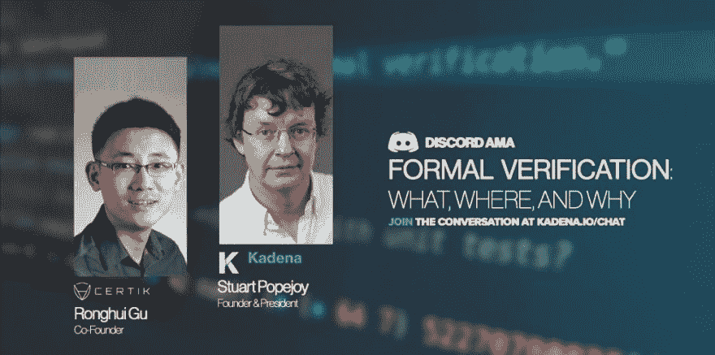

# 邀请-与 Certik & Kadena 进行正式验证讨论-涵盖区块链 FV

> 原文：<https://dev.to/ambituous/invite-formal-verification-discussion-with-certik-kadena-covering-blockchain-fv-cbk>

嘉手纳正在主持另一个 AMA，一个有趣的话题，着眼于…

### 形式验证:内容、地点和原因

由于讨论的是“正式核查”，这是作为凯达娜·AMA 武库的一部分的最新系列。从普通大众到铁杆技术人员。每个人都可以在形式验证及其在区块链空间内的应用和使用方面提出任何问题。

在这个技术 AMA 中，你将见证两个连续的技术企业家展开一场非常有趣的讨论，探索区块链项目如何审计他们的代码以满足特定的标准。

术语形式验证在这个上下文中扩展了数学，集中于减少智能合约的错误和漏洞的实例。如果企业愿意在企业区块链平台上进行部署，这是一项关键要求。该 AMA 是一个必须参加的会议，因为它被 Certik 覆盖，Certik 是区块链领先的安全审计和渗透测试正式验证平台之一。

参加 2019 年 5 月 7 日在 discord.io/kadena 举行的 AMA

### 嘉手纳

面向企业的高吞吐量可扩展区块链。只有少数共识机制，Kadena 是第一个推出 BFT 共识协议和 Chainweb，一个新的工作证明共识机制。两位创始合伙人威尔·马蒂诺和斯图尔特·波佩霍伊在摩根大通工作时相识，他们从零开始开发了一款符合微软企业标准的全新私人区块链

过去，嘉手纳曾举办过一次类似的市政厅 AMA，由专注于加密的投资对冲基金 Multicoin Capital 的联合创始人兼管理合伙人凯尔萨马尼(Kyle Samani)担任主角。讨论的主题是工作证据与利益证据，快速回顾一下

欲了解更多信息，前往官方 EventBrite 上市。那些在 AMA 参与的人可以在#ask-kadena 频道或标签为# FormalVerficationAMA 的推特上提出他们的问题。

AMA 定于 2019 年 5 月 7 日上线，别忘了收听嘉手纳的 Discord group，威尔·马蒂诺和容晖·顾将现场回答问题。

加入讨论@ discord.io/kadena