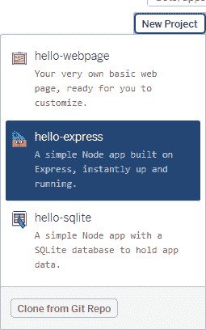
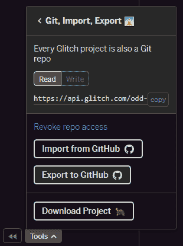
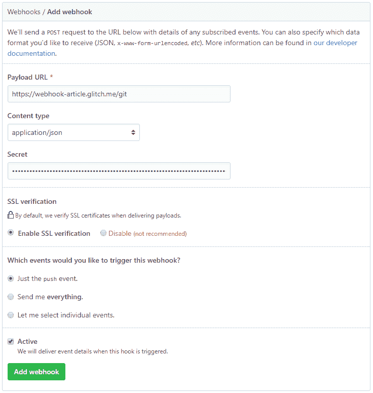

# 通过 GitHub Webhooks 持续部署到 Glitch

> 原文：<https://dev.to/healeycodes/continuous-deployment-to-glitch-via-github-webhooks-3hmh>

我们将使用 Glitch 作为一个免费的容器平台来托管我们的应用程序。更好的是，它将有连续部署！每当我们在 GitHub 上提交我们的`master`分支时，一个安全的 webhook 将被发送到我们的项目，它将更新、构建和重启自己。

接收这个 webhook 的路由内置在我们的 Node.js/Express 应用程序中。我们将使用 Glitch 的`hello-express`模板来简化事情。在该路径中，我们需要运行 git 命令来获取更新的文件以及任何构建和安装命令。

*注意:Glitch 通过运行`npm start`自动重启 Node.js 项目。*

[](https://res.cloudinary.com/practicaldev/image/fetch/s--CwOx78kV--/c_limit%2Cf_auto%2Cfl_progressive%2Cq_auto%2Cw_880/https://thepracticaldev.s3.amazonaws.com/i/81dj02v4f1dqi7b8bbgb.png)

在 Glitch 上创建一个新的`hello-express`项目，通过添加`SECRET='randomized password here'`将你的秘密添加到`.env`文件中。我们需要一个额外的包，它可以通过 package.json 中的 Glitch UI 安装，或者通过带有`npm install body-parser`的控制台安装。

这是`POST`路线，包括额外进口:

```
const bodyParser = require('body-parser');
app.use(bodyParser.json());
const crypto = require('crypto');
const { execSync } = require('child_process');

app.post('/git', (req, res) => {
  const hmac = crypto.createHmac('sha1', process.env.SECRET);
  const sig = 'sha1=' + hmac.update(JSON.stringify(req.body)).digest('hex');
  if (req.headers['x-github-event'] === 'push' &&
    crypto.timingSafeEqual(Buffer.from(sig), Buffer.from(req.headers['x-hub-signature']))) {
    res.sendStatus(200);
    const commands = ['git fetch origin master',
                      'git reset --hard origin/master',
                      'git pull origin master --force',
                      'npm install',
                      // your build commands here
                      'refresh']; // fixes glitch ui
    for (const cmd of commands) {
      console.log(execSync(cmd).toString());
    }
    console.log('updated with origin/master!');
    return;
  } else {
    console.log('webhook signature incorrect!');
    return res.sendStatus(403);
  }
}); 
```

我们对推送事件感兴趣，所以我们检查标题。之后，我们通过用我们的秘密和 webhook 的主体创建一个 HMACSHA1 键控散列来执行安全检查，web hook 的主体将是来自 GitHub 的存储库信息。GitHub 用我们的秘密发送了同一具尸体的签名。我们将签名与`timingSafeEqual`进行比较，以避免计时攻击。希望一切都好，这两个匹配。否则，我们将发送一个`403`代码并跳过更新。

如果一切正常，我们向 GitHub 发回一个`200`代码，并运行我们的命令。我们使用`execSync`同步完成这项工作，因为它们相互依赖，我们记录结果，以防有任何错误或我们稍后需要的信息。`refresh`是一个 Glitch environment 命令，它重置了用户界面并修复了边栏中的文件树(这个周末困扰了我大约半个小时！).对于较小的更改，更新过程通常需要 5-15 秒。在此期间，您的应用程序将不可用。

[](https://res.cloudinary.com/practicaldev/image/fetch/s--9QkB_gCs--/c_limit%2Cf_auto%2Cfl_progressive%2Cq_auto%2Cw_880/https://thepracticaldev.s3.amazonaws.com/i/qo9l5q70puvrc1un0lv9.png)

创建 GitHub webhook 实际上非常简单，但首先要做一些准备。您将需要一个至少包含一个文件的存储库，以便 Glitch 可以向其中导出文件。一旦你建立了你的库，通过 Glitch 控制台`git remote add origin {url}`将它添加为远程源，并发送你的项目。它将成为`glitch`分支。创建一个拉式请求并将其合并到`master`。否则，当 webhook 触发时，您的项目可能会加载错误的`master`变更并自行重置！

*我见过一些人直接从`glitch`分支建立这个过程，但是我更喜欢将`master`作为项目的生产版本。*

[](https://res.cloudinary.com/practicaldev/image/fetch/s--WvOvx7Yl--/c_limit%2Cf_auto%2Cfl_progressive%2Cq_auto%2Cw_880/https://thepracticaldev.s3.amazonaws.com/i/n883n26dt9ipqzdmof4b.png)

进入存储库设置，用 Glitch 项目的秘密创建一个新的 webhook。确保选择`application/json`作为内容类型。仅此而已。任何具有正确签名的`push`事件都将触发 Glitch 项目的更新/安装/重启周期🎉。

您可以在 [PairCode 存储库](https://github.com/healeycodes/PairCode)上的一个实际项目中看到这种情况。这是我在大学写的一个轻量级的 CodePen 克隆，最近一直在修改。格林奇让它起死回生。

如果你有任何棘手的问题，请联系我们👍。

* * *

加入我的关于编程和个人成长的[时事通讯](https://buttondown.email/healeycodes)的 150 多人注册！

我发关于科技的微博。