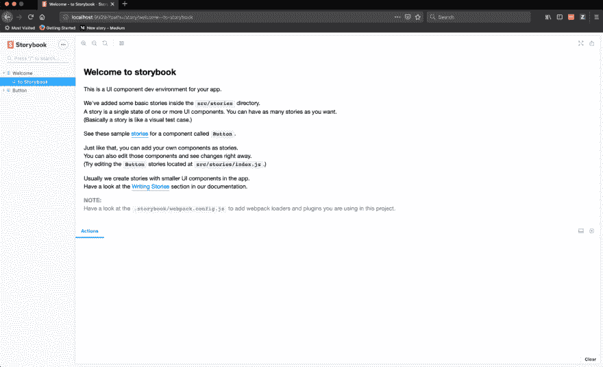
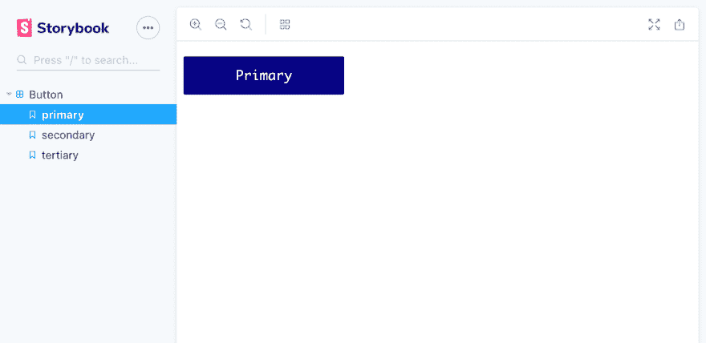
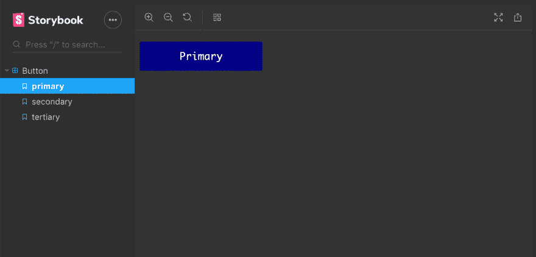
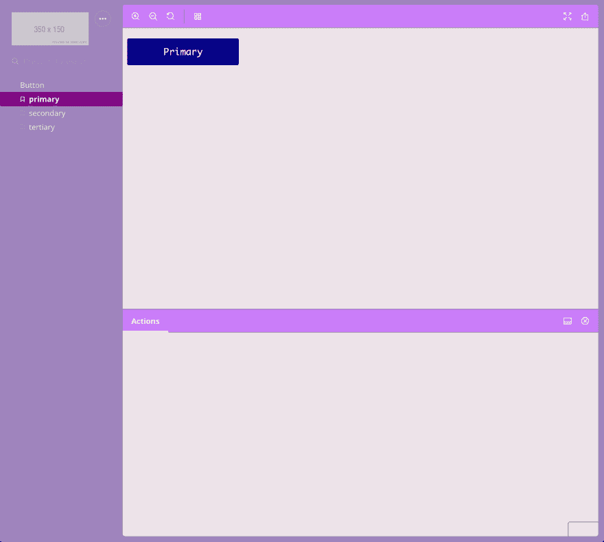

# 用故事书记录 React 组件

> 原文：<https://dev.to/emmabostian/documenting-react-components-with-storybook-4h3b>

# 什么是故事书？

Storybook 将自己推销为 UI 组件的游乐场，它的主要焦点是“写故事”

Storybook 使用故事的概念来记录组件。

一个故事通常包含一个组件的单一状态，就像一个可视化的测试用例。从技术上讲，故事是一个函数，它返回可以在屏幕上呈现的内容。

您的组件故事书将包含许多不同组件的不同故事。

我们编写的每个故事将包含一个单独的状态，例如:

```
Button
  ├── primary
  ├── secondary
  └── tertiary 
```

Storybook 的伟大之处在于，它可以与许多流行的前端框架和库(如 React、Vue、React Native、Angular 等)一起工作。

# 设置

对于本教程，我将使用 React talk 将故事书添加到我的建筑设计系统中，这是我于 2019 年 5 月在 ReactJS Girls London 发表的演讲。欢迎您跟随您自己的代码，或者在[我的库](https://github.com/emmawedekind/react-button)中查看最终代码。

1.  切换到您的项目目录并安装您的依赖项(如果需要的话)。我忘记了，花了十分钟试图找出为什么没有工作…

然后，安装 Storybook 的样板文件。(这需要一秒钟的下载时间。同时，也许你想煮些新鲜咖啡。)

```
cd my-project
npx -p @storybook/cli sb init 
```

该工具将检查您的 package.json 文件，以确定您正在使用哪个框架或库(视图层)。如果自动检测失败，或者如果您想将 Storybook 用于 HTML，请使用以下命令:

```
npx -p @storybook/cli sb init --type html | <other-type> 
```

1.  安装完成后，让我们用下面的命令启动 Storybook:

```
npm run storybook 
```

运行之后，我的浏览器弹出了一个`localhost`窗口，我看到了这个屏幕:

[](https://res.cloudinary.com/practicaldev/image/fetch/s--Mmhf3fgB--/c_limit%2Cf_auto%2Cfl_progressive%2Cq_auto%2Cw_880/https://cdn-images-1.medium.com/max/1600/1%2AwwLGjl_5V9oaxokCNYMyPw.png)

1.  现在，我们希望将 Storybook 作为开发依赖项添加到我们的项目中。我们可以通过运行以下命令来实现这一点:

```
npm install @storybook/react --save-dev 
```

1.  Storybook 有一些我们也需要安装的对等依赖项。`react`和`react-dom`应该保存为普通依赖关系。`@babel/core`和`babel-loader`应该保存为开发依赖项。

```
npm install react react-dom --save
npm install babel-loader @babel/core --save-dev 
```

1.  我们想添加一个 npm 脚本，这样我们就可以轻松地启动 Storybook。在我们的`package.json`文件中，让我们添加一个故事书脚本。

```
{
  "scripts": {
    "storybook": "start-storybook"
  }
} 
```

1.  最后，让我们创建 Storybook 配置文件，它将简单地告诉 Storybook 我们将在哪里编写我们的故事。

您很可能已经在前面的步骤中创建了这个文件，但是如果没有，请在`storybook/`文件夹中创建一个新的`config.js`文件。

我的`config.js`文件包含以下内容:

```
import { configure } from "@storybook/react";

function loadStories() {
  require("../src/stories");
}

configure(loadStories, module); 
```

这告诉 Storybook 在`src/stories`文件夹中寻找我们的故事。

# 让我们记录下来

1.  确保您的开发服务器正在运行 npm run storybook。
2.  首先，我们将去掉`src/stories/index.js`中的样板文件。我的文件看起来像这样:

```
import React from "react";
import { storiesOf } from "@storybook/react";
import { action } from "@storybook/addon-actions"; 
```

1.  现在，让我们导入第一个组件。对于我的项目，我将导入我的按钮组件。它直接位于 src/文件夹中。

```
import Button from '../Button'; 
```

我使用枚举来描述我的按钮类型，所以我也将导入它们。

```
import { ButtonTypes } from "../buttonTypes"; 
```

1.  我们现在想为我们的按钮写第一个`storiesOf`。我们将从三个状态开始:一级、二级和三级。

我们需要使用`.add()`函数来添加每个状态。这需要两个参数:我们想要添加的状态的名称和一个返回组件的函数。

下面是我的`index.js`文件的样子:

```
import React from "react";

import { storiesOf } from "@storybook/react";
import { action } from "@storybook/addon-actions";

import Button from "../Button";
import { ButtonTypes } from "../buttonTypes";

storiesOf("Button", module)
  .add("primary", () => (
    <Button
      type={ButtonTypes.PRIMARY}
      onClick={action("clicked")}
      label="Primary"
    />
  ))
  .add("secondary", () => (
    <Button
      type={ButtonTypes.SECONDARY}
      onClick={action("clicked")}
      label="Secondary"
    />
  ))
  .add("tertiary", () => (
    <Button
      type={ButtonTypes.TERTIARY}
      onClick={action("clicked")}
      label="Tertiary"
    />
)); 
```

当我们在 UI 中检查时，我们应该看到一个 story，Button，它有三种状态:初级、二级和三级。

[](https://res.cloudinary.com/practicaldev/image/fetch/s--lYGu8_Vl--/c_limit%2Cf_auto%2Cfl_progressive%2Cq_auto%2Cw_880/https://cdn-images-1.medium.com/max/1600/1%2AjNWN3RldHeW4U5Z7oxtQOw.png)

1.  现在这个工作了，我想更好地模块化我的故事。如果我为一个企业应用程序或者一个完整的设计系统这样做，我会在组件本身旁边添加故事。然而，由于这是一个概念验证，我将把它们添加到 stories/文件夹中。

我将在`src/stories/`中创建一个`buttonStories.js`文件。

接下来，我将把所有代码从`index.js`文件复制并粘贴到这个新文件中。

最后，我将更新`index.js`来导入`buttonStories.js`文件。

```
import "./buttonStories"; 
```

就是这样！现在，您可以创建故事书故事来记录组件的状态。

# 主题化

您可以为您的故事书文档选择不同的主题。

### 黑暗主题

1.  导入添加参数和主题:

```
import { addParameters } from '@storybook/react';
import { themes } from '@storybook/theming'; 
```

1.  接下来，将主题键添加到参数选项中:

```
import { addParameters } from '@storybook/react';
import { themes } from '@storybook/theming';

// Option defaults.
addParameters({
  options: {
    theme: themes.dark,
  },
}); 
```

瞧，一个黑暗的主题！

[](https://res.cloudinary.com/practicaldev/image/fetch/s--RSgjOYmD--/c_limit%2Cf_auto%2Cfl_progressive%2Cq_auto%2Cw_880/https://cdn-images-1.medium.com/max/1600/1%2ABKgyh1nsEelEG4aLDqNSRA.png)

### 自定义主题

您可以使用 create()函数生成一个自定义主题。

1.  在中创建一个新文件。storybook 文件夹，并根据您的主题为其命名。我会叫我的`purpleDream.js`

2.  粘贴下面的代码并更新值以适应你的主题的需要。

```
import { create } from "@storybook/theming";

export default create({
  base: "dark",

  colorPrimary: "mistyrose",
  colorSecondary: "purple",

  // UI
  appBg: "#9f84bd",
  appContentBg: "#ede3e9",
  appBorderColor: "grey",
  appBorderRadius: 4,

  // Typography
  fontBase: '"Open Sans", sans-serif',
  fontCode: "monospace",

  // Text colors
  textColor: "white",
  textInverseColor: "rgba(255,255,255,0.9)",

  // Toolbar default and active colors
  barTextColor: "white",
  barSelectedColor: "white",
  barBg: "#ca7df9",

  // Form colors
  inputBg: "white",
  inputBorder: "silver",
  inputTextColor: "white",
  inputBorderRadius: 4,

  brandTitle: "My custom storybook",
  brandUrl: "https://example.com",
  brandImage: "https://placehold.it/350x150"
}); 
```

1.  更新你的`config.js`文件来使用你的新主题。

```
import { configure } from "@storybook/react";
import { addParameters } from "@storybook/react";
import purpleDream from "./purpleDream";

function loadStories() {
  require("../src/stories");
}

addParameters({
  options: {
    theme: purpleDream
  }
});

configure(loadStories, module); 
```

给你。你现在有了一个自定义主题(希望不要像我的一样难看。)

[](https://res.cloudinary.com/practicaldev/image/fetch/s--vqNV9UXe--/c_limit%2Cf_auto%2Cfl_progressive%2Cq_auto%2Cw_880/https://cdn-images-1.medium.com/max/1600/1%2AkqQoqhs1wkpX50j5zArp9w.png)

* * *

我希望你喜欢这个关于故事书和反应入门的教程。请在 GitHub 上随意查看我的代码。