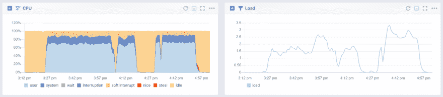
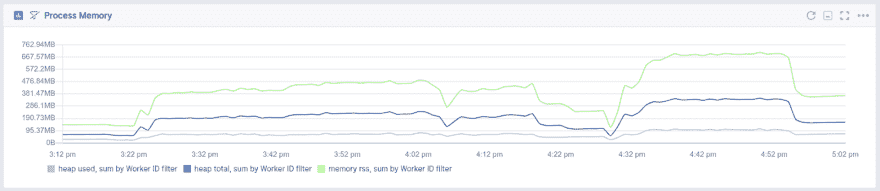
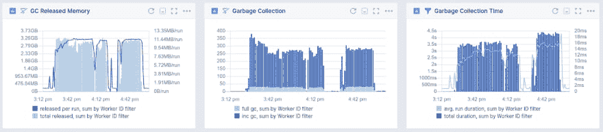
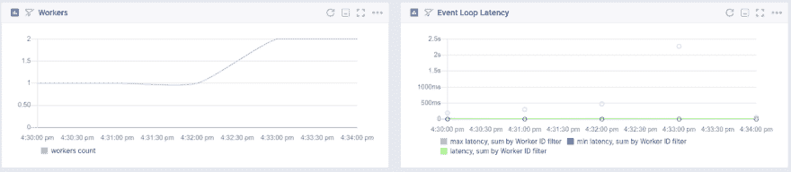
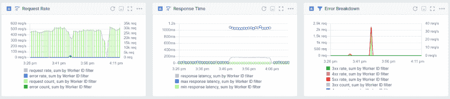
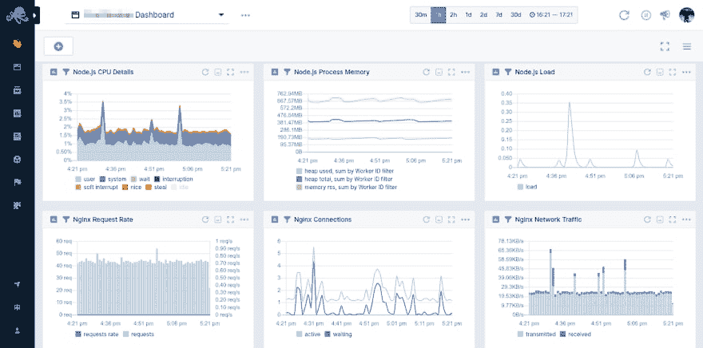

# 要监视的 Top Node.js 度量

> 原文：<https://dev.to/sematext/top-node-js-metrics-to-monitor-1id5>

[https://api.parler.io/ss/player?url=https://www.parler.io/audio/7723913179/55a00250ccac6328268207eb74ca1e9abc4c6c77.42ee840f-056e-41ed-ab84-a0d6cad93ea1.mp3](https://api.parler.io/ss/player?url=https://www.parler.io/audio/7723913179/55a00250ccac6328268207eb74ca1e9abc4c6c77.42ee840f-056e-41ed-ab84-a0d6cad93ea1.mp3)

让 [Node.js](https://nodejs.org/en/) 应用程序变得快速而稳定是一项棘手的任务。用构建 Node.js 的 [V8 引擎](https://v8.dev/)获得恰到好处的性能并不像人们想象的那么简单。 [JavaScript 是一种动态类型语言](https://www.quora.com/Is-JavaScript-a-dynamically-typed-or-statically-typed-language)，你可以让解释器给变量分配类型。如果不小心，这可能会导致内存泄漏。Node.js 本质上是一个 JavaScript 运行时，在内存使用和 CPU 线程使用方面有限制。它确实有垃圾收集，这与进程内存和 CPU 使用率紧密相关。

有各种各样的指标需要探索和跟踪，但是哪些是重要的呢？本文将讨论在分析 Node.js 服务器性能时至关重要的关键指标。

## node . js 的 CPU 使用度量

我在上面提到过 Node.js 运行时在 CPU 线程利用率方面有限制。这背后的原因是运行时的[单线程执行](https://codeburst.io/how-node-js-single-thread-mechanism-work-understanding-event-loop-in-nodejs-230f7440b0ea)，这意味着它被绑定到一个 CPU 的单核。Node.js 应用程序的一个实例只能使用一个 CPU 核心。

然而，记住这一点，Node.js 应用程序很少消耗大量的 CPU 时间。相反，它们依赖于[非阻塞 I/O](https://nodejs.org/de/docs/guides/blocking-vs-non-blocking/) 。CPU 不必等待 I/O 请求，而是异步处理它们。如果您面临高 CPU 利用率，这可能意味着大量同步工作占用了 CPU 并阻塞了线程。这太糟糕了！通过阻塞线程，它也阻塞了异步进程。

大多数时候你不需要担心 CPU 负载。他们很少会破坏交易。降低 CPU 使用率的方法是创建子进程或分支来处理 CPU 密集型任务。例如，您有一个处理传入请求的 web 服务器。为了避免阻塞这个线程，您可以生成一个[子进程](https://zaiste.net/nodejs-child-process-spawn-exec-fork-async-await/)来处理 CPU 密集型任务。相当酷。

修复 CPU 密集型代码是提高 Node.js 服务器性能和稳定性的第一步。需要注意的指标有:

*   CPU 使用率
*   CPU 负载

## node . js 的内存使用和泄漏度量

为了理解内存使用和潜在的泄漏，您首先需要理解什么是[堆和栈](https://blog.sessionstack.com/how-does-javascript-actually-work-part-1-b0bacc073cf)。值可以存储在堆栈或堆中。栈可以被可视化地表示为一堆书，其中书实际上是函数，它们的上下文存储在内存中。堆是一个更大的区域，存储动态分配的所有内容。

除此之外，还有一件关于 Node.js 进程内存的重要事情您必须知道。单个进程可以有 1.5 GB 的最大堆。你猜对了！内存泄漏是 Node.js 中的一个常见问题。当对象被引用的时间太长时，就会发生内存泄漏，这意味着即使不需要值，也会存储这些值。因为 Node.js 基于 V8 引擎，所以它使用垃圾收集来回收不再需要的变量所使用的内存。这个回收内存的过程停止了程序的执行。我们将在下一节更详细地介绍垃圾收集。

注意内存泄漏比您想象的要容易。如果您的进程内存持续稳定增长，而不是周期性地被垃圾收集减少，那么您很可能有内存泄漏。理想情况下，您应该将重点放在防止内存泄漏上，而不是对它们进行故障排除和调试。如果您在应用程序中遇到内存泄漏，要找到根本原因是非常困难的。您需要注意的指标有:

*   垃圾收集周期之间释放的内存
*   进程堆大小
*   进程堆使用情况

## node . js 的垃圾收集指标

在 V8 运行时，垃圾收集会停止程序执行。  [垃圾收集有两种](https://javascript.info/garbage-collection)。一种叫做清理，利用**增量垃圾收集周期**一次只处理堆的一部分。这与**完全垃圾收集周期**相比非常快，后者从经历了多次增量垃圾收集周期的对象和变量中回收内存。因为完整的垃圾收集周期会暂停程序的执行，所以它们的执行频率较低。

通过测量完整或增量垃圾收集周期的执行频率，您可以看到它如何影响回收内存所需的时间以及释放了多少内存。将释放的内存与堆的大小进行比较，可以显示是否有增长的趋势，从而判断是否有内存泄漏。

由于上述原因，您应该监控以下 Node.js 垃圾收集指标:

*   垃圾收集消耗的时间
*   完整垃圾收集周期的计数器
*   增量垃圾收集周期的计数器
*   垃圾收集后释放的内存

## Node.js 事件循环指标

Node.js 天生就很快，因为它可以异步处理事件。使之成为可能的是[事件循环](https://nodejs.org/de/docs/guides/event-loop-timers-and-nexttick/)。它是一个特殊的地方**,保留用于处理异步函数，这些函数被调用作为对特定事件的响应**,并且在主线程之外执行。这样的函数也被称为**回调函数**。

Node.js 具有受 CPU 限制的能力，并在等待 I/O 操作时使用异步操作来避免浪费 CPU 周期。一个服务器可以处理大量的连接，并且不会因为 I/O 操作而被阻塞。这叫做**非阻塞 I/O** ，一个*著名的*术语。然而，事件循环可能会变慢，并最终导致每个后续事件需要更长的时间来处理，从而导致所谓的**事件循环滞后**。

事件循环滞后的常见原因是**长时间运行的同步流程**和**每循环任务的增量**。

### 长时间运行的同步流程

注意在应用程序中如何处理同步执行。所有其他操作都需要等待执行。这就是 Node.js 性能的著名规则。[不要阻塞事件循环！](https://nodejs.org/de/docs/guides/dont-block-the-event-loop/)您无法避免您的服务器所做的 CPU 受限的工作，但是您可以明智地选择如何执行异步和同步任务。如上所述，对同步任务使用分支或子流程。

### 每循环任务增量

随着应用程序的扩展，您会看到每个循环的负载和任务数量都在增加。Node.js 跟踪所有需要由事件循环处理的异步函数。当计数过高时，随着任务的增加而出现的滞后将导致响应时间的增加。

好消息是，您可以通过增加运行应用程序的进程数量来缓解这一问题。通过使用集群模块，您可以利用服务器的所有 CPU 核心。当然，您也可以使用 PM2 来产生工作进程。下一节将详细介绍这一点。

如果你想要更详细的事件循环的解释，看看 JSConf EU 的菲利普·罗伯茨的演讲。

这就是为什么您需要监控这些指标:

*   最慢的事件处理(最大延迟)
*   最快的事件处理(最小延迟)
*   平均事件循环延迟

## Node.js 集群模式和分叉工作进程

到目前为止，我已经多次提到 Node.js 的单线程特性，以及单个进程的内存上限，以及如何通过所有措施避免阻塞线程。扩展 Node.js 超过这个范围是通过集群模块完成的。

通过使用集群模块，您可以创建一个与分叉的工作进程共享套接字的主进程。这些进程可以交换消息。关键是。所有分叉的工作进程都有自己的进程 ID，可以在专用的 CPU 内核上运行。web 服务器的一个典型用例是派生工作进程，这些工作进程在共享服务器套接字上运行，并以循环方式处理请求。

检查工作进程的数量(包括由集群模块产生的进程和由远离主线程运行同步任务产生的子进程)可能是需要了解的重要指标。如果它们由于某种原因被终止，确保让它们重新运行是很重要的。在监控工具中拥有这个特性是一个很大的优势！

这里需要观察的指标有:

*   工人计数
*   每个工作线程的事件循环延迟

## Node.js HTTP 请求/响应延迟

关注面向用户的延迟是监控任何 API 的最关键步骤。HTTP 请求到达您的服务器，并及时向您的用户返回响应，这将使您的客户回头客。监控热门框架的 API 路线，像 [Express](https://expressjs.com/) 、 [Koa](https://koajs.com/) 、[哈比神](https://hapijs.com/)都是必须的。

在监控 HTTP 请求和响应指标时，您必须考虑 4 个关键值:

*   响应时间
*   请求速率
*   错误率
*   请求/响应内容大小

## Node.js 监控仪表板和集成

如果没有支持服务，比如用于代理的 [Nginx](https://www.nginx.com/) 、用于缓存的 [Redis](https://redis.io) 、用于索引和全文搜索的 [Elasticsearch](https://en.wikipedia.org/wiki/Elasticsearch) ，或者像 [MongoDB](https://www.mongodb.com/) 或 [PostgreSQL](https://www.postgresql.org/) 这样的持久存储，Node.js 应用程序将永远无法独立运行。这些服务与 Sematext 的集成就像添加 Node.js 指标一样简单。选择监控解决方案时，请确保您可以在一个地方创建包含所有这些指标的控制面板。有一种方式向您展示所有服务及其健康状况的概述是至关重要的。

查看 Node.js 应用程序周围所有系统的指标非常重要。这只是一个结合了 Node.js、Nginx 和 Elasticsearch 指标的 Node.js 监控仪表板的小例子。

## 总结 Node.js 关键指标

监控 Node.js 应用程序的健康和性能可能很难做到。Node.js 关键指标是紧密耦合的。垃圾收集周期会导致进程内存和 CPU 使用率的变化。关注这些 Node.js 指标对于保持您的应用程序正常运行，同时以最小的延迟为您的用户提供服务是至关重要的。

这些是我要监控的 Node.js 主要指标。请在下面的评论中告诉我你认为什么是至关重要的。

如果你需要一个软件栈的可观察性解决方案，看看  [语义云](https://sematext.com/cloud/)。我们正在推动  [开源我们的产品](https://github.com/sematext)并产生影响。如果您想试用我们并监控您的 Node.js 应用程序，[注册](https://apps.sematext.com/ui/registration)获得 30 天的 pro 试用，或者立即选择免费等级。