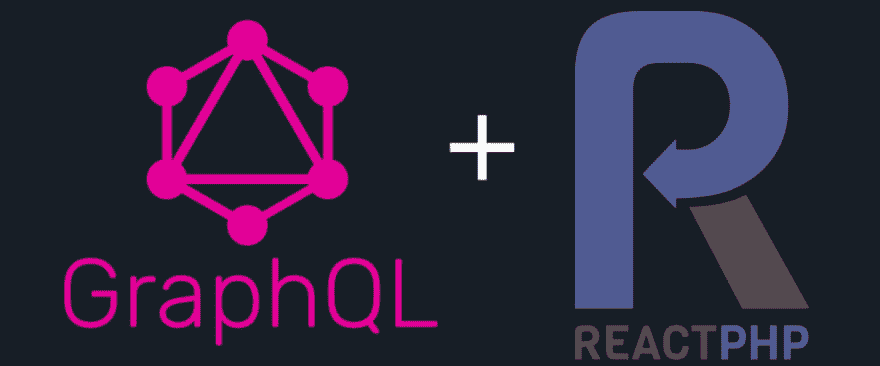

# 了解如何使用 PHP 在微服务架构之上构建无服务器的 GraphQL API

> 原文：<https://dev.to/realflowcontrol/learn-how-you-can-build-a-serverless-graphql-api-on-top-of-a-microservice-architecture-with-php-51bn>

[](https://res.cloudinary.com/practicaldev/image/fetch/s--fO3jWQrL--/c_limit%2Cf_auto%2Cfl_progressive%2Cq_auto%2Cw_880/https://cdn-images-1.medium.com/max/1024/1%2ACGmVEHr9ZF-qzSjXLzv_3g.png)

几周前，我读了 Chris Noring 的一篇非常有趣的文章，关于[“了解如何在微服务架构之上构建无服务器的 GraphQL API，第 1 部分”](https://dev.to/azure/learn-how-you-can-build-a-serverless-graphql-api-on-top-of-a-microservice-architecture-233g)，他完全是用 Node.js 和 Express 构建的，我对自己说:*你可以用 PHP 和* [*ReactPHP*](https://reactphp.org/) *来做这件事！*

*免责声明:这不是 JavaScript 对 PHP 的咆哮！*

### 大局

正如 Chris Noring 在他的原始文章中所做的，我创建了两个公开 REST-API 的微服务，一个服务产品，另一个服务对所述产品的评论。这两个微服务将只在内部可用，不会暴露在互联网上，但仍然应该有面向客户的 API。为此，我将使用 GraphQL 作为一个高级 API，结合两个服务的结果。

正如你所想象的，我的文章没有什么原创，我只是用 PHP 和 ReactPHP 做了同样的事情。你可以在 GitHub 上找到[的源代码，所以我将自己限制在重点部分。](https://github.com/flow-control/php-graphql-microservice)

### 高亮显示

#### 服务

这两项服务非常简单。只是一点 ReactPHP 代码异步处理传入的 HTTP 请求。出于示例的目的，两者都返回静态 JSON 字符串。在一个更深入的例子中，您可以连接到一个数据库并查找数据。

#### GraphQL

当在 PHP 中使用 GraphQL 时，有几个库，但只有 [webonyx/graphql-php](https://github.com/webonyx/graphql-php) 看起来足够成熟，而且它有一个支持 ReactPHP 的异步接口。所以这是本案的完美匹配。

当使用异步接口时，您需要调用`GraphQL::promiseToExecute`而不是`GraphQL::executeQuery`，并给它 promise 适配器作为第一个参数，在我的例子中是`GraphQL\Executor\Promise\Adapter\ReactPromiseAdapter`的一个实例

当以这种方式初始化和使用时，对`promiseToExecute`的方法调用将返回一个 ReactPHP 承诺，在这个承诺上您可以注册您的`then`-处理程序。另外，你的`resolve`函数现在可以返回一个 ReactPHP 承诺，这意味着你可以在任何地方编写异步代码。

你得到的是一个用 PHP 编写的纯异步 GraphQL-API。

在 GitHub 上找到源代码

## [real flow control](https://github.com/realFlowControl)/[PHP-graph QL-微服务](https://github.com/realFlowControl/php-graphql-microservice)

### 基于微服务架构的 GraphQL API 的简单实现示例

<article class="markdown-body entry-content container-lg" itemprop="text">

# 微服务之上的 GraphQL API

这只是 Chris Norings 关于在微服务架构之上构建[无服务器 GraphQL API 的文章中的一个从 Node.js/Express 到 PHP/ReactPHP 的端口。](https://dev.to/azure/learn-how-you-can-build-a-serverless-graphql-api-on-top-of-a-microservice-architecture-233g)

## 入门指南

这些说明将为您提供一个项目的副本，并在您的本地机器上运行，用于开发和测试目的。

### 先决条件

您需要在本地机器上启动并运行`docker`和`docker-compose`。

### 安装

```
git clone https://github.com/flow-control/php-graphql-microservice.git
cd php-graphql-microservice
make
docker-compose up -d
curl -X POST \
       -H "Content-Type: application/json" \
       --data '{ "query": "{ product (id:1) { id name } }" }' \
       localhost:8000
```

Enter fullscreen mode Exit fullscreen mode

## 用...建造

*   [react PPH](https://reactphp.org/)
*   [graphql-php](https://github.com/webonyx/graphql-php)
*   [线索/嗡嗡声-反应](https://github.com/clue/reactphp-buzz)

## 许可证

MIT，参见[许可文件](https://github.com/realFlowControl/php-graphql-microserviceLICENSE)。

</article>

[View on GitHub](https://github.com/realFlowControl/php-graphql-microservice)

编码快乐！