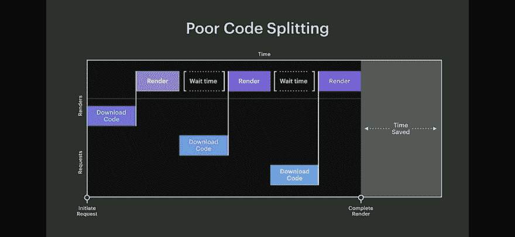
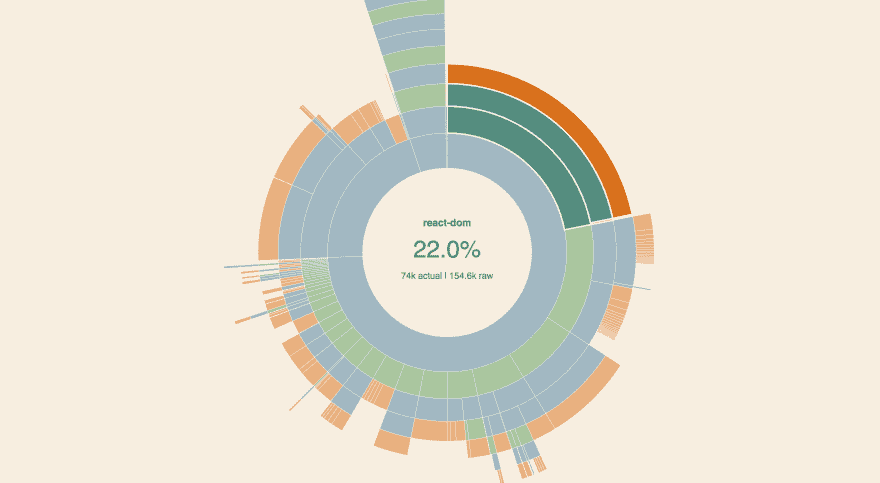
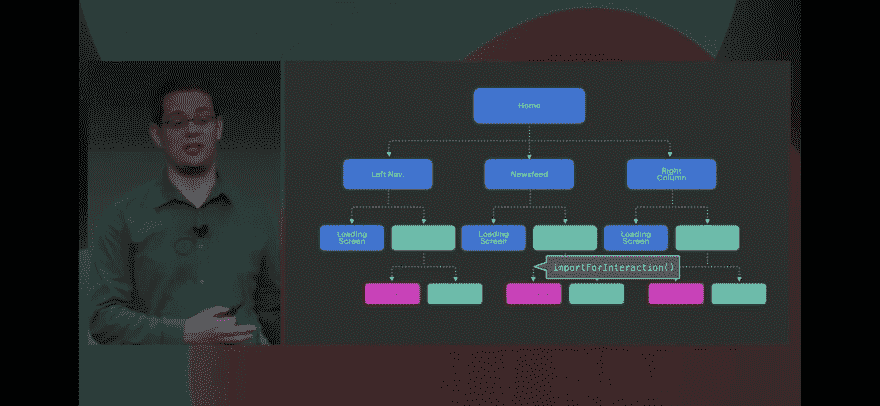

# 🚗用于代码分割的边车

> 原文：<https://dev.to/thekashey/sidecar-for-a-code-splitting-1o8g>

代码分割。代码拆分无处不在。然而，为什么呢？仅仅因为现在有太多的 javascript，而且不是所有的都在同一时间点使用。

JS 是一个很*重*的东西。不是为你的 iPhone Xs 或全新的 i9 笔记本电脑，而是为数百万(可能是数十亿)较慢的*设备拥有者。或者至少是你的手表。*

所以- JS 是不好的，但是如果我们**禁用它**会发生什么呢-问题会消失...对于一些网站来说，和基于 React 的网站一起消失。但是不管怎样，有些网站不需要 JS 也能工作...我们应该向他们学习一些东西...

# 代码拆分

今天，我们有两条路可走，两条让它变得更好或不变得更糟的路:

## 1。少写代码

那是你能做的最好的事情。虽然`React Hooks`可以让你发布更少的代码，像`Svelte`这样的解决方案可以让你生成比*通常的*更少的代码，但这并不容易做到。

这不仅与代码有关，还与*功能*有关——为了保持代码“紧凑”，你必须保持它“紧凑”。如果 application bundle 要做这么多事情(并且有 20 种语言版本)，就没有办法保持它的小。

有办法写出*简短而健全的*代码，也有办法写出相反的实现——*血战企业*。你知道，两者都是合法的。

[](https://res.cloudinary.com/practicaldev/image/fetch/s--lG6PDbQr--/c_limit%2Cf_auto%2Cfl_progressive%2Cq_auto%2Cw_880/https://thepracticaldev.s3.amazonaws.com/i/owpecb2mbhg4bg2bck7s.png)

但主要问题是代码本身。一个简单的 react 应用程序可以轻松绕过“推荐”的 250kb。你可能会花一个月的时间优化它，让它变得更小。“小”优化被很好地记录下来并且非常有用——只需用`size-limit`得到`bundle-analyzer`,然后恢复原状。
有许多库，它们争夺每一个字节，试图让你保持在你的极限内——[preact](https://preactjs.com/)和 [storeon](https://github.com/storeon/storeon) ，仅举几例。

但是我们的应用程序超过了 200kb。更接近 **100Mb** 。删除千字节没有意义。即使删除兆字节也没有意义。

> 过一会儿，你就不可能让你的应用程序保持小了。它会慢慢变大。

## 2。无船代码

或者，`code split`。换句话说——**投降**。拿你的 100mb 包，做 20 个 5mb 包。老实说——如果你的应用程序变大了，这是唯一可能的处理方法——用它创建一个小应用程序包。

> 既然我们正在讨论它，你可能希望确保在 2019 年应对代码拆分时，你是最新和最棒的。或者只是阅读一些实现细节。

[](/thekashey) [## 💡2019 年反应代码拆分

### Anton Korzunov 3 月 19 日 7 分钟读取

#react #javascript #ssr #codesplitting](/thekashey/react-code-splitting-in2019-3cmg)

但是现在有一件事你应该知道:无论你选择哪个选项，它都是一个实现细节，而我们正在寻找更可靠的东西。

# 关于代码拆分的真相

关于代码拆分的真相是，它的本质是**时间分隔**。你不仅仅是*分割*你的代码，你还以一种方式分割它，让**在一个时间点尽可能少地使用**。

只是不要发布你现在不需要的代码。摆脱它。

[](https://res.cloudinary.com/practicaldev/image/fetch/s--Zpy8sx-3--/c_limit%2Cf_auto%2Cfl_progressive%2Cq_auto%2Cw_880/https://thepracticaldev.s3.amazonaws.com/i/5hh0jid2m3la0t8o5b2x.png)

说起来容易，做起来难。我有几个沉重的，但没有充分分裂的应用程序，其中任何一个页面加载了大约 50%的东西。有时`code splitting`变成了`code separation`，我的意思是——你可以将代码移动到不同的块中，但是仍然要全部使用。回想一下*“不要发布你现在不需要的代码”*，–我*需要* 50%的代码，这才是真正的问题。

> 有时仅仅在这里和那里加上`import`是不够的。直到不是**时间**分离，而只是**空间**分离——这一点都不重要。

有 3 种常见的代码拆分方式:

1.  只是动态`import`。这几天很少单独使用。它更多的是关于跟踪一个*状态*的问题。
2.  当您可能推迟 React 组件的呈现和加载时。如今大概 90%的“反应代码分割”。
3.  *懒* `Library`，其实就是`.1`，但是会通过 React 渲染道具给你一个库码。在 [react-imported-component](https://github.com/theKashey/react-imported-component#library-level-code-splitting) 和 [loadable-components](https://www.smooth-code.com/open-source/loadable-components/docs/library-splitting/) 中实现。相当有用，但不太为人所知。

## 组件级代码拆分

这个最受欢迎。作为每路由代码分割或每组件代码分割。要做到这一点并最终保持良好的*感知效果*并不容易。从`Flash of Loading Content`开始就是死亡。

好的技巧是:

*   并行加载一条路线的`js chunk`和`data`。
*   使用`skeleton`在页面加载前显示类似页面的内容(如脸书)。
*   为了更好的预测，你甚至可以使用 [guess-js](https://github.com/guess-js/guess) 。
*   使用一些延迟、加载指示器、`animations`和`Suspense`(将来)来软化过渡。

而且，你知道，那都是关于*感知*表现的。

[](https://res.cloudinary.com/practicaldev/image/fetch/s--NP7f8YXF--/c_limit%2Cf_auto%2Cfl_progressive%2Cq_auto%2Cw_880/https://thepracticaldev.s3.amazonaws.com/i/4tl08n169vx1ziat7nhc.png)

> 图片来自[用幽灵元素改进的 UX](https://blog.angularindepth.com/https-medium-com-thomasburleson-animated-ghosts-bfc045a51fba)

# 听起来不太好

你知道，我可以称自己为代码分解专家，但我也有自己的失败。

有时我可能无法减少包的大小。有时我可能无法提高结果性能，只要`the _more_ code-splitting you are introducing - the more you spatially split your page - the more time you need to _reassemble_ your page back` *。这叫做**加载波**。

> *   No SSR or pre-rendering. The appropriate SSR is the current game changer.

[](https://res.cloudinary.com/practicaldev/image/fetch/s--gZpfLwd---/c_limit%2Cf_auto%2Cfl_progressive%2Cq_auto%2Cw_880/https://thepracticaldev.s3.amazonaws.com/i/evzfftae04h5t868xhyw.jpeg)

上周我失败了两次:

*   我在[一次图书馆比较](https://github.com/mui-org/material-ui/issues/15450)中输了，只要我的图书馆更好😉，但比另一个大得多。我没能**1。**少写代码。
*   优化一个小网站，由我的妻子在 React。它使用基于路由的组件分割，但是`header`和`footer`被保留在主包中，以使转换更“可接受”。仅仅几件事，**互相紧耦合**捆绑端暴涨到 320 kb(gzip 之前)。没有什么重要的东西，也没有什么我真的可以拿走的东西。**千刀万剐**。我的**出货失败代码**。

> `React-Dom`为 20%，`core-js`为 10%，`react-router`，`jsLingui`，`react-powerplug`...20%的自有代码...我们已经做完了。

[](https://res.cloudinary.com/practicaldev/image/fetch/s--oDpV2F7e--/c_limit%2Cf_auto%2Cfl_progressive%2Cq_auto%2Cw_880/https://thepracticaldev.s3.amazonaws.com/i/vxnjfmzn6z63o9qhdlg6.png)

## 解

我已经开始思考如何解决我的问题，以及为什么*常见的解决方案*对我的用例不适用。

> 我做了什么？我已经列出了所有重要的位置，没有它们应用程序根本无法工作，并试图理解为什么我还有其他的位置。

这让我大吃一惊——问题出在 CSS 上。在普通 CSS 转换中，我使用了更平滑的用户界面，以及我实现它的方式。长话短说——在转换动画之前，底层 DOM 节点必须存在。

这是代码

*   一个*控制*变量- `componentControl`，最终会被设置为`DisplayData`应该显示的东西。
*   一旦设定值- `DisplayData`变得可见，改变`className`，从而触发花式过渡。同时`FocusLock`变得活跃，使`DisplayData`成为**模态**。

```
<FocusLock
 enabled={componentControl.value} 
 // ^ initially it's "disabled". And when it's disabled - it's dead.
>
  {componentControl.value && <PageTitle title={componentControl.value.title}/>}
  // ^ it's does not exists. Dead-dead
  <DisplayData
    data={componentControl.value}
    visible={componentControl.value !== null}
    // ^ would change a className basing on visible state
  />
  // ^ that is just not visible, but EXISTS
</FocusLock> 
```

我想将这段代码作为一个整体进行拆分，但这是我无法做到的，原因有两个:

1.  一旦需要，信息应该立即可见，没有任何延迟。业务需求。所以最好不要码分**信息**。
2.  信息“骨架”应该先存在，才能正确处理 CSS 转换。

这个问题可以通过使用 [CSSTransitionGroup](https://github.com/reactjs/react-transition-group) 或 [recondition](https://github.com/theKashey/recondition) 来部分解决——首先创建 hidden，然后应用一个*visible*class name——但是，你知道，修复*一个代码*添加*另一个代码*听起来很奇怪，即使实际上*足够了*。我的意思是添加更多的代码可以帮助删除更多的代码。但是...但是...

> 应该有更好的办法！

TL；博士——这里有两个关键点:

*   `DisplayData`必须被**挂载**，并且之前存在于 DOM 中。
*   `FocusLock`也应该存在在先，以牵制`DisplayData`，但它的**大脑在一开始并不需要**。

* * *

所以让我们改变我们的思维模式

# 蝙蝠侠和罗宾

假设我们的代码是蝙蝠侠和罗宾。蝙蝠侠可以对付大多数的坏人，但是当他不能的时候，他的伙伴罗宾会来拯救他..

> 蝙蝠侠将再次投入战斗，罗宾将稍后到达。

这是蝙蝠侠:

```
+<FocusLock - enabled={componentControl.value} +> -  {componentControl.value && <PageTitle title={componentControl.value.title}/>} +  <DisplayData
+    data={componentControl.value}
+    visible={componentControl.value !== null}
+  />
+</FocusLock> 
```

这是他的伙伴，罗宾

```
-<FocusLock + enabled={componentControl.value} -> +  {componentControl.value && <PageTitle title={componentControl.value.title}/>} -  <DisplayData
-    data={componentControl.value}
-    visible={componentControl.value !== null}
-  />
-</FocusLock> 
```

蝙蝠侠和罗宾可以组成一个团队，但他们实际上是两个不同的人。

别忘了——我们还在讨论**代码拆分**。并且，在代码分割方面，助手在哪里？罗宾在哪里？

[](https://res.cloudinary.com/practicaldev/image/fetch/s--EylBIQb0--/c_limit%2Cf_auto%2Cfl_progressive%2Cq_auto%2Cw_880/https://thepracticaldev.s3.amazonaws.com/i/647ij80gvo56g2apw3tv.png)

> 在边车里。罗宾正在一辆**边车里等待**。

# 边车

*   这些都是你的顾客必须尽快看到的视觉材料。最好是立刻。
*   这里是所有的逻辑和奇特的交互功能，它们可能在一秒钟后可用，但不是在一开始。

最好称之为**垂直代码分割**，其中代码分支平行存在，与常见的**水平代码分割**相反，其中代码分支被*切割*。

*   在[一些国家](https://github.com/respond-framework/rudy)，这三人组被称为`replace reducer`或其他方式来延迟加载 redux 逻辑和副作用。
*   在[其他一些国家](https://developers.facebook.com/videos/2019/building-the-new-facebookcom-with-react-graphql-and-relay/)，它被称为`"3 Phased" code splitting`。

> 这只是关注点的另一种分离，只适用于这样的情况，您可以延迟加载组件的某个部分，但不能延迟加载另一个部分。

[](https://res.cloudinary.com/practicaldev/image/fetch/s--nCax3xxB--/c_limit%2Cf_auto%2Cfl_progressive%2Cq_auto%2Cw_880/https://thepracticaldev.s3.amazonaws.com/i/96yww94ggedak03dphz4.jpeg)

> 图片来自[用 React、GraphQL 和 Relay](https://developers.facebook.com/videos/2019/building-the-new-facebookcom-with-react-graphql-and-relay/) 建造新 facebook.com，其中`importForInteractions`或`importAfter`T5 是`sidecar`T6。

还有一个**有趣的**观察——虽然`Batman`对顾客来说更有价值，只要是顾客可能*看到的*，他总是很健康(并且有一个秘密的腹肌)...而`Robin`，你知道，他可能有点*超重*，需要更多的字节来生存。

因此，对于顾客来说，蝙蝠侠是可以忍受的，他以更低的成本提供了更多的价值。你是我的英雄蝙蝠！

## 什么东西可以搬到边车上:

*   `useEffect`、`componentDidMount`和朋友居多。
*   像所有的*模态*效果一样。即`focus`和`scroll`锁。你可以先展示一个模态，然后**再**让模态*模态*，即“锁定”客户的注意力。
*   自定义`Selects`——他们自然分裂成蝙蝠侠(输入)和罗宾(Dropdrown)。自定义`Calendars`或任何其他 UI 组件与显示另一个(最大和最复杂的)部分或点击/悬停是一样的。
*   表格。将所有逻辑和验证转移到边车上，并阻止表单提交，直到逻辑加载完毕。客户可能开始填写表格，而不知道它只是`Batman`。
*   一些动画。对我来说是一整块。
*   一些视觉上的东西。比如[自定义滚动条](https://github.com/theKashey/React-stroller)，它可能会在一秒钟后显示精美的滚动条。🤷‍♂️设计师🤷‍♂️

此外，不要忘记——卸载到 sidecar 的每一段代码，也卸载被删除的代码使用的 core-js poly-和 ponyfills 之类的东西。

[](https://res.cloudinary.com/practicaldev/image/fetch/s--Rc1jlNXq--/c_limit%2Cf_auto%2Cfl_progressive%2Cq_auto%2Cw_880/https://thepracticaldev.s3.amazonaws.com/i/kknd3t392m1lbxiy7hro.jpg)

代码分割可以比我们今天的应用程序更加智能。我们必须意识到有两种*代码*可以拆分:1)视觉方面 2)交互方面。后者可以稍后出现。`Sidecar`无缝分割两个任务，让*感觉所有东西都加载得更快*。它会的。

## 最古老的代码拆分方式

虽然可能还不太清楚什么时候什么是`sidecar`,但我会给出一个简单的解释:

> `Sidecar`是**你所有的剧本**。Sidecar 是我们今天得到所有前端东西之前*对*进行代码分割的方式。

我说的是服务器端渲染( **SSR** ，或者只是普通的 **HTML** ，我们昨天都已经习惯了。当页面包含的 HTML 和逻辑分别位于可嵌入的外部脚本中时(关注点分离)，事情会变得像以前一样简单。

我们有 HTML，**加上** CSS，**加上**一些内嵌的脚本，**加上**剩下的脚本提取到一个`.js`文件中。

`HTML` + `CSS` + `inlined-js`是`Batman`，而外部脚本是`Robin`，该网站能够在没有罗宾的情况下运行，老实说，部分没有蝙蝠侠(他将在双腿(内联脚本)骨折的情况下继续战斗)。这只是昨天的事，许多“非现代和酷”的网站今天也是如此。

* * *

如果你的应用支持 SSR——试着**禁用 js** ,让它在没有它的情况下也能工作。这样就能清楚地知道什么东西可以搬到边车里。
如果你的应用程序只是一个客户端的 SPA——试着想象一下，如果 SSR 存在，它将如何工作。

> 比如用 React 写的-[theurge.com](https://theurge.com/en-au/)，全功能**没有任何 js 使能**。

有很多东西你可以卸到一个边车。例如:

*   评论。您可以将代码发布到`display`注释，而不是`answer`，只要它可能需要更多的代码(包括 WYSIWYG 编辑器)，这在最初是不需要的。最好延迟一个*评论框*，或者甚至只是将代码加载隐藏在动画后面，而不是延迟整个页面。
*   视频播放器。运送没有“控制”的“视频”。一秒钟后加载它们，客户可能会尝试与之交互。
*   图片库，像`slick`。画**画**没什么大不了的，但是制作动画和管理起来就困难多了。很清楚什么可以被移到边车。

> 想想什么对你的应用程序是必要的，什么不是...

# 实现细节

## (DI)构件代码拆分

最简单的形式`sidecar`很容易实现——只要把所有东西都移到一个子组件中，你就可以用一种“旧”的方式进行代码拆分。这几乎是智能组件和非智能组件之间的一种分离，但这一次智能组件并不是包含非智能组件的*-而是相反的。* 

```
const SmartComponent = React.lazy( () => import('./SmartComponent'));

class DumbComponent extends React.Component {
  render() {
    return (
      <React.Fragment>
       <SmartComponent ref={this} /> // <-- move smart one inside
       <TheActualMarkup />           // <-- the "real" stuff is here
      </React.Fragment>
  } 
} 
```

这也需要将*初始化*代码转移到一个哑代码中，但是你仍然可以对代码中*最重的*部分进行代码拆分。

> 你现在能看到一个`parallel`或`vertical`代码分裂模式吗？

## 二手车

用 React、GraphQL 和 Relay 建造新 facebook.com[，我已经在这里提到过，有一个`loadAfter`或`importForInteractivity`的概念，这很像 sidecar 概念。](https://developers.facebook.com/videos/2019/building-the-new-facebookcom-with-react-graphql-and-relay/)

同时，我不建议创建类似于`useSidecar`的东西，只要你可能有意尝试在里面使用`hooks`，但是这种形式的代码分割会打破挂钩的*规则。*

请选择更具声明性的组件方式。您可能会在`SideCar`组件中使用`hooks`。

```
const Controller = React.lazy( () => import('./Controller'));
const DumbComponent = () => {
 const ref = useRef();
 const state = useState();

 return (
  <>
   <Controller componentRef={ref} state={state} />
   <TheRealStuff ref={ref} state={state[0]} />
  </>
 )
} 
```

## 预取

别忘了——你可能会使用[装载优先级提示](https://medium.com/webpack/link-rel-prefetch-preload-in-webpack-51a52358f84c)来预载或预取`sidecar`并使其更加透明和不可见。

重要的东西——预取脚本将通过**网络**加载它，但是除非它确实需要，否则不会执行(并消耗 CPU)。

## SSR

与*正常的*代码分解不同，SSR 不需要特殊的动作。`Sidecar`可能不是 SSR 流程的一部分，在`hydration`步骤之前不需要。它可以被“故意”推迟。

因此——随意使用`React.lazy`(理想的是没有 `Suspense`的**，这里你不需要任何回切(加载)指示器)，或者任何其他有 SSR 支持的库，但是最好没有 SSR 支持，以便在 SSR 过程中*跳过*边车块。**

# 坏零件

但是这个想法也有一些不好的地方

## 蝙蝠侠不是一个制作名称

虽然`Batman` / `Robin`可能是一个很好的思维概念，而`sidecar`是技术本身的完美匹配——对于`maincar`没有“好”的名字。没有所谓的`maincar`，显然`Batman`、`Lonely Wolf`、`Solitude`、`Driver`、`Solo`不能用来命名非边车零件。

脸书使用了`display`和`interactivity`，这可能是我们所有人的最佳选择。

> 如果你有一个好名字给我，请在评论中留下

## 树摇晃

这更多的是从 T4 的角度来分离关注点。假设你有`Batman`和`Robin`。还有`stuff.js`

```
export * from `./batman.js`
export * from `./robin.js` 
```

然后你可以尝试基于组件的代码分割来实现一个 sidecar

```
//main.js
import {batman} from './stuff.js'

const Robin = React.lazy( () => import('./sidecar.js'));

export const Component = () => (
  <>
   <Robin />  // sidecar
   <Batman /> // main content
  </> )

// and sidecar.js... that's another chunk as long as we `import` it
import {robin} from './stuff.js'
..... 
```

简而言之，上面的代码可以工作，但是不能“工作”。

*   如果你只使用来自`stuff.js`的`batman`-树抖动将只保留它。
*   如果你只使用来自`stuff.js`的`robin`-树抖动将只保留它。
*   **但是**如果你同时使用两者，即使是在不同的块中——两者都将被捆绑在`stuff.js`的**第一个**事件中，即**主捆绑包**。

> 树抖动对代码分解不友好。您必须通过文件来分离关注点。

## 取消导入

另一件被大家遗忘的事情是 javascript 的成本。在 jQuery 时代,`jsonp` payload 加载脚本(用`json` payload ),获取有效载荷，然后**移除**脚本的时代，这是很常见的。

> 如今我们都在编写脚本，即使不再需要，它也将永远被输入。

就像我之前说的——JS 太多了，迟早有一天，随着*连续导航*你会加载所有的 JS。我们应该找到一种方法来取消导入不再需要的块，清除所有内部缓存并释放内存，以使 web 更加可靠，而不是因为内存不足异常而崩溃应用程序。

大概能够`un-import` (webpack [可以做到](https://github.com/theKashey/wipeWebpackCache))是我们应该坚持使用*基于组件的* API 的原因之一，只要它能给我们处理`unmount`的能力。

到目前为止——ESM 模块标准没有关于这类东西的内容——也没有关于缓存控制的内容，也没有关于撤销导入操作的内容。

## 创建支持侧边柜的库

到目前为止，只有一种方法可以创建支持`sidecar`的库:

*   将您的组件拆分成几个部分
*   通过`index`暴露一个`main`部分和`connected`部分(不破坏 API)
*   通过单独的入口点公开一个`sidecar`。
*   在目标代码中-导入`main`部分和`sidecar` -树摇动应该切割一个`connected`部分。

这一次树抖动应该正常工作，唯一的问题是如何命名`main`部分。

```
//main.js
export const Main = ({sidecar, ...props}) => (
  <div>
    {sidecar} 
    ....
  </div> );

// connected.js
import Main from './Component';
import Sidecar from './Sidecar';

export const Connected = props => (
  <Main
    sidecar={<Sidecar />}
    {...props}
  /> );

//index.js
export * from './Main';
export * from './Connected';

//sidecar.js
import * from './Sidecar';

// -------------------------

//your app BEFORE
import {Connected} from 'library'; //

// -------------------------

//your app AFTER, compare to `connected.js`
import {Main} from 'library';
const Sidecar = React.lazy(import( () => import('library/sidecar')));
// ^ all the difference ^

export SideConnected = props => (
  <Main
    sidecar={<Sidecar />}
    {...props}
  /> );

// ^ you will load only Main, Sidecar will arrive later. 
```

理论上来说,`dynamic import`可以用在 node_modules 内部，使得*组装过程*更加透明。

> 反正——无非就是`children` / `slot`的模式，在 React 里那么常见。

## 最终形成

上面列出了所有的原则，最终的`sidecar`形式是:

```
import {Main} from 'library';
const Sidecar = React.lazy(import(/* webpackPrefetch: true */ () => import('library/sidecar')));

export SideConnected = ({enabled, props}) => (
  <Main
    sidecar={enabled && <Sidecar />}
    {...props}
  /> ); 
```

它**预取** sidecar 块，并不在组件刚刚“使用”时使用，而是在它以“活动”形式使用时使用(如果该形式存在)。

如果不提取“活动形式”, sidecar 将改善渲染时间，将其与交互时间分开，只要“交互”由`the main bundle`本身加载，第二个时间就会稍有延迟。

> 这“一点”可能是第一次加载主程序块和呈现应用程序所需的全部时间。

记住——提取小的“汽车”,在最初的渲染之后进行可能不是最好的主意。在我的例子中，我能够“提取”几乎 70%的代码，大大缩短了渲染时间。

# 未来

`Facebook`证明了这个想法是正确的。如果你还没有看过那个视频——现在就看。我刚刚从一个稍微不同的角度解释了同样的想法(并在 F8 会议前一周开始写这篇文章)。

现在它需要对你的代码库进行一些修改。它需要更明确的关注点分离来实际分离它们，并让代码不是水平地而是垂直地分离，为更大的用户体验运送更少的代码。

除了传统的 SSR，这可能是处理大型代码库的唯一方法。当您拥有大量代码时，这是交付最少量代码的最后机会。

> 它可以使一个大的应用程序变得更小，一个小的应用程序甚至更小。

10 年前，媒体网站在 300 毫秒内“准备就绪”，几毫秒后*真的*准备就绪了吗？今天，秒甚至超过 10 秒是常见的数字。真可惜。

让我们停下来，想一想——我们怎样才能解决这个问题，让 UX 再次变得伟大...

[](https://res.cloudinary.com/practicaldev/image/fetch/s--zleHbamk--/c_limit%2Cf_auto%2Cfl_progressive%2Cq_auto%2Cw_880/https://thepracticaldev.s3.amazonaws.com/i/j2ux5xt0hrka9wuoz3iq.jpg)

# 整体

`sidecar`提供**时间**和/或**空间**间隔。稍后你可以`import`你需要的所有脚本...稍后使用动态导入，或者你可以`require`它们，当你需要它们的时候。在第二次中，您将使事情变得更简单，更多地使用 synchornios，但仍然能够节省一些初始包启动时间，推迟模块评估示例。

```
// time and space separation
const ImportSidecar = sidecar( () => import("./sidecar"));

export function ComponentCombination(props) {
  return (
    <ComponentUI
      {...props}
      sideCar={RequireSideCar}
    />
  );
}

// only time separation
const RequireSideCar = (props: any) => {
  const SideCar = require('./sidecar').default;
  return <SideCar {...props} />; };

export function ComponentCombination(props) {
  return (
    <ComponentUI
      {...props}
      sideCar={RequireSideCar}
    />
  );
} 
```

*   1.组件代码分割是一个最强大的工具，它让你能够完全分割某些东西，但是这是有代价的——你可能在一段时间内除了一个空白页或者一个 T2 框架之外什么都不会显示。那是水平分离。
*   2.当组件拆分不起作用时，库代码拆分会有所帮助。那是水平分离。
*   3.代码，卸载到 sidecar 将完成图片，并可能让您提供更好的用户体验。但是也需要一些工程上的努力。那是垂直分离。

**我们来聊聊这个**。

## 停！那么你试图解决的问题呢？

> [反应-聚焦-锁定](https://github.com/theKashey/react-focus-lock)、[反应-聚焦](https://github.com/theKashey/react-focus-on)和[反应-移除-滚动](https://github.com/theKashey/react-remove-scroll)都实现了这种模式。

这只是第一部分。**我们现在处于最后阶段**，还需要几周时间来写下这份提案的第二部分。同时...

[](https://res.cloudinary.com/practicaldev/image/fetch/s--b_tsuoKW--/c_limit%2Cf_auto%2Cfl_progressive%2Cq_auto%2Cw_880/https://thepracticaldev.s3.amazonaws.com/i/kpjsy69niqycdo17kp4u.png)