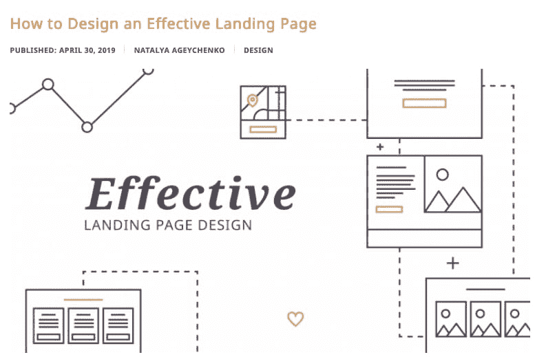
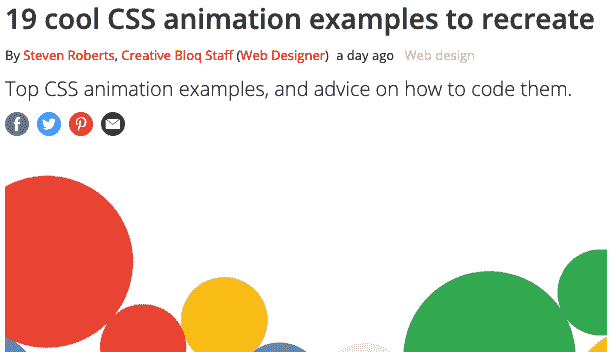
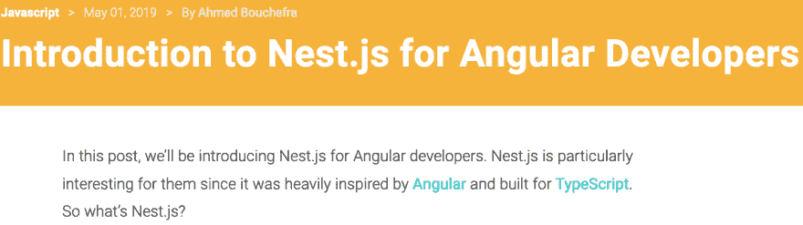
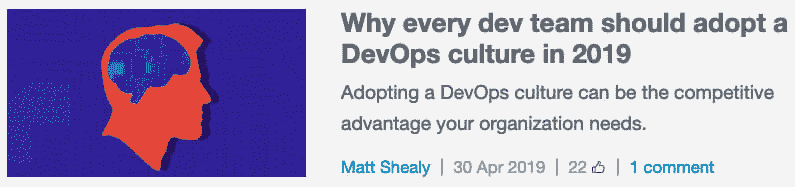

# 本周值得一读的 5 篇外星人文章👽📖

> 原文：<https://dev.to/xenoxdev/5-alien-articles-of-the-week-worth-reading-58pg>

嗨伙计们！我暂停写这个系列几个星期，但现在我带着另一个外星人文章装置回来了。这些是在 Dev.to 之外发布的文章，因此被称为“alien”。👽希望你喜欢它们！

# 1。规划奇妙用户体验的 7 个步骤

如果你想让你的用户喜欢使用这个应用，良好的用户体验是必不可少的。Sunil Joshi 的这篇文章解释了 UX 设计的规划阶段，涵盖了这个阶段的一些重要步骤，如开发用户故事、定义用户流、头脑风暴和草图等等。

# 2。如何设计一个有效的登陆页面

登录页面是对您的企业最重要的网页之一。一个好的登陆页面可以将访问者转化为客户。Natalya Ageychenko 的这篇文章可以帮助你创建一个有效的高质量的登录页面，解释登录页面的原则，可能影响转换的常见错误，以及创建有效登录页面的步骤。

# 3。19 个很酷的 CSS 动画例子来重现

Steven Roberts 的这篇文章收集了来自世界各地网站的 CSS 动画示例，它还解释了如何实现这些示例，有哪些类型的动画，如何在一些有用的提示的帮助下实现和正确使用它们。

# 4。面向 Angular 开发者的 Nest.js 简介

Nestjs 是一个构建 nodejs 应用程序的框架，Ahmed Bouchefra 在他的文章中为 angular 开发人员介绍了 nestjs。他还解释了如何使用 Nest CLI 制作模块和控制器，并借助一个示例项目进行了演示。

# 5。为什么每个开发团队都应该在 2019 年采用 DevOps 文化

在这篇文章中，Matt Shealy 解释了适应 DevOps 文化如何能够以更少的错误提高您的开发和测试速度，它如何通过提供更强的通信来完全打破部门和工作单元之间的壁垒，以及它如何能够为您的组织带来好处。

# 让我知道你的想法！

在评论里告诉我你觉得哪篇文章最有用！另外，告诉我你最喜欢的 dev 博客，并分享你最近阅读的内容。祝你愉快！❤

