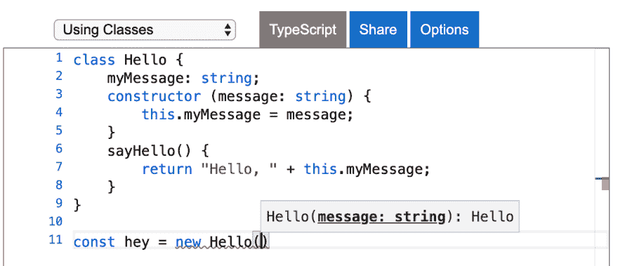

# 在 TypeScript 中逐步键入函数

> 原文：<https://dev.to/zanonnicola/progressively-typing-a-function-in-typescript-1hfb>

当我开始使用 TypeScript 时，我发现对于我想完成的大多数事情来说，整个类型系统非常简单和直观。

这是一种很好的感觉。最后，我终于可以确信我的代码在运行时不会中断，IDE 中的智能感知有助于提高我的工作效率。

那是什么感觉？

看看这段代码。

```
class Hello {
    myMessage: string;
    constructor (message: string) {
        this.myMessage = message;
    }
    sayHello() {
        return "Hello, " + this.myMessage;
    }
} 
```

如果没有在构造函数中传递正确的类型，在代码中引用 Hello 类将产生提示和有用的错误信息。

[](https://res.cloudinary.com/practicaldev/image/fetch/s--eYe2f2OX--/c_limit%2Cf_auto%2Cfl_progressive%2Cq_auto%2Cw_880/https://www.inextenso.dev/Files/_playground.png) 
当然天下没有不散的筵席。

当我开始向更复杂的代码库添加类型时，我很快意识到我必须更聪明地使用我的类型。如果我想真正利用类型系统，我必须挖掘得更深，找到更好的模式。

我最纠结的是函数。

在本文中，我将尝试演示一种增量模式，它帮助我更好地理解 TypeScript 中的一些概念。

### 场景:`safeDelete()`

我们被要求编写一个带有两个参数的函数:一个`Object`和一个`key`。

这个函数应该做的是删除给定的键，并返回新对象的副本。如果键不在对象中，它应该返回 undefined。

## 普通 JS 版

```
function safeDelete(obj, key) {
    if (obj.hasOwnProperty(key)) {
        const shallowCopy = {...obj}
        delete shallowCopy[key];
        return shallowCopy;
    }
    return undefined;
}

// Calling the function
safeDelete({ a: 1, b: 2 }, 'b'); // {a: 1} 
```

让我们给它添加一些类型，好吗？

## 打字稿版本(步骤 1)

```
function safeDelete(obj: any, key: string) {
    if (obj.hasOwnProperty(key)) {
        const shallowCopy = {...obj}
        delete shallowCopy[key];
        return shallowCopy;
    }
    return undefined;
} 
```

够简单吧？

这种方法的问题是推断的返回类型是`any`

```
function safeDelete(obj: any, key: string): any 
```

让我们改进它！

## 打字稿版本(第二步)

让我们试着给函数
添加一个更好的类型签名

```
type objDelete = (obj: object, key: string) => object | undefined;

const safeDelete: objDelete = (obj, key) => {
      if (obj.hasOwnProperty(key)) {
        const shallowCopy = {...obj}
        delete shallowCopy[key as keyof typeof obj];
        return shallowCopy;
    }
    return undefined;
} 
```

我们在这里说的是，我们的函数将只接受一个对象和一个字符串作为参数，并将返回未定义的或一个对象

推断的返回类型将是:

```
const safeDelete: (obj: object, key: string) => object | undefined 
```

## 打字稿版本(第三步)

```
function safeDelete<T>(obj: T, key: string) {
    if (obj.hasOwnProperty(key)) {
        const shallowCopy = {...obj}
        delete shallowCopy[key as keyof typeof obj];
        return shallowCopy;
    }
    return undefined;
} 
```

推断的返回类型将是:

```
function safeDelete<{ a: number; b: number; }>(obj: { a: number; b: number; }, key: string): { a: number; b: number; } | undefined 
```

现在好多了！👍

使用 TypeScript 泛型将允许我们创建一个可以在多种类型上工作的组件，而不是单一的类型。

编译器超级聪明，会替我们完成工作。

现在，您可以安全地操作函数的返回值了。

正如你所看到的，你可以逐步使你的字体签名更加智能。