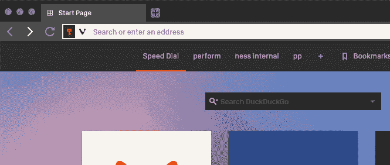
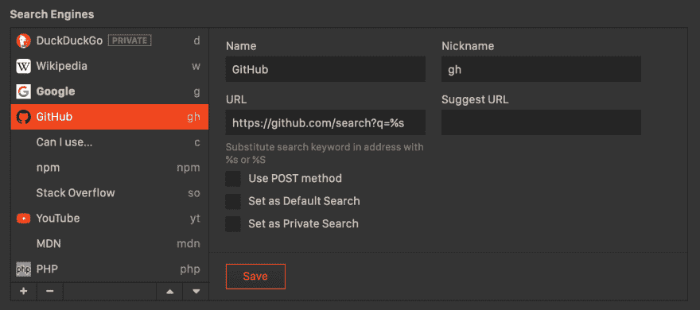

# 对浏览器有用的搜索引擎快捷方式

> 原文：<https://dev.to/rmnvsl/useful-search-engine-shortcuts-for-browsers-55m>

今天，大多数现代网络浏览器都包含设置多个搜索引擎的功能，可以减少你每天花在寻找最佳结果上的时间。不久前，我在推特上发布了关于将 GitHub 加入浏览器搜索引擎列表的消息。从那以后，我的列表变得越来越大，我想你可能会发现它很有用。

我的默认浏览器是 [Vivaldi](https://vivaldi.com/) ，但你可以在以下所有浏览器中找到相同的设置:Firefox、Chrome、Opera 或 Brave。我目前无法访问 IE/Edge，也没有在 Safari 中找到；有时候和别人比起来真的很老套...

这是自定义搜索引擎在野外的使用情况:

去哪里找？使用以下地址:

*   [维瓦尔第://settings/search/](https://dev.tovivaldi://settings/search/) 在维瓦尔第，搜索引擎下
*   [关于:在 Firefox 中，一键搜索引擎下的首选项#搜索](https://dev.toabout:preferences#search)
*   chrome://settings/search engines 在 Chrome、Opera 和 Brave 中，因为它们都会将你重定向到正确的地址

您必须添加引擎名称、关键字或昵称，这是您在地址栏中使用的快捷方式，并且搜索包含`%s`的 URL，这是您正在寻找的短语的占位符。所以在堆栈溢出的情况下，设置如下:

*   名称:堆栈溢出
*   昵称/关键词:`so`
*   网址:`https://stackoverflow.com/search?q=%s`

在 Firefox 中有点不同，你可以添加自定义引擎作为插件，所以你必须在他们的[插件门户](https://addons.mozilla.org/en-US/firefox/search/?sort=rating&type=search)中搜索它们。您可以稍后设置自定义关键字。

## 我的当前设置

| 名字 | 关键字 | 全球资源定位器(Uniform Resource Locator) |
| --- | --- | --- |
| 达克达克戈 | `d` | `https://duckduckgo.com/?q=%s` |
| 维基百科(一个基于 wiki 技术的多语言的百科全书协作计划ˌ也是一部用不同语言写成的网络百科全书ˌ 其目标及宗旨是为全人类提供自由的百科全书)ˌ开放性的百科全书 | `w` | `https://en.wikipedia.org/wiki/Special:Search?search=%s` |
| 谷歌 | `g` | `https://www.google.com/search?q=%s` |
| 开源代码库 | `gh` | `https://github.com/search?q=%s` |
| 我能用吗... | `c` | `https://caniuse.com/#search=%s` |
| npm | `npm` | `https://www.npmjs.com/search?q=%s` |
| 堆栈溢出 | `so` | `https://stackoverflow.com/search?q=%s` |
| 油管（国外视频网站） | `yt` | `https://www.youtube.com/results?search_query=%s` |
| MDN | `mdn` | `https://developer.mozilla.org/en-US/search?q=%s` |
| 服务器端编程语言（Professional Hypertext Preprocessor 的缩写） | `php` | `https://www.php.net/manual-lookup.php?pattern=%s` |

## 陷阱

假设我想了解更多关于 npm 控制台选项的信息。

匆忙中，我在地址栏输入`npm cli options`，结果得到[“找到 0 个包”](https://www.npmjs.com/search?q=cli%20options)。啊？那是因为我设置了`npm`关键字在 npm 包数据库中搜索。为了克服这种行为，我需要使用`g npm cli options`来告诉浏览器使用谷歌作为搜索引擎。

这肯定不是世界末日，但有时会令人困惑。可能通过选择不同的关键词来解决，看你的喜好了！

> 你还有其他有趣的用例吗？