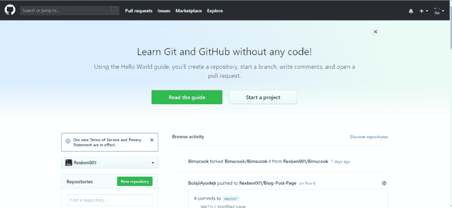
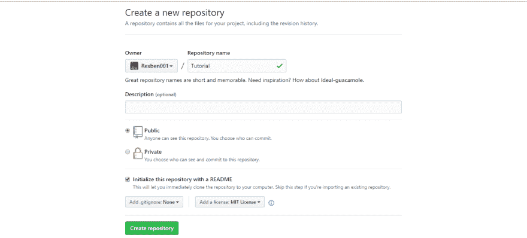
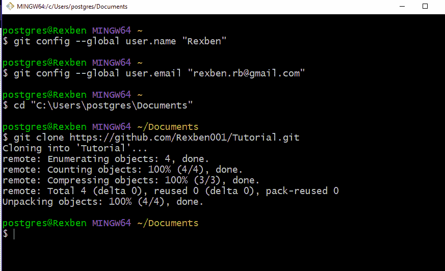
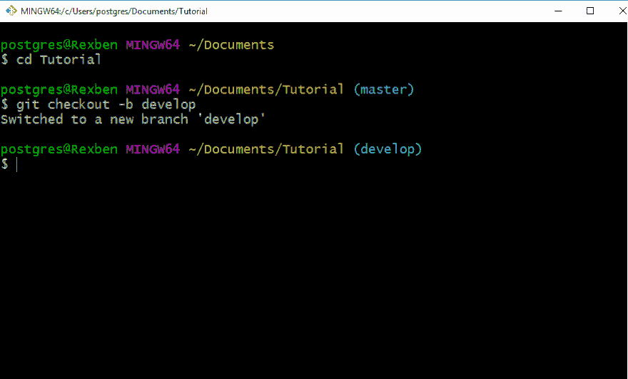
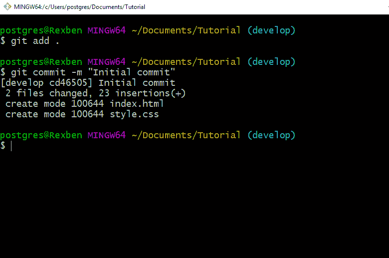
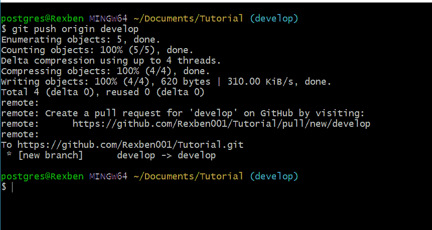
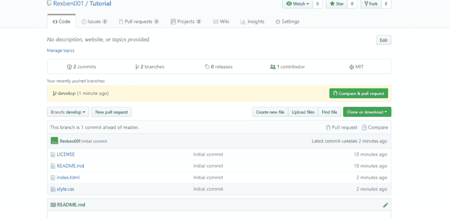

# Git 和 GitHub 新手

> 原文：<https://dev.to/rexben001/new-to-git-and-github-3dl5>

**什么是 GitHub？**

GitHub 是一个网站和基于云的服务，帮助开发者存储和管理他们的代码，以及跟踪和控制他们代码的变化。我想说 GitHub 是 Git 的中枢。对源文件进行版本控制后，你需要一个安全的地方来存储它，GitHub 就是那个安全的地方。我认为 GitHub 是一个开发者的社交平台，一个开发者合作、为开源项目做贡献、共享资源、提出问题等的地方。

**什么是版本控制？**

版本控制是一种记录一段时间内对一个文件或一组文件的更改的系统，以便您可以在以后调用特定的版本。在处理源文件时，您可以使用 ***Ctrl + z*** 来撤消更改，但是当您关闭源文件并重新打开它时，您不能在关闭源文件之前使用 ***Ctrl + z*** 来撤消先前的更改。使用版本控制，当您重新打开文件时，可以回到源文件的早期版本。

**Git 是什么？**

Git 是一个版本控制系统，用于跟踪计算机文件的变化，并协调多人对这些文件的工作。它主要用于软件开发中的源代码管理，但也可用于跟踪任何文件集的变更。

要遵循本教程，您需要一个 GitHub 帐户，并且需要在您的本地机器(计算机)上安装 Git。

如果您还没有 GitHub 账户，请前往 https://github.com创建一个。如果你的本地机器上没有安装 Git，去 https://git-scm.com/downloads[下载一个并安装到你的电脑上。](https://git-scm.com/downloads)

在 GitHub 上创建了一个帐户并安装了 Git 之后，请严格遵循以下步骤:

#### **第一步**

*开始一个项目*

*创建新的存储库*

在 GitHub 上创建一个新的存储库，随便取什么名字。

勾选框初始化 ReadMe.md

添加 License，MIT License

点击创建资源库

因此，我们已经成功地创建了一个新的存储库。

#### **第二步**

*将存储库克隆到本地机器*

**将存储库克隆到您的本地机器上**

在您的本地机器上打开 Git Bash

*您需要为您的 Git 设置用户名和电子邮件*

**git 配置—全局用户名“rex Ben”**

用您的 Github 用户名替换 Rexben

**git config—global user . email "[rexben.rb@gmail.com](mailto:rexben.rb@gmail.com)"**

替换为您的 GitHub 电子邮件

导航到您想要克隆存储库的文件夹，对于我来说，我想将它克隆到我的文档文件夹中。

**CD " C:\ Users \ postgres \ Documents "**

***cd —*** 当前目录，现在更改当前目录

，我现在在我的文档文件夹里。

克隆我创建的 GitHub 库

*复制你的 repo 的 URL 并粘贴到 Git Bash*

**饭桶克隆[https://github.com/Rexben001/Tutorial.git](https://github.com/Rexben001/Tutorial.git)T3】**

***git 克隆—*** 将您的在线或远程回购克隆到您的本地机器上

当它完成克隆后，你可以去检查你的文档文件夹，你会发现一个文件夹与你的 GitHub 库同名。

#### 第三步

**创建新的分支**

*进入我们克隆的回购*

**光盘教程**

***创建另一个分支***

默认情况下，分支主管是由 git

创建的，最好是创建另一个分支，不要直接在您的主管分支中工作。

所以，让我们创建一个名为“开发”的分支

**git checkout -b 开发**

***git branch —*** 用于列出回购中的所有分支

***git check out<branch name>—***将当前分支移至另一个分支。

例如 *git checkout hello —* 我从当前的分支转移到一个名为“hello”的分支

***git check out-b<branch name>—***创建一个新分支并将其移入

例如 *git checkout -b develop —* 我创建了一个名为 develop 的新分支，并将其移入其中

#### **第四步**

* *添加一些文件到里面** *让我们添加一个索引文件和 CSS 文件*

**触摸 index.html touch style . CSS**

***触摸<文件名> —*** 新建一个文件

***mkdir<folderName>—***新建一个文件夹

#### **第五步**

给 index.html 和 style.css

添加几行代码你可以使用你选择的任何文本编辑器，我会使用 VsCode

从 VsCode 打开文件夹，给你的 index.html 和 style.css

添加一些代码，然后保存文件

#### **第六步**

**提交对 Git 的更改**

**提交对 git 的更改**

导航回你的 Git Bash

为了让 Git 开始跟踪你的文件/文件夹，你需要把它们添加到 add。

**去把它给我。**

***git 添加。—*** 将项目中的所有文件/文件夹添加到 git 中。

* *git commit -m "初始提交" **

用您的提交消息替换初始提交

***git commit -m“初始提交”——***用提交消息将文件提交给 git。将文件添加到 git 之后，您需要提交对项目所做的任何更改。我认为它在任何应用程序中都相当于 Ctrl + s。此外，你需要使你的提交消息是唯一的，以防你想得到你的源代码的一个特定版本，一个非常详细的提交消息将使它毫无压力地找到它。

#### **第七步**

**推送至 GitHub**

* *推送至 GitHub * *在完成应用程序的特定部分后，最好将它推送至 GitHub，以便备份您的项目。

**git 推送原点开发**

***git 推送原点< branchName > —*** 将当前分支推送到 GitHub，如果您的 GitHub repo 中不存在该分支，则会自动创建。

你会被提示输入你的 GitHub 用户名和密码。如果您输入正确的详细信息，您的分行将被推送到网上。你可以导航到你的 GitHub 帐户，你会看到分行。

**现在就在 GitHub 上开发大脑**

#### 其他 Git 命令

**git log —** 检查您的日志，查看所有提交及其 id 的列表

***git status—***该命令称为*查找您的位置*。它会告诉你你现在在哪一个分支上，你做了哪些没有被记录下来的改变。

***git merge—***将两个分支合并在一起

**git diff—** 查看两个提交之间的不同

##### 获取更多命令:

[https://git-scm.com/docs](https://git-scm.com/docs)
T3[https://github.com/joshnh/Git-Commands](https://github.com/joshnh/Git-Commands)

**演职员表:** [**维基百科**](http://www.wikipedia.com)