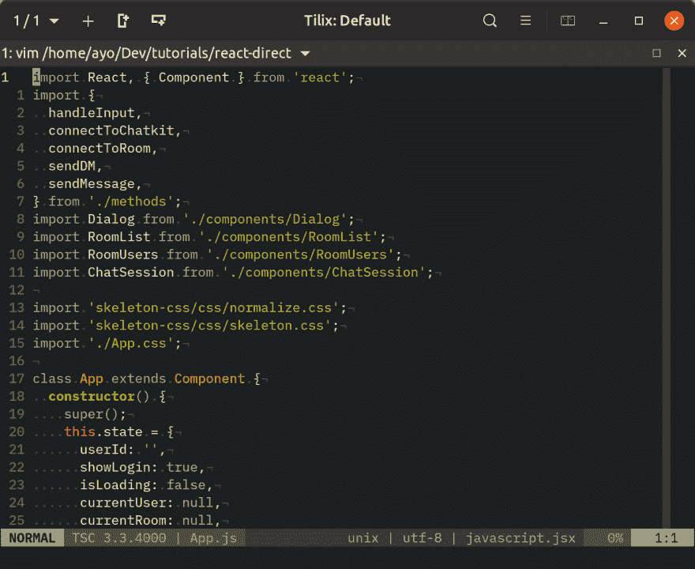
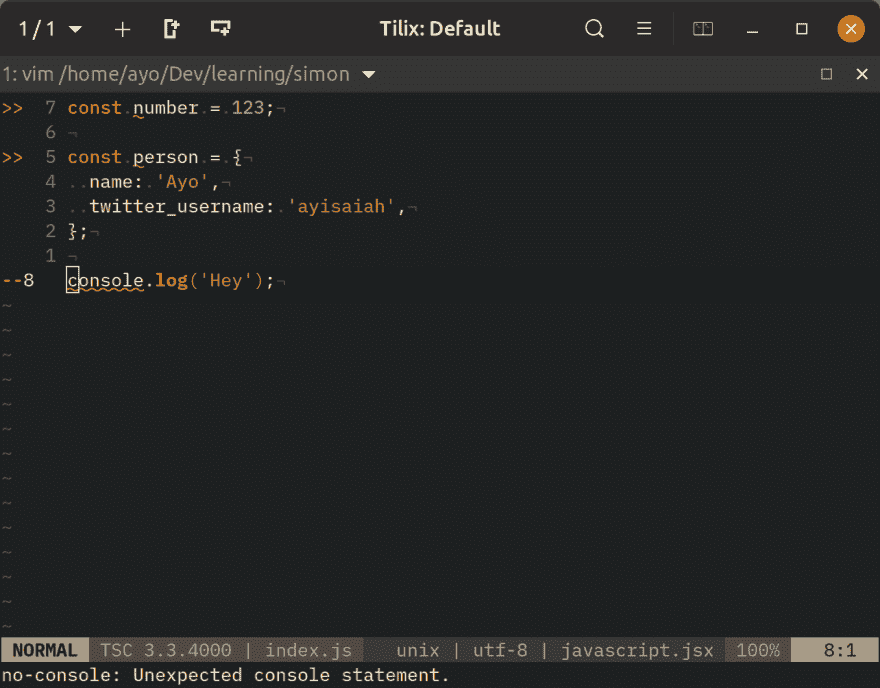
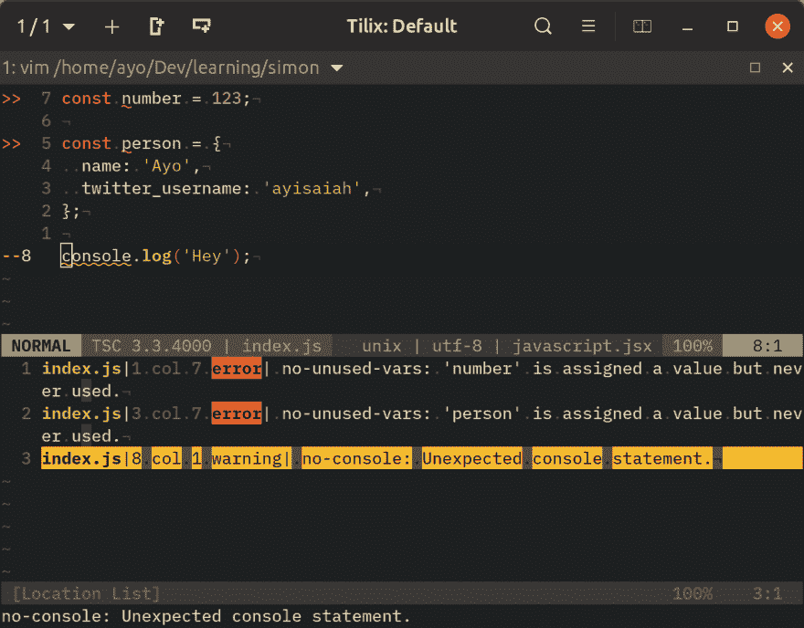
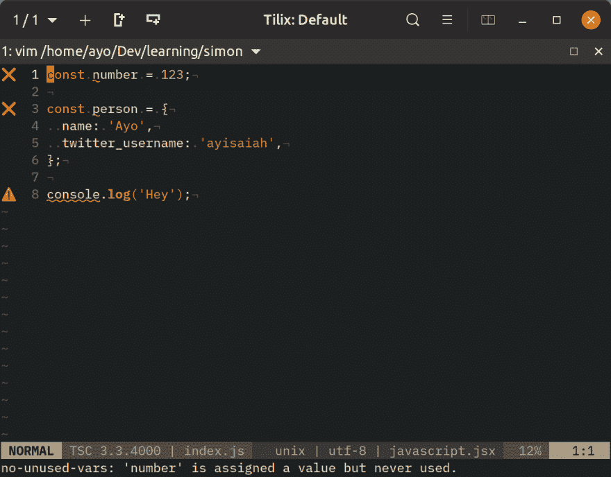
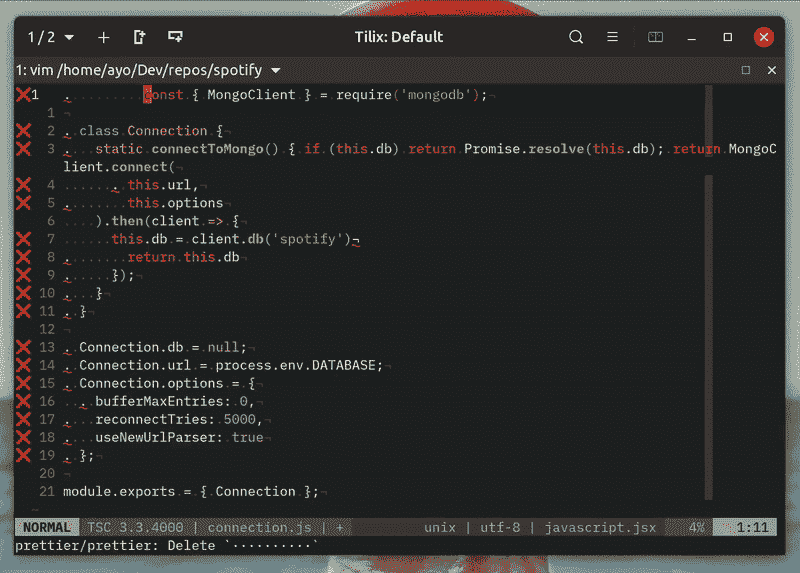
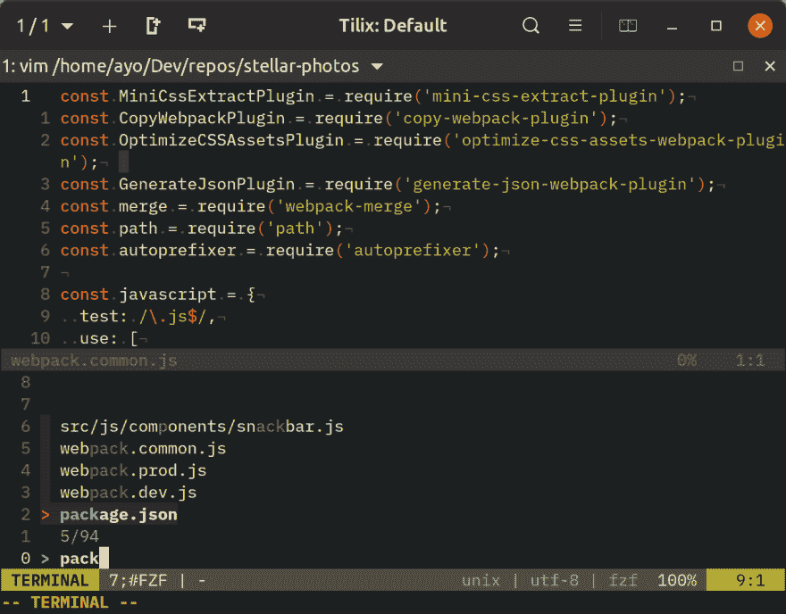
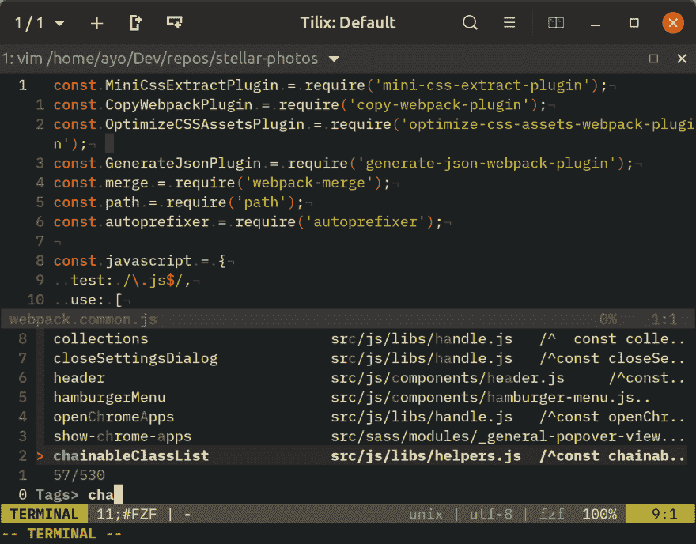
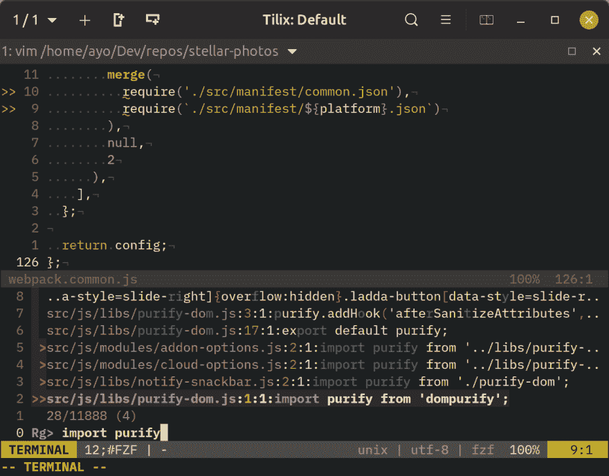
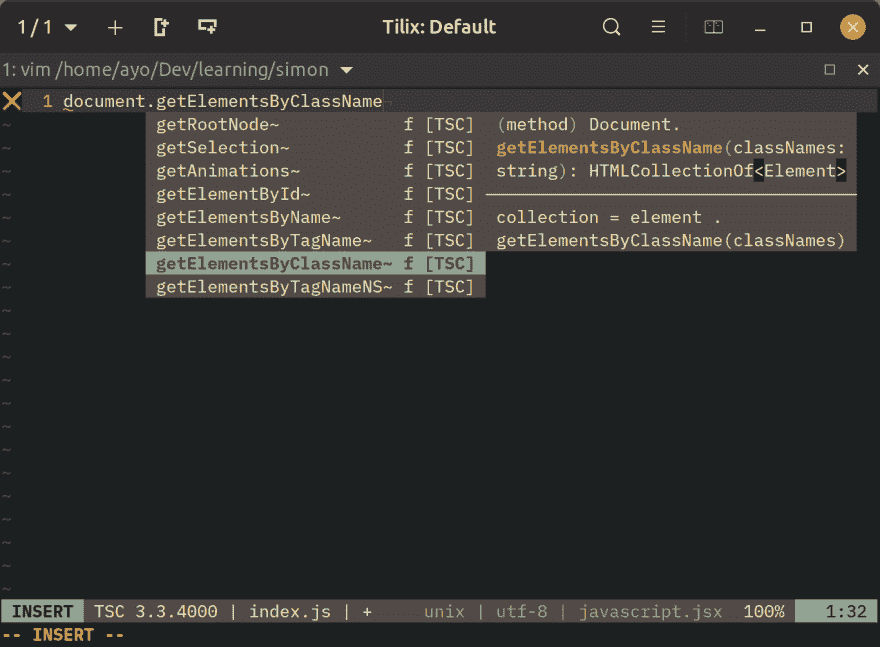

# 为 JavaScript 开发设置 Vim 的指南

> 原文：<https://dev.to/ayoisaiah/a-guide-to-setting-up-vim-for-javascript-development-4hbb>

我使用 Vim 已经将近两年了，我所有的 JavaScript 开发工作都是在它上面完成的。在这个过程中，我调整了我的配置几次，直到我最终实现了一个我可以说非常满意的设置。因此，在本文中，我想谈谈我利用的一些插件和工具，它们使在 Vim 中编写 JavaScript 成为一种更愉快的体验。

所有的插件和设置都经过测试，并确认可以在 Vim 8.1 和 Neovim 0.4.0 上工作，这是本文撰写时的最新版本。因为这篇文章主要讨论为 Vim 安装和配置插件，我建议你采用 [vim-plug](https://github.com/junegunn/vim-plug) 作为你的插件管理器，如果你还没有使用的话。

## 语法高亮显示

Vim 支持 JavaScript 的基本语法高亮显示，但我发现它不是最理想的，特别是在涉及现代 ES2015+语法时，而且它不支持 React 时的 JSX。我发现 [vim-javascript](https://github.com/pangloss/vim-javascript) 和 [vim-jsx](https://github.com/mxw/vim-jsx) 在两种情况下都解决了我的问题。

[](https://res.cloudinary.com/practicaldev/image/fetch/s--v6aCFS6P--/c_limit%2Cf_auto%2Cfl_progressive%2Cq_auto%2Cw_880/https://thepracticaldev.s3.amazonaws.com/i/1qdnhekd2t4tej2r9vup.png)

然而，我后来用 [vim-polyglot](https://github.com/sheerun/vim-polyglot) 替换了这两个插件，这是一个捆绑了 100 多种语言的其他几个语法插件的插件，并且按需加载它们，因此性能不受影响。

因此，`vim-polyglot`不必再添加另一个插件来为`.vue`文件提供语法高亮显示，它会毫不费力地完成这项工作。这意味着我可以在不同的 JavaScript 框架和其他编程语言之间切换。

## 林挺与 ESLint 的代码

代码林挺帮助您识别代码中的潜在错误，而不必运行代码。它还帮助您避免有问题的模式或不符合特定风格指南的代码。ESLint 已经成为 JavaScript 开发者的主流林挺工具，因为它全面支持该语言的所有现代特性，并且易于扩展。

如果你还没有使用 ESLint，请按照本指南在你的 JavaScript 项目中设置它。为了让 ESLint 工作，你需要用特定的[规则](https://eslint.org/docs/rules/)来配置它。你可以使用只解决常见问题的推荐配置，或者如果你想要一套更全面的规则，可以查看 [Airbnb 的风格指南](https://www.npmjs.com/package/eslint-config-airbnb-base)。

虽然 ESLint 是为通过命令行使用而构建的，但许多人(包括我自己)更喜欢将它集成到他们的代码编辑器中，以便在编写代码时获得实时反馈。使用 ALE 很容易将 ESLint 集成到 Vim 中。

一旦你[安装了 ALE](https://github.com/w0rp/ale#installation) ，在一个已经配置为使用 ESLint 的 JavaScript 项目中打开 Vim，并试图故意制造一个错误。它应该直接工作，无需进一步配置。

[](https://res.cloudinary.com/practicaldev/image/fetch/s--H6cusl3u--/c_limit%2Cf_auto%2Cfl_progressive%2Cq_auto%2Cw_880/https://thepracticaldev.s3.amazonaws.com/i/65ywuc2mlm5jqongkorn.png)

正如您所看到的，在编写代码时，错误和警告的指示符出现在有问题的行旁边，当光标位于发现错误的行上时，错误的原因打印在屏幕的底部。在这种情况下，ESLint 警告我关于未使用的变量和`console`语句。

此外，您可以打开位置列表来查看文件中的所有错误，并使用`:lnext`(或`:lne`)导航到下一项，使用`:lprevious`(或`:lpr`)导航到上一项来跳转到每个错误。

[](https://res.cloudinary.com/practicaldev/image/fetch/s--haI7VCif--/c_limit%2Cf_auto%2Cfl_progressive%2Cq_auto%2Cw_880/https://thepracticaldev.s3.amazonaws.com/i/z9q203kdt5v5crufop54.png)

在林挺错误之间快速跳转的一个更简单的方法是使用下面显示的`<Plug>`快捷键。您可以将`[c`和`]c`更改为您喜欢的组合键。

```
nmap <silent> [c <Plug>(ale_previous_wrap)
nmap <silent> ]c <Plug>(ale_next_wrap) 
```

Enter fullscreen mode Exit fullscreen mode

顺便说一句，我不喜欢 ALE 使用的默认错误和警告指示器，所以我使用下面的配置将它们改为更美观的指示器:

```
let g:ale_sign_error = '❌'
let g:ale_sign_warning = '⚠️' 
```

Enter fullscreen mode Exit fullscreen mode

[](https://res.cloudinary.com/practicaldev/image/fetch/s--eK1qoE-L--/c_limit%2Cf_auto%2Cfl_progressive%2Cq_auto%2Cw_880/https://thepracticaldev.s3.amazonaws.com/i/rmtl5jd0ga149snbvwzg.png)

## 代码格式用更漂亮的

[prettle](https://prettier.io/)是一款代码格式化工具，自 2017 年初问世以来，它在 JavaScript 生态系统中获得了巨大的发展势头。它基本上确保了一个代码库符合一个设定的代码风格指南，而不管从事该项目的开发人员有多少。

它的工作原理是根据配置文件中指定的[选项](https://prettier.io/docs/en/options.html)格式化一个文件(或多个文件)。因此，所有由 Prettier 格式化的文件都遵循相同的准则，包括独立、引用样式、间距、行宽和其他一些样式问题。

要使用更漂亮的，你需要把它添加到你的项目中。你可以使用 pretty 的 [CLI](https://prettier.io/docs/en/cli.html) ，或者将其配置为[预提交钩子](https://prettier.io/docs/en/precommit.html)，但是我更喜欢在我保存文件时让它立即格式化我的代码的即时反馈。

ESLint 也有一些代码修复功能，但其中一些与 Prettier 的方法相冲突。最好让 ESLint 处理代码质量问题，而让 Prettier 专注于代码格式问题。

为了实现这一点，你需要使用[eslint-config-appellite](https://github.com/prettier/eslint-config-prettier)禁用与 espellite 冲突的 ESLint 规则，同时使用[ESLint-plugin-appellite](https://github.com/prettier/eslint-plugin-prettier)向 ESLint 添加 appellite 的代码修复功能。为此，在您的项目目录中运行以下命令:

```
$ yarn add eslint-config-prettier eslint-plugin-prettier -D 
```

Enter fullscreen mode Exit fullscreen mode

然后将以下内容添加到您的 ESLint 配置文件中。这将在一个步骤中配置`eslint-plugin-prettier`和`eslint-config-prettier`。

```
{
  "extends": ["plugin:prettier/recommended"]
} 
```

Enter fullscreen mode Exit fullscreen mode

这就是你需要做的所有事情，以便将 beautiful 与 ESLint 集成。下一步是配置 Vim，以便所有 JavaScript 代码在文件保存后立即被格式化。ALE 很好地为我们解决了这个问题！

除了支持报告错误的 linters，ALE 还可以运行修复程序来格式化 Vim 缓冲区中的代码。你所需要做的就是在你的`.vimrc`中指定`eslint`作为 JavaScript 的固定器，如下所示:

```
let g:ale_fixers['javascript'] = ['eslint']

" Fix files automatically on save
let g:ale_fix_on_save = 1 
```

Enter fullscreen mode Exit fullscreen mode

此时，林挺和格式化错误将由 ESLint 注释，而 Prettier 在保存时格式化代码。

[](https://res.cloudinary.com/practicaldev/image/fetch/s--AMj6G3Y1--/c_limit%2Cf_auto%2Cfl_progressive%2Cq_66%2Cw_880/https://thepracticaldev.s3.amazonaws.com/i/xb6zzcbdnuieq2f7000l.gif)

您也可以使用`:ALEFix`命令按需格式化代码。使用它最简单的方法是在 Vim 配置文件中创建一个键映射。

```
nmap <F6> <Plug>(ale_fix) 
```

Enter fullscreen mode Exit fullscreen mode

## 超快速模糊文件搜索

文件搜索在任何编辑器中都很重要，虽然 Vim 通过`:find`命令支持这一点，但据我所知，它非常基础，不支持模糊查找。有一些工具可以将模糊文件搜索引入到 vim 中。在使用了 [CtrlP](https://github.com/ctrlpvim/ctrlp.vim) 一段时间后，我切换到了 [Fzf.vim](https://github.com/junegunn/fzf.vim#installation) ，它是一个同名的命令行模糊查找器的包装器 [Fzf](https://github.com/junegunn/fzf) 。

Fzf 表面看起来是一个简单的工具，但实际上非常强大。以下是我每天利用它的几种方式:

### 模糊文件查找器

我使用 Fzf 的主要目的是搜索项目中的文件。这是通过使用`:Files`命令实现的，在我的 Vim 配置中，我将这个命令绑定到了`Ctrl-P`。我还修改了`$FZF_DEFAULT_COMMAND`变量，使用 [Ripgrep](https://github.com/BurntSushi/ripgrep) 来列出文件。安装 Ripgrep 后，将其放入您的`.bashrc`或`.zshrc`中，搜索除隐藏目录中的文件(如`.git`)或在您的`.gitignore`文件中被忽略的文件:
之外的所有文件

```
export FZF_DEFAULT_COMMAND='rg --files --follow --hidden'

# Fish syntax
# set -gx FZF_DEFAULT_COMMAND 'rg --files --follow --hidden' 
```

Enter fullscreen mode Exit fullscreen mode

另外，Fzf 提供了`:Buffers`和`:History`命令来搜索打开的缓冲区和你的缓冲区历史。我已经将它们分别映射到了`<Leader>b`和`<Leader>h`。

```
nnoremap <C-p> :Files<CR>
nnoremap <Leader>b :Buffers<CR>
nnoremap <Leader>h :History<CR> 
```

Enter fullscreen mode Exit fullscreen mode

与 CtrlP 类似，Fzf 打开后，可以按`Enter`键在当前窗口打开选中的文件，或者使用`Ctrl-T`、`Ctrl-X`或`Ctrl-V`分别在新标签页、水平分割或垂直分割中打开选中的文件。

[](https://res.cloudinary.com/practicaldev/image/fetch/s--QTD98jeH--/c_limit%2Cf_auto%2Cfl_progressive%2Cq_auto%2Cw_880/https://thepracticaldev.s3.amazonaws.com/i/qvoor4km791wme0hrx8x.png)

### 搜索标签

Fzf 提供了两个主要命令来搜索项目中的标签。第一个`:BTags`允许您在当前缓冲区中搜索标签。它不需要标签文件，并且非常适合在方法之间快速跳转。

[](https://res.cloudinary.com/practicaldev/image/fetch/s--5pg5OMhV--/c_limit%2Cf_auto%2Cfl_progressive%2Cq_auto%2Cw_880/https://thepracticaldev.s3.amazonaws.com/i/s496elc84sz9sd5h9sek.png)

第二个是`:Tags`，允许您在项目范围内搜索标签，但是它需要一个标签文件。您可以使用[通用 Ctags](https://github.com/universal-ctags/ctags) 为您的项目生成一个标记文件，并将其与 [Gutentags](https://github.com/ludovicchabant/vim-gutentags) 结合使用，以在后台自动创建和更新标记。

[](https://res.cloudinary.com/practicaldev/image/fetch/s--x_W9BZE4--/c_limit%2Cf_auto%2Cfl_progressive%2Cq_auto%2Cw_880/https://thepracticaldev.s3.amazonaws.com/i/nsqdrzpu9wxxtqftxjn1.png)

我已经映射了分别映射到`<Leader>t`和`<Leader>T`的两个命令。

```
nnoremap <Leader>t :BTags<CR>
nnoremap <Leader>T :Tags<CR> 
```

Enter fullscreen mode Exit fullscreen mode

## 项目范围搜索

Fzf 提供的`:Rg`命令使用 Ripgrep 在整个项目中查找一个模式的所有出现，因此您可以搜索特定的字符串，选择匹配项，并使用 quickfix 列表导航结果。我经常用它来检查一个方法在我的代码库中的使用位置，我发现它在我最近重构的一个项目中非常有用。

当使用`:Rg`时，您可以缩小结果范围，并在所选结果上点击`Enter`以在当前窗口中打开文件。这将完全跳过快速修复列表。要选择多个结果，只需使用您想要选择的每个文件上的`Tab`键或`Alt-A`选择所有结果，然后使用`Enter`填充快速修复列表，您可以使用`:cnext`和`:cprev`进行导航。

[](https://res.cloudinary.com/practicaldev/image/fetch/s--u0QI2g7N--/c_limit%2Cf_auto%2Cfl_progressive%2Cq_auto%2Cw_880/https://thepracticaldev.s3.amazonaws.com/i/g4fjaqclnlgzp6xmywgf.png)

使用 Fzf 可以做更多的事情。例如，您可以使用`:Helptags`导航 Vim 的`:help`文档，搜索代码片段(`:Snippets`)，Git 提交(`:Commits`)，命令历史(`:History:`，等等。使用`:h fzf-vim-commands`找出您可用的所有选项。

## 智能代码补全

对于大多数人来说，拥有良好的代码完成体验是拥有现代开发设置的关键。Vim 通过`omnicomplete`支持一些开箱即用的基本功能，但是我们将用更强大的东西来取代它。

自从我开始使用 Vim，我已经尝试了一些自动完成的插件，包括[de complete](https://github.com/Shougo/deoplete.nvim)和 [YouCompleteMe](https://github.com/Valloric/YouCompleteMe) ，但是都没有提供我想要的体验。

最近发现了 [Coc.nvim](https://dev.to/scottw/coc-nvim-1a7f) ，很棒！它为 Vim 带来了几个类似 IDE 的特性，并且易于设置。它建立在[语言服务器](https://langserver.org/)的概念之上，在现代编辑器中，它支持自动完成、转到定义、悬停工具提示等功能。

按照[安装指南](https://github.com/neoclide/coc.nvim/wiki/Install-coc.nvim)启动并运行 Coc.nvim。一旦安装了 Coc.nvim，就需要安装一些语言服务器扩展来为 JavaScript 和 Typescript 项目提供 intellisense 支持。你可以用`:CocInstall`这样做。

```
:CocInstall coc-tsserver coc-json 
```

Enter fullscreen mode Exit fullscreen mode

有了 [coc-tsserver](https://github.com/neoclide/coc-tsserver) ，你可以获得如此多的[特性](https://github.com/neoclide/coc-tsserver#features)，使得编写、调试和重构 JavaScript 或 Typescript 变得轻而易举。不需要配置任何东西，自动完成应该就可以了，你可以在输入的时候看到函数签名和相关的建议。

[](https://res.cloudinary.com/practicaldev/image/fetch/s--7fgZ3eW3--/c_limit%2Cf_auto%2Cfl_progressive%2Cq_auto%2Cw_880/https://thepracticaldev.s3.amazonaws.com/i/9b3m84q8efvkz8036txn.png)

你甚至可以借助 [coc-eslint](https://github.com/neoclide/coc-eslint) 和[COC-beautiful](https://github.com/neoclide/coc-prettier)来替换 ALE 的林挺和代码格式化功能，但由于我对自己的设置已经很满意，所以我选择目前不这么做。

## 总结起来

这篇文章介绍了几个插件，它们可以帮助您在 JavaScript 开发中从 Vim 获得更多的实用工具。虽然您不必使用这些东西来提高 Vim 的工作效率，但是它肯定可以帮助您避免错误，并加快开发过程。

我希望这篇文章对你有用。如果你有任何问题，或者在配置插件时遇到任何麻烦，请在下面留下评论，我会尽快回复你。如果你对我的个人配置感兴趣，你可以查看[我的点文件](https://github.com/ayoisaiah/dotfiles/tree/master/vim)或者[在 Twitter 上给我发消息](https://twitter.com/@ayisaiah)。

感谢阅读！