# 通过构建 HTML 周期表理解网格布局

> 原文：<https://dev.to/huijing/understanding-grid-placement-through-building-a-html-periodical-table-15m3>

我使用 CSS grid 来构建布局已经有一段时间了，到目前为止，我所有的设计要么是一些明确放置的单个网格项目，要么是 100%自动放置。我以前不需要设计网格之间的间隙，但是在三月的一个晴朗的日子，我在 [WebsiteSetupOrg](https://websitesetup.org/html5-periodical-table/) 上发现了一个 HTML 周期表。

它现在看起来和我第一次看到它的时候不一样了，因为我看到的版本拼写出了 HTML，我完全投入其中。在我通常的右键单击检查中，我注意到布局没有使用网格，但是我的注入了网格的大脑认为它可以，所以我决定使用网格布局重新创建设计。

液体错误:内部

## 网格手动放置

使用 Grid 进行布局的最大好处之一是能够将网格项目准确地放置在您设计的网格上的任何位置。这种设计的大部分计划将进入实际的网格本身。

但是快速回顾一下这是如何工作的，让我们看一个相对简单的 3x3 网格，上面有 3 个网格项目。Firefox 网格检查器是打开的，所以我们知道将我们的部分分配到哪一行。

<figcaption>像棋盘上的棋子</figcaption>

[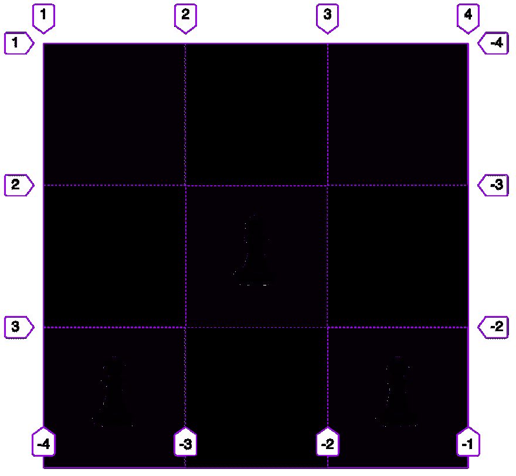](https://res.cloudinary.com/practicaldev/image/fetch/s--Tr56poS0--/c_limit%2Cf_auto%2Cfl_progressive%2Cq_auto%2Cw_880/https://www.chenhuijing.com/asseimg/posts/grid-placement/manual%402x.png)

抛开实际的视觉样式不谈，这就是网格代码的样子:

```
.grid {
  display: grid;
  grid-template-columns: repeat(3, 24vmin);
  grid-template-rows: repeat(3, 24vmin);
}

.grid__item:first-child {
  grid-row: 3;
}

.grid__item:nth-child(2) {
  grid-row: 2;
  grid-column: 2;
}

.grid__item:nth-child(3) {
  grid-row: 3;
  grid-column: 3;
} 
```

Enter fullscreen mode Exit fullscreen mode

`grid-row`和`grid-column`是设置开始线和结束线各自尺寸的快捷键。默认情况下，网格项只占用一个网格单元，所以即使我只为两个属性指定了起始行而没有结束行，它也能很好地工作。

手动放置网格项目背后的概念是，您可以根据行号和列号将项目放置在网格上。不需要过于复杂的定位规则和计算。

## 网格自动放置

如果我们有大量的网格项，并且我们并不真的想要明确地放置它们，有[一个 5 步算法](https://www.w3.org/TR/css-grid-1/#auto-placement-algo)浏览器用来决定如何放置没有明确定义网格位置的网格项。以下解释假设流向为`row`。

**步骤 0:生成匿名网格项**

如果存在任何连续的子文本序列，这意味着一串文本周围没有任何标签，浏览器会将其包装在一个*匿名块容器网格项*中。

让我们在这里谈一谈匿名物品。网页上的一切都是一个盒子。有许多不同类型的盒子，但盒子仍然是盒子。因此，如果你有一些与任何元素无关的东西，比如一串文本，浏览器会为它们生成匿名框。

从说明书上看，它说:

> 在某些情况下，当需要从元素树生成的盒子不提供的特定嵌套结构时，生成匿名盒子来修复盒子树。

下面，我们有一个包含匿名文本的`p`块元素的例子，其中散布着`em`和`strong`:

[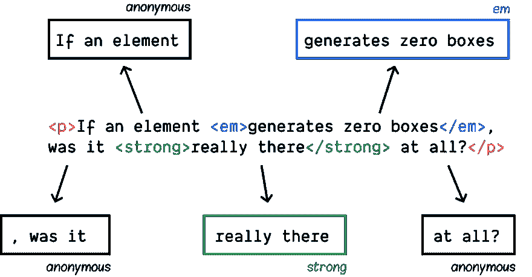](https://res.cloudinary.com/practicaldev/image/fetch/s--TPVn0RoD--/c_limit%2Cf_auto%2Cfl_progressive%2Cq_auto%2Cw_880/https://www.chenhuijing.com/asseimg/posts/grid-placement/anonymous-1280.png)

浏览器将建立`p`元素作为 5 个内嵌框的包含块，其中 3 个是匿名的。匿名盒只存在于盒树中，并通过它们的盒树父代继承属性。

第一步:放置任何没有自动定位的东西。

**步骤 2:处理锁定到给定行的项目。**

对于具有明确的`grid-row-start`和`grid-row-end`值的每个网格项目，将该项目放在最早的列开始行，该行:

1.  不会与任何被占用的网格单元重叠
2.  并且经过了以这种方式放置的前一个网格项目。

如果打包设置为`dense`，则忽略第二位。

第三步:确定隐式网格中的列。

创建隐式网格的列时，浏览器会从显式网格的列开始。然后，对于具有已定义列位置的所有项目，将隐式列添加到隐式网格的开始和结束位置，以容纳它们。

【firefox devtools 的时候比较好，但是因为实现中的一个 bug 而不得不用 chromeಠ_ಠ[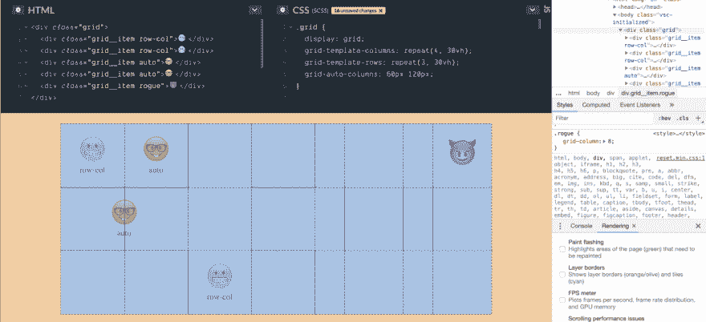](https://res.cloudinary.com/practicaldev/image/fetch/s--buGwgQNV--/c_limit%2Cf_auto%2Cfl_progressive%2Cq_auto%2Cw_880/https://www.chenhuijing.com/asseimg/posts/grid-placement/implicit-1280.png)

上面的例子是一个 4x3 的显式网格，但是`.rogue`网格项被放置在网格列`8`上，这导致在显式网格之后又生成了 4 个隐式列。

如果所有项目*中没有*的最大列跨度超过了隐式网格的列数，则在末尾添加更多列以适应该列跨度。

[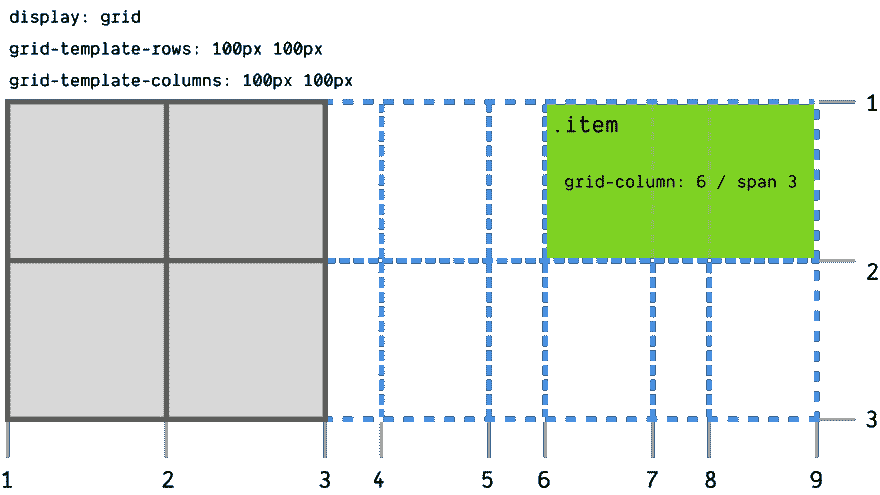](https://res.cloudinary.com/practicaldev/image/fetch/s--n2e1GtHY--/c_limit%2Cf_auto%2Cfl_progressive%2Cq_auto%2Cw_880/https://www.chenhuijing.com/asseimg/posts/grid-placement/implicit-grid-1280.png)

第四步:摆放剩余的物品。

有一种东西叫做*自动放置光标*，我们**看不到**，但是它决定了网格中当前的“插入点”。该点被指定为一对行和列网格线。

如果在前面的步骤运行后还有剩余的物品，有 4 种可能的情况会影响这些剩余物品的放置。

当网格填充为默认值`sparse`，且网格项有定义的列位置时:

1.  将光标的列位置设置为该列的起始值。如果这小于光标的前一列位置，则将行位置增加 1。
2.  增加光标的行位置，直到网格项目不与任何已占用的网格单元格重叠，根据需要创建隐式行。
3.  根据行起始值的跨度，将网格项的行起始值设置为光标的行位置和行结束值。

当网格填充为默认值`sparse`，网格项自动定位在任一轴上时:

1.  增加光标的列位置，直到网格项目不与任何已占用的网格单元重叠，或者直到光标的列位置加上网格项目的范围溢出了步骤 3 中生成的隐式列
2.  找到合适的光标列位置后，将网格项的行起始和列起始设置为光标位置。否则，增加光标的行位置，根据需要创建隐式行，并将光标的列位置设置为隐式网格上最开始的列。

当网格填充为默认值`dense`，且网格项有定义的列位置时:

1.  将光标的列位置设置为该列的起始值。将光标的行位置设置为隐式网格中最开始的行。
2.  增加光标的行位置，直到网格项目不与任何已占用的网格单元格重叠，根据需要创建隐式行。
3.  将网格项的行起始值设置为光标所在的行位置。

当网格填充为默认值`dense`，网格项自动定位在任一轴上时:

1.  将光标的行和列位置设置为隐式网格的最开始的行和列。
2.  增加光标的列位置，直到网格项不与任何被占用的单元格重叠，或者直到光标的列位置加上网格项的范围溢出了步骤 3 中生成的隐式列。
3.  找到合适的光标列位置后，将网格项的行起始和列起始设置为光标位置。否则，增加光标的行位置，根据需要创建隐式行，并将光标的列位置设置为隐式网格上最开始的列。

## 建筑布局

当绘制到 20x10 的网格上时，我心中的目标设计看起来是这样的:

[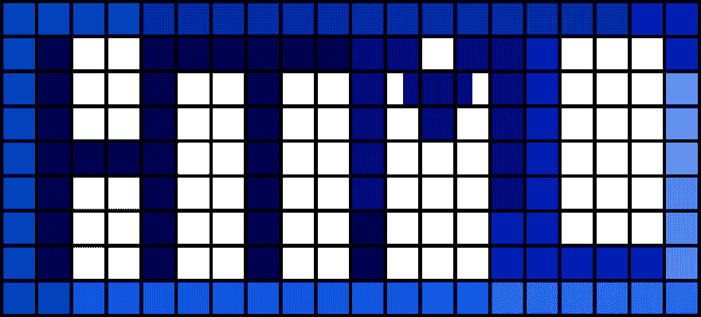](https://res.cloudinary.com/practicaldev/image/fetch/s--CveMug3O--/c_limit%2Cf_auto%2Cfl_progressive%2Cq_auto%2Cw_880/https://www.chenhuijing.com/asseimg/posts/grid-placement/html-grid.svg)

但是等等，如果你靠近一点看，你会注意到有些东西没有完全对齐。

[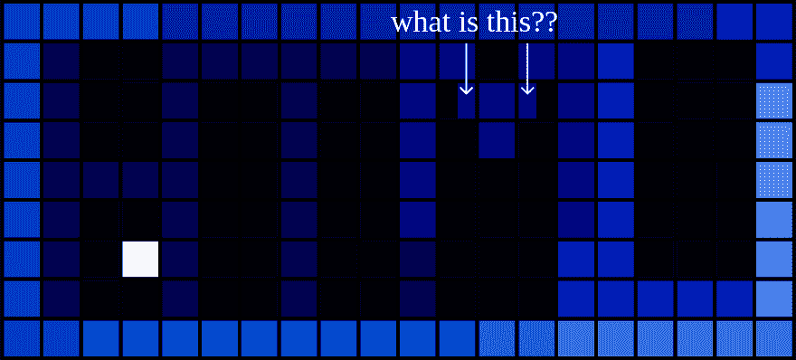](https://res.cloudinary.com/practicaldev/image/fetch/s--khXmsTED--/c_limit%2Cf_auto%2Cfl_progressive%2Cq_auto%2Cw_880/https://www.chenhuijing.com/asseimg/posts/grid-placement/html-grid2.svg)

你知道这意味着什么吗？多列，就是这样。这是设计阶段的一部分，我称之为**网格规划**。对于类似的事情，你可以选择模拟(这是我喜欢做的)，或者将图像导入任何可以让你在上面画线的程序。

从那里，您可以找出最少可能的行数和列数，同时仍然让您的每个网格项目都与网格线对齐。

[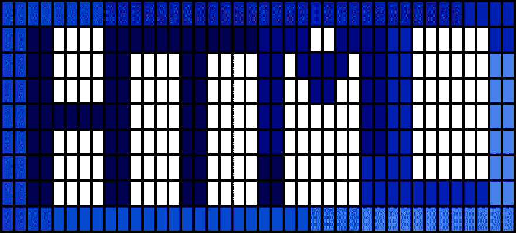](https://res.cloudinary.com/practicaldev/image/fetch/s--58o0jg4n--/c_limit%2Cf_auto%2Cfl_progressive%2Cq_auto%2Cw_880/https://www.chenhuijing.com/asseimg/posts/grid-placement/html-grid3.svg)

那就 40x10 吧。

### 构建网格

没有一些标记就没有元素网格。为此，您可以选择让您的标记按行或列流动，您可以使用`grid-auto-flow`属性影响网格项目的布局方向。我将使用 row 的默认值。因此，标记采用从左到右、从上到下的顺序。

现在，让我们创建一个 40 列 10 行的网格。

```
.elements {
  display: grid;
  grid-template-columns: repeat(40, 5ch);
  grid-template-rows: repeat(10, auto);
} 
```

Enter fullscreen mode Exit fullscreen mode

### 定位元素

我们还希望每个网格项目跨越 2 个网格水平网格单元。

```
.element {
  grid-column: span 2;
} 
```

Enter fullscreen mode Exit fullscreen mode

现在，图表就派上用场了，因为您可以确定想要将哪些列“推”到行中的其余网格项，以便在网格上重新创建字母 HTML。

[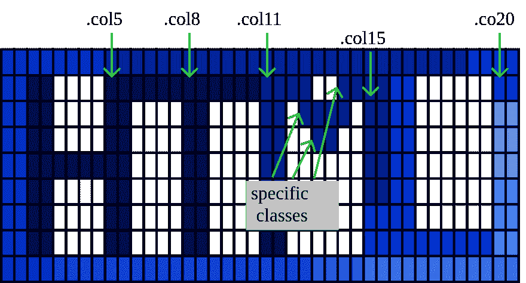](https://res.cloudinary.com/practicaldev/image/fetch/s--nnV9WYEk--/c_limit%2Cf_auto%2Cfl_progressive%2Cq_auto%2Cw_880/https://www.chenhuijing.com/asseimg/posts/grid-placement/classes.svg)

设计中有 5 个“全列”网格项目。我们可以利用新发现的对自动放置的理解，用 CSS 类“推出”网格项之间所需的空白，而不是绘制每个网格项。那么对于更具体的职位，我们可以只针对那些具有特定类别的职位。

```
.col5 { grid-column: 9 / span 2 }
.col8 { grid-column: 15 / span 2 }
.col11 { grid-column: 21 / span 2 }
.col15 { grid-column: 29 / span 2 }
.col20 { grid-column: 39 / span 2 }

.h1 { grid-column: 27 / span 2 }
.h4 { grid-column: 24 / span 2 }
.h3 { grid-column: 25 / span 2 }
.html { grid-column: 20 / span 2 } 
```

Enter fullscreen mode Exit fullscreen mode

如果我将`grid-auto-flow`的值设置为`dense`，那么自动放置算法会将没有明确网格列位置的网格项打包到空格中，我们会得到如下结果:

[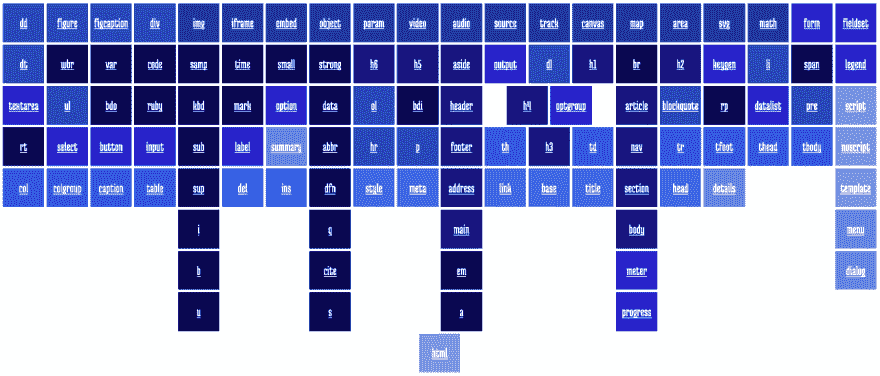](https://res.cloudinary.com/practicaldev/image/fetch/s--M4a27u_k--/c_limit%2Cf_auto%2Cfl_progressive%2Cq_auto%2Cw_880/https://www.chenhuijing.com/asseimg/posts/grid-placement/dense-1280.png)

## 后退并缩小视口

到目前为止，我已经习惯了迎合不支持网格的浏览器，以及我的目标设计无法工作的视口。我也将回顾一下我的思考过程。

[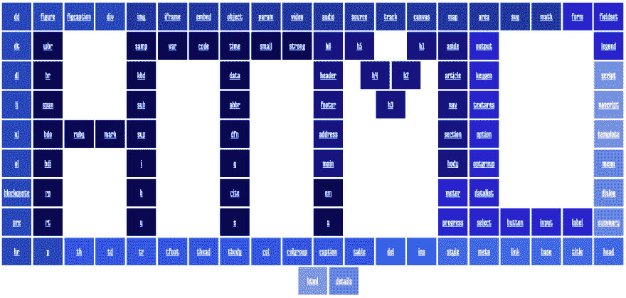](https://res.cloudinary.com/practicaldev/image/fetch/s--ZItQr9Tv--/c_limit%2Cf_auto%2Cfl_progressive%2Cq_auto%2Cw_880/https://www.chenhuijing.com/asseimg/posts/grid-placement/wide-1280.png)

在重新调整窗口大小后，我发现设计在宽度低于 1280 像素时会变形，所以这是最小宽度媒体查询的基础。只有当视窗宽度超过 1280 像素时，定位的网格项目才会生效。

小于这个值时，所有的元素都会被算法自动放置，所以它看起来像一个标准的 HTML 元素网格。在这种情况下，我不需要确定网格应该有多少列。相反，我让浏览器在关键字`auto-fit`的帮助下解决这个问题。

为了确保在网格的两边没有任何奇怪的空白，我将列宽度设置在`10ch`和`1fr`之间，这使得无论大小如何变化，元素总是占据视口的整个宽度。

```
.elements {
  display: grid;
  grid-template-columns: repeat(auto-fit, minmax(10ch, 1fr));
  gap: 0.2em;

  a {
    padding: 1em 0;
  }
} 
```

Enter fullscreen mode Exit fullscreen mode

[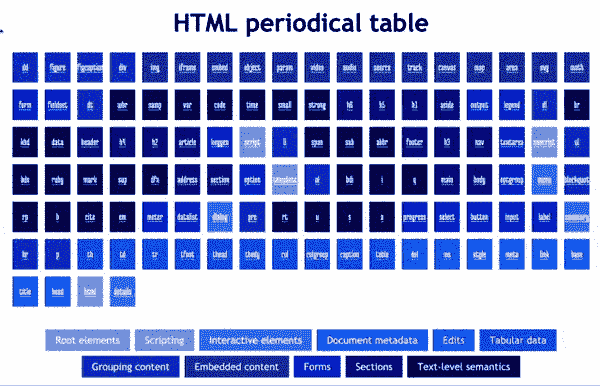](https://res.cloudinary.com/practicaldev/image/fetch/s--PkKgKAdy--/c_limit%2Cf_auto%2Cfl_progressive%2Cq_66%2Cw_880/https://thepracticaldev.s3.amazonaws.com/i/58je1c4fvezy0wkzrkrl.gif)

然后，不支持网格的浏览器。我选择退回到基于 flex 的布局，但是如果你愿意，你也可以选择 floats 或者 inline-block。这里的要点是特征查询。

所有与网格相关的代码都被打包成一个特性查询，如下所示，**包括**媒体查询:

```
@supports (display: grid) {
  .elements {
    display: grid;
    grid-template-columns: repeat(auto-fit, minmax(10ch, 1fr));
    gap: 0.2em;

    a {
      padding: 1em 0;
    }
  }

  @media screen and (min-width: 1280px) {
    .elements {
      grid-template-columns: repeat(40, 5ch);
      grid-template-rows: repeat(10, auto);

      a {
        grid-column: span 2;
        margin: 0;
      }
    }

    a.col5 { grid-column: 9 / span 2 }
    a.col8 { grid-column: 15 / span 2 }
    a.col11 { grid-column: 21 / span 2 }
    a.col15 { grid-column: 29 / span 2 }
    a.col20 { grid-column: 39 / span 2 }

    a.h1 { grid-column: 27 / span 2 }
    a.h4 { grid-column: 24 / span 2 }
    a.h3 { grid-column: 25 / span 2 }
    a.html { grid-column: 20 / span 2 }
  }
} 
```

Enter fullscreen mode Exit fullscreen mode

位于特征查询之外的基本样式将处理不支持网格的浏览器。如果您想测试它的外观，请注释掉整个功能查询块。

```
.elements {
  font-family: 'Medula One', serif;
  display: flex;
  flex-wrap: wrap;
  justify-content: center;

  a {
    padding: 1em;
    flex: none;
    margin: 0.25em;
  }
} 
```

Enter fullscreen mode Exit fullscreen mode

对于不支持特征查询的浏览器来说，这基本上是会发生的，因为浏览器将忽略特征查询中的整个块。

[](https://res.cloudinary.com/practicaldev/image/fetch/s--_z0fl_F9--/c_limit%2Cf_auto%2Cfl_progressive%2Cq_auto%2Cw_880/https://www.chenhuijing.com/asseimg/posts/grid-placement/flex-1280.png)

## 撒上一些 Javascript

好的，在这里我想表扬一下迈克·瑞思穆勒，他也创造了一个非常好的版本的 [HTML 元素周期表](https://www.madebymike.com.au/demos/html5-periodic-table/)。它比我的漂亮多了，而且，它有清晰度的特点。

[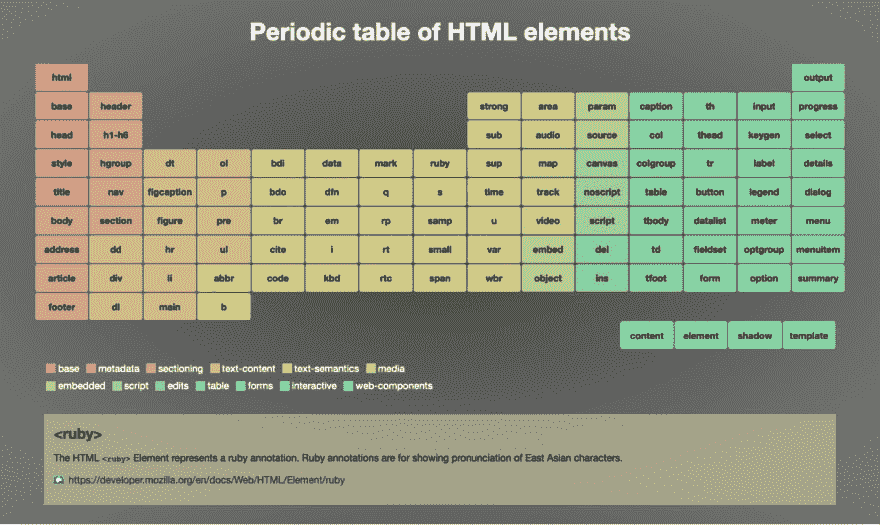](https://res.cloudinary.com/practicaldev/image/fetch/s--4x1xzNpJ--/c_limit%2Cf_auto%2Cfl_progressive%2Cq_auto%2Cw_880/https://www.chenhuijing.com/asseimg/posts/grid-placement/mike-1280.png)

也有一个传说，因为元素被分为几类。当您将鼠标悬停在类别名称上时，相关元素也会高亮显示。非常好，我也想对我的周期表做同样的事情。

定义的显示并不太复杂。它使用了`:target`伪类，所以当你点击表格中的任何元素时，它的定义会显示在表格下面。您必须将元素上的锚链接与包含其定义的元素的 id 相匹配，以便 URL 片段匹配。

以这个标记为例:

```
<a href="#ruby" class="txt-lvl">ruby</a>

<div id="ruby">
  <dt><a href="https://developer.mozilla.org/en/docs/Web/HTML/Element/ruby">&lt;ruby&gt;</a></dt>
  <dd>
  <p>The HTML <code>&lt;ruby&gt;</code> Element represents a ruby annotation. Ruby annotations are for showing pronunciation of East Asian characters.</p>
  <p><a class="moz-link" href="https://developer.mozilla.org/en/docs/Web/HTML/Element/ruby">https://developer.mozilla.org/en/docs/Web/HTML/Element/ruby</a></p>
  </dd>
</div> 
```

Enter fullscreen mode Exit fullscreen mode

你可以用下面的 CSS 使它工作:

```
div {
  padding: 1em;
  text-align: left;
  display: none;
}

div:target {
  display: block; 
} 
```

Enter fullscreen mode Exit fullscreen mode

Javascript 位用于悬停高亮功能。它所做的是向 body 元素添加一个 CSS 类，这样所选类别中的相关元素就会改变背景颜色。

```
Array.prototype.forEach.call(document.querySelectorAll('.legend li'), li => {
  li.addEventListener('mouseenter', function() {
    document.body.classList.add('hover-' + this.className)
  }, false)
  li.addEventListener('mouseleave', function() {
    document.body.classList.remove('hover-' + this.className)
  }, false)
}) 
```

Enter fullscreen mode Exit fullscreen mode

我有 11 个类别，所以我作弊并使用 Sass 来生成所需的 CSS:

```
$colours: ( 
  root: #7b9de1,
  scripting: #749eef,
  int-elem: #5186ed,
  meta: #2b6dec,
  edits: #155eea,
  tab-data: #024ee0,
  grp-cont: #0242bc,
  emb-cont: #00369c,
  forms: #0202ca,
  sections: #000080,
  txt-lvl: #010151
);

@each $class, $colour in $colours {
  .#{$class} {
    background-color: #{$colour};
    color: white;
  }

  .hover-#{$class} {
    .#{$class} {
      background-color: #fdb35f;
      color: black;
    }
  }
} 
```

Enter fullscreen mode Exit fullscreen mode

## 包装完毕

差不多就是这样。这篇文章比我预期的要长，但我希望它能对实现这个 HTML 周期表的 CSS 技术有所启发。如果你想自己深入研究代码并对其进行调整，这里有代码笔:

[https://codepen.io/huijing/embed/wOXzNx?height=600&default-tab=result&embed-version=2](https://codepen.io/huijing/embed/wOXzNx?height=600&default-tab=result&embed-version=2)

快乐的 CSS-ing！