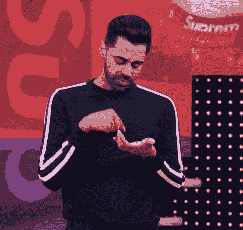
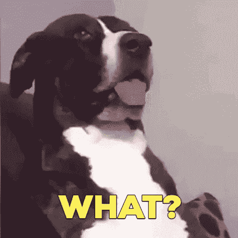
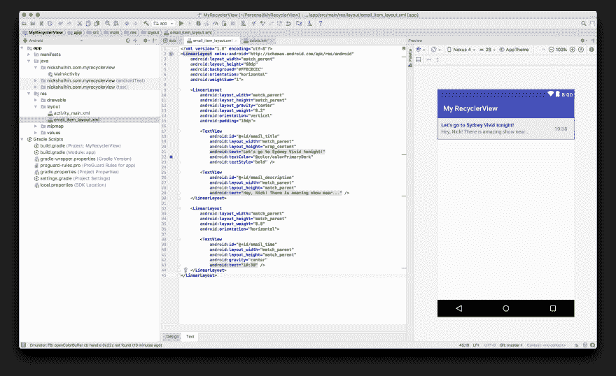
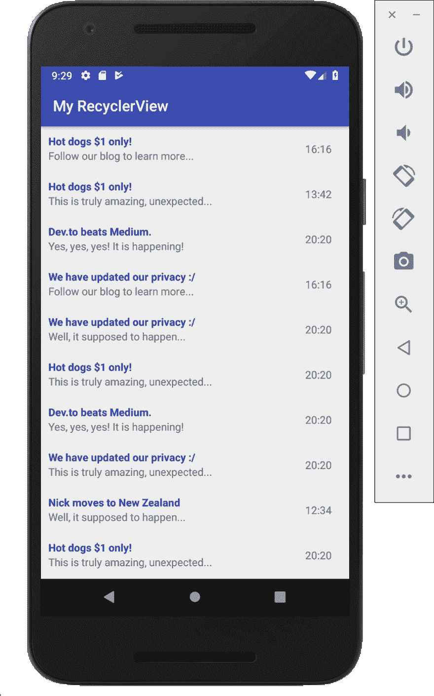

# 卷动...卷动...recycle view for Android with kot Lin！

> 原文：<https://dev.to/nickitax/scrolling-scrolling-recyclerview-for-android-with-kotlin-561n>

[](https://i.giphy.com/media/vvWhQsVAFkyisScAsM/giphy.gif)

我们都喜欢滚动(一些奇怪的人刷 _(ツ)_/)。

滚动是几乎每个应用程序都要进行的主要交互。

让我们来看看 Android 实现的名为 RecyclerView 的“高效滚动”的幕后是什么！

* * *

# 第一部分:什么是回收器视图，它实际回收的是什么？♻️

* * *

RecyclerView 开创了一种创建视图持有者对象的有效方法，将它们与数据绑定，并根据列表状态进行重用。

想象一下，你在手机应用上收到了`44442`封邮件(一定很受欢迎！).

理论上，我们认为每封邮件都应该有一个“单元视图”,包含邮件的详细信息，如标题和简短描述。但是我们有…很多邮件…怎么办？

RecyclerView 来帮忙了！但是怎么做呢？

它由三个主要元素组成:单元格布局、适配器和视图持有人对象。

单元格布局表示列表项的 XML 设计蓝图。大概是这样的:

[](https://res.cloudinary.com/practicaldev/image/fetch/s--bLHg-PI3--/c_limit%2Cf_auto%2Cfl_progressive%2Cq_auto%2Cw_880/https://thepracticaldev.s3.amazonaws.com/i/o6fcxuy6i1w1e2bhuwfe.png)

下一步，Adapter 使用来自电子邮件服务器的数据，并将 XML 视图“绑定”到特定数据，如标题或交付时间。

为了执行这个绑定，Adapter 管理一个叫做 ViewHolder 的东西——一个属于 RecyclerView 的类，负责在视图中显示一个项目。

精彩的部分来了:

RecyclerView 没有为我们的每封邮件创建 44442 个视图，而是重用了已经创建的视图持有者，这些视图持有者在屏幕上留下了一个可观察的区域。

什么？

[](https://i.giphy.com/media/3o7527pa7qs9kCG78A/giphy.gif)

想象一下，您的电子邮件列表占据全屏幕高度，可以包含 10 封要显示的电子邮件。

你开始向上滚动。

⬆️

一旦顶视图不在视图中，它就会被 RecyclerView 重新使用，带有新的数据并作为新的底部元素推送。差不多吧。

理论讲够了，让我们做实际部分吧！🔨

* * *

# 第二部分:让我们和…科特林一起创建一个循环视图！♻️

* * *

科特林是爱，科特林是生活(我ⓒ).)

在我看来，Kotlin 是 Android 身上发生的最好的事情之一:)

它非常容易编写，采用了函数式方法，易于理解，隐藏了许多样板逻辑。

我们还在等什么？让我们创建我们的“电子邮件”应用程序项目！

`NOTE`:所有准备好的复制粘贴代码都可以在[这里](https://github.com/NickitaX/recyclerviewtutorial)

一个简单的 EmptyActivity 将适合我们的用例:

[](https://res.cloudinary.com/practicaldev/image/fetch/s--W6TDKUrf--/c_limit%2Cf_auto%2Cfl_progressive%2Cq_auto%2Cw_880/https://thepracticaldev.s3.amazonaws.com/i/nvzutsc3idw2pca1hnib.png)

接下来，让我们创建我们的项目/单元格布局！

对于一个简单的预览，我们可以使用标题，描述和时间。

让我们在名为 email_item_layout.xml 的 res/layout 文件夹中创建一个:

[](https://res.cloudinary.com/practicaldev/image/fetch/s--wWrWaWlH--/c_limit%2Cf_auto%2Cfl_progressive%2Cq_auto%2Cw_880/https://thepracticaldev.s3.amazonaws.com/i/stdq1dchj0kivg8k03d4.png)

仔细看:

```
<?xml version="1.0" encoding="utf-8"?>
<LinearLayout xmlns:android="http://schemas.android.com/apk/res/android"
    android:layout_width="match_parent"
    android:layout_height="60dp"
    android:background="#FFECECEC"
    android:orientation="horizontal"
    android:weightSum="1">

    <LinearLayout
        android:layout_width="match_parent"
        android:layout_height="match_parent"
        android:layout_gravity="center"
        android:layout_weight="0.2"
        android:orientation="vertical"
        android:padding="10dp">

        <TextView
            android:id="@+id/email_title"
            android:layout_width="match_parent"
            android:layout_height="wrap_content"
            android:text="Let's go to Sydney Vivid tonight!"
            android:textColor="@color/colorPrimaryDark"
            android:textStyle="bold" />

        <TextView
            android:id="@+id/email_description"
            android:layout_width="match_parent"
            android:layout_height="match_parent"
            android:text="Hey, Nick! There is amazing show near..." />
    </LinearLayout>

    <LinearLayout
        android:layout_width="match_parent"
        android:layout_height="match_parent"
        android:layout_weight="0.8"
        android:orientation="horizontal">

        <TextView
            android:id="@+id/email_time"
            android:layout_width="match_parent"
            android:layout_height="match_parent"
            android:gravity="center"
            android:text="10:38" />
    </LinearLayout>
</LinearLayout> 
```

好吧，接下来呢？啊，不幸的是 RecyclerView 不是默认提供的，所以我们需要将它作为外部依赖项导入我们的构建 gradle 文件:

```
implementation 'com.android.support:recyclerview-v7:28.0.0' 
```

一旦完成，我们就可以创建我们的电子邮件数据类了！我们可以创建“模型”包并声明一个简单的 Email 类，它包含标题、描述和交付时间作为字符串属性:

```
data class Email(val title: String, val description: String, val time: String) 
```

搞定了。

现在是最有趣的部分之一:强大的适配器！

让我们在名为“adapters”的新包中创建一个名为 EmailAdapter 的文件。

我们的 EmailAdapter 将接受一个电子邮件对象、上下文的列表，并包含一个自定义的视图持有者:

```
class EmailAdapter(private val emailList: List<Email>, private val context: Context) : RecyclerView.Adapter<EmailAdapter.EmailViewHolder>() {

    override fun onBindViewHolder(emailViewHolder: EmailViewHolder, index: Int) {
        emailViewHolder.titleTextView.text = emailList[index].title
        emailViewHolder.descriptionTextView.text = emailList[index].description
        emailViewHolder.timeTextView.text = emailList[index].time
    }

    override fun onCreateViewHolder(parent: ViewGroup, viewType: Int): EmailViewHolder {
        return EmailViewHolder(LayoutInflater.from(context).inflate(R.layout.email_item_layout, parent, false))
    }

    override fun getItemCount(): Int {
        return emailList.size
    }

    inner class EmailViewHolder(view: View) : RecyclerView.ViewHolder(view) {
        val titleTextView: TextView = view.findViewById(R.id.email_title)
        val descriptionTextView: TextView = view.findViewById(R.id.email_description)
        val timeTextView: TextView = view.findViewById(R.id.email_time)

    }
} 
```

`onCreateViewHolder`负责将我们的电子邮件项目的 XML 布局膨胀成一个`EmailViewHolder`对象。
`EmailViewHolder`类扩展了`ViewHolder`并引用了我们在 XML 布局中声明的视图，如标题、描述和时间`TextViews`，用于在`onBindViewHolder`函数中注入数据。

我们快完成了！！！

现在我们需要将 RecyclerView XML 声明放入 activity_main.xml:

```
<?xml version="1.0" encoding="utf-8"?>
<android.support.constraint.ConstraintLayout xmlns:android="http://schemas.android.com/apk/res/android"
    xmlns:tools="http://schemas.android.com/tools"
    android:layout_width="match_parent"
    android:layout_height="match_parent"
    tools:context=".MainActivity">

    <android.support.v7.widget.RecyclerView
        android:id="@+id/email_recycler_view"
        android:layout_width="match_parent"
        android:layout_height="match_parent" />

</android.support.constraint.ConstraintLayout> 
```

下一步将是在 MainActivity 中启动 RecyclerView，并提供一些随机的几乎真实的电子邮件数据对象:)

```
class MainActivity : AppCompatActivity() {

    override fun onCreate(savedInstanceState: Bundle?) {
        super.onCreate(savedInstanceState)
        setContentView(R.layout.activity_main)
        val fakeEmails = generateFakeEmails()
        setUpEmailRecyclerView(fakeEmails)
    }

    private fun setUpEmailRecyclerView(emails: List<Email>) {
        val layoutManager = LinearLayoutManager(this, LinearLayoutManager.VERTICAL, false)
        val emailRecyclerView = findViewById<RecyclerView>(R.id.email_recycler_view)
        val recyclerAdapter = EmailAdapter(emails, this)
        emailRecyclerView.layoutManager = layoutManager
        emailRecyclerView.adapter = recyclerAdapter
    }

    private fun generateFakeEmails(): List<Email> {
        val titles = listOf(
                "Hot dogs $1 only!",
                "Dev.to beats Medium.",
                "We have updated our privacy :/",
                "Nick moves to New Zealand")
        val descriptions = listOf(
                "This is truly amazing, unexpected...",
                "Yes, yes, yes! It is happening!",
                "Follow our blog to learn more...",
                "Well, it supposed to happen...")
        val times = listOf(
                "13:42",
                "16:16",
                "12:34",
                "20:20")
        val emailList = mutableListOf<Email>()
        for (i in 0..10) {
            emailList.add(
                    Email(titles.random(), descriptions.random(), times.random())
            )
        }
        return emailList
    }
} 
```

OMG！看看我们得到了什么！！！

[](https://res.cloudinary.com/practicaldev/image/fetch/s--CIoPh-aD--/c_limit%2Cf_auto%2Cfl_progressive%2Cq_auto%2Cw_880/https://thepracticaldev.s3.amazonaws.com/i/teoa8t1tdnxov0yd0op2.png)

现在我们可以回收我们的电子邮件😜

(*) o since o (*)