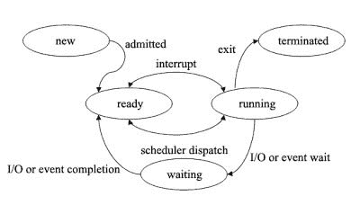
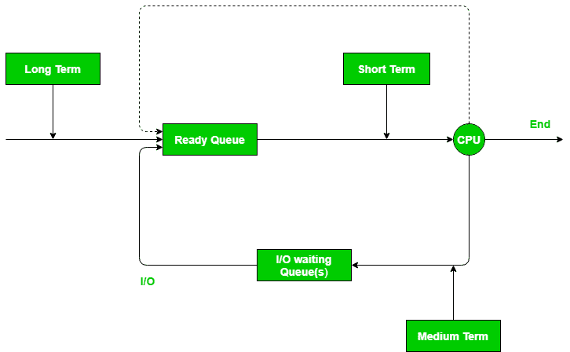
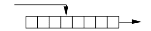
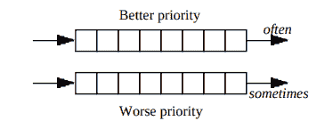
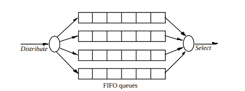
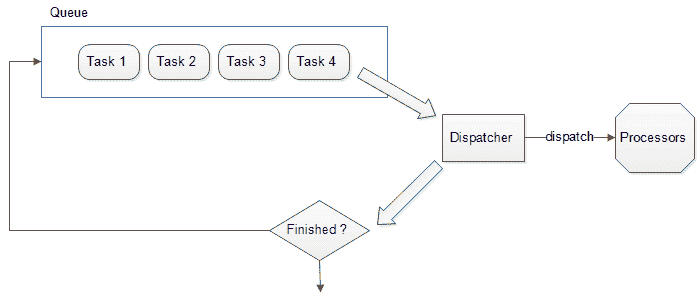

# 调度员

> 原文：<https://dev.to/l04db4l4nc3r/the-dispatcher-4l4k>

**简介**

假设你是一名员工，希望在你的评估中得到 A+。现在老板选你做一个超级重要的项目。感觉很特别？用这个比喻来说，老板是一个任务调度者。现在，调度员是这样一个人，他给你一个装满与项目有关的简报信件的手提箱，并拍拍你的背为你开门。

为了方便起见，我们叫他帕特曼吧。

你的计算机是一个有趣的硬件，但拥有一个更壮观的软件，不，是一系列协同工作的进程。让它看起来像一个大软件。但是这些过程需要交流。此外，他们需要协调他们的时间凝聚力。这就是调度程序和调度程序的用武之地。

**操作系统中的进程状态**

操作系统中的进程有 5 种相关状态:

*   `New`:创建新流程时
*   `Ready`:流程准备执行时
*   `Running`:流程运行时
*   `Waiting`:当进程正在等待另一个进程或 I/O 任务完成时
*   `Terminated`:流程结束时

请注意，所有进程都有一个等待队列和一个就绪队列。

等待队列由等待分派的所有进程的列表组成。当流程准备好执行时，它们被推入就绪队列。

**短期调度器**在 CPU 中运行，用于从就绪队列中选择单个进程执行。

**调度员**

进程调度程序将 CPU 的控制权交给由短期调度程序选择的进程。

让我们回到介绍中，我们说你的老板是调度者，而 pat-man 是调度员。请注意，老板选择了你，但实际上是帕特-曼为你打开了大门，并给了你经营的资源。类似地，调度程序可以将线程分配给进程，将 CPU 分配给线程。

调度员有以下职责:

*   **切换到用户模式**:所有的低级操作系统进程都运行在内核级安全访问上，但是所有的应用程序代码和用户发布的进程都运行在应用程序空间或用户权限模式下。Dispatcher 将进程切换到用户模式。
*   **寻址:**程序计数器(PC)寄存器指向要执行的下一个进程。调度程序负责寻址该地址。
*   **上下文切换的启动:**上下文切换是指当前正在运行的进程暂停，其所有数据和进程控制块(PCB)都存储在主存中，另一个进程加载到它的位置上执行。
*   **管理调度延迟:**调度延迟是指停止一个流程并启动另一个流程所需的时间。对于相同的硬件配置，调度延迟越低，软件的效率越高。

> 请注意，调度程序不是线程。调度程序在每个内核上运行，运行一个线程一段时间，保存其状态，加载另一个线程的状态并运行它。

**选择要调度的进程**

调度员可以通过以下方式选择流程:

*   从前面搜索表，并运行第一个就绪线程。

*   从队列中分派一个线程并运行它。如果该过程没有完成，将其插入到队列的后面。

*   给每个线程一个优先级，并相应地组织优先级队列。

 
基于优先级的多个队列

*   每个优先级都有多个队列。每当一些线程准备好执行时，选择一个具有最高优先级的线程并运行它。

**停止进程和管理调度程序故障**

如果一个线程正在执行，而调度程序没有执行，这意味着操作系统失去了控制。在这种情况下，可以采用以下恢复机制:

**陷阱:**陷阱本质上是操作系统中的事件，它导致操作系统的状态切换。陷阱允许程序或任务继续执行，而不会失去程序的连续性。陷阱处理程序的返回地址指向在陷阱指令之后要执行的指令。它们可以用来捕捉算术错误。

*   系统调用是一个应用程序编程接口，运行在用户模式的进程可以通过它与内核模式通信，以利用操作系统特定的功能，如发送信号或终止进程。
*   `Page Fault`:当程序试图访问其地址空间中的数据或代码，但当前不在系统中时，发生页面错误。

**中断:**当前线程之外发生的事件，导致操作系统中的状态切换。例如:定时器，磁盘操作完成等。它们可以用来停止正在运行的进程。

> 中断是硬件中断，如 I/O 事件的完成，而陷阱是软件调用的中断，如除以 0。陷阱和中断都是异步的，并在调度失败时被操作系统用作信号或恢复机制。

**结论**

调度程序是操作系统不可或缺的一部分。它负责维护就绪队列，并确保每个就绪进程都被调度以利用 CPU。

Dispatcher 也在其他系统中使用，如复杂的小型消息传递系统，以及在面向对象编程中作为动态 dispatcher。该是有人表扬这个拍拍肩膀的时候了！

**延伸阅读**

[**陷阱和中断有什么区别？**T3】](https://stackoverflow.com/questions/3149175/what-is-the-difference-between-trap-and-interrupt)

[**为嵌入式 Systems.pdf 的紧凑任务调度器**](https://drive.google.com/file/d/0Bw1wxZHj3VakNnZ3eFVEbUhWZ2s/view)

[**实现异步调度队列**](https://embeddedartistry.com/blog/2017/2/1/c11-implementing-a-dispatch-queue-using-stdfunction)