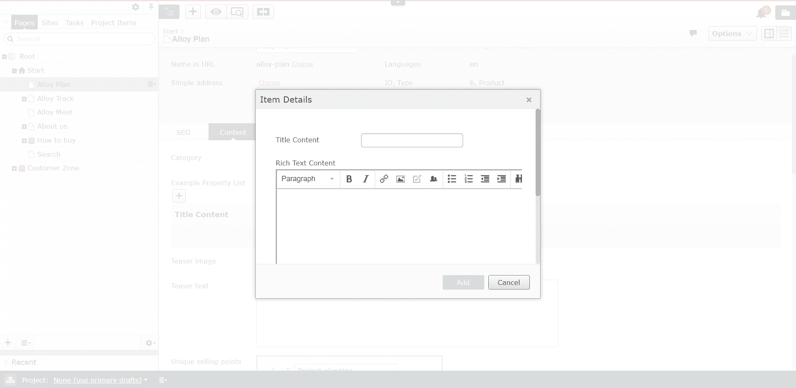
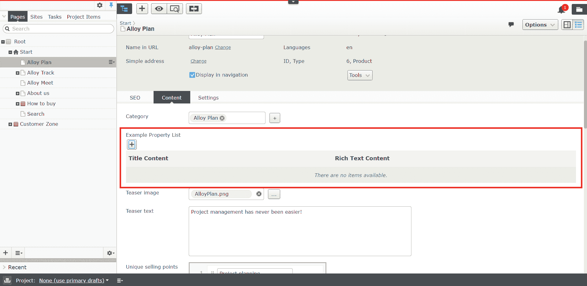
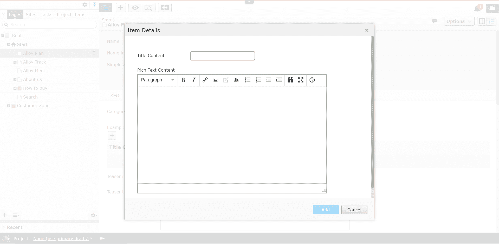

# 更改 Episerver 属性列表模式大小

> 原文：<https://dev.to/debpu06/changing-episerver-propertylist-modal-size-1c76>

# Episerver PropertyList 模态尺寸

## 快速汇总

我曾在多个场合使用过 Episerver 的 PropertyList，我经常遇到的一个问题是编辑器视图中出现的模态对于某些场景来说太小了。具体来说，当使用 XhtmlString 属性时。

[](//images.ctfassets.net/9usgdrjsks5w/CDWYqotWhTbzLSxavKOCA/e30bd27822175d44ee7a0b822d463c7b/Default_Modal_Size.PNG)

[*跳转到*实现](#implementation)

这对于编辑人员来说是一个问题，因为在模态中没有水平滚动功能。因此，如果编辑想要将内容居中，他们可能需要做一些变通，比如添加空白，让 TinyMCE 围绕他们希望看到的内容居中。

在寻找这个问题的解决方案时，我能够找到一些可以用来解决这个问题的 CSS 更新。然而，我发现这并不是我所欣赏的快速谷歌搜索。所以我想我会把它贴在这里，希望它会更容易被下一个人找到。

正如我说过的，我在别处找到了这个解决方案，所以感谢 [Minesh Shah](https://world.episerver.com/System/Users-and-profiles/Community-Profile-Card/?userid=517e12cf-fa98-dc11-b081-0018717a8c82) 把我找到的东西贴在了 [Episerver 论坛](https://world.episerver.com/forum/developer-forum/-Episerver-75-CMS/Thread-Container/2016/3/editing-content-on-propertylist/)上。

#### Episerver TinyMCE 2.0 配置

我知道在 Episerver 11 中 TinyMCE 的最新更新中，你可以根据你的配置自定义编辑器的大小，直到内容类型。但是，自定义配置只能添加到 IContentData 的实例中。并且实现自定义 PropertyList 的页面无法访问这些 XhtmlString 属性来应用自定义配置。另外，我认为从编辑的角度来看，增加模态的大小比减少富文本区域的大小更好。

## 实现

### 创建属性

创建属性列表的过程非常简单。这里的实现你可以在我的 [Github repo](https://github.com/debpu06/Alloy-Demo-Project/tree/feature-propertylist-modal-size) 使用 Alloy 演示网站中找到。首先，我创建了一个自定义类型以及一个属性类型定义。

```
public class ContentProperty{ [Display(Name = "Title Content")] public virtual string Title { get; set; } [Display(Name = "Rich Text Content")] public virtual XhtmlString MainContentArea { get; set; }}[PropertyDefinitionTypePlugIn]public class ContentPropertyListTypeDefinition : PropertyList<contentproperty> { } 
```

Enter fullscreen mode Exit fullscreen mode

然后，我将该属性添加到 Alloy 页面类型之一 ProductPage 中。

```
[EditorDescriptor(EditorDescriptorType = typeof(CollectionEditorDescriptor<contentproperty>))]
[Display(
    Name = "Example Property List",
    GroupName = SystemTabNames.Content)]
public virtual IList<contentproperty> PropertyListExample { get; set; } 
```

Enter fullscreen mode Exit fullscreen mode

这就是创建实际属性所需的全部内容。

[](//images.ctfassets.net/9usgdrjsks5w/2mUpo3fbe1BhmN0RhUIUrn/1a52aeecacacafa0c7a9470b925150b8/Page_Property.png)

### 添加 CSS

正如您在本文开头的图片中看到的， *MainContentArea* 属性不适合模态。我们可以通过更新以下内容来解决这个问题:

首先，更新 web 项目根目录中的 **module.config** 。如果您没有 module.config 文件，您可以添加它并包含以下内容:

```
<?xml version="1.0" encoding="utf-8"?>
<module>
    <assemblies>
        <!-- This adds the Alloy template assembly to the "default module" -->
        <add assembly="Alloy Demo Site"></add>
    </assemblies>
    <clientresources>
        <add name="epi-cms.widgets.base" path="Styles/Styles.css" resourcetype="Style"></add>
    </clientresources>
    <dojo>
        <paths>
            <add name="alloy" path="Scripts"></add>
        </paths>
    </dojo>
</module> 
```

Enter fullscreen mode Exit fullscreen mode

如果您已经有了配置，那么在**客户端资源**节点下添加名为 **epi-cms.widgets.base** 的节点(如果您还没有的话)。引用的 CSS 是我们添加样式更新的地方。

其次，更新 *module.config* 中引用的 CSS 文件。在本例中，它将位于*~/client resources/Styles/Styles . CSS*中。在 CSS 文件中，添加以下内容:

```
.Sleek .epi-dialog-landscape .dijitDialogPaneContentArea {
    height: 500px !important;
}

.Sleek .epi-dialog-landscape, .Sleek .epi-dialog-portrait, .Sleek .epi-dialog--auto-height {
    width: auto !important;
    transform: translateX(-50%);
    left: 50% !important;
} 
```

Enter fullscreen mode Exit fullscreen mode

CSS 调整模式的高度和宽度，并使其在页面上居中。

[](//images.ctfassets.net/9usgdrjsks5w/1VHNQZbKC113zfRmzyD6zc/c00d5aeae96fb2987b2793f6bd0d3e52/Final_Modal_Size.PNG)

## 最后的想法

最终结果提供了更好的编辑体验。正如我之前提到的，这并不新鲜，但希望你能比我更快地找到解决方案。一如既往，如果您对如何改进该解决方案有任何问题或想法，请随时联系我们。