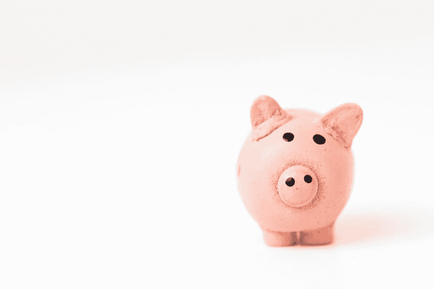

# 我从书上学到的个人理财原则

> 原文：<https://dev.to/steelwolf180/personal-finances-principles-i-learnt-from-books-2g6o>

# 简介

我最近在创业治疗播客上看到一集，叫做[“创业不会破产——创始人会”](https://castbox.fm/episode/Startups-Don't-Go-Bankrupt%2C-Founders-Do-id1998369-id147056077?country=us)。

那段播客让我产生了共鸣，让我想起了大学毕业后第一年的糟糕回忆和冷汗。

幸运的是，经历这些让我变得更加坚强，也让我有了现在的地位。

每天做时间过得很快的艰苦工作，而不是每天都害怕工作。

以下是我在成长过程中通过书籍学到的一些个人理财原则，帮助我在大学毕业的第一年应对金融不确定性。

我希望这些书中的理财原则能帮助你做出更好的购买决定，并在你的一生中成长为一个更好的人。

# 先支付自己

这是我在阅读《巴比伦最富有的人》这本书时学到的最初几条财务原则之一。

其中谈到，在给其他人发工资之前，把你每月工资的 10% 存到储蓄投资账户中， **10%** 拿出来，& **10%** 享受一下。

这对帮助你培养积累财富的心态尤为重要。

这帮助我独自运用这个原则克服了生活中的问题。

# 投资自己

通过投资于自己，把自己塑造成一个更好的人，可以让你踏上做有意义的工作的道路，过上充实的生活。

对自己投资的要点是积极主动，而不是消极被动，等待你的人力资源或某人指定你应该在哪里训练自己变得更好。

对自己的投资可以有不同的形式，可以是非金钱的形式。

这可能需要花费时间和精力来学习新技术，就像我学习 Django 成为 Django 开发人员一样。

花钱请一位拥有你想要的技能、经验或人脉的导师、顾问或教练，边喝咖啡、喝茶边向他们请教。

它可以是花时间和金钱买书、会议、研讨会、或者只是做志愿者工作来获得技能，比如教编程课。

# 关注成本，而不是价格

我记得几周前在我的 facebook feed 上流传着一段 gif 引文，是关于买便宜的衣服让你成为一个更好的人。

当我从托马斯·J·斯坦利的《别再装有钱人》一书中看到原因时，我笑了。

你应该关注拥有成本，而不是产品的价格。

假设你有两件不同的 t 恤，款式、颜色和品牌都一样，但区别在于材质和做工。

第一件 t 恤的价格是 40 美元，而第二件 t 恤的价格是 80 美元。你会选择哪个？

是第一件 t 恤而不是第二件 t 恤是因为价格的原因吗？

现在，如果我告诉你，第一件 t 恤可以穿大约 3 个月，而第二件 t 恤由于质量原因可以穿大约 1 年。

基本上，如果你在第一件 t 恤坏掉之前买 4 件，可以穿一年，那么它的总拥有成本是 120 美元。

由于所用的材料和制作质量，从长远来看，只买第二件 80 美元的 t 恤更实惠。

我敢肯定，少用一点，专注于基本的、高质量的、经久耐用的物品，会给你带来快乐。

# 结论

我只是在实践我多年来在个人理财和投资领域阅读的书籍中所学到的东西。

这帮助我在为自己买东西时做出了更好的决定，并让我的头脑变得能够接受新的智慧。

关于个人理财和投资的书籍数不胜数，这里有 3 本书是我非常喜欢的，并且打开了我理解它的大门。

*   托马斯·J·斯坦利的《隔壁的百万富翁》
*   乔治·s·卡尔森的《巴比伦最富有的人》
*   罗伯特·T·清崎的《富爸爸穷爸爸》

如果你喜欢我的文章，请**注册**Max[冒险家简讯](http://eepurl.com/dOUoUb)获取我每周在 **Python** 、**创业**和 **Web 开发**偶然发现的牛逼内容。

你也可以**关注**我来获取我在 **Dev** 上的文章的**最新**更新

这篇文章最初发表在 Max 的博客上，地址是[我从书里学到的个人理财原则](https://www.maxongzb.com/personal-finances-principles-i-learnt-from-books/)和[照片由 Unsplash 上的 Fabian Blank 拍摄](https://unsplash.com/photos/pElSkGRA2NU)

# 参考文献

*   戴夫·拉姆齐的《金钱大变身》现场直播！- 7 小步
*   罗伯特·清崎——富爸爸，穷爸爸——如何投资自己
*   你赚的钱都用来做什么了？——约翰·索姆兹
*   [为什么工程师应该计划提前退休](https://retireby40.org/engineers-plan-early-retirement/)