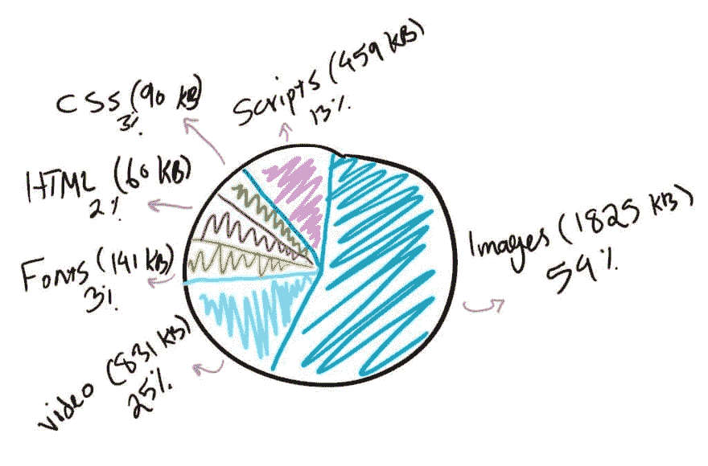
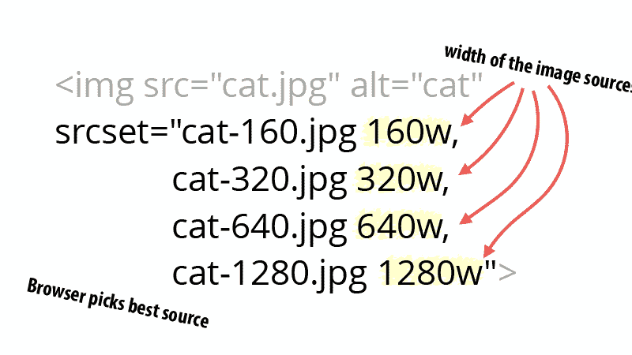

# 图像优化

> 原文：<https://dev.to/yashints/image-optimisation-3ic9>

最近，我有机会在悉尼 NDC 做了一个关于网络性能的演讲，得到了很好的反馈。

这启发了我就我在那次演讲中涉及的每个主题写了一系列的帖子，谁知道呢，也许有一天这些帖子中的每一个都会成为一次单独的演讲😃。

所有其他零件:

[关于 HTML 和 CSS 的第 1 部分](https://yashints.dev/blog/2018/09/29/web-perf-1)

[第 2 部分使用预加载/预取来增加加载时间](https://yashints.dev/blog/2018/10/06/web-perf-2)

[第三部分 JavaScript 技巧和窍门](https://yashints.dev/blog/2018/10/12/web-perf-3)

[第五部分网络字体优化](https://yashints.dev/blog/2018/11/23/web-perf-5)

## [T1】简介](#intro)

相信我，你不希望谷歌讨厌你的网站。知道每个网站上最重要的内容是图片，关注它们的优化是非常重要的。

幸运的是，减小它们的尺寸非常容易，并且对页面的整体尺寸有很大的影响。对于移动设备上的大多数用户来说，图像质量并不那么重要。即使在高分辨率的桌面上，你也可以做出一些牺牲。这是因为人眼不会察觉某些不存在的像素。

只要你不过度优化图像使其变丑，继续缩小它的尺寸是有好处的🤷‍.

> 图片占网页总重量的 50%以上😱。这就是为什么我们应该优化它们！

|  |
| --- |
| 【2018 年每页平均字节数 |

## 图像优化是什么意思

图像优化是指**使用不同的技术减小图像尺寸**。这将导致页面加载更快，从而有更好的用户体验。

## 何必呢

通过优化图像，您将获得以下好处:

*   这将改善页面加载时间。用户等待页面加载的每一秒钟，亚马逊每年都会损失 16 亿美元的销售额(你现在可以选择一个计算器，看看你的公司会受到多大的影响😁).
*   它提高了你的搜索引擎优化能力，你的网站将在搜索引擎中排名更高，带来更多的流量。
*   创建站点备份会更快(如果您使用 CMS 或备份整个站点)
*   较小的图像使用较少的带宽，不会耗尽用户的移动数据配额。
*   在服务器(或 CDN)上需要更少的存储空间，使其更具成本效益。

## 让我们优化它们

图像优化的主要目标是找到文件大小和图像质量之间的平衡。但是在我们开始优化技巧之前，我们应该了解不同的图像格式以及何时使用每种格式。

### 选择正确格式

*   **PNG**–生成更高质量的图像，但文件也更大。是作为无损图像格式创建的，尽管它也可能是有损的。
*   **JPEG**–使用有损和无损优化。您可以调整质量级别，以获得质量和文件大小的良好平衡。
*   **GIF**–仅使用 256 种颜色。是动画形象的最佳选择。它只使用无损压缩。

有一些较新的图像格式，如 **WebP** 和 **Jpeg2000** ，但是浏览器支持还没有出现。总的来说，你应该用 JPEG 来处理色彩丰富的图像，用 PNG 来处理简单的图像。

**【更新】**
对 WebP 和 Jpeg2000 的支持提升了很多，放心使用吧。但是，请确保您有一个后备选项，以防它不受支持，您不想排除用户查看这些。

```
<picture>
  <source srcset="img/awesomeWebPImage.webp" type="image/webp">
  <source srcset="img/creakyOldJPEG.jpg" type="image/jpeg"> 
  
</picture> 
```

Enter fullscreen mode Exit fullscreen mode

上面的代码片段是支持所有浏览器的最佳组合，无论新旧，甚至是那些不支持图片的浏览器。

### 大小 vs 压缩

这是压缩前后的图像示例。注意质量是如何受到影响的(你在猫身上看不到，但在它周围看得到):

**之前**
[](https://res.cloudinary.com/practicaldev/image/fetch/s--DCFNNqc_--/c_limit%2Cf_auto%2Cfl_progressive%2Cq_auto%2Cw_880/https://yashints.dev/static/f418272fbe68058ad6a67edb674ebd63/b4133/cat-lg.jpg)

[](https://res.cloudinary.com/practicaldev/image/fetch/s--s5XGO42d--/c_limit%2Cf_auto%2Cfl_progressive%2Cq_auto%2Cw_880/https://yashints.dev/static/90e74e99d64dfa1db5e3ee84560be56e/b4133/cat-sm.jpg) 后

 **出于同样的原因，你无法找出第一个和第二个图像之间的猫本身的差异，这是安全的压缩图像到这种程度。只是让你知道第一个图像是 4mb，第二个只有 27kb。🤷‍

### 有损与无损优化

既然您已经知道压缩图像和降低质量有多重要，那么知道我们有两种类型的压缩也很重要:

*   **有损** -这是一种从图像中消除一些数据的过滤器，在上面的例子中，你可以看到猫周围的区域有一些损失。使用这种技术，文件大小将在很大程度上减少。像 Adobe Photoshop、Affinity Photo 这样的工具或者像[图像压缩软件](https://imagecompressor.com/)这样的免费在线工具会帮你搞定。

*   **无损** -这是一种不消除任何数据的过滤器，只使用压缩来减小大小，但这意味着它需要图像解压缩才能运行。你可以使用像[文件优化器](http://netm.ag/optimize-263)和[图像优化器](http://imageoptim.com/)这样的工具轻松做到这一点。

你需要亲自体验，并为你的图像找到最佳拍摄点。这是一个需要事先做一些工作的任务，但是可以为你节省很多时间。另一件要考虑的事情是在你的构建过程中使用 ImageOptim 这样的工具，这样你甚至不需要担心前期的工作。您的原始图像保持不变。

## 使用正确的尺寸

尽管压缩很重要，但它本身只能保持同样的维度。应用压缩后，不能再以相同的宽度和高度减小尺寸。

除此之外，你需要知道在移动设备上显示 2000 像素宽的图片不是一个好主意。尤其是在较小的设备上，人类检测变化的能力远不如他们在观看具有大纵横比的位监视器时。

要实现这一点，你可以使用`HTML`中的`srcset`和`width descriptors`属性。这样，您就可以提到多个屏幕尺寸，并指定每个尺寸使用哪个图像。

[](https://res.cloudinary.com/practicaldev/image/fetch/s--zSgTXYpY--/c_limit%2Cf_auto%2Cfl_progressive%2Cq_auto%2Cw_880/https://thepracticaldev.s3.amazonaws.com/i/9xxjf6bmdnpel4r2ryti.png)

当您使用宽度描述符时，您为浏览器提供了一个图像列表及其真实宽度，以便它可以根据视口大小选择最佳来源。

## 使用 SVGs

SVG 是一种可扩展的矢量格式，非常适用于徽标、图标、文本和简单图像。以下是您考虑使用它们的几个原因:

*   SVG 在浏览器和照片编辑工具中都可以自动缩放。这是网页和平面设计师的梦想！
*   谷歌索引 SVG，和它索引 png 和 jpg 的方式一样，所以你不用担心 SEO。
*   SVG 通常(不总是)比 png 或 jpg 文件小。这可能导致更快的加载时间。

这里有一个例子来告诉你它可以有多大的不同(图片来自[https://genki hagata . com):](https://genkihagata.com):)

| **JPEG** |
| --- |
|  |
| 大小:81.4KB |

| **PNG** |
| --- |
|  |
| 大小:85.1KB |

| **【SVG】t1㎡型** |
| --- |
|  |
| 大小:6.1KB |

**注意**:我不能在这篇文章中嵌入 svg，所以我只用了 jpeg 文件。但是你可以在我的原帖上查看[。](https://yashints.dev/blog/2018/11/12/web-perf-4)

## 懒加载图片

当我们考虑到目前为止我们所经历的一切时，你会意识到在某个点上把图像做得更小是不够的。尤其是当你的页面中有太多这样的图标时。这就是我们需要确保我们的网页快速加载它们的地方。

这就是懒惰装载的拯救之道。让我们看看它是如何工作的演示(视频来自 [CSS Tricks](https://css-tricks.com) ):

### 什么事？

延迟加载图像就是直到稍后才加载图像的行为。这是 web 开发中的一种技术，适用于许多其他形式的资源，但这里我们只关注图像。

> **Wikipedia:** 惰性加载是计算机编程中常用的一种设计模式，它将对象的初始化推迟到需要它的时候。如果使用得当，它可以提高程序运行的效率。

### 这是怎么做到的

假设你有一个很长的页面，里面有很多图片。如果用户看不到页面底部的图片，为什么它会被加载？就这么简单，您可以在一个事件上加载图像，比如当页面的该部分可见时(使用 scroll 事件处理程序)或任何其他事件。但不仅仅是在页面加载时。

除此之外，如果用户从不向下滚动，该图像将不会被加载，从而为最终用户节省一些网络流量和数据使用。

考虑到这对整个页面加载时间和速度的影响，您将开始看到很多好处。

### 偷懒装载技巧

在页面上加载图像有两种常见的方式，使用`img`标签和 CSS `background-image`。让我们从图像标签开始。

#### 图像标签

这里有一个我们通常用来加载图像的简单图像标签:

```
 
```

Enter fullscreen mode Exit fullscreen mode

延迟加载图像的标记非常相似。`src`属性是浏览器发送网络请求和获取图像的触发器。不管这是页面上的第一张还是第 50 张图片。

要推迟加载，只需使用`data-src`属性。

```
 
```

Enter fullscreen mode Exit fullscreen mode

因为`src`是空的，所以当标签被渲染时，浏览器不加载图像。现在只是触发加载的问题，这通常是在图像进入视窗时完成的。

我们可以使用像`scroll`、`resize`和`orientationChange`这样的事件来确定何时触发加载。滚动事件非常清楚，当用户滚动时，如果图像标签在页面上，那么我们触发加载并告诉浏览器获取图像。但是，resize 和 orientation change 事件同样重要。调整大小是当用户改变窗口大小时，就像他们缩小窗口一样。当用户旋转他们的设备时，方向发生改变。

一旦我们挂钩到这些事件，我们就可以启用延迟加载，结果非常好:

```
document.addEventListener(
  'DOMContentLoaded',
  function() {
    var lazyloadImages = document.querySelectorAll(
      'img.lazy'
    )
    var lazyloadThrottleTimeout

    function lazyload() {
      if (lazyloadThrottleTimeout) {
        clearTimeout(lazyloadThrottleTimeout)
      }

      lazyloadThrottleTimeout = setTimeout(
        function() {
          var scrollTop = window.pageYOffset
          lazyloadImages.forEach(function(img) {
            if (
              img.offsetTop <
              window.innerHeight + scrollTop
            ) {
              img.src = img.dataset.src
              img.classList.remove('lazy')
            }
          })
          if (lazyloadImages.length == 0) {
            document.removeEventListener(
              'scroll',
              lazyload
            )
            window.removeEventListener(
              'resize',
              lazyload
            )
            window.removeEventListener(
              'orientationChange',
              lazyload
            )
          }
        },
        20
      )
    }

    document.addEventListener('scroll', lazyload)
    window.addEventListener('resize', lazyload)
    window.addEventListener(
      'orientationChange',
      lazyload
    )
  }
) 
```

Enter fullscreen mode Exit fullscreen mode

### 使用交集 API

让我们看看这个 API 提供了什么:

> 交叉点观察器 API 提供了一种异步观察目标元素与祖先元素或顶级文档的视口的交叉点变化的方法。

在前一种技术中，所有这些事件处理程序可能会对页面的性能产生一些影响，与此相反，这种方法相对较新。

这个 API 通过计算消除了之前的性能影响，并提供了一种非常有效的方法来在资源在屏幕上时调用回调函数:

```
document.addEventListener(
  'DOMContentLoaded',
  function() {
    var lazyloadImages

    if ('IntersectionObserver' in window) {
      lazyloadImages = document.querySelectorAll(
        '.lazy'
      )
      var imageObserver = new IntersectionObserver(
        function(entries, observer) {
          entries.forEach(function(entry) {
            if (entry.isIntersecting) {
              var image = entry.target
              image.src = image.dataset.src
              image.classList.remove('lazy')
              imageObserver.unobserve(image)
            }
          })
        }
      )

      lazyloadImages.forEach(function(image) {
        imageObserver.observe(image)
      })
    } else {
      var lazyloadThrottleTimeout
      lazyloadImages = document.querySelectorAll(
        '.lazy'
      )

      function lazyload() {
        if (lazyloadThrottleTimeout) {
          clearTimeout(lazyloadThrottleTimeout)
        }

        lazyloadThrottleTimeout = setTimeout(
          function() {
            var scrollTop = window.pageYOffset
            lazyloadImages.forEach(function(img) {
              if (
                img.offsetTop <
                window.innerHeight + scrollTop
              ) {
                img.src = img.dataset.src
                img.classList.remove('lazy')
              }
            })
            if (lazyloadImages.length == 0) {
              document.removeEventListener(
                'scroll',
                lazyload
              )
              window.removeEventListener(
                'resize',
                lazyload
              )
              window.removeEventListener(
                'orientationChange',
                lazyload
              )
            }
          },
          20
        )
      }

      document.addEventListener(
        'scroll',
        lazyload
      )
      window.addEventListener('resize', lazyload)
      window.addEventListener(
        'orientationChange',
        lazyload
      )
    }
  }
) 
```

Enter fullscreen mode Exit fullscreen mode

我们将观察者附加到所有我们想要延迟加载的图像上。当 API 检测到元素已经进入视口时，使用`isIntersecting`属性，我们从`data-src`属性中选取 URL，并将其移动到`src`属性，以便浏览器像以前一样触发图像加载。完成后，我们从图像中移除惰性类，并从图像中移除观察者。

### CSS 背景图片

CSS 背景图片不像图片标签那样简单。为了加载它们，浏览器需要构建 DOM 树和 CSSDOM 树([参见这里的](https://dev.to/2018/09/29/web-perf-1))。如果 CSS 规则适用于该节点，则浏览器加载它，否则不适用。所以我们需要做的就是不要默认给它一个背景属性，当它可见的时候添加它:

```
document.addEventListener(
  'DOMContentLoaded',
  function() {
    var lazyloadImages

    if ('IntersectionObserver' in window) {
      lazyloadImages = document.querySelectorAll(
        '.lazy'
      )
      var imageObserver = new IntersectionObserver(
        function(entries, observer) {
          entries.forEach(function(entry) {
            if (entry.isIntersecting) {
              var image = entry.target
              image.classList.remove('lazy')
              imageObserver.unobserve(image)
            }
          })
        }
      )

      lazyloadImages.forEach(function(image) {
        imageObserver.observe(image)
      })
    } else {
      var lazyloadThrottleTimeout
      lazyloadImages = document.querySelectorAll(
        '.lazy'
      )

      function lazyload() {
        if (lazyloadThrottleTimeout) {
          clearTimeout(lazyloadThrottleTimeout)
        }

        lazyloadThrottleTimeout = setTimeout(
          function() {
            var scrollTop = window.pageYOffset
            lazyloadImages.forEach(function(img) {
              if (
                img.offsetTop <
                window.innerHeight + scrollTop
              ) {
                img.src = img.dataset.src
                img.classList.remove('lazy')
              }
            })
            if (lazyloadImages.length == 0) {
              document.removeEventListener(
                'scroll',
                lazyload
              )
              window.removeEventListener(
                'resize',
                lazyload
              )
              window.removeEventListener(
                'orientationChange',
                lazyload
              )
            }
          },
          20
        )
      }

      document.addEventListener(
        'scroll',
        lazyload
      )
      window.addEventListener('resize', lazyload)
      window.addEventListener(
        'orientationChange',
        lazyload
      )
    }
  }
) 
```

Enter fullscreen mode Exit fullscreen mode

还有:

```
#bg-image.lazy {
  background-image: none;
  background-color: #f1f1fa;
}
#bg-image {
  background-image: url('path/to/some/cat/image.jpg');
  max-width: 600px;
  height: 400px;
} 
```

Enter fullscreen mode Exit fullscreen mode

## 总结

我们已经看到了如何使用不同的压缩方法来减小图像尺寸，如何为不同的屏幕尺寸加载不同的尺寸，以及最后如何延迟加载它们。使用这些技术，您可以极大地提高页面的性能，玩一段时间后，它会成为您的爱好。

请一如既往地传播这个词，看看下一篇关于网络字体的文章😃👋。**