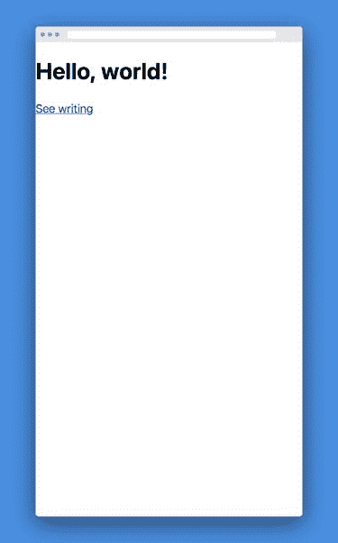
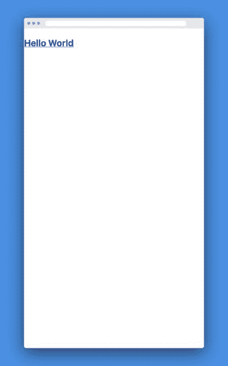
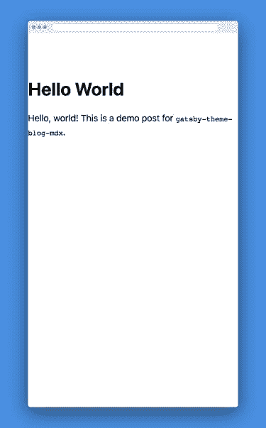
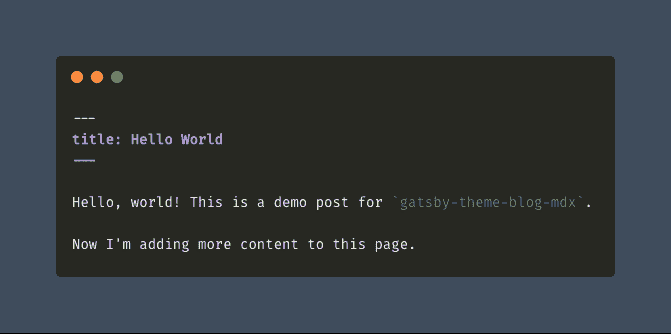
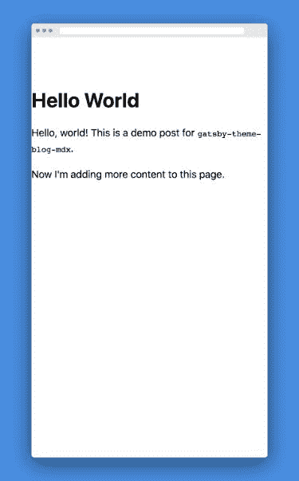
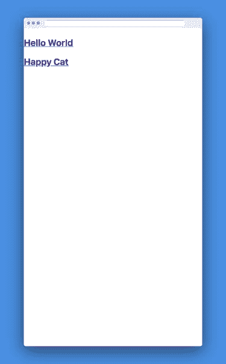
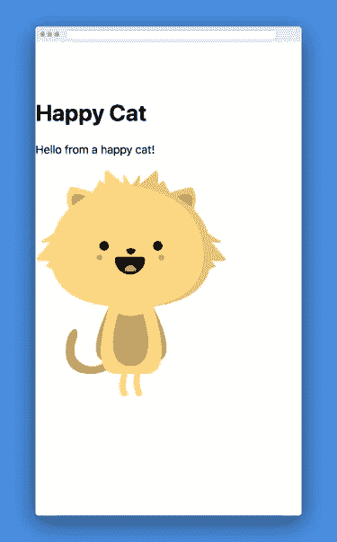

# [预稳定版本]在非主题启动器中使用 Gatsby 主题

> 原文：<https://dev.to/ekafyi/using-gatsby-themes-in-a-non-theme-starter-54c7>

> ⚠️**2019 年 7 月 7 日更新:**这篇文章是在主题稳定之前*写的。这篇文章中的一些 API 和代码现在可能不准确。小心行事。⚠️*

* * *

> 随着主题在 Gatsby 中的引入，开始构建一个 Gatsby 站点比以往任何时候都更容易。共享功能、数据源和设计都可以预先打包成一个 Gatsby 主题，在 NPM 安装。——[盖茨比主题介绍](https://www.gatsbyjs.org/docs/themes/introduction/)

一个盖茨比**主题**是一个盖茨比站点的*可重用块，可以*共享、扩展和定制* ( [源](https://youtu.be/SV2zu9FvUTw?t=406))。它是 6 个月前[推出的](https://www.gatsbyjs.org/blog/2018-11-11-introducing-gatsby-themes/)，目前仍处于试验阶段。因此，在数百个现有的[【starters】](https://www.gatsbyjs.org/starters/?v=2)(样板网站)中，很少是专门为主题而构建的。*

在这篇文章中，我们将在一个空白站点中使用 [gatsby-theme-blog-mdx](https://github.com/gatsbyjs/gatsby/tree/master/themes/gatsby-theme-blog-mdx) 主题，这个空白站点是用由来已久的 [hello-world](https://github.com/gatsbyjs/gatsby-starter-hello-world) 启动器创建的。这是最基本的 Gatsby starter 站点，相当于初始化一个包，安装`yarn add gatsby react react-dom`，返回一行硬编码页面。我想看看我能否用最少的特定主题知识和软件包来构建一个主题驱动的网站。

我将从“快乐之路”开始，这样你就可以了解事情是如何进行的。之后，我会向你展示我遇到的问题以及我是如何解决的，然后是我的笔记和结论。

**目录:**

*   ☀️快乐之路
*   ⛈蜿蜒的小路
*   📝我的笔记
*   🚪结论

* * *

## ☀️的幸福之路

> ⚠️·盖茨比的主题目前还处于实验阶段。主题 API 将来可能会改变。⚠️

### 1。创建一个盖茨比网站

我们使用官方的[gatsby-starter-hello-world](https://github.com/gatsbyjs/gatsby-starter-hello-world)来创建一个新的 Gatsby 站点。我在一个名为`eka-hello-world-starter`的文件夹中创建它；你可能想用你自己的名字来代替它。😀

```
# create a new Gatsby site using the hello-world starter
gatsby new eka-hello-world-starter https://github.com/gatsbyjs/gatsby-starter-hello-world

# go to the site folder
cd eka-hello-world-starter

# run to check if it works
# (stop by pressing Ctrl + C)
gatsby develop 
```

### 2。导入主题

```
yarn add gatsby-theme-blog-mdx 
```

### 3。将主题添加到我们的网站

我们使用的启动器没有`gatsby-config.js`，所以在你的站点的根目录下创建它，内容如下:

```
// eka-hello-world-starter/gatbsy-config.js
module.exports = {
  __experimentalThemes: [
    {
      resolve: `gatsby-theme-blog-mdx`,
      options: {}, 
    },
  ],
} 
```

正如你所看到的，这类似于我们如何添加插件到我们的网站。我们还可以设置特定的选项，这可以在主题的自述文件中看到。

### 4。添加您的页面内容

在你的站点的根目录下创建一个名为`posts`的文件夹，并在里面创建一个`.mdx`文件。

```
# create "posts" folder
mkdir posts

# create a file called "hello-world.mdx" in "posts"
touch posts/hello-world.mdx 
```

在文件中写入页面内容。这只是一个例子；只要填写[封面](https://github.com/cuttlebelle/website/blob/master/content/documentation/what-is-frontmatter.md)中的`title`字段，就可以写任何东西。

<figure>

```
---
title: Hello World
---
Hello, world! This is a demo post for `gatsby-theme-blog-mdx`. 
```

<figcaption>eka-hello-world-starter/posts/hello-world.mdx</figcaption>

</figure>

**注意:**文件夹名`posts`在主题中定义。你*必须*使用这个名字，除非你重写代码(这超出了本文的范围)。但是，文件名可以是您想要的任何名称。

### 5。创建作者列表

我们实际上没有在 UI 中使用作者列表，但是主题需要这个文件。我将在下一节详细讨论这一点。现在，让我们在`src`中创建一个名为`data`的文件夹，并在那里创建一个名为`author.yaml`的文件。

```
# if you're still in "posts" directory, move up to project root
cd ..

# create "data" folder in "src"
mkdir src/data

# create a file called "author.yaml" in "data"
touch src/data/author.yaml 
```

添加一个名为`id`的字段，其中*具有任意的*值。

```
# eka-hello-world-starter/src/data/author.yaml
- id: eka 
```

### ⑥。删除我们网站的`index.js`

起始站点附带了一个索引页面组件。但是在这种情况下，我们希望使用主题的索引，所以我们将删除我们的`eka-hello-world-starter/src/pages/index.js`文件。

### 7。运行应用程序

运行`gatsby develop`。如果一切顺利，我们可以在浏览器中打开 [http://localhost:8000](http://localhost:8000) ，看到一个简单的页面，上面有一个标题和一个链接，链接到我们的帖子页面(*“见写”*)。

[](https://res.cloudinary.com/practicaldev/image/fetch/s--8hXtP2k5--/c_limit%2Cf_auto%2Cfl_progressive%2Cq_auto%2Cw_880/https://thepracticaldev.s3.amazonaws.com/i/m6jlclwuraub23i7xzyb.jpg)

点击链接会把我们带到[http://localhost:8000/blog](http://localhost:8000/blog)，文章列表页面。我们可以看到我们的帖子标题，“你好，世界”。

[](https://res.cloudinary.com/practicaldev/image/fetch/s--Fr63UT10--/c_limit%2Cf_auto%2Cfl_progressive%2Cq_auto%2Cw_880/https://thepracticaldev.s3.amazonaws.com/i/vlnc2nht6a6u78hbgl5m.jpg)

当我们点击标题时，我们会转到[http://localhost:8000/posts/hello-world](http://localhost:8000/posts/hello-world)，其中包含我们之前在`hello-world.mdx`中写的文本。

[](https://res.cloudinary.com/practicaldev/image/fetch/s--P54Iuxmm--/c_limit%2Cf_auto%2Cfl_progressive%2Cq_auto%2Cw_880/https://thepracticaldev.s3.amazonaws.com/i/pzhnztom5a88vr8etnks.jpg)

在我们的`hello-world.mdx`中再添加一行，就可以看到页面自动更新了新的内容。

[](https://res.cloudinary.com/practicaldev/image/fetch/s--GA_Xi_5Q--/c_limit%2Cf_auto%2Cfl_progressive%2Cq_auto%2Cw_880/https://thepracticaldev.s3.amazonaws.com/i/4szfpotdakpp4uxs68g6.png)

[](https://res.cloudinary.com/practicaldev/image/fetch/s--jcKp1vdS--/c_limit%2Cf_auto%2Cfl_progressive%2Cq_auto%2Cw_880/https://thepracticaldev.s3.amazonaws.com/i/srzki2nrdg0vugwodwmj.jpg)

我们有自己的博客了！🎉

### 8。添加一只猫(可选)

现在让我们添加另一页。我在这里添加一个名为`cat.mdx`的文件:

<figure>

```
---
title: Happy Cat
---
Hello from a happy cat! 
```

<figcaption>eka-hello-world-starter/posts/cat.mdx</figcaption>

</figure>

但是等等…我们现在要做些别的事情。使用 [MDX](https://mdxjs.com) ，我们可以将 *React 组件*添加到 Markdown 页面。

我们将添加这个奇妙的包 [miukimiu/react-kawaii](https://github.com/miukimiu/react-kawaii) 并将其导入到我们的新页面中。

```
# if you're still in "posts" directory, move up to project root
cd ..

# install the package
yarn add react-kawaii 
```

现在让我们回到我们的 post 文件，从新安装的`react-kawaii`包中添加一个组件。

<figure>

```
---
title: Happy Cat
---
import { Cat } from "react-kawaii"

Hello from a happy cat!

<Cat size={320} mood="excited" color="#FFD882" /> 
```

<figcaption>eka-hello-world-starter/posts/cat.mdx</figcaption>

</figure>

用`gatsby develop`运行 app，打开[http://localhost:8000/blog](http://localhost:8000/blog)，我们可以在那里看到我们的新帖子。

[](https://res.cloudinary.com/practicaldev/image/fetch/s--W5ke2aA8--/c_limit%2Cf_auto%2Cfl_progressive%2Cq_auto%2Cw_880/https://thepracticaldev.s3.amazonaws.com/i/2s7prfoivh2jmgqo7c5y.jpg)

当我们打开帖子页面时，我们可以看到带有 SVG 猫图像的帖子。

[](https://res.cloudinary.com/practicaldev/image/fetch/s--Oy-u_psA--/c_limit%2Cf_auto%2Cfl_progressive%2Cq_auto%2Cw_880/https://thepracticaldev.s3.amazonaws.com/i/wsd02nzaj26ab3wi49l5.jpg)

导入组件的能力——无论是从外部包还是本地包安装的组件——意味着我们可以向页面添加各种有趣的东西！有了 Markdown 和 transformer 插件，我们已经可以嵌入外部媒体，但现在我们可以添加更丰富的交互式内容。✨

接下来，我打算在到达“快乐之路”之前，原路返回。你也可以跳到这篇文章末尾的*注释*和*结论*。

* * *

## ⛈弯弯曲曲的小路

### `gatsby-theme-blog`，逃之夭夭的人

*   我最初是从[入门](https://www.gatsbyjs.org/docs/themes/getting-started/)页面开始的。我按照说明安装了`gatsby-starter-blog-theme`。我假设这将是一个使用`gatsby-theme-blog`的启动站点，但是这个启动站点并不存在(在[本期](https://github.com/gatsbyjs/gatsby/issues/13481)中讨论过)。
*   我搜索`gatsby-theme-blog`，发现[包](https://github.com/gatsbyjs/gatsby/tree/master/themes/gatsby-theme-blog)。就在那时，我想知道是否有可能在一个常规的 Gatsby 站点中使用`gatsby-theme-blog`——即。一个*而不是*专为`gatsby-theme-blog`打造的——这让我写了这篇文章。只有一种方法可以知道…
*   我创建了一个基本的`hello-world`站点并添加了`gatsby-theme-blog`，这与上一节中的步骤 1 到 4 相同:
    *   在我的站点文件夹中运行了`yarn add gatsby-theme-blog`
    *   在`gatsby-config.js`中增加了`__experimentalThemes = ["gatsby-theme-blog"]`
    *   按照页面中[步骤 2-3](https://www.gatsbyjs.org/docs/themes/getting-started/#2-scaffold-out-an-example-post) 的说明，创建了一个示例帖子和主页
*   我屏住呼吸跑着`gatsby develop`，然后…

```
Error: TypeError [ERR_INVALID_ARG_TYPE]: The "path" argument must be   of type string. Received type undefined

gatsby-config.js:67 module.exports
[eka-hello-world-starter]/[gatsby-theme-blog]/gatsby-config.js:67:34 
```

*   正如我们所看到的，这个错误的发生是因为我没有提供`path`，不管它是什么。我在`node_modules`文件夹里打开了主题的`gatsby-config.js`。`typography`插件选项似乎是罪魁祸首，所以我把它注释掉了。

```
{
  resolve: 'gatsby-plugin-typography',
  // options: {
  //   pathToConfigModule: path.relative(
  //     root,
  //     require.resolve('./src/utils/typography')
  //   ),
  // },
}, 
```

*   然后清空缓存，重启应用。上面的错误消失了…但它被另一个错误所取代:

```
GraphQLError: Expected type MarkdownRemarkFieldsEnum, found frontmatter___date; Did you mean the enum value frontmatter___title?
### other log message
TypeError: Cannot read property ‘allMarkdownRemark’ of undefined
gatsby-node.js:44 graphql.then.result
[eka-hello-world-starter]/[gatsby-theme-blog]/gatsby-node.js:44:35 
```

*   我检查了主题的`gatsby-node.js`中的冒犯线。是`const posts = result.data.allMarkdownRemark.edges`，它仅仅表示 GraphQL 查询失败，因此没有`result`数据。之前的消息暗示该错误可能与文件 frontmatter 有关。

    *   我检查并确认:(1)我在 `pages`和`posts`文件夹中的*都有降价文件(只是为了确认一下)，以及(2)文件在首页有`title`字段。*
    *   我还检查了主题的`gatsby-config.js`以确保`gatsby-source-filesystem`和`gatsby-transformer-remark`插件存在。
    *   最后，我检查了自述文件，以确保没有需要包含的选项。(也试过`postsPerPage`选项只是因为。)
*   重新启动应用程序，和…同样的错误。放弃了，给自己冲了杯咖啡。😬

*   然后我在盖茨比的官方主题列表中看到`gatsby-theme-blog-mdx`有一个示例站点，于是决定用它来代替。

<figure>

[](https://i.giphy.com/media/pHZ8BDWQhJrvLmL29M/giphy.gif)

<figcaption>A coffee later...</figcaption>

</figure>

### `gatsby-theme-blog-mdx`

*   这个[主题](https://github.com/gatsbyjs/gatsby/tree/master/themes/gatsby-theme-blog-mdx)有一个[对应的启动器](https://github.com/gatsbyjs/gatsby/tree/master/themes/gatsby-starter-theme-blog-mdx)、*但是*我没有直接使用启动器，因为我想更好地理解添加主题。当我发现一个比较代码的问题时，我只是瞥了一眼启动程序。
*   我采取了步骤 1-3
*   我不知道在哪里添加我的内容(MDX 文件)。我本来可以在`gatsby-config.js`中进行调查，但是我通过查看示例站点更快地发现 MDX 路径是`posts`。总而言之，我可以在三个地方找到存放内容的地方:
    *   1)主题文件(*)这个*主题为[提供了一个样本帖子格式](https://github.com/gatsbyjs/gatsby/blob/master/themes/gatsby-theme-blog-mdx/posts/__frontmatter.mdx)，但我猜其他主题可能没有？)
    *   2)主题的相关起始站点
    *   3)主题的`gatsby-config.js`文件
*   [示例 MDX 文件](https://github.com/gatsbyjs/gatsby/blob/master/themes/gatsby-starter-theme-blog-mdx/posts/hello.mdx)在[的八个可用字段](https://github.com/gatsbyjs/gatsby/blob/master/themes/gatsby-theme-blog-mdx/posts/__frontmatter.mdx)中有三个前置字段:`title`、`date`和`author`。在这一点上，我不知道哪些是强制性的。我只是把除了`title`以外的都删了；如果有错误，我会把它们加回去。
*   **【与上一节第 5 步相关】**快速看了一下启动器，显示了`src/data/author.yml`的存在。但我还是运行了这个应用程序，希望尽可能少地修改。不出所料，我得到了一个错误:

```
Error: MdxFrontmatter.author cannot convert to OutputType the follow  ing string: ‘AuthorYaml’ 
```

*   我打开主题的配置，发现[是罪魁祸首](https://github.com/gatsbyjs/gatsby/blob/master/themes/gatsby-theme-blog-mdx/gatsby-config.js#L14)，台词`mapping: { "Mdx.frontmatter.author":` AuthorYaml `}`。我注释掉了令人不快的行，然后再次运行应用程序。成功了！！🙌🏾
*   现在我知道这个应用程序工作了，我想在不修改包文件的情况下修复`AuthorYaml`问题*。从长远来看，修改包内容不是一个好的做法——如果我要更新应用程序，我必须重复上面的步骤。如果我在回购中共享我的项目，我必须告诉每个人克隆这个项目。我试图用像`"Mdx.frontmatter.author": false`这样考虑不周的尝试来覆盖`mapping`值😝无济于事。*
*   所以选择是:(a)修改主题文件，或者(b)在我的站点中创建`author.yml`文件。我选择了后者，只添加了`id`，省略了其他字段。
*   在这一点上，该应用程序已经工作。然而，我不知道网页的网址是由什么主题生成的。找出答案的“黑客”方法是键入任何不可用的路径(例如[http://localhost:8000/AAA](http://localhost:8000/aaa))，这将显示 Gatsby 的 dev 错误页面并列出可用的路径。但是我想看主题的索引页！所以……↓
*   **【与上一节第 6 步相关】**我从`hello-world`启动器中移除了`src/pages/index.js`，重启了 app。瞧，我得到了我们在第 7 步看到的东西！

这就是我试错的结局；剩下的步骤进展顺利。

* * *

## 📝我的笔记

这些是我关于使用主题的笔记和随想。请记住，这些大多是我的*主观*想法，我*没有*完全掌握主题，所以它们可能不完全准确！

🤔 ***什么样的盖茨比网站可以使用主题？为了使用主题，我需要学习多少？***
*Any*Gatsby site——建立在任何首发或无首发(即。您手动安装了依赖项)—可以使用主题。唯一需要的步骤是在`gatsby-config.js`中添加包含主题名称的`__experimentalThemes`字段。

🤔那么，为什么我们有专门为某个特定主题打造的首发呢？
一个主题的功能范围可以从添加*一个*单个空文件——就像这个“[最小可能的盖茨比主题](https://github.com/ChristopherBiscardi/gatsby-starter-theme/tree/master/gatsby-theme-minimal)”——到整个复杂的站点。正如你在上面的实验中所看到的，即使是一个相当简单的主题，我们仍然需要弄清楚我们的帖子应该放在哪里，封面应该包括什么，等等。

因此，我理解需要一个特定主题的启动器来轻松地搭载用户。如[主题简介](https://www.gatsbyjs.org/docs/themes/introduction/)中所述，“一个 starter 的安装将包含演示内容和一个紧凑的 gatsby-config”。你也可以[将你的旧启动器转换成一个主题](https://www.gatsbyjs.org/docs/themes/converting-a-starter/)，然后在任何网站上使用它。

尽管有这样的好处，但是，我觉得对特定主题的依赖会违背主题的动机。主题应该是模块化的“乐高积木”——比如博客、电子商务、搜索、任何来源的数据——开发者可以组装起来满足他们的需求([来源](https://youtu.be/SV2zu9FvUTw?t=506))。因此，它们应该具有足够的弹性，可以添加到任何类型的 Gatsby 网站，无论大小。

如果我要在现实生活中添加一个 Gatsby 主题，我目前的方法是将特定主题的起始站点视为如何实现该主题的文档(文件格式、路径等)。

🤔 ***我一直在教程里看到 yarn workspace。需要吗？***
你做*而不是*需要纱线工作区来使用主题；你需要它在本地*创建主题*(在你机器的文件夹中)。如果你导入一个发表在 NPM 上的主题，就像我们在这篇文章中所做的，yarn workspace 是不必要的。查看这篇很棒的文章，了解更多关于 yarn workspace 的信息:[为主题开发设置 Yarn workspace](https://github.com/gatsbyjs/gatsby/blob/beacac6215e7a527a937a121a482f0b60bd69126/docs/blog/2019-04-01-setting-up-yarn-workspaces-for-theme-development/index.md)

🍃我想在后面探讨的话题是:不同主题之间的冲突，尤其是当一个项目的规模增大时。例如，如果多个主题使用与源相同的路径和文件格式(例如`/posts`)，而没有自定义路径的能力，情况会怎样？我们要么需要在配置中编写大量条件语句，要么直接修改主题文件。这有可能吗？

* * *

## 🚪结论

在很大程度上，Gatsby 主题实现了它的承诺:一个主题确实是“一个 NPM 安装”，它确实使用户能够在不接触代码的情况下添加内容。(在我看来，*建立一个主题网站*仍然需要至少对盖茨比大体上有中等程度的熟悉——这在盖茨比的[详尽文档](https://www.gatsbyjs.org/docs/)的帮助下很大。)主题的有用性很大程度上依赖于文档(“如何使用这个主题？”)和/或相应的起始位置。

这个系列的下一个主题是:我将在本地创建一个盖茨比主题。

敬请关注，感谢阅读！🙌🏾

📚*关于盖茨比主题资源的列表，请到我的[介绍](https://dev.to/ekaonthenet/learning-gatsby-themes-introduction-1gje)帖子*的结尾