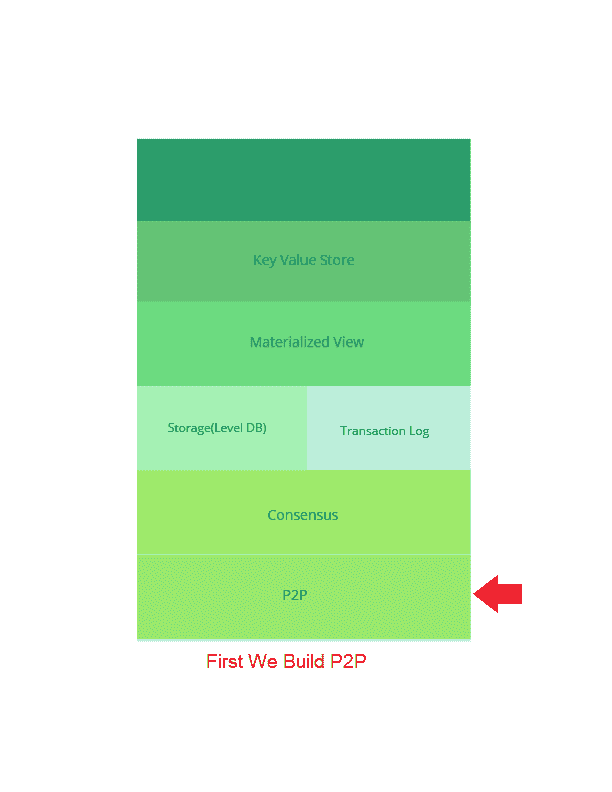

# 逐步构建分布式数据库…(第 1.1.1 部分服务器和 P2P)

> 原文：<https://dev.to/rajdeepdas/building-a-distributed-database-step-by-steppart-111-servers-and-p2p-3cbe>

#### 分布式数据库节点的对等网络和 Python 中的简单服务器实现。

<figure> 

<figcaption>照片由[JESHOOTS.COM](https://unsplash.com/@jeshoots?utm_source=medium&utm_medium=referral)上[下](https://unsplash.com?utm_source=medium&utm_medium=referral)</figcaption>

</figure>

**上一篇**[https://medium . com/@ rajdeepdas . India/building-a-distributed-database-step-by-step-Part-1-abc7d 944 e52d](https://medium.com/@rajdeepdas.india/building-a-distributed-database-step-by-step-part-1-abc7d944e52d)

今天，我们将明确 P2P 的基本概念，并尝试构建一个 P2P 应用程序，这将有助于我们在未来构建分布式数据库节点。

首先，我想用 Go & C/C++来构建服务器，但我认为更重要的是理清概念。为了容易理解，让我们试着用更简单的语言来构建，比如 Python。稍后我们会将其转换为 C/C++或 go 实现。

我选择 Python 是因为它有很多库和模块，所以理解抽象概念比理解底层细节更容易。一开始，如果我们在一个非常低的水平上，对于初学者以及中级用户或程序员来说，理解起来会更困难。

因为我打算让所有初学者到高级程序员阅读这个系列，所以如果你是中级或高级程序员，并且了解这些基本概念，我会建议你跳过这一部分，否则你可能会感到无聊。虽然我也会要求高级程序员阅读它，以纠正我是否犯了任何错误，并给我反馈。

太多的介绍和谈论让我们开始吧:)

<figure> 

<figcaption>【第一层(自下而上)</figcaption>

</figure>

**点对点** ( **P2P** )计算或联网是一种[分布式应用](https://en.wikipedia.org/wiki/Distributed_application)架构，在对等点之间划分任务或工作负载。对等体在应用程序中是同等特权、同等权力的参与者。据说它们形成了一个点对点的节点网络。

每个人都有一个问题，为什么这个人想使用点对点网络，使用它的主要目的如下…

1.  在对等网络中，所有节点既充当服务器又充当客户端，因此不需要专用的服务器。
2.  正如我在之前的帖子中所说的那样( [*帖子链接*](https://medium.com/@rajdeepdas.india/building-a-distributed-database-step-by-step-part-1-abc7d944e52d) )，我们将使用**筏**共识算法来同步数据库。
3.  对于去中心化的应用，P2P 是一个很好的选择。
4.  众所周知，无线传感器网络主要是分散的，所以如果我们遵循 P2P 网络的技术，我们很容易使任何一个节点成为主节点。
5.  点对点的最大优势来自成本，因为它不需要中央服务器、网络操作系统或管理员。对等网络

让我们首先构建一个简单的 Python 准系统 HTTP 服务器

**简单的 HTTP 服务器(** bareBoneServer.py)