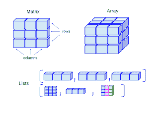
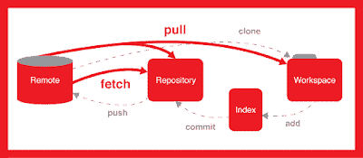
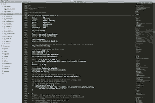
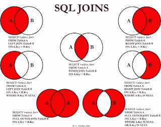
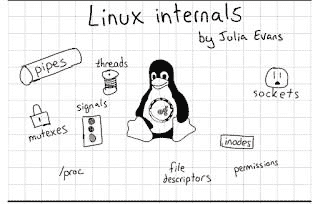
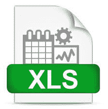
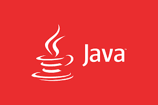
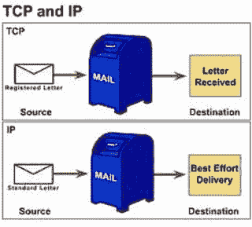
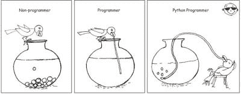

# 每个软件开发人员都应该知道的 10 件事

> 原文：<https://dev.to/javinpaul/10-things-every-software-developer-should-know-39pe>

*披露:这篇文章包括附属链接；如果您从本文提供的不同链接购买产品或服务，我可能会收到报酬。*

如果你一直在自学编程，并想知道每个软件开发人员或程序员都应该学习或了解的一些最基本的事情，那么，这里有一个列表，列出了作为程序员你可以学习做好的一些基本事情。

作为一个 Java 博客的作者，我经常收到来自我的读者，尤其是初学者的问题，计算机科学毕业生可以做些什么来为软件开发职业做准备？怎样才能成为一名优秀的程序员？或者对初级开发人员的期望是什么？

这些人大多是大学生、初级开发人员和学习编程的人，由于互联网，他们可以获得大量的信息，并渴望提前了解一些东西，为他们在 T2 的编程工作面试做准备。

在本文中，我将分享 **10 件我认为每个软件开发人员都应该知道或学习的事情**。

这包括像 [C++](http://www.java67.com/2018/02/5-free-cpp-courses-to-learn-programming.html) 或 [Java](https://javarevisited.blogspot.com/2018/05/top-5-java-courses-for-beginners-to-learn-online.html) 这样的编程语言，像[数据结构](https://javarevisited.blogspot.com/2018/01/top-5-free-data-structure-and-algorithm-courses-java--c-programmers.html)、[算法](https://javarevisited.blogspot.com/2018/11/top-5-data-structures-and-algorithm-online-courses.html#axzz5fKHU123K)和计算机网络基础知识这样的基本计算机科学概念，像 [Git](https://javarevisited.blogspot.com/2018/01/5-free-git-courses-for-programmers-to-learn-online.html) 、Microsoft Word 和 Excel 这样的基本工具，像 [SQL](https://javarevisited.blogspot.com/2018/05/top-5-sql-and-database-courses-to-learn-online.html) 和 [UNIX](http://www.java67.com/2018/02/5-free-linux-unix-courses-for-programmers-learn-online.html) 这样的技能，像 Eclipse 或 Visual Studio 这样的编辑器，以及文本编辑器。

这个列表并不完整，我还没有包括一些更高级的东西，比如[正则表达式](https://click.linksynergy.com/deeplink?id=JVFxdTr9V80&mid=39197&murl=https%3A%2F%2Fwww.udemy.com%2Flearn-regular-expressions-in-online-regex-course%2F)，但是它确实为你提供了一个程序员应该知道的东西的良好起点。

> 如果你的目标是软件开发职业，并寻找一份编程工作，那么这些都是你可以学习和提高的东西，以便在竞争中保持领先。

## 每个程序员和软件开发人员都应该知道的 10 件事

事不宜迟，这里列出了我个人认为每个程序员都应该知道的事情，不管他做的是什么工作。这些都是[基本功](https://dev.to/javinpaul/11-essential-skills-software-developers-should-learn-in-2020-1bio)，将长期为你服务。

在这些技能上投入的任何时间、金钱和努力都会在你的职业生涯中获得回报。

### 1。数据结构和算法

如果你想成为一名程序员，那么你应该很好地了解数据结构和算法；这是没有办法的。

这是任何[编程工作面试](https://javarevisited.blogspot.com/2011/06/top-programming-interview-questions.html)的重要话题之一，如果你不知道基本的数据结构(例如[数组](https://javarevisited.blogspot.com/2015/06/top-20-array-interview-questions-and-answers.html)、[链表](http://javarevisited.blogspot.sg/2017/07/top-10-linked-list-coding-questions-and.html#axzz4xXS86IVo)、[映射](http://www.java67.com/2017/08/top-10-java-hashmap-interview-questions.html)、set)，就不可能写出真实世界的应用程序。

这就是为什么每个程序员都应该在他们的计算机科学课程中认真学习数据结构和算法。

即使你是自学编程，你也必须知道数据结构和算法；其实很多编程训练营第一件事都会教你数据结构和算法。

如果你想自学，那么 [**数据结构和算法:使用 Java**](https://click.linksynergy.com/fs-bin/click?id=JVFxdTr9V80&subid=0&offerid=323058.1&type=10&tmpid=14538&RD_PARM1=https%3A%2F%2Fwww.udemy.com%2Fdata-structures-and-algorithms-deep-dive-using-java%2F) 深入学习是一个很好的起点。

并且，如果你需要一些免费的替代品，那么这个[免费数据结构和算法课程](https://medium.freecodecamp.org/these-are-the-best-free-courses-to-learn-data-structures-and-algorithms-in-depth-4d52f0d6b35a)的列表也是有用的。

### 2。源代码管理(Git)

源代码控制用于存储您的代码，并帮助程序员在团队中协作。例如，如果许多程序员在相同的代码库中工作，但是使用不同的特性，那么像 Git 这样的源代码控制工具可以帮助他们协作，而不会覆盖彼此的变化。简而言之，如果你想成为一名程序员或软件开发人员，你必须知道像 Git 或 SVN 这样的版本控制工具。

谢天谢地 [Git](https://dzone.com/articles/top-5-free-courses-to-learn-git-and-github-in-2019) 和 [Github](https://hackernoon.com/top-5-free-courses-to-learn-git-and-github-best-of-lot-2f394c6533b0) 已经简化了市场，现在超过 70%的组织使用 Git，所以你可能只需要学习 Git 就可以了。

顺便说一下，您应该在命令行上花一些精力学习 Git ,并且您应该熟悉高级版本控制概念，如分支和合并，以及使用命令行和 GUI 的工具本身。

我向所有想在线学习 Git 的人推荐，[**《GitHub 终极版:Git 大师》和 GitHub**](https://click.linksynergy.com/fs-bin/click?id=JVFxdTr9V80&subid=0&offerid=634352.1&type=10&tmpid=14538&RD_PARM1=https%3A%2F%2Fwww.udemy.com%2Fgithub-ultimate%2F) 课程。

但是，如果你需要更多的选择，你也可以查看这个列表[免费课程，在线学习 Git](https://dev.to/javinpaul/5-free-courses-to-learn-git-and-github-in-depth-jpp) 。

### 3。文本编辑器(Vim)

作为一名程序员或软件开发人员，我没有一天不使用像 Vim 这样的文本编辑器。它是最重要的工具之一，即使对于非程序员，如 DBA 和系统管理员，以及任何使用计算机的人。

我主要在 Windows 上使用 NotePad，在 [Linux](http://www.java67.com/2018/02/5-free-linux-unix-courses-for-programmers-learn-online.html) 上使用 VIm，但是在高级编辑器方面有很多选择，比如 Sublime 和 NotePad++，它们提供了类似 IDE 的功能。

我建议你花些时间学习你最喜欢的编辑器和键盘快捷键，生产力提示是你可以学习的。如果你喜欢 Vim，那么 [Vim MasterClass](https://click.linksynergy.com/deeplink?id=JVFxdTr9V80&mid=39197&murl=https%3A%2F%2Fwww.udemy.com%2Fvim-commands-cheat-sheet%2F) 是最好的开始课程之一，如果你是一个 Windows 的家伙，那么你可以查看[Sublime Text for Rapid Web Development](https://click.linksynergy.com/fs-bin/click?id=JVFxdTr9V80&subid=0&offerid=634352.1&type=10&tmpid=14538&RD_PARM1=https%3A%2F%2Fwww.udemy.com%2Fsublime-text-for-rapid-web-development%2F)来学习 Sublime，另一个强大的文本编辑器。

### 4。ides(intelli idea 或 VSCode)

当我开始软件开发时，我需要在记事本或 DOS 编辑器中编写代码，然后保存文件，从命令行运行编译器，通过运行 ANT 脚本创建包。像调试和分析这样的活动是一个遥远的梦想，但是像 IntelliJIDEA 和 Visual Studio 这样的 ide 的出现已经完全改变了现代程序员开发软件的方式。

换句话说，像 IntelliJIDEA 或 AndroidStudio 这样的 ide 对于任何程序员来说都是最重要的工具。对于 [C](https://medium.com/javarevisited/10-best-c-programming-courses-for-beginners-2c2c1f6bcb12) 、 [C++](https://javarevisited.blogspot.com/2020/07/top-10-courses-to-learn-c-in-depth-best.html) 、 [C#程序员](https://medium.com/javarevisited/5-best-c-c-sharp-programming-courses-for-beginners-in-2020-494f7afc7a5c)，选择很明确:Visual Studio。而且对于 Python 开发者来说，Jupiter Notebook 一天比一天好。

对于 Java 程序员来说，有三大 ide 可供选择: [Eclipse](http://www.java67.com/2018/02/5-free-eclipse-and-junit-online-courses-java-developers.html) ，NetBeans， [IntelliJ IDEA](https://javarevisited.blogspot.com/2018/09/top-5-courses-to-learn-intellij-idea-java-and-android-development.html) 。

虽然 Eclipse 是我最喜欢的，但 IntelliJ IDEA 可能是其中最强大的。如果你碰巧是 IntelliJ IDEA 的粉丝，那么我建议你通过 [**IntelliJ IDEA 技巧来提高 Java 开发人员的生产力**](https://click.linksynergy.com/fs-bin/click?id=JVFxdTr9V80&subid=0&offerid=634352.1&type=10&tmpid=14538&RD_PARM1=https%3A%2F%2Fwww.udemy.com%2Fintellij-idea-secrets-double-your-coding-speed-in-2-hours%2F) 来更好地学习你的 IDE。

如果你需要更多的选择，你还可以查看这个免费 Eclipse 课程列表和一些推荐的 T2 intelli jidea 课程列表。

### 5。数据库和 SQL

SQL 是一个经典的，可能是任何软件开发人员最有价值的技能。它已经存在了 30 多年，我认为它还会存在 30 年。鉴于[数据库](https://javarevisited.blogspot.com/2019/01/top-6-free-database-and-sql-courses-to-learn-online.html)的无处不在，程序员应该熟悉基本的数据库概念，如规范化和表设计以及 [SQL](https://javarevisited.blogspot.com/2018/05/top-5-sql-and-database-courses-to-learn-online.html) 。

像 [Oracle](http://www.java67.com/2018/02/5-free-oracle-and-microsoft-sql-server-online-courses.html) ， [Micrsoft SQL Server](https://javarevisited.blogspot.com/2018/12/top-5-free-microsoft-sql-server-and-transact-sql-online-courses.html#axzz5hG3koJem) ， [MySQL](https://javarevisited.blogspot.com/2018/05/top-5-mysql-courses-to-learn-online.html) ， [PostgreSQL](https://medium.com/javarevisited/7-best-free-postgresql-courses-for-beginners-to-learn-in-2021-3bf369d73794) 这样的数据库有很多，但是知道一个就够了。关键是你要熟悉数据库。您应该知道如何插入/更新/删除数据，以及[如何编写 SQL 查询](https://javarevisited.blogspot.com/2017/01/a-better-way-to-write-sql-queries.html)来检索数据。

像加入聚合函数这样的高级概念的知识是一个很大的奖励，如果你想得到它，那么 [**完整的 SQL BootCamp**](http://bit.ly/2yoX0mI%20https://click.linksynergy.com/fs-bin/click?id=JVFxdTr9V80&subid=0&offerid=323058.1&type=10&tmpid=14538&RD_PARM1=https%3A%2F%2Fwww.udemy.com%2Fthe-complete-sql-bootcamp%2F) 是一个很好的起点。

而且，如果你需要一些免费的替代品，这里有一个为程序员和软件开发人员提供的学习 SQL 的[免费课程列表。](http://www.java67.com/2018/02/5-free-database-and-sql-query-courses-programmers.html)

### 6。UNIX 或 Linux

和 SQL 一样，UNIX 也经受住了时间的考验。它也已经存在了 30 多年，我希望在未来的许多年里它还会存在。

由于大多数程序员在某些时候不得不在 Linux 机器上工作，所以掌握好[Linux 命令行](https://hackernoon.com/top-5-free-linux-courses-for-programmers-4a433b4edade)会大有帮助。

它让你有效地工作。您可以搜索文件，通过检查系统的 CPU 和内存使用情况来了解系统的情况，并执行基本和高级任务。

如果你想学习 Linux 命令，我建议你在 5 天内通过 [**学习 Linux，并在 Udemy 上升级**](https://click.linksynergy.com/fs-bin/click?id=JVFxdTr9V80&subid=0&offerid=562016.1&type=10&tmpid=14538&RD_PARM1=https%3A%2F%2Fwww.udemy.com%2Flearn-linux-in-5-days%2F) 你的职业课程。

如果你需要一些免费的选择，那么你也可以在 Dev.to 上查看这个为初学者学习 Linux 的免费课程列表。

### 7。微软优越试算表

我可能会因为将 Excel 包含在这个列表中而受到很多批评，但我仍然认为 Excel 是程序员、软件开发人员、项目经理、交易员和商业人士的主要工具之一。它不仅仅是电子表格软件。

它提供了许多有用的特性和功能来执行复杂的数据分析。我使用 Excel 来跟踪进度、协调数据、[数据科学](https://dev.to/javinpaul/10-data-science-and-machine-learning-courses-for-programmers-looking-to-switch-career-57kd)、数据质量检查以及项目规划。

它有多种用途，这也是我敦促每个程序员深入学习 Excel 的原因。除了复制和粘贴数据，你还应该知道一些基本的功能，比如搜索、排序、过滤和 VLOOKUP 来比较东西。

如果你想从零开始学习 Excel 或者想提高自己的知识， [**微软 Excel - Excel 从初级到高级**](https://click.linksynergy.com/fs-bin/click?id=JVFxdTr9V80&subid=0&offerid=323058.1&type=10&tmpid=14538&RD_PARM1=https%3A%2F%2Fwww.udemy.com%2Fmicrosoft-excel-2013-from-beginner-to-advanced-and-beyond%2F) 是一个很好的入门课程。

### 8。编程语言

当然，如果你想成为一名程序员，你必须知道一门编程语言: [C++](https://hackernoon.com/top-5-free-c-courses-to-learn-programming-in-2019-d27352277da0) 或 [Java](https://javarevisited.blogspot.com/2018/08/top-5-free-java-8-and-9-courses-for-programmers.html) ，或者可能是 [Python](http://www.java67.com/2018/02/5-free-python-online-courses-for-beginners.html) 或 [JavaScript](http://www.java67.com/2018/04/top-5-free-javascript-courses-to-learn.html) 。你可以选择任何你想要的，但我个人的建议是，你至少应该知道 Java。

它很容易开始，这就是为什么初学者的好选择。它也非常强大，允许你做几乎任何事情。

它有很多库，从做像 web 开发这样的基础工作到处理大数据等更复杂的任务。如果你决定学习 Java，那么 [**完整的 Java 大师班**](https://click.linksynergy.com/fs-bin/click?id=JVFxdTr9V80&subid=0&offerid=323058.1&type=10&tmpid=14538&RD_PARM1=https%3A%2F%2Fwww.udemy.com%2Fjava-the-complete-java-developer-course%2F) 可能是最好的起点。

如果你需要更多的选择，如果你不介意从免费资源中学习，那么你也可以看看这个为初学者提供的[免费 Java 编程课程列表](https://javarevisited.blogspot.com/2017/11/top-5-free-java-courses-for-beginners.html#axzz5mwZJhPHT)和这些学习 Java 的[免费网站](http://javarevisited.blogspot.sg/2015/06/2-websites-to-learn-coding-in-java-online-free.html)。

### 9。网络基础

当今世界是一个相互连接的世界，无论你走到哪里，你都会发现计算机网络，从你的家中开始，你在许多设备上使用 Wi-Fi，到学校、学院和办公室使用局域网(LAN)连接到互联网。

您将编写的大多数应用程序(如 Web 应用程序或移动应用程序)也不会是独立的，而是客户端-服务器类型的应用程序，其中请求将通过网络到达服务器。客户将从世界任何地方访问您的应用程序。

底线是您必须了解网络基础知识，以理解、开发和支持您的应用程序。如果你想了解更多，我建议你参加 Udemy 上的 [**完整的网络基础**](https://click.linksynergy.com/fs-bin/click?id=JVFxdTr9V80&subid=0&offerid=634352.1&type=10&tmpid=14538&RD_PARM1=https%3A%2F%2Fwww.udemy.com%2Fcomplete-networking-fundamentals-course-ccna-start%2F) 课程。对于初学者来说，这是一个很好的起点。

如果你需要另一种选择，那么[面向非技术人员的计算机网络入门](https://click.linksynergy.com/deeplink?id=JVFxdTr9V80&mid=39197&murl=https%3A%2F%2Fwww.udemy.com%2Fintroduction-to-computer-networks%2F)也是一个很好的起点。

### 10。脚本语言

在第 8 点中，我要求你学习一门编程语言，然而在这里，我要求你学习一门脚本语言？为什么？同样的编程语言不能作为脚本语言使用吗？

嗯，当然有一些编程语言既适合于面向对象编程，也适合于脚本编写，比如 T2、Python 和 T3，这就是为什么我要求你至少学习它们。

但是如果你碰巧选择了 C/c++(T1)或 T2 Java(T3 ),那么你就不能像 T4 Python 或 Perl 开发人员那样快速做出东西。

这就是为什么我建议每个程序员学习 Python，如果你同意的话， [**完整的 Python 训练营**](https://click.linksynergy.com/fs-bin/click?id=JVFxdTr9V80&subid=0&offerid=634352.1&type=10&tmpid=14538&RD_PARM1=https%3A%2F%2Fwww.udemy.com%2Fcomplete-python-bootcamp%2F) 是一个很好的开始课程。

脚本语言使得创建工具和脚本来解决编程世界中的常见问题变得容易。如果你很好地掌握了 Python 这样的脚本语言，那么你就可以很容易地自动化普通的东西。

再次建议你[学 Python](https://dev.to/javinpaul/why-every-programmer-should-learn-python-in-2019-157i) 一举两得，如果你还需要一些资源的话，[免费 Python 课程](https://javarevisited.blogspot.com/2018/12/10-free-python-courses-for-programmers.html)的这些列表也很有帮助

计算机科学毕业生和所有想成为程序员或想从事软件开发或网站开发的人可以使用这个列表来找到成为一名成功的程序员所需的东西、工具和技能。

您可能想了解的其他**编程文章**:

*   [2021 年 Java 开发者路线图](https://javarevisited.blogspot.com/2019/10/the-java-developer-roadmap.html)
*   [2021 年学习 Spring Boot 的五大课程](https://www.java67.com/2018/06/5-best-courses-to-learn-spring-boot-in.html)
*   [2021 年要学的 10 种编程语言](http://www.java67.com/2017/12/10-programming-languages-to-learn-in.html)
*   [2021 年每个 Java 开发人员都要学习的 10 种工具](https://www.java67.com/2018/04/10-tools-java-developers-should-learn.html)
*   [2021 年 Java 开发人员应该阅读的 10 本书](http://www.java67.com/2018/02/10-books-java-developers-should-read-in.html)
*   【Java 开发人员应该知道的 20 个库
*   [2021 年 Java 和 Web 开发人员应该学习的 10 个框架](http://javarevisited.blogspot.sg/2018/01/10-frameworks-java-and-web-developers-should-learn.html)
*   [2021 年要学的 10 个 Scala 和 Groovy 框架](https://javarevisited.blogspot.com/2020/09/top-10-scala-and-groovy-frameworks-java.html)
*   [我最喜欢的深入学习 Java 的免费课程](https://medium.com/javarevisited/10-free-courses-to-learn-java-in-2019-22d1f33a3915)
*   [深入学习 Spring 框架的前 5 门课程](https://javarevisited.blogspot.com/2018/06/top-6-spring-framework-online-courses-Java-programmers.html)
*   [面向 Java 开发者的 10 门免费学习 Maven、Jenkins 和 Docker 的课程](https://medium.com/javarevisited/top-10-free-courses-to-learn-maven-jenkins-and-docker-for-java-developers-51fa7a1e66f6)
*   [面向 Java 开发者的 10 门免费 Spring Boot 课程](https://medium.com/javarevisited/10-free-spring-boot-tutorials-and-courses-for-java-developers-53dfe084587e)
*   [面向 Java 程序员的 10 门高级 Spring Boot 课程](https://medium.com/javarevisited/10-advanced-spring-boot-courses-for-experienced-java-developers-5e57606816bd)
*   [2021 年 Java 开发者为什么要学习 Docker](https://javarevisited.blogspot.com/2020/11/why-devops-engineer-learn-docker-kubernetes.html#axzz6dXsEfLvJ)

> 顺便说一句，如果你有兴趣了解更多程序员应该知道的事情，互联网上有很多指南，比如《程序员应该知道的 97 件事**》一书，这是每个严肃程序员的必读之作。**