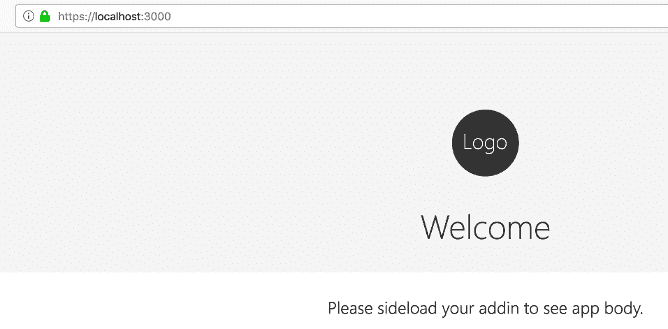

# 使用 VsCode 和 Mkcert 私有可信 CA 的 Office 加载项

> 原文：<https://dev.to/kagundajm/office-add-in-using-vscode-and-mkcert-private-trusted-ca-fo4>

### 简介

开发 Office 加载项需要使用 HTTPS。因此，需要 SSL/TLS 证书来授予使用加密通信的权限，并验证证书持有人的身份。当生成新的外接程序项目时，也会为该项目创建自签名证书。要让浏览器使用这些证书，必须将它们添加为受信任的根证书。但是，有些时候，即使将这些自签名证书添加为根信任证书，一些浏览器也无法识别它们是可信的。

mkcert 安装后会将您的计算机交给可信的私人证书颁发机构(CA)。因此，浏览器将信任并加载使用 **mkcert** 生成的任何证书，而不会发出任何警告。

在本文中，我们将逐步完成生成 office 加载项项目、安装 mkcert 以及向加载项项目添加可信证书的过程。此过程将为创建和测试 Excel 加载项做好准备，而浏览器不会引发任何证书错误。

### 先决条件

*   你需要已经安装了 [Nodejs](https://nodejs.org/en/) 。安装 Nodejs 的同时也会安装 [npm](https://www.npmjs.com/) 。

    您可以通过在终端上运行以下命令来验证是否安装了 Nodejs 和 npm。`npm --version && node --version`

*   在这篇文章中，我们将使用 [Visual Studio 代码](https://code.visualstudio.com/)。你可以自由使用你最喜欢的编辑器。

### 安装约曼工具集

Yeoman 是一个开源的客户端工具栈，可以帮助开发者构建现代的网络应用。

从终端运行以下命令:`npm install --global yo`

如果在安装过程中遇到 **EPERM** 或 **EACCESS** 等权限或访问错误，可以按照[在 macOS 和 Linux 上安装不带 sudo 的 npm 包](https://github.com/sindresorhus/guides/blob/master/npm-global-without-sudo.md)或[的说明手动更改 npm 的默认目录](https://docs.npmjs.com/resolving-eacces-permissions-errors-when-installing-packages-globally#manually-change-npms-default-directory)。重复安装过程现在应该完成，没有错误。

完成 Yeoman 安装后，安装用于 Office 插件的 Yeoman 生成器。`npm install --global yo generator-office`

### 创建 web app

*   也可以创建一个文件夹来存放 office 加载项。您可以使用不同的名称或位置来存储项目。`mkdir ~/office-js`

*   将位置更改为您创建的文件夹或项目文件夹。`cd ~/office-js`

*   通过运行以下命令生成您的 Excel 外接程序项目:`yo office`

    系统将提示您输入所需的信息，以使约曼发电机创建项目

```
 ? ==========================================================================
    We're constantly looking for ways to make yo better! 
    May we anonymously report usage statistics to improve the tool over time? 
    More info: https://github.com/yeoman/insight & http://yeoman.io
    ========================================================================== No

        _-----_     ╭──────────────────────────╮
        |       |    │   Welcome to the Office  │
        |--(o)--|    │   Add-in generator, by   │
       `---------´   │ @OfficeDev! Let's create │
        ( _´U`_ )    │    a project together!   │
        /___A___\   /╰──────────────────────────╯
        |  ~  |     
    __'.___.'__   
    ´   `  |° ´ Y ` 

    ? Choose a project type: Office Add-in project using Jquery framework
    ? Choose a script type: Javascript
    ? What do you want to name your add-in? actual-expense-add-in
    ? Which Office client application would you like to support? Excel
    ---------------------------------------------------------------------------------- 
```

也可以通过运行带有以下参数和选项的`yo`命令来创建项目，而不提示答案。`yo office jquery "actual-expense-add-in" excel --js`

```
- `jquery` is the project type. Other types are `angular`, `react`, `excel-functions` for Excel Custom functions or `manifest` which will create only the `manifest.xml` file.
- `expense-add-in` is the name of the project
- `excel` is the Microsoft Office client that will host the add-in. Other supported hosts are onenote, outlook, powerpoint, project and word.
- `--js` tells the generator to use Javascript. If you want to use TypeScript, then pass `--ts`. 

When the project has been generated, it will also create a folder which contains the project files. 
```

### 更新清单文件

*   将目录切换到新创建的项目。`cd actual-expense-add-in`

*   通过运行以下命令打开新创建的项目。`code .`

*   打开项目根目录下的 **manifest.xml** 文件，更新外接程序的 **ProviderName** 、 **DisplayName** 和 **Description** 。

```
 <ProviderName>Kagunda JM</ProviderName>
    <DefaultLocale>en-US</DefaultLocale>
    <!-- The display name of your add-in. Used on the store and various places of the Office UI such as the add-ins dialog. -->
    <DisplayName DefaultValue="Actual Expenses Updater" />
    <Description DefaultValue="Allows capturing invoice/receipts data and automatically updating VAT Payments lists workbooks"/> 
```

### 安装本地认证机构(CA)

Office 主机客户端(excel、onenote、outlook、powerpoint、project 和 word)要求加载项来自受信任的安全位置。生成新项目还会生成浏览器不信任的自签名证书。通过[将自签名证书添加为可信根证书](https://github.com/OfficeDev/generator-office/blob/master/src/docs/ssl.md)，可以使浏览器信任这些自签名证书。

另一种方法也是我们将要使用的方法是安装 [mkcert](https://github.com/FiloSottile/mkcert) ，这是一个用 [Go](https://github.com/golang/go) 编写的零配置工具，用于生成由您自己的私人证书颁发机构(CA)签名的可信证书。当浏览器加载你的 CA 签名的网页时，你不会得到类似于`Your connection is not private`或`Your connection is not secure`的警告。

*   打开终端，运行以下命令:`brew install mkcert`和`brew install nss # if you use Firefox`

    [安装说明](https://github.com/FiloSottile/mkcert#installation)适用于所有支持的平台，包括移动设备。

*   从终端运行`mkcert -install`来安装你的私有 CA

```
 => mkcert -install
    Using the local CA at "/Users/kagundajm/Library/Application Support/mkcert" ✨
    Password:
    The local CA is now installed in the system trust store! ⚡️
    The local CA is now installed in the Firefox trust store (requires browser restart)! 🦊 
```

*   在项目的根目录下，有一个名为 **certs** 的文件夹。将目录更改到该文件夹。`cd certs`

*   在这个文件夹中有三个文件 **ca.crt** 、 **server.crt** 和 **server.key** 。使用以下命令删除这些文件。`rm ca.crt`和`rm server.*`

*   在 **certs** 文件夹中，使用以下命令生成新的证书文件:`mkcert -cert-file server.crt -key-file server.key localhost 127.0.0.1 ::1`

这应该会给你一个类似如下的输出:

```
 => mkcert -cert-file server.crt -key-file server.key localhost 127.0.0.1 ::1
        Using the local CA at "/Users/kagundajm/Library/Application Support/mkcert" ✨

        Created a new certificate valid for the following names 📜
        - "localhost"
        - "127.0.0.1"
        - "::1"

        The certificate is at "server.crt" and the key at "server.key" ✅ 
```

*   最后将 **rootCA.pem** 从信任存储复制到当前文件夹，作为 **ca.crt** 。`cp "$(mkcert -CAROOT)/rootCA.pem" ca.crt`

每次生成新的外接程序项目时，都需要重复上述两个步骤。您可以将 **certs** 文件夹和该文件夹中的所有文件复制到一个公共的可访问位置，而不是重复执行为新项目生成证书的这两个步骤。然后，每当您生成一个新项目时，您都可以修改 **package.json** 文件，以便在启动过程中搜索证书时指向这个位置。

*   将 **certs** 文件夹复制到我们一开始创建的 **~/office-js** 中。请记住，我们仍然在**证书**文件夹中。`cp -r . ~/office-js/certs`

*   打开项目根目录下的 **package.json** ,修改下面一行，以便可以从新位置读取证书。

```
 "start":  "webpack-dev-server --mode development --https --key ./certs/server.key --cert ./certs/server.crt --cacert ./certs/ca.crt --port 3000", 
```

更改后，该行应类似于下面的

```
 "start":  "webpack-dev-server --mode development --https --key ~/office-js/certs/server.key --cert ~/office-js/certs/server.crt --cacert ~/office-js/certs/ca.crt --port 3000", 
```

*   保存更改。

### 启动开发服务器

*   打开项目根目录下的终端，运行下面的命令来启动 dev 服务器。`npm start`

*   打开您的网络浏览器并导航至**[https://localhost:3000/](https://localhost:3000/)**

    您现在应该会看到没有任何警告的**欢迎**页面

    [](https://res.cloudinary.com/practicaldev/image/fetch/s--N_gTFyGI--/c_limit%2Cf_auto%2Cfl_progressive%2Cq_auto%2Cw_880/https://thepracticaldev.s3.amazonaws.com/i/vr6cqazk39q019dl58u3.png)

既然我们已经使用 https 在浏览器上测试了生成的 office 插件，并且没有证书错误，那么我们可以开始准备向插件添加更多的功能了。这将是未来文章的主题。