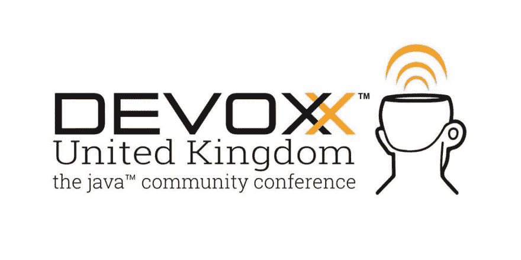

# 要注意的 OpenJDK 提供程序

> 原文：<https://dev.to/lemuelogbunude/openjdk-providers-to-take-note-of-ifl>

OracleJDK 最近的生产支持变化迫使组织重新考虑哪种 Java 发行版将支持他们的 Java 应用程序向前发展。OpenJDK 是一个很好的选择。

好消息是，OpenJDK 选项得到了很好的支持，并且在功能上可以与 Oracle JDK 互换。

以下是一些例子:

## [AdoptOpenJDK](https://adoptopenjdk.net/index.html)

AdoptOpenJDK 是一个 Java 用户组(JUG)成员、Java 开发人员和供应商的社区，他们都是 OpenJDK 的拥护者。

他们最近达到了 2500 万次下载，并拥有越来越多的支持者和用户。

> AdoptOpenJDK@ AdoptOpenJDK比赛时间！为了庆祝达到 2500 万次下载，我们将赠送一张门票给[@ DevoxxUK](https://twitter.com/DevoxxUK)(5 月 8 日-10 日)！为了有机会获胜，只需关注 [@adoptopenjdk](https://twitter.com/adoptopenjdk) 并转发这条推文。获胜者将于 5 月 1 日公布！[# competition time](https://twitter.com/hashtag/CompetitionTime)[#赠品](https://twitter.com/hashtag/giveaway)2019 年 4 月 26 日 23:31 点5332

## [RedHat OpenJDK](https://developers.redhat.com/products/openjdk/overview/)

RedHat 最近从 Oracle 那里接管了 OpenJDK 8 和 OpenJDK 11 项目的管理权，所以你可以猜到他们是认真的。

> 红帽公司@红帽[# open JDK](https://twitter.com/hashtag/OpenJDK)8 和 OpenJDK 11 的领导过渡到[#红帽](https://twitter.com/hashtag/RedHat)。了解更多关于红帽对 [#Java](https://twitter.com/hashtag/Java) 社区的承诺:
> [red.ht/2Zfttd8](https://t.co/pDQkfJWpV7)[@ open JDK](https://twitter.com/OpenJDK)[@ Java](https://twitter.com/java)2019 年 4 月 13:29 日下午70112

自 2007 年以来，Red Hat 一直是 OpenJDK 社区的成员，也是该项目的最大贡献者之一。

引用 Red Hat 中间件副总裁兼总经理迈克·皮赫的话:“Java 正处于复兴时期。它将继续发展，并成为新兴架构的关键组成部分。开发人员渴望将 Java 带入下一代开发，Red Hat 通过参与 OpenJDK 项目成为这一运动的领导者。我们正在努力引领 JDK 用户在其现有环境中获得支持和创新。Red Hat 仍然致力于 Java，并且很高兴有机会帮助管理 OpenJDK 社区。”

## [亚马逊科雷托](https://aws.amazon.com/corretto/)

Amazon Corretto 拥有来自 Amazon 的免费长期支持，因此您可以仅在需要时升级版本。亚马逊致力于 Corretto，在数以千计的生产服务中运行它。

亚马逊将至少在 2023 年 6 月之前免费分发 Corretto 8 的安全更新，至少在 2024 年 8 月之前免费分发 Corretto 11 的安全更新。Corretto 包括来自新版本的目标反向端口，以及来自 OpenJDK 社区的新开发的增强功能。

发布过程包括对数千种亚马逊服务的测试，这使得在发现问题的几天内发布修复成为可能。

> 詹姆斯·高斯林@ errcraft亚马逊 Corretto 8，我们在去年秋天的预览版中发布的 OpenJDK 8 的支持 build，现在已经普遍可用:准备生产！它是在亚马逊的服务下生产的，所以它非常坚固。即将推出:科雷托 11！[aws.amazon.com/blogs/opensour…](https://t.co/OeZQ41JwlI)03:44am-02 2019506801

## [祖鲁](https://www.azul.com/downloads/zulu/)

Zulu 是 OpenJDK 的一个广泛可用的二进制发行版。Zulu 发行版是经过全面测试和兼容性验证的 OpenJDK 12、11、8 和 7 平台的最新版本。Zulu 可免费用于 Linux、Windows 和 MacOS 平台，并可根据要求提供商业支持。

Zulu 由 Azul 系统公司制造、测试、支持和提供。

如果您需要商业支持，您可以查看 Zulu Enterprise，它比 Oracle 收费更便宜，并且还增加了经济高效的世界级基于订阅的 Java 支持计划的优势。

## [自由女神](https://bell-sw.com/pages/home)

Liberica 是一个 100%开源的 Java 8、9、10、11 和 12 实现。它是由 BellSoft 贡献的 OpenJDK 构建的，经过了彻底的测试，并通过了 OpenJDK 许可下提供的 JCK。

> BellSoft@ bell software我们很高兴地宣布，除了已经发布的 Linux X86_64 和 Linux ARM_64 之外，面向 MacOS 和 Windows 的 Liberica JDK 8u192 已经公开上市。都是用 [#OpenJFX](https://twitter.com/hashtag/OpenJFX) 捆绑的。 [#Docker](https://twitter.com/hashtag/Docker) 集装箱也有[bell-sw.com/java-8u192.html](https://t.co/C8bwUIfSc3)2018 年 11 月 06 日下午 15:4048

## [SapMachine](https://sap.github.io/SapMachine/)

SAP 是 OpenJDK 项目最大的外部贡献者之一，致力于确保 Java 平台的持续成功。

SapMachine 在 Windows、Linux 和 MacOS 上受支持。Docker 图像可用于大多数版本。版本已经通过了 Java 兼容性工具包，用于证明与 OpenJDK 的兼容性。

## 结论

如您所见，有不同的 OpenJDK 提供者可供您选择。这些提供商拥有工程师来为您提供生产就绪、经过实战检验的 JDK。

谢谢你😊！

