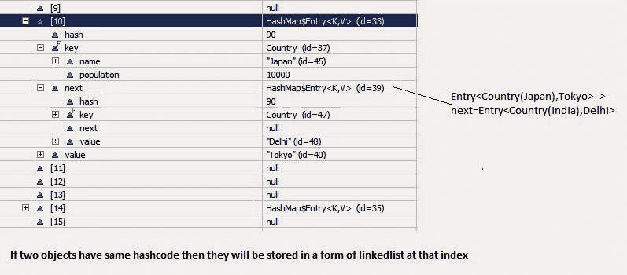

# HashMap 如何在 java 内部工作:一种调试方法

> 原文：<https://dev.to/arpitmandliya/how-hashmap-works-internally-in-java-a-debug-approach-58fn>

最常见的面试问题是“HashMap 如何在 [java](https://java2blog.com/core-java-tutorial-for-beginners-experienced/) 中工作”、 [HashMap](https://java2blog.com/hashmap-in-java-with-examples/) 的 get 和 put 方法如何在内部工作”。在这里，我试图用一个简单的例子来解释内部功能。HashMap 是 java 中使用最多的[集合之一。我们先从例子开始，而不是从理论开始，这样你会有更好的理解，然后我们会看到 get 和 put 函数在 java 中是如何工作的。](https://java2blog.com/collections-java/)

我们举一个很简单的例子。我有一个 Country 类，我们将使用 Country 类对象作为键，使用它的大写名称(字符串)作为值。下面的例子将帮助你理解，这些键值对将如何存储在 hashmap 中。

**1。Country.java**

```
package org.arpit.java2blog;
public class Country {

    String name;
    long population;

    public Country(String name, long population) {
        super();
        this.name = name;
        this.population = population;
    }
    public String getName() {
        return name;
    }
    public void setName(String name) {
        this.name = name;
    }
    public long getPopulation() {
        return population;
    }
    public void setPopulation(long population) {
        this.population = population;
    }

    // If length of name in country object is even then return 31(any random number) and if odd then return 95(any random number).
    // This is not a good practice to generate hashcode as below method but I am doing so to give better and easy understanding of hashmap.
    @Override
    public int hashCode() {
        if(this.name.length()%2==0)
            return 31;
        else 
            return 95;
    }
    @Override
    public boolean equals(Object obj) {

        Country other = (Country) obj;
        if (name.equalsIgnoreCase((other.name)))
            return true;
        return false;
    }

}
```

If you want to understand more about hashcode and equals method of object, you may refer **[hashcode() and equals() method in java](http://www.java2blog.com/2014/02/hashcode-and-equals-method-in-java.html)** **2\. HashMapStructure.java**(main class)

```
import java.util.HashMap;
import java.util.Iterator;

public class HashMapStructure {

    /**
     * @author Arpit Mandliya
     */
    public static void main(String[] args) {

        Country india=new Country("India",1000);
        Country japan=new Country("Japan",10000);

        Country france=new Country("France",2000);
        Country russia=new Country("Russia",20000);

        HashMap countryCapitalMap=new HashMap<country>();  
        countryCapitalMap.put(india,"Delhi");  
        countryCapitalMap.put(japan,"Tokyo");  
        countryCapitalMap.put(france,"Paris");  
        countryCapitalMap.put(russia,"Moscow");  

        Iterator countryCapitalIter=countryCapitalMap.keySet().iterator();//put debug point at this line  
        while(countryCapitalIter.hasNext())  
        {  
            Country countryObj=countryCapitalIter.next();  
            String capital=countryCapitalMap.get(countryObj);  
            System.out.println(countryObj.getName()+"----"+capital);  
        }  
    }  

}</country>
```

Now put debug point at line 24 and right click on project->debug as-> java application. Program will stop execution at line 24 then right click on countryCapitalMap then select watch.You will be able to see structure as below. [](http://3.bp.blogspot.com/-T4TsTlhwaXU/Uwjj9ypm69I/AAAAAAAACsY/J4-a6rxZLLE/s1600/HashMapStructure1.bmp) Now From above diagram, you can observe the following points

```
static class Entry implements Map.Entry
{
        final K key;
        V value;
        Entry next;
        final int hash;
        ...//More code goes here
}
```

1.  每当我们试图将任何键值对放入 hashmap 时，条目类对象被实例化为键值，并且该对象将被存储在上述条目中。现在你一定想知道，上面创建的 Enrty 对象将存储在哪里(表中的确切位置)。答案是，哈希码是通过调用 Hascode()方法为一个键计算的。此 hashcode 用于计算上述条目[]表的索引。
2.  现在，如果你在上图中看到数组索引 10，它有一个名为 HashMap$Entry 的 Entry 对象。
3.  我们在 hashmap 中放了 4 个键值，但它似乎只有 2 个！！！！这是因为如果两个对象有相同的 hashcode，它们将被存储在相同的索引中。现在的问题是如何做到的？它以 LinkedList 的形式存储对象(逻辑上)。

So how hashcode of above country key-value pairs are calculated.

```
Hashcode for Japan = 95 as its length is odd.
Hashcode for India =95 as its length is odd
HashCode for Russia=31 as its length is even.
HashCode for France=31 as its length is even.

```

下图将清楚地解释链表的概念。

[](http://1.bp.blogspot.com/-uBsIhju_rS0/Uwjnm9ngraI/AAAAAAAACsk/0NoA3f6iHqI/s1600/HashMapStructure2.bmp)

现在，如果你对 hashmap 结构有了很好的理解，让我们来看看 put 和 get 方法。

* * *

## 放

让我们看看 put 方法的实现:

```
       /**
         * Associates the specified value with the specified key in this map. If the
         * map previously contained a mapping for the key, the old value is
         * replaced.
         *
         * @param
 key
         *            key with which the specified value is to be associated
         * @param
 value
         *            value to be associated with the specified key
         * @return the previous value associated with key, or null
         *         if there was no mapping for key. (A null return
         *         can also indicate that the map previously associated
         *         null with key.)
         */
        public V put(K key, V value) {
            if (key == null)
                return putForNullKey(value);
            int hash = hash(key.hashCode());
            int i = indexFor(hash, table.length);
            for (Entry e = table[i]; e != null; e = e.next) {
                Object k;
                if (e.hash == hash && ((k = e.key) == key || key.equals(k))) {
                    V oldValue = e.value;
                    e.value = value;
                    e.recordAccess(this);
                    return oldValue;
                }
            }

            modCount++;
            addEntry(hash, key, value, i);
            return null;
        }
```

now lets understand above code step by step

1.  检查密钥对象是否为空。如果 key 为 null，那么它将被存储在表[0]中，因为 null 的 hashcode 总是 0。
2.  调用 Key 对象的 hashcode()方法并计算哈希代码。这个 hashcode 用于查找存储条目对象的数组的索引。有时可能会发生这样的情况，这个 hashcode 函数写得很差，所以 JDK 设计者放了另一个函数 hash()，它以上面计算的哈希值作为参数。如果想进一步了解 hash()函数，可以参考 hashmap 中的 [hash 和 indexFor 方法。](http://www.java2blog.com/2014/02/hash-and-indexfor-method-in-hashmap.html)
3.  indexFor(hash，table.length)用于计算存储条目对象的表数组中的精确索引。
4.  正如我们在例子中看到的，如果两个关键对象有相同的 hashcode(这被称为**冲突**)，那么它将以 linkedlist 的形式存储。所以在这里，我们将遍历 linkedlist。
    *   如果在我们刚刚计算的那个索引中没有元素，那么它将直接把我们的入口对象放在那个索引中。
    *   如果该索引中存在元素，那么它将进行迭代，直到得到 Entry->next 为 null。
    *   如果我们再次输入相同的键，逻辑上它应该替换旧的值。是的，它会这样做。迭代时，它将通过调用 equals()方法( **key.equals(k)** )来检查键的相等性，如果该方法返回 true，那么它将使用当前条目的值对象替换值对象。
    *   如果没有找到重复的键，那么当前条目对象将成为 linkedlist 中的第一个节点，当前条目->下一个将成为该索引中现有的第一个节点。

* * *

## 获取

Lets see implementation of get now:

```
/**
     * Returns the value to which the specified key is mapped, or {@code null}
     * if this map contains no mapping for the key.
     *
     *
     * More formally, if this map contains a mapping from a key {@code k} to a
     * value {@code v} such that {@code (key==null ? k==null :
     * key.equals(k))}, then this method returns {@code v}; otherwise it returns
     * {@code null}. (There can be at most one such mapping.)
     *
     *
     * A return value of {@code null} does not *necessarily* indicate that
     * the map contains no mapping for the key; it's also possible that the map
     * explicitly maps the key to {@code null}. The {@link
 #containsKey
     * containsKey} operation may be used to distinguish these two cases.
     *
     * @see #put(Object, Object)
     */
    public V get(Object key) {
        if (key == null)
            return getForNullKey();
        int hash = hash(key.hashCode());
        for (Entry e = table[indexFor(hash, table.length)]; e != null; e = e.next) {
            Object k;
            if (e.hash == hash && ((k = e.key) == key || key.equals(k)))
                return e.value;
        }
        return null;
    }

```

随着您对 hashmap 的 put 功能的理解。因此，理解 get 功能非常简单。如果您传递任何键来从 hashmap 获取值对象。

1.  检查密钥对象是否为空。如果键为空，则将返回驻留在表[0]中的对象的值。
2.  调用 Key 对象的 hashcode()方法并计算哈希代码。
3.  indexFor(hash，table.length)用于使用生成的 hashcode 计算表数组中的精确索引，以获取条目对象。
4.  在获取表数组中的索引后，它将遍历 linkedlist，并通过调用 equals()方法检查键是否相等，如果返回 true，则返回 Entry 对象的值，否则返回 null。

### 需要记住的要点:

*   HashMap 有一个名为 Entry 的内部类，用于存储键值对。
*   上面的条目对象存储在名为 table 的条目[ ](数组)中
*   表的索引在逻辑上称为桶，它存储链表的第一个元素
*   Key 对象的 [hashcode](https://java2blog.com/hashcode-and-equals-method-in-java/) ()用于查找那个 Entry 对象的 bucket。
*   如果两个关键对象有相同的 hashcode，它们将进入表数组的同一个桶中。
*   Key 对象的 equals()方法用于确保 key 对象的唯一性。
*   值对象的 equals()和 hashcode()方法根本没有使用

Please go through  [core java interview questions](http://www.java2blog.com/2016/07/core-java-interview-questions-and-answers.html)and [java interview questions](https://java2blog.com/java-interview-questions/) for more interview questions.

最初发布在 Java2blog 上，标题为【HashMap 如何在 Java 中工作

你可能也喜欢

*   [Java 中的 HashMap](http://www.java2blog.com/2016/04/hashmap-in-java-with-examples.html)
*   【HashMap 如何在 java 中工作
*   [HashMap 中方法的 hash 和 indexfor】](http://www.java2blog.com/2014/02/hash-and-indexfor-method-in-hashmap.html)
*   [Java 中的 hashcode 和 equals 方法](http://www.java2blog.com/2014/02/hashcode-and-equals-method-in-java.html)
*   [如何通过键和值对 HashMap 进行排序](http://www.java2blog.com/2016/05/how-to-sort-hashmap-in-java-by-keys-and.html)
*   【HashMap 和 Hash 的区别[集合](http://www.java2blog.com/2013/02/difference-between-hashmap-and-hashset.html)
*   【HashMap 和 Hashtable 的区别
*   [如何迭代 HashMap](http://www.java2blog.com/2015/06/how-to-iterate-over-map-or-hashmap-in.html)