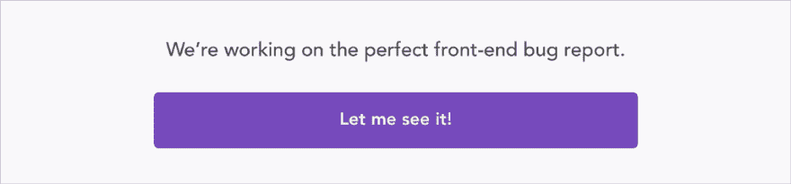

# Create React App 3 的新增功能

> 原文：<https://dev.to/bnevilleoneill/what-s-new-in-create-react-app-3-1dah>

[](https://res.cloudinary.com/practicaldev/image/fetch/s--kYGX8mR8--/c_limit%2Cf_auto%2Cfl_progressive%2Cq_auto%2Cw_880/https://cdn-images-1.medium.com/max/792/1%2AGDOTuSGlq3eg0odb_7guQw.jpeg)

2019 年 4 月底发布的 Create React App (CRA) 3 为 hooks 和 TypeScript 项目添加了林挺规则，以及其他改进和版本升级，以简化 React 应用的开发。

在本文中，我将介绍 CRA 3 的以下新功能:

*   笑话 24
*   钩子规则的支持
*   打字稿文件的林挺
*   生产和开发环境的浏览器列表配置
*   jsconfig.json/tsconfig.json 的 baseUrl

要获得所有特性的完整列表(以及一些突破性的变化)，请查看这个版本的[变更日志](https://github.com/facebook/create-react-app/releases/tag/v3.0.0)。

[](https://logrocket.com/signup/)

### [t1 是 24](#jest-24)

CRA 现在捆绑了最新的主要版本 [Jest](https://jestjs.io/) (具体来说，在撰写本文时是版本 24.7.1)。

与之前的版本相比，Jest 24 包括如下变化:

*   内置支持传输类型脚本文件
*   改进的错误报告
*   test.todo 函数，用于在测试摘要中单独打印 todo
*   将 setupTestFrameworkScriptFile 重命名为 setupFilesAfterEnv，将其转换为数组

要了解更多信息，你可以查看这篇[博客文章](https://jestjs.io/blog/2019/01/25/jest-24-refreshing-polished-typescript-friendly)或[的变更日志](https://github.com/facebook/jest/blob/master/CHANGELOG.md)。

如果你没有使用 Jest，它是一个运行在 Node.js 环境中的单元测试框架，而不是一个浏览器。

当执行 npm 测试时，CRA 将使用 Jest 运行具有以下命名约定的测试:

*   __tests__ 文件夹中带有. js 后缀的文件
*   带有. test.js 后缀的文件
*   带有. spec.js 后缀的文件

默认情况下，Jest 将只运行与自上次提交以来更改的文件相关的测试，它将以监视模式启动(每次保存文件时，它都会重新运行测试)。

为了避免在监视模式下运行测试，CRA 3 移除了- no-watch 标志，而支持 Jest 的标志- watchAll=false。但是，如果您或您的 CI 服务器设置了 CI 环境变量，则不需要此标志。

您可以在页面的[了解更多关于运行测试的信息。](https://facebook.github.io/create-react-app/docs/running-tests#on-ci-servers)

### 挂钩规则

钩子是在 React 16.8 中引入的[。它们是允许你使用 React 特性的函数，这些特性只适用于](https://reactjs.org/blog/2019/02/06/react-v16.8.0.html)[功能组件](https://www.robinwieruch.de/react-function-component/)中的类(如[状态处理](https://reactjs.org/docs/hooks-state.html))。

使用钩子有两个规则:

1.  在函数组件的顶层使用钩子，不要在循环、条件或嵌套函数中使用
2.  只从功能组件调用钩子，不要从常规 JavaScript 函数调用钩子

CRA 3 集成了一个 ESLint 插件，[ESLint-plugin-react-hooks](https://github.com/facebook/react/tree/master/packages/eslint-plugin-react-hooks)，它执行这两个规则和其他约定(例如，钩子必须以 use 开头，后跟一个大写字符)。

如果您违反了其中一条规则，构建将会失败。

例如，如果您按以下方式修改文件 src/app . js:

```
import React, { useState } from 'react';
// ...

function App() {
  if(1 !== 0) {
    const [count, setCount] = useState(0);
  }

  return (
    /* ... */
  );
}

// ... 
```

由于在条件块中使用了挂钩 useState，构建将失败，并显示以下消息:

```
Failed to compile. 
```

```
./src/App.js

Line 7:  React Hook "useState" is called conditionally. React Hooks must be called in the exact same order in every component render react-hooks/rules-of-hooks 
```

在[这个自述文件](https://github.com/facebook/create-react-app/tree/master/packages/eslint-config-react-app)(特别是 [index.js](https://github.com/facebook/create-react-app/blob/master/packages/eslint-config-react-app/index.js) 文件)中，你可以了解到更多关于 CRA 使用的 ESLint 配置。

在[这个页面](https://facebook.github.io/create-react-app/docs/setting-up-your-editor#displaying-lint-output-in-the-editor)上，您可以学习如何设置您的编辑器来显示 lint 输出。

### 打字稿林挺

CRA 3 还通过 [typescript-eslint](https://github.com/typescript-eslint/typescript-eslint) 为 TypeScript 项目添加了林挺规则。

请记住，您可以使用以下任一选项来创建 TypeScript 项目:

```
npx create-react-app my-typescript-app --typescript 
```

或者:

```
yarn create react-app my-typescript-app --typescript 
```

[在这里](https://github.com/facebook/create-react-app/blob/4b8b38bf7c55326f8d51ea9deeea76d7feee307d/packages/eslint-config-react-app/index.js#L55:L86)你可以看到 CRA 3.0 中 TypeScript 的 ESLint 配置，在[本页](https://facebook.github.io/create-react-app/docs/setting-up-your-editor#displaying-lint-output-in-the-editor)你可以找到在 Visual Studio 代码的 ESLint 扩展中启用 TypeScript 支持的说明。

### 浏览列表配置

[Browserslist](https://github.com/browserslist/browserslist) 允许您配置一组浏览器版本，以更改构建输出，从而生成兼容的代码并支持指定的浏览器版本。

您可以为生产和开发指定单独的列表。例如，如果将以下配置添加到 package.json 文件中:

```
"browserslist": {

  "production": [

    "cover 99.5%"

  ],

  "development": [

    "last 2 chrome versions"

  ]

} 
```

生产版本将针对覆盖全球 99.5%使用量的浏览器，而开发版本将只针对 Chrome 的最后两个版本。

Browserslist 使用[我可以使用](https://caniuse.com/)进行这些查询，但是你可以使用[https://browser rl . ist](https://browserl.ist/)来查看这些查询的结果(这里[这里](https://browserl.ist/?q=cover+99.5%25)和[这里](https://browserl.ist/?q=last+2+chrome+versions))并测试你自己的。

这样，您可以将 [@babel/polyfill](https://babeljs.io/docs/en/babel-polyfill) 安装为项目的依赖项，并将其导入到 src/index.js 或 src/index.tsx 文件的顶部，浏览器列表将在必要时包括 poly fill(poly fill 不会自动添加)。在[这个页面](https://facebook.github.io/create-react-app/docs/supported-browsers-features)，你可以找到更多关于支持的语言特性的信息。

此外，如果您希望 CRA 3 处理一个重置 CSS，它将默认使用 [PostCSS Normalize](https://github.com/csstools/postcss-normalize) ，这反过来将使用 Browserslist 配置来调整其输出。你只需要添加@ import-normalize；CSS 文件中的任何位置。详见[本页](https://facebook.github.io/create-react-app/docs/adding-css-reset)。

Browserslist 的默认配置针对生产中的各种浏览器，但是按照这个 [README](https://github.com/browserslist/browserslist#queries) 文件中的说明，您将能够定义自己的定制查询。

### 设置基本 URL

将 NODE_PATH 环境变量设置为冒号分隔的(Windows 上的分号)绝对路径列表，允许 Node.js 在这些路径中搜索模块，以避免类似于:
的情况

```
const myModule = require('../../../../../../myModule'); 
```

CRA 3 消除了在. env 文件中设置 NODE_PATH 的需要(仍然考虑这个变量，但是[不推荐使用，并且将在未来的版本](https://github.com/facebook/create-react-app/blob/4b8b38bf7c55326f8d51ea9deeea76d7feee307d/packages/react-scripts/config/modules.js#L28)中删除)。

所以现在您必须在项目根目录下的 jsconfig.json 或 tsconfig.json 文件(后者用于 TypeScript 项目)中使用 baseUrl:

```
{

  "compilerOptions": {

    "baseUrl": "src"

  },

} 
```

这样，而不是像:

```
import Menu from 'src/components/Menu'; 
```

你可以只拥有:

```
import Menu from 'components/Menu'; 
```

这不是一个很大的改进，但是在 CRA 3.0 中，baseUrl 唯一可接受的值是 src 和 node_modules(默认值)。

在[这个页面](https://facebook.github.io/create-react-app/docs/importing-a-component#absolute-imports)，你可以找到更多关于这个功能的信息。

### 结论

毫无疑问，CRA 在每一个新版本中都在不断进步。由于近 [50 名提交者](https://github.com/facebook/create-react-app/releases/tag/v3.0.0)的工作，这一次，它为内部和底层工具带来了一系列有用的添加、改进和更新。

如果你已经用 CRA 2 版创建了一个 React 应用程序，并且没有弹出它，那么升级到 CRA 3 版就像运行以下命令一样简单:

```
npm install --save --save-exact react-scripts@3.0.0

# Or

yarn add --exact react-scripts@3.0.0 
```

如果你已经弹出了你的应用程序，没有简单的升级过程，所以考虑是否值得将项目恢复到弹出之前的状态，升级，或者可选地，再次弹出。

编码快乐！

* * *

### Plug: [LogRocket](https://logrocket.com/signup/) ，一款适用于网络应用的 DVR

[](https://logrocket.com/signup/)

<figcaption>[https://logrocket.com/signup/](https://logrocket.com/signup/)</figcaption>

LogRocket 是一个前端日志工具，可以让你回放问题，就像它们发生在你自己的浏览器中一样。LogRocket 不需要猜测错误发生的原因，也不需要向用户询问截图和日志转储，而是让您重放会话以快速了解哪里出错了。它可以与任何应用程序完美配合，不管是什么框架，并且有插件可以记录来自 Redux、Vuex 和@ngrx/store 的额外上下文。

除了记录 Redux 操作和状态，LogRocket 还记录控制台日志、JavaScript 错误、堆栈跟踪、带有头+正文的网络请求/响应、浏览器元数据和自定义日志。它还使用 DOM 来记录页面上的 HTML 和 CSS，甚至为最复杂的单页面应用程序重新创建像素级完美视频。

[免费试用](https://logrocket.com/signup/)。

* * *

帖子[Create React App 3](https://blog.logrocket.com/whats-new-in-create-react-app-3-950049f54f92/)中的新内容最先出现在[日志博客](https://blog.logrocket.com)上。