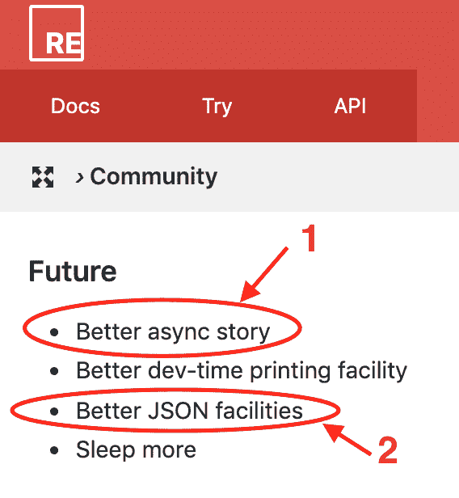
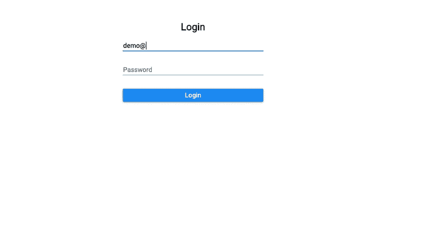
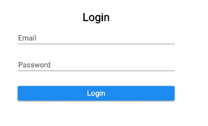

# 生产反应应用的原因？🤔(第二部分)

> 原文：<https://dev.to/seif_ghezala/reasonml-for-production-react-apps-part-2-362b>

我喜欢时不时地去看理性的路线图，对即将被烹饪的东西感到兴奋。每当我访问该页面时，我都会情不自禁地注意到这两点:

[](https://res.cloudinary.com/practicaldev/image/fetch/s--EeohSTev--/c_limit%2Cf_auto%2Cfl_progressive%2Cq_auto%2Cw_880/https://thepracticaldev.s3.amazonaws.com/i/4w5vix6ye46qjbtv9ku1.png) 

<figure>

<figcaption>推理路线图</figcaption>

</figure>

所以官方文档本身承认异步故事和 JSON 处理并没有那么好。

这就是为什么在本系列的第二部分中，我们将为单词计数器构建一个简单的登录页面。通过这样做，我很确定我们会碰到这两点，并且对合理构建 React 应用程序有一个更好的概述。

就像前一部分一样，我将在迭代中构建这个特性，并报告我喜欢/不喜欢什么。

[](https://res.cloudinary.com/practicaldev/image/fetch/s--W2DB8rfW--/c_limit%2Cf_auto%2Cfl_progressive%2Cq_66%2Cw_880/https://thepracticaldev.s3.amazonaws.com/i/kqhk965ppigtor0dlppk.gif) 

<figure>

<figcaption>最终结果</figcaption>

</figure>

你可以在这里找到最终代码[。](https://github.com/siffogh/words-counter)

# 迭代#1:将单词 counter 分离成它自己的组件

我们的应用程序将不再只是一个文字计数器页面。因此，我们必须将 App 组件的内容移到一个单独的组件中，并为登录页面创建另一个组件。

```
/* src/Home.re */

[%bs.raw {|require('./Home.css')|}];

let countWordsInString = text => {
  let spacesRegex = Js.Re.fromString("\s+");

  switch (text) {
  | "" => 0
  | noneEmptyText =>
    noneEmptyText
    |> Js.String.trim
    |> Js.String.splitByRe(spacesRegex)
    |> Js.Array.length
  };
};

module Times = {
  [@bs.module "./icons/times.svg"] [@react.component]
  external make: (~height: string) => React.element = "default";
};

module Copy = {
  [@bs.module "./icons/copy.svg"] [@react.component]
  external make: (~height: string) => React.element = "default";
};

module CopyClipboard = {
  [@bs.module "react-copy-to-clipboard"] [@react.component]
  external make: (~text: string, ~children: React.element) => React.element =
    "CopyToClipboard";
};

[@react.component]
let make = () => {
  let (text, setText) = React.useState(() => "");

  let handleTextChange = e => ReactEvent.Form.target(e)##value |> setText;

  let handleClearClick = _ => setText(_ => "");

  let wordsCountText =
    (text |> countWordsInString |> string_of_int) ++ " words";

  <div className="Home">
    <div className="header">
      <h3> {"Words Counter" |> ReasonReact.string} </h3>
      <span> {ReasonReact.string(wordsCountText)} </span>
    </div>
    <textarea
      placeholder="Express yourself..."
      value=text
      onChange=handleTextChange
    />
    <div className="footer">
      <Button
        title="Clear text"
        onClick=handleClearClick
        disabled={String.length(text) === 0}>
        <Times height="20px" />
      </Button>
      <CopyClipboard text>
        <Button
          title="Copy text"
          disabled={String.length(text) === 0}
          category=Button.PRIMARY>
          <Copy height="20px" />
        </Button>
      </CopyClipboard>
    </div>
  </div>;
}; 
```

App 组件也被重构，只呈现一个 Home 组件:

```
/* src/App.re */

[@react.component]
let make = () => {
  <div className="App"> <Home /> </div>;
}; 
```

> 到目前为止，我们只是做了一些小改动，没有什么让我喜欢/不喜欢的。

# 迭代 2:添加路由器

为了能够导航到我们的主页和登录页面，我们需要添加一个路由器。

让我们首先构建一个简单的登录页面，我们可以导航到:

```
/* src/Login.re */

[@react.component]
let make = () => {
  <div className="Login"> <h1>{ "Login Page" |> ReasonReact.string }</h1> </div>;
}; 
```

ReasonReact 自带一个内置路由器:ReasonReactRouter。路由器提供了一个钩子`useUrl()`，用来消耗当前的 url。为了实现导航，我们只需要根据我们从`useUrl()`钩子:
使用的 url 路径呈现一个不同的页面组件

```
/* src/App.re */

[@react.component]
let make = () => {
  let url = ReasonReactRouter.useUrl();

  let page =
    switch (url.path) {
    | [] => <Home />
    | ["login"] => <Login />
    | _ => <div> {"Page not found :/" |> ReasonReact.string} </div>
    };

  <div className="App"> page </div>;
}; 
```

## 我喜欢👍

*   内置路由器的 API 非常简单。
*   url 路径上的模式匹配将始终提醒您不要忘记回退页面，否则，它是不详尽的。
*   我可以想象，基于特定条件的路由可以非常容易和优雅地实现，因为路由是基于模式匹配的。

# 迭代 3:构建登录页面界面

我们已经设置了主页和登录页面的导航，所以让我们将实际内容放入登录页面。首先，让我们创建一个带有电子邮件和密码字段的登录模板，这些字段将它们的值存储在状态:

```
/* src/Login.re */

[%bs.raw {|require('./Login.css')|}];

[@react.component]
let make = () => {
  let (email, setEmail) = React.useState(() => "");
  let (password, setPassword) = React.useState(() => "");

  let handleEmailChange = e => ReactEvent.Form.target(e)##value |> setEmail;
  let handlePasswordChange = e =>
    ReactEvent.Form.target(e)##value |> setPassword;

  let handleFormSubmit = e => {
    ReactEvent.Form.preventDefault(e);
    /* TODO: add logic for submitting the form */
  };

  <div className="Login">
    <h2> {"Login" |> ReasonReact.string} </h2>
    <form onSubmit=handleFormSubmit>
      <div className="inputField">
        <input
          type_="email"
          placeholder="Email"
          value=email
          onChange=handleEmailChange
          required=true
        />
      </div>
      <div className="inputField">
        <input
          type_="password"
          placeholder="Password"
          value=password
          onChange=handlePasswordChange
          required=true
        />
      </div>
      <Button title="Login" category=Button.PRIMARY>
        {"Login" |> ReasonReact.string}
      </Button>
    </form>
  </div>;
}; 
```

以下是登录页面的外观:

[](https://res.cloudinary.com/practicaldev/image/fetch/s--EXCbgBHp--/c_limit%2Cf_auto%2Cfl_progressive%2Cq_auto%2Cw_880/https://thepracticaldev.s3.amazonaws.com/i/ebknfeeju7pwnr2fdxe5.png) 

<figure>

<figcaption>登录页面</figcaption>

</figure>

## 我喜欢👍

*   我可以说我使用 ReasonReact 变得相当快，尽管我不喜欢一些我在前面部分提到的东西(例如，必须使用 ReasonReact.string 和 ReactEvent。Form.target)。

# 迭代 4:添加错误处理

在进入表单提交实现之前，我希望我们的组件首先能够处理潜在的错误。

为此，让我们创建一个处理 3 种可能错误的[变量](https://reasonml.github.io/docs/en/variant#docsNav):

*   未找到电子邮件
*   无效密码
*   其他(例如，用户被阻止时的错误)

```
type loginError =
  | EMAIL_NOT_FOUND
  | INVALID_PASSWORD
  | OTHER; 
```

因为服务器错误消息是字符串，所以让我们创建一个助手函数，将字符串转换成变量:

```
let stringToLoginError = str =>
  switch (str) {
  | "EMAIL_NOT_FOUND" => Some(EMAIL_NOT_FOUND)
  | "INVALID_PASSWORD" => Some(INVALID_PASSWORD)
  | _ => None
  }; 
```

现在，我们想在状态中添加一个错误字段。因为，在任何时候，我们要么有错误，要么没有，该字段应该是 option(loginError)类型。

一旦有了这些，使用模式匹配有条件地呈现电子邮件或密码错误就变得非常容易:

```
/* src/Login.re */

[%bs.raw {|require('./Login.css')|}];

type loginError =
  | EMAIL_NOT_FOUND
  | INVALID_PASSWORD
  | OTHER;

let stringToLoginError = str =>
  switch (str) {
  | "EMAIL_NOT_FOUND" => Some(EMAIL_NOT_FOUND)
  | "INVALID_PASSWORD" => Some(INVALID_PASSWORD)
  | _ => Some(OTHER)
  };

[@react.component]
let make = () => {
  let (email, setEmail) = React.useState(() => "");
  let (password, setPassword) = React.useState(() => "");
  let (error, setError) = React.useState(() => None);

  let handleEmailChange = e => ReactEvent.Form.target(e)##value |> setEmail;
  let handlePasswordChange = e =>
    ReactEvent.Form.target(e)##value |> setPassword;

  let handleFormSubmit = e => {
    ReactEvent.Form.preventDefault(e);
    /* TODO: add logic for submitting the form */
  };

  <div className="Login">
    <h2> {"Login" |> ReasonReact.string} </h2>
    <form onSubmit=handleFormSubmit>
      <div className="inputField">
        <input
          type_="email"
          placeholder="Email"
          value=email
          onChange=handleEmailChange
          required=true
        />
        {switch (error) {
         | Some(EMAIL_NOT_FOUND) =>
           <div className="error">
             {{js| ⚠  Email not found |js} |> ReasonReact.string}
           </div>
         | _ => ReasonReact.null
         }}
      </div>
      <div className="inputField">
        <input
          type_="password"
          placeholder="Password"
          value=password
          onChange=handlePasswordChange
          required=true
        />
        {switch (error) {
         | Some(INVALID_PASSWORD) =>
           <div className="error">
             {{js| ⚠ Invalid password |js} |> ReasonReact.string}
           </div>
         | _ => ReasonReact.null
         }}
      </div>
      <Button title="Login" category=Button.PRIMARY>
        {"Login" |> ReasonReact.string}
      </Button>
    </form>
  </div>;
}; 
```

## 我喜欢👍

*   在处理不同的错误类型时，变量给人信心。依靠它们，您最终可以明确地处理不同类型的错误。

# 迭代 5:为获取创建一个包装器

当我们提交表单时，我们希望向后端发出一个登录 post 请求。如果用户凭证有错误，我们已经准备好处理它了😎。
如果登录成功，我们将记录一条成功消息。

如何从浏览器发出请求？你使用全局函数`fetch`。

我通常在 fetch 之上创建一个包装器来发出 POST/GET 请求，原因如下:

*   避免重复的样板文件。
*   当请求失败时，获取承诺不会失败。因此，我通常检查响应的状态，并根据它来解决承诺或使其失败(参见下面的代码)。

下面是我的 post 请求获取包装器在 JavaScript 中通常的样子:

```
export async function post(url, body) {
  let response = await fetch(url, {
    method: 'POST',
    credentials: 'include',
    body: typeof body === 'string' ? body : JSON.stringify(body),
    headers: {
      'Content-Type': 'application/json'
    },
    mode: 'cors'
  });

  if (response.status >= 200 && response.status < 300) {
    return response;
  }

  throw response;
} 
```

然后我可以在其他任何地方使用它:

```
try {
    const response = await post('some/url', { foo: "bar"});
    const jsonContent = await response.json();
} catch(e) {
    // do something with the error
} 
```

让我们试着理智地做同样的事情。没有内置的绑定来获取 in Reason，所以我们必须使用 [bs-fetch](https://github.com/reasonml-community/bs-fetch) 。

```
/* src/Request.re */

let post = (url, payload) => {
  let stringifiedPayload = payload |> Js.Json.object_ |> Js.Json.stringify;

  Fetch.fetchWithInit(
    url,
    Fetch.RequestInit.make(
      ~method_=Post,
      ~body=Fetch.BodyInit.make(stringifiedPayload),
      ~headers=Fetch.HeadersInit.make({"Content-Type": "application/json"}),
      (),
    ),
  );
}; 
```

bs-fetch 模块 fetch 的 fetchWithInit 函数用于通过配置调用 Fetch。我们将 url 和用`Fetch.RequestInit.make()`进行的配置传递给它。

到目前为止，这是一个承诺。

> 我提到过我使用 Firebase 作为身份验证的后端吗？嗯，我使用 Firebase 作为身份验证的后端。

Firebase 返回的认证错误是 JSON 对象，所以我们必须使用`response.json()`方法从响应中提取错误对象。

因此，我们希望从 fetch 响应中提取 JSON 内容。为此，我们可以使用 Fetch。Response.json 函数:

```
/* src/Request.re */

let post = (url, payload) => {
  let stringifiedPayload = payload |> Js.Json.object_ |> Js.Json.stringify;

  Fetch.fetchWithInit(
    url,
    Fetch.RequestInit.make(
      ~method_=Post,
      ~body=Fetch.BodyInit.make(stringifiedPayload),
      ~headers=Fetch.HeadersInit.make({"Content-Type": "application/json"}),
      (),
    ),
  ) |> Js.Promise.then_(Fetch.Response.json)
}; 
```

由于我们将经常使用`then_``catch``resolve`和`reject`，我们可以打开 Js。Promise 模块，这样我们就不用在它们前面加上 Js。打电话时的承诺:

```
/* src/Request.re */

let post = (url, payload) => {
  let stringifiedPayload = payload |> Js.Json.object_ |> Js.Json.stringify;

  Js.Promise.(
    Fetch.fetchWithInit(
      url,
      Fetch.RequestInit.make(
        ~method_=Post,
        ~body=Fetch.BodyInit.make(stringifiedPayload),
        ~headers=Fetch.HeadersInit.make({"Content-Type": "application/json"}),
        (),
      ),
    )
    |> then_(Fetch.Response.json)
  );
}; 
```

就像 JavaScript `json()`函数一样，`Fetch.Response.json()`返回一个承诺，该承诺通过一个类型为`Js.Json`的对象进行解析(如果您将鼠标悬停在它上面，可以在编辑器中看到这一点)。

如果我们想从类型为`Js.Json`的对象中提取任何数据，我们必须使用函数 Js 将它转换成一个`Js.Dict` (dictionary/map)对象。Json.decodeObject()。这将返回一个选项，因为 JSON 响应可以是空的或者根本不是一个对象。因此，我们必须使用模式匹配来处理这两种情况，并提取`Js.Dict`值:

```
/* src/Request.re */

let post = (url, payload) => {
  let stringifiedPayload = payload |> Js.Json.object_ |> Js.Json.stringify;

  Js.Promise.(
    Fetch.fetchWithInit(
      url,
      Fetch.RequestInit.make(
        ~method_=Post,
        ~body=Fetch.BodyInit.make(stringifiedPayload),
        ~headers=Fetch.HeadersInit.make({"Content-Type": "application/json"}),
        (),
      ),
    )
    |> then_(Fetch.Response.json)
    |> then_(response => {
      switch (Js.Json.decodeObject(response)) {
        | Some(decodedRes) => {
          resolve(decodedRes);
        }
        | None => resolve(Js.Dict.empty())
      }
    })
  );
}; 
```

现在我们有了响应对象，我们需要检查它是否有错误。如果内容有一个错误对象，我们拒绝承诺，并抛出一个包含错误消息的异常。因此，我们必须为此创建一个定制的异常类型。否则，我们用包含响应的`Js.Dict`对象来解析承诺:

```
/* src/Request.re */

exception PostError(string);

let post = (url, payload) => {
  let stringifiedPayload = payload |> Js.Json.object_ |> Js.Json.stringify;

  Js.Promise.(
    Fetch.fetchWithInit(
      url,
      Fetch.RequestInit.make(
        ~method_=Post,
        ~body=Fetch.BodyInit.make(stringifiedPayload),
        ~headers=Fetch.HeadersInit.make({"Content-Type": "application/json"}),
        (),
      ),
    )
    |> then_(Fetch.Response.json)
    |> then_(response =>
         switch (Js.Json.decodeObject(response)) {
         | Some(decodedRes) =>
           switch (Js.Dict.get(decodedRes, "error")) {
           | Some(error) =>
             reject(
               PostError(
                 "There is an error, but we don't know its message yet",
               ),
             )

           | None => resolve(decodedRes)
           }
         | None => resolve(Js.Dict.empty())
         }
       )
  );
} 
```

我们现在要做的就是从 Js 中提取错误消息。Json 错误，与我们从响应中提取错误对象的方式相同。唯一的区别是消息是一个`string`而不是一个对象:

```
/* src/Request.re */

exception PostError(string);

let post = (url, payload) => {
  let stringifiedPayload = payload |> Js.Json.object_ |> Js.Json.stringify;

  Js.Promise.(
    Fetch.fetchWithInit(
      url,
      Fetch.RequestInit.make(
        ~method_=Post,
        ~body=Fetch.BodyInit.make(stringifiedPayload),
        ~headers=Fetch.HeadersInit.make({"Content-Type": "application/json"}),
        (),
      ),
    )
    |> then_(Fetch.Response.json)
    |> then_(response =>
         switch (Js.Json.decodeObject(response)) {
         | Some(decodedRes) =>
           switch (Js.Dict.get(decodedRes, "error")) {
           | Some(error) =>
             switch (Js.Json.decodeObject(error)) {
             | Some(decodedErr) =>
               switch (Js.Dict.get(decodedErr, "message")) {
               | Some(errorMessage) =>
                 switch (Js.Json.decodeString(errorMessage)) {
                 | Some(decodedErrorMessage) =>
                   reject(PostError(decodedErrorMessage))
                 | None => reject(PostError("POST_ERROR"))
                 }
               | None => resolve(decodedRes)
               }
             | None => resolve(decodedRes)
             }

           | None => resolve(decodedRes)
           }
         | None => resolve(Js.Dict.empty())
         }
       )
  );
}; 
```

就这样吧，下次迭代看看我们的模块行不行。

但在此之前，我喜欢/不喜欢的是:

## 我喜欢👍

*   Js。承诺总是有回报的。这使得它们的返回值比 JavaScript 中的承诺更容易预测，JavaScript 中的承诺既可以返回承诺，也可以返回值。

*   Js。Post 总是返回一个用 Js.Dict 解析的承诺。使用它很难出错，因为它的返回类型是可预测的。

*   虽然从响应中提取错误信息是一个真正的斗争，但我不得不承认它是防弹的。我甚至在看浏览器之前就设法让它工作了。

## 我不喜欢👎

*   bs-fetch API 的语法很不自然。
*   虽然访问 JSON 值是安全的，但不可否认这是一种痛苦，很容易导致难以理解的嵌套地狱。

## 迭代#6:在登录页面中使用请求模块

我们已经构建了一个很好的模块来进行 POST 请求，让我们在登录页面中使用它。

在这样做之前，我们必须处理一个问题:我们不能从被拒绝的承诺中直接访问一个异常。让我们按照[官方 BuckleScript 示例](https://bucklescript.github.io/docs/en/interop-misc#safe-external-data-handling)构建一个小的助手函数，从被拒绝的承诺中提取我们的异常:

```
 let handlePromiseFailure =
    [@bs.open]
    (
      fun
      | Request.PostError(err) => {
          err;
        }
    ); 
```

我们现在可以在`handleFormSubmit`函数中进行 POST 调用:

```
/* src/Login.re */

  let handleFormSubmit = e => {
    ReactEvent.Form.preventDefault(e);
    let payload = Js.Dict.empty();
    Js.Dict.set(payload, "email", Js.Json.string(email));
    Js.Dict.set(payload, "password", Js.Json.string(password));

    Js.Promise.(
      Request.post(loginUrl, payload)
      |> then_(res =>
           {
             alert("Login successful!");
             setError(_ => None);
           }
           |> resolve
         )
      |> catch(e =>
           (
             switch (handlePromiseFailure(e)) {
             | Some(err) => setError(_ => stringToLoginError(err))
             | None => setError(_ => None)
             }
           )
           |> resolve
         )
      |> ignore
    );
  }; 
```

为了测试登录表单，我创建了以下用户:

```
{  "email":  "demo@demo.com",  "password":  "demodemo"  } 
```

这是最后的结果:

[](https://res.cloudinary.com/practicaldev/image/fetch/s--W2DB8rfW--/c_limit%2Cf_auto%2Cfl_progressive%2Cq_66%2Cw_880/https://thepracticaldev.s3.amazonaws.com/i/kqhk965ppigtor0dlppk.gif) 

<figure>

<figcaption>最终登录表单</figcaption>

</figure>

就是这样！登录页面完全按照我们想要的那样工作！🎉

## 我不喜欢👎

从被拒绝的承诺中提取例外的额外步骤。