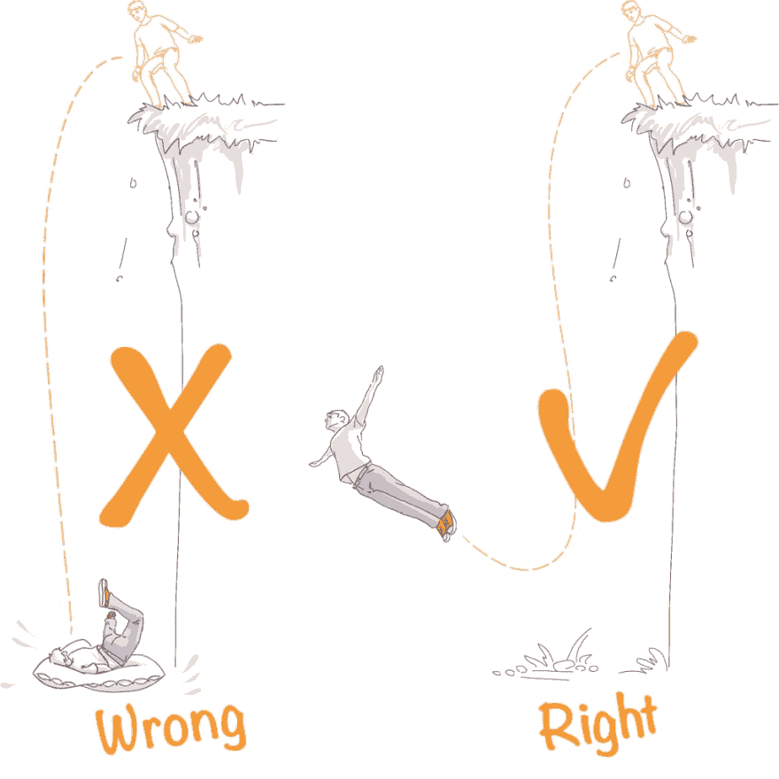

# 如何辞掉工作成为一名自由职业者:走向独立的 3 条法则

> 原文：<https://dev.to/mkdev/how-to-quit-your-job-and-become-a-freelancer-3-rules-on-the-way-to-your-independence-4kcp>

当我关掉闹钟时，我的第一个想法是“哦，上帝，我只是在浪费我的生命。”那是 2012 年 4 月 10 日早上 7 点半。“我不能再这样生活了，”我想。因此，我决定辞职，并在同一天通知了我的雇主。星期五是我最后一天做工资单上的雇员，我进入了空白期。

对于我们大多数人来说，这就是辞职的决定。即使这是一个有意识的选择，对许多人来说迈出第一步也是非常困难的。我，其实，已经兜圈子好几年了。

### 通往虚空的道路。

我总共花了十年时间才意识到自己真正想做的事情。我第一次开始思考这个问题是在我上学的时候。嗯，我并没有考虑长大后想成为什么样的人，没有。但即使在那个年龄，我也很确定工作中常规的世俗任务(就像我看到父母或亲戚做的那些)根本不适合我。我想做一些有创意的东西！不过，我不确定自己想做什么样的“创造性的东西”。这个愿望更多的是一种幼稚的信念，认为我是独一无二的，非常重要，而不是一个有意识的目标。

随着岁月的流逝，这种信念几乎被严酷的现实和无情的教育制度彻底摧毁。我甚至没有注意到这种变化。我自己赚的第一笔钱甚至粉饰了这种情况，我“创造”的愿望也消失了。

但随着职业生涯的发展，我不时会想到，我跳槽是有原因的，我总是缺少一些东西，某种自由。我总有那种感觉，觉得自己做错了什么，即使是当我还是一个部门主管或者在公司创造一些新项目的时候。总是有些不对劲。我通常工作 8 到 13 个小时，这取决于我的职位。在那段时间里，我甚至制定了一个规则，把与工作相关的问题留在工作中，这让我的同事们羡慕不已。但是想到我在这 8-13 个小时里过着别人的生活，我快疯了。我花时间让某个陌生人的生活变得独特而有意义，这令人难以置信地讨厌。事实上，那些陌生人是我的雇主，他们雇佣我们所有人来实现他们的愿望。

这些想法极具破坏性，我知道我必须改变一些事情。我的愿望是摆脱这一切。我过去常常做白日梦，梦想有一天我会振作起来，开创自己的事业。但这并没有发生。我需要一些转折点来最终下定决心。

实际上，有三个。三个转折点会让我最终辞掉工作，成为一名自由职业者。

第一次没多久。我被大学开除了，但不是因为进步太差(我的进步出奇的好)，而是因为旷课。我逃课了，因为学习对我来说并不令人兴奋，也不是我喜欢的。我是被逼进入大学的，首先是被父母逼的，但也是被体制本身逼的。

我一直想成为一名建筑师，我有这方面的天赋。但是我所拥有的并不足以让我自己获得一个国家资助的地方，我的家庭也负担不起我的学习费用。所以我进入了我的州考试成绩还可以的学院。但是我很快就意识到我不想把时间花在我不喜欢的事情上。从那以后就是这样了。

第二个转折点是我已经工作了几年。我在客户那里测试设备，我必须和汽车装配厂的员工一起工作。客户在入口处迎接了我，并在我们开始之前带我参观了车间。在那里，我看到了一张永远留在我记忆中的照片。

那是一个有一堆不同电线和电缆的车间。有一些工作台站成一排，几个员工在他们前面。他们从两边各拿了两个篮子。他们会从一个篮子里拿出一批电线，以正确的方式连接起来，然后把它们放进另一个篮子里。

就这样。从一个篮子里取出电线，连接起来，放入另一个篮子里。八个小时。一周五天。他们还有一个小时的午休和一个月的假期。

如果我曾经有过自己的地狱，这个工作室就是了。那是有史以来最糟糕的工作。每当我对目前的工作感到厌倦时，我就会想起那个工作室，有那么一会儿我会感觉好一些。但与此同时，我也意识到，作为一名工资单上的雇员，任何工作基本上都是在不同的条件下在同一个车间里进行的。电线是不同的，更棘手，我会说，但就是这样。随着时间的推移，我越来越意识到这一点。

第三个是我在尤金的大众创业公司 Integrator 最好的作品。这是一个让我意识到当你在做自己的事情时是什么感觉的地方。我发现自己又变得独特而有意义了，就像童年时一样。除此之外，我学会了做很多新的事情，并获得了设定和实现目标的能力。哦，那些日子。

在 Integrator 的工作让我意识到我再也不会回到一份合适的工作了。我从来没有。有一天，投资者停止了对创业公司的投资，我的家庭经历了预算短缺。我试图找到一份典型的办公室工作，我得到了它。一个体面的职位，莫斯科标准的体面薪水和可怕的无聊。

两个月后我就走了。我以前所有的经历，关于工作应该是什么以及如何享受工作的想法，总是与办公室工作相冲突。我恢复了这不是我的生活的感觉。一个决定性的星期四，我意识到醒来后唯一的感觉就是自怜。“永不超生，”我决定。

永不超生。

### 踏入虚空。

辞去高薪办公室工作的决定是自发的，我的银行账户上的钱略高于零，我渴望自己当老板。这似乎是一个愚蠢的行动，如此重大的变化需要认真的规划。但不是这样的。

这比看起来容易。不，不代表整条路都好走。这是难以置信的困难，不要相信任何人说，否则。然而，走上这条道路是相当容易的，不会害怕跌入深渊。你只需要遵循我建立的三条简单规则，走自己的路。

如果我从已经做过的人那里读到这样的文章，我会更容易开始。他们可能也有相似的规则。顺便说一下，人们利用他人的经验而不是在黑暗中摸索的想法后来成为 mkdev.me 的主要目标之一。

不管怎样，我走了很长一段路，经历了自己的磕磕碰碰，得出了一些结论。记住，不管别人说什么，不管他们给你什么样的警告，主要的规则是...

### 法则一:不假思索的下潜。

那些正考虑辞职开始做自己的项目的人最常见的错误是，他们试图为一切做计划和铺垫。当你踏入虚空，你显然不想落在坚实的地面上，你想减轻打击。你需要一个 B 计划，以防万一。万一出了什么问题，你总是有机会回来，这样你就不会在你起来的时候饿死。某种你可以生活一个月、两个月、三个月甚至六个月的经济缓冲。这听起来是正确合法的。但这是错误的。

你对别人做得越多，你的精神负担就越重。你养成了消费习惯，比如汽车贷款、抵押贷款和家庭需求，而且你以后无法摆脱它们。负担变得越来越大，你需要一个更大的财务缓冲。

但是不管这个垫子有多大，都是不够的。从来没有。如果你步入虚空，知道打击被减弱了，下面有一个缓冲垫，你就会准确地落在上面。如果下面只有坚实的地面，我保证你会学会飞翔。

这真的很难。很难打破旧习惯。这个过程本身是非常痛苦的，起初会造成许多不便。所以如果你不想清理你大脑的地面，你需要遵循下面两条规则。

### 规则 2:只做你喜欢做的事情...

...找个愿意付钱给你的人。

这是我现在的个人座右铭。这里的关键点是“你喜欢做的事情”，因为你成为个人专家的整个过程将是痛苦的。让我告诉你为什么。

自我实现的需求是人类的天性，这是我们拥有意识的结果(或者说是副产品)。我们以不同的方式满足这种需求。有些人用事业、金钱、性征服、政治、购买昂贵的东西、不断定制汽车、抚养孩子、创造新东西来做到这一点。我们甚至常常没有意识到，我们为某样东西而奋斗，当我们得到它时，我们感到满足，这只是我们自我实现的需要。

这就是为什么当你在做你喜欢的事情，你想做得更好的事情时，你会因为过程本身和结果而感觉良好。所以你最好好好利用一下。

如果你做哪怕是最微小最简单的工作，但你发自内心地热爱它，你会感到自我满足。这一事实将缓解最初阶段的困难，那时你只是在学习“扇动翅膀”

即使一开始你的工作不能养家糊口，你也不会感到不满意，因为你总是会发展自己的技能并感到自我满足。问题是你不会觉得自己在工作。你只是在做你喜欢做的事情。

对我来说，是画画。在这里你可能会说“这与我无关！我不会画画，我喜欢编程！”但事实是，大多数领域在工作结构、寻找客户等方面都是相似的。这意味着我的绘画经验可能对你的编程有所帮助。

当我辞职时，我决定仔细考虑我真正喜欢做什么。我真正想做的是什么？我心里有几个选择。第一件事是成为一名宇航员。我想领导科学探险，在轨道上进行生物实验，在火星上种苹果。关于这一点，我仍然在追逐彩虹，但它不会在这一点上工作。第二是制作电脑游戏。我不能。第三是设计房屋及其内部。但你应该记住，我不能选择我的高等教育，没有适当的教育，我所有的项目将只是可怕的混乱。第四件事是画画。哦，我能做到！我一生都在画画:在学校的笔记本上，在大学的讲座上，在办公室会议上，在咖啡馆的餐巾纸上，用手指在 iPad 上...当时的质量不是最好的，但我可以修复。

请记住，我没有从我能做的事情中做出选择。我可以做很多事情。到目前为止，我已经在销售、团队管理、网上商店运营和一些商业项目方面积累了大量经验。但是我是在选择我**喜欢**和**想要**做的事情。只有决定了这一点，我才开始思考我实际上能做什么。

但是你需要明白，那时我已经有了一些绘画技巧。辞去工作，然后花六个月的时间来提高技能是不理智的。这就是为什么你总是需要在你喜欢的领域发展技能。就像，现在！尽管在那之前我从来没有为我的画拿过钱，我总是保持我的技能，这样我就可以做最便宜的工作而不感到羞耻。

我就是这样开始画画赚钱的。因为我在做我喜欢的事情，所以我从未感到不满。即使是缺钱的时候，一天工作 18 个小时的时候，深渊真的很近的时候，我也一直很享受这个过程。我的客户给我的钱和反馈曾经给了我生活的意义。我睡着了，感觉那天我做了非常重要的事情。我醒来时期待着新的挑战和成就。自我实现，妈的！

这就是为什么做你喜欢的事情是至关重要的。因此，无论如何，你都将征服新的高峰，发展，掌握你的技能，最终成为一名专业人士。

### 规则三:永远设定子目标。

工薪就业的最大问题之一是它形成了某种生活模式和依赖性。我们变得不仅依赖日常事务，还依赖每月的收入。我们的日常工作和薪水的日期成为我们计划生活、购物和休闲时间的起点。我们喜欢按计划生活。我们努力使我们的需求适应我们的薪水。如果我们想要一些大的东西，一些我们还负担不起的东西，我们会做一个心理计算，把这个想法推迟到我们有更多的钱的时候。但这是错误的。

你需要设定子目标来打破这种恶性循环。如果你想快速达到目标，你需要寻找实现目标的方法，而不是计算完成目标本身需要的时间。

它是如何工作的？首先，你要遵守第一条和第二条规则。然后你设定一个目标。例如，如果你真的想玩的某个游戏在某一天发布了，你需要在它发布之前升级你的电脑。要做到这一点，你需要一定数量的钱。这会让你设定一个目标，在某一天赚到一定数量的钱。

如果你是自由职业者或经营自己的生意，对你来说更容易。你能挣多少钱直接取决于你做什么和你有多努力。因此，当你给自己设定一个子目标时，你就开始考虑怎么做才能得到更多的钱。找一份待遇更好的工作？工作 10 小时而不是 8 小时？做一些特别的交易？有很多选择，这取决于你到底在做什么(规则二)。

通过将目标分解成几个子目标，你可以更彻底地计划实现目标的过程。但是要点还是一样的。你计算在一定时间内你能挣多少钱来达到你的目标。你的钱在这里是一个变量。当你是一名雇员时，你的钱是一个常数，而你的梦想是变量。这不公平，是吗？

此外，有了明确的目标和实现目标的方法，你就一定会进步。比方说，如果你今天想要一台 1000 美元的电脑，第二天你可能想要一个 8000 美元的波拉波拉度假。所以你必须提高你的技能来达到设定的目标。

这就是为什么你需要设定具体的、清晰的、可实现的目标。通过达到这些目标，你会在工作中变得越来越好(规则二)。看起来好像你在电脑游戏中完成任务。每个游戏都有一组任务，你通过完成它们来获得经验。你变得越来越好，并获得令人敬畏的奖励。但是在你的办公室工作中，你只是一次又一次地完成同样的任务，获得同样多的经验和同样的回报。

* * *

当然，定期付款永远不会消失。你总是需要一些方法来支付你的生活费用，比如房租、账单、Spotify、网飞、PS+等等。我挣的钱不能少于日常开销的总额，因为我会再次跌倒在坚实的地面上(第一条规则。)所以当我设定目标的时候，我会把那些开销记在心里。

随着时间的推移，你越来越容易挣到支付生活费用所需的钱，因为你不断提高自己的技能。你很快就会展开翅膀，迎风飞翔。第一条规则将变得无关紧要，因为默认情况下，你将开始按照第三条规则生活。第二条规则将会获得越来越多你喜欢并乐于尝试的东西。这就是我如何找到一些时间来研究天体物理学和生物学，并更接近我的太空梦。现在我在 gamedev 也有一些朋友。尽管我仍然不会做游戏，但我知道如何管理那些会做的人。或者甚至管理建筑师，一起创造一些项目？为什么不呢？

在某个时候，你不再考虑你能做什么，不能做什么。你开始考虑不同的事情，比如“如何从我喜欢做的事情中赚钱。”如果我从未尝试过又怎样？我会的，我别无选择。

* * *

这显然不是我给你的最后一堆建议。你现在很困惑去哪里找第一个客户，如何证明你是专业人士？如何设定长期目标和子目标？所有这些都只是空谈，一个人到底应该做什么？具体在哪里？

会有的，我保证，但是以后。让我们把这篇文章看作是一个新系列文章的介绍吧！:)

* * *

这是 Leonid Suschev 写的一篇 mkdev 文章。