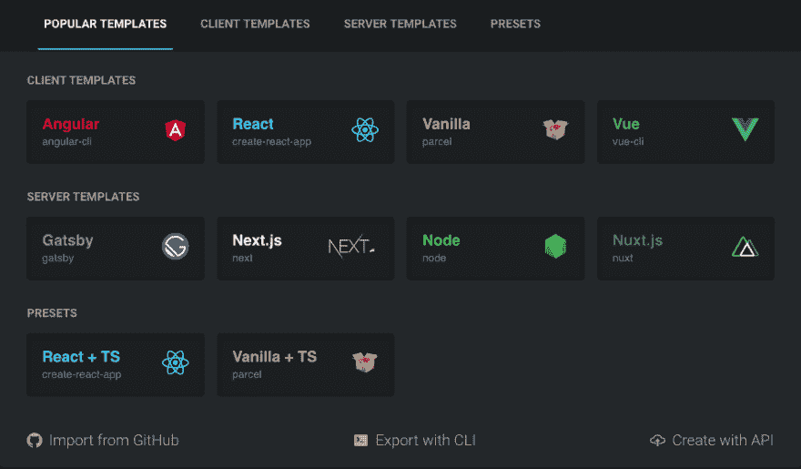
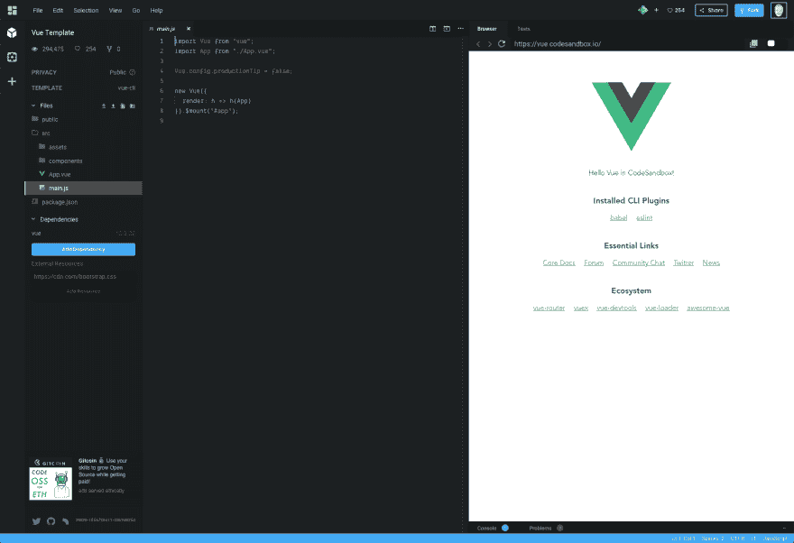
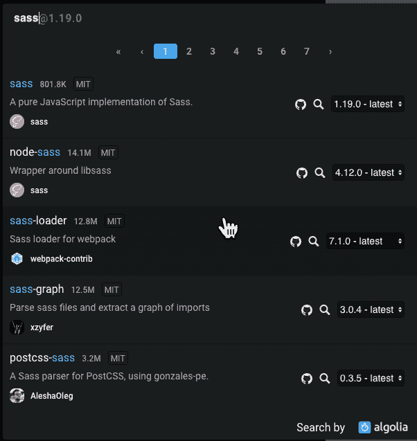
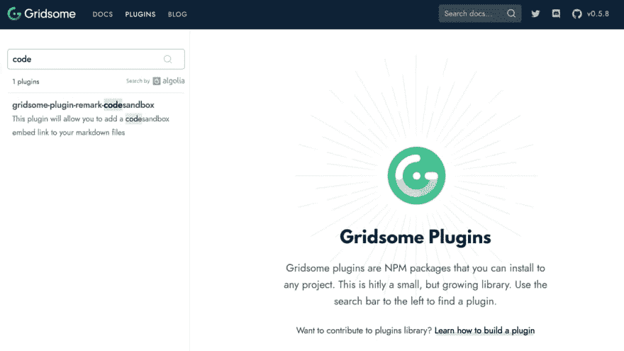

# 我如何为 Gridsome 创建一个 CodeSandbox 插件

> 原文：<https://dev.to/therealdanvega/how-i-created-a-codesandbox-plugin-for-gridsome-2dfd>

我一直是 CodeSandbox 的忠实粉丝。最近，我使用它的次数越来越多，我发现它是我离不开的工具之一。在本文中，我将向您介绍 CodeSandbox，并告诉您一些我喜欢它的原因。然后我将带你浏览我创建的插件，这样我可以在 Markdown 中嵌入一个 CodeSandbox，这样我就可以在我的 Gridsome powered 博客上显示它们。

## 什么是 CodeSandbox

CodeSandbox 是一个在线编辑器，可以帮助你创建从原型到部署的 web 应用程序。举个例子，假设你想[创建你的第一个](https://www.danvega.dev/blog/2019/04/30/up-and-running-with-vue) [VueJS](https://vuejs.org/) 应用。您可以确保在本地安装了 Visual Studio 代码和正确的扩展、node & npm、Vue CLI，然后从命令行创建您的第一个应用程序。如果您理解了所有这些，并且想要花时间来设置您的开发环境，那很好，但是如果您不理解呢？

如果你只是想检查一下，然后轻松地创建一个新项目呢？如果您想为 React、Vue、Gatsby、Gridsome、VuePress、Next、Nuxt 等多个 web 项目这样做，该怎么办？如果你想把它作为一种教学工具，一个单一的概念比整个故事更重要。这就是 CodeSandbox 的用武之地，它大放异彩。

### code sandbox 入门

为了理解它是什么以及你为什么想要使用它，我认为它是你需要亲自尝试的工具之一。要开始，您需要使用您的 Github 帐户注册。从那里您将被带到您的仪表板，在那里您可以创建和组织新的 CodeSandboxes。

如果你点击创建沙箱，你会看到一个类似这样的对话框。从这里你可以选择各种模板。如果您选择 Vue 作为模板，它将使用 Vue CLI 启动一个新的应用程序。

[](https://res.cloudinary.com/practicaldev/image/fetch/s--TMmrUdZ6--/c_limit%2Cf_auto%2Cfl_progressive%2Cq_auto%2Cw_880/https://thepracticaldev.s3.amazonaws.com/i/nz0s5917endkg34oqwh9.png)

[](https://res.cloudinary.com/practicaldev/image/fetch/s--CIlP9r3J--/c_limit%2Cf_auto%2Cfl_progressive%2Cq_auto%2Cw_880/https://thepracticaldev.s3.amazonaws.com/i/v45kmqjttptjw2vcv0hm.png)

如果你只是离开这里，回到你的仪表板，什么也不会为你保存。你可以从浏览器窗口的预览网址看出，它目前是 https://vue.codesandbox.io/的地址，而不是唯一的地址。

一旦你点击 File > Save，你应该会看到 URL 变成了一个唯一的，现在这就是你的 CodeSandbox，你可以开始玩了。我也喜欢给这个 CodeSandbox 起一个名字，所以在顶部的标题中，它现在显示为`My Sandbox / Vue Template`，点击 Vue Template，把名字改成你正在做的任何东西。在我的情况下，我会将其更改为 Hello VueSandbox。

如果你习惯于使用 Visual Studio 代码，那么这应该看起来很熟悉。是的，这是正确的，这是在浏览器中运行的 Visual Studio 代码(扩展和所有)。花些时间打开并编辑一些文件，观察您的更改触发预览的重新加载。你注意到这种在线编辑体验有多流畅了吗？

如果您需要为您的项目安装一个依赖项，只需在项目文件中单击 Add Dependency 按钮，然后搜索您想要安装的 npm 包。

[](https://res.cloudinary.com/practicaldev/image/fetch/s--eW7Px801--/c_limit%2Cf_auto%2Cfl_progressive%2Cq_auto%2Cw_880/https://thepracticaldev.s3.amazonaws.com/i/um76osodz5ywlhkht8bk.png)

创建一个新项目就是这么简单，现在您已经有了可以与任何人共享的东西。如果你看右上角，你会看到一个分享按钮，有多种方式分享你的 CodeSandbox。这是我在 YouTube 上跟随的一个教程，学习使用可拖动组件。

[https://codesandbox.io/embed/wq3o75v4qk](https://codesandbox.io/embed/wq3o75v4qk)

### 为什么是 CodeSandbox

当我第一次听说 CodeSandbox 的时候，我非常怀疑，因为我这辈子都不明白为什么会有人想要在线编码。我在我的本地机器上有这个很棒的开发环境，有 Node + NPM，Visual Studio 代码和所有我喜欢的东西。

更不用说以前已经尝试过这种方法，而且性能一直不尽如人意。嗯，我在这里告诉你，由于 CodeSandbox，我对这样一个产品的所有怀疑和担忧都被消除了。

如果你花点时间在编辑器里，你会发现它的表现非常棒。我甚至不愿去想是什么工程技术成就了这一切，但我真的很感激。那么现在它工作了，你想使用它的原因是什么呢？

你还记得压缩你的代码并上传到你的 FTP 站点并与你的朋友分享的日子吗？嗯，我老了，所以我这样做，但你生活在一个伟大的时代，Github 允许你与任何人分享你的代码，对不对？当然，但是他们仍然需要克隆你的回购协议，并在本地安装所有的工具来运行你的代码。更不用说您的代码可能还没有经过测试，虽然它在您的机器上运行良好，但在我的机器上可能不工作。

当你只是想看一个很酷的演示或者第一次尝试一个框架/库的时候，这是非常令人沮丧的。这些都是与朋友、读者、追随者甚至学生分享你的 CodeSandbox 的很好的用例。

## 创建 Gridsome 插件

现在你对 CodeSandbox 有了更多的了解，我想告诉你我是如何和为什么为 Gridsome 创建插件的。如果你一直关注我，你会知道今年我把我的博客移到了网格上。这让我可以用 Markdown 写我所有的博客文章，这是我喜欢的写内容的方式。

但是，当您需要添加某种自定义 HTML 时，这确实带来了挑战，就像本例一样。当你在一个 CodeSandbox 上时，你可以点击“共享”按钮，你会得到一个嵌入链接或一些使用 iframe 的 HTML，你可以用它在你的应用程序中嵌入 CodeSandbox。

备注是 Gridsome 使用的 [Markdown 处理器，如果你要创建一个 Markdown 插件，这是你需要理解的第一件事。我之前写了一个](https://www.npmjs.com/package/@gridsome/transformer-remark) [Gridsome 评论插件](https://github.com/danvega/gridsome-plugin-remark-twitter)，允许你插入 Twitter 卡片，所以我有一点点的想法，我需要在这里做什么。

## Gridsome 插件第一步

如果你从未写过 Gridsome 插件，我会在继续之前查看一下[他们的文档](https://gridsome.org/docs/how-to-create-a-plugin)。你需要做的第一步是创建一个名为`gridsome-plugin-remark-codesandbox`的文件夹，它遵循其他 Gridsome 注释插件的惯例。在那里，您将通过运行命令`npm init`创建一个新的`package.json`。

```
{
  "name": "gridsome-plugin-remark-codesandbox",
  "version": "0.1.0",
  "description": "This plugin will allow you to add a codesandbox embed link to your markdown files",
  "main": "index.js",
  "scripts": {
    "test": "echo \"Error: no test specified\" && exit 1"
  },
  "keywords": [
    "gridsome",
    "gridsome-plugin",
    "markdown",
    "vuejs",
    "codesandbox"
  ],
  "author": "Dan Vega <danvega@gmail.com>",
  "license": "MIT",
  "dependencies": {

  }
} 
```

这里需要注意的一点是，如果你想在 https://gridsome.org/plugins 的 Gridsome 插件搜索中找到关键词`gridsome-plugin`，你需要添加这个关键词。

[](https://res.cloudinary.com/practicaldev/image/fetch/s--KpGUn0y3--/c_limit%2Cf_auto%2Cfl_progressive%2Cq_auto%2Cw_880/https://thepracticaldev.s3.amazonaws.com/i/plq4f1exs6nhkojbkwo3.png)

此时，我将创建一个新的 Github(或者您最喜欢的 Git 主机)存储库来存储您的插件代码。创建 Github 存储库后，您可以按照说明进行初始提交并添加您的远程源。

```
git init
git add .
git commit -m "initial commit"
git remote add origin https://github.com/danvega/gridsome-plugin-remark-codesandbox.git
git push -u origin master 
```

### Gridsome 降价备注处理

在你深入研究代码之前，最好有一个你希望如何构建你的减价的计划。当我想嵌入一个 CodeSandbox 时，我只需在它自己的行(段落)上添加嵌入链接。这可能是最简单的处理方法，因为解析器可以遍历段落并找到链接。

```
# CodeSandbox Embed Demo

This is a really cool sortable demo

https://codesandbox.io/embed/wq3o75v4qk?fontsize=12 
```

有了所有的基础设施，是时候写一些代码了。您可以从在项目的根目录下创建`index.js`开始。这个项目只有一个依赖项，你现在需要通过运行命令`npm install unist-util-visit`来安装它，然后在`index.js`的顶部要求它。

```
const visit = require("unist-util-visit"); 
```

unist-util-visit 包为我们做了所有繁重的工作，对使用 remark 非常有帮助。在 visit 函数中，我们沿着树向下移动寻找段落。这意味着嵌入代码需要在自己的段落中有自己的行，这正是我想要的。接下来，您将调用一个名为`isCodeSandboxLink`的方法，并将当前节点传递给它。每次找到一个，就将它添加到节点数组中，以便以后处理它们。

```
const visit = require("unist-util-visit");

module.exports = options => {
  const debug = options.debug ? console.log : () => {};

  return tree => {
    const nodes = [];

    visit(tree, "paragraph", node => {
      debug(node);
      if (isCodeSandboxLink(node)) {
        debug(`\nfound codesandbox link`, node.children[0].url);
        nodes.push([node, node.children[0].url]);
      }
    });
  };
}; 
```

`isCodeSandboxLink`函数检查几件事情

*   嵌入链接应该独立成一行。
*   它应该是一个链接，所以只是把一个 id 没有用。
*   它匹配为匹配嵌入链接而定义的正则表达式。

```
const codeSandboxRegexp = /https:\/\/codesandbox\.io\/embed\/.\*/;

const isCodeSandboxLink = node => {
  return (
    node.children.length === 1 &&
    node.children[0].type === "link" &&
    codeSandboxRegexp.test(node.children[0].url)
  );
}; 
```

现在，您的 Markdown 文件中已经有了所有 CodeSandbox 链接的数组，您需要处理它们。您将在访问函数调用后立即这样做，看起来像这样:

```
for (let i = 0; i < nodes.length; i++) {
  const nt = nodes[i];
  const node = nt[0];
  const csLink = nt[1];
  debug(`\nembeding codesandbox: ${csLink}`);
  try {
    const csEmbed = getEmbeddedCodeSandbox(csLink);
    node.type = "html";
    node.value = csEmbed;
  } catch (err) {
    debug(`\nfailed to get iframe for ${csLink}\n`, er);
  }
} 
```

最后，您需要使用`iframe`返回嵌入它所需的 HTML。

```
const getEmbeddedCodeSandbox = link => {
  return `<iframe src="${link}" style="width:100%; height:500px; border:0; border-radius: 4px; overflow:hidden;" sandbox="allow-modals allow-forms allow-popups allow-scripts allow-same-origin"></iframe>`;
}; 
```

我真正喜欢这种方法的是，你可以用自己的选项定制每个嵌入。

```
// smaller font
https://codesandbox.io/embed/wq3o75v4qk?fontsize=11

// different view
https://codesandbox.io/embed/wq3o75v4qk?fontsize=14&view=editor 
```

如果你想知道有哪些选项，你可以查看一下 [CodeSandbox 文档](https://codesandbox.io/docs/embedding#embed-options)。如果你继续做下去，你最终会得到一个类似这样的解决方案。

```
const visit = require("unist-util-visit");

const codeSandboxRegexp = /https:\/\/codesandbox\.io\/embed\/.*/;

const isCodeSandboxLink = node => {
  return (
    node.children.length === 1 &&
    node.children[0].type === "link" &&
    codeSandboxRegexp.test(node.children[0].url)
  );
};

const getEmbeddedCodeSandbox = link => {
  return `<iframe src="${link}" style="width:100%; height:500px; border:0; border-radius: 4px; overflow:hidden;" sandbox="allow-modals allow-forms allow-popups allow-scripts allow-same-origin"></iframe>`;
};

module.exports = options => {
  const debug = options.debug ? console.log : () => {};

  return tree => {
    const nodes = [];

    visit(tree, "paragraph", node => {
      debug(node);
      if (isCodeSandboxLink(node)) {
        debug(`\nfound codesandbox link`, node.children[0].url);
        nodes.push([node, node.children[0].url]);
      }
    });

    for (let i = 0; i < nodes.length; i++) {
      const nt = nodes[i];
      const node = nt[0];
      const csLink = nt[1];
      debug(`\nembeding codesandbox: ${csLink}`);
      try {
        const csEmbed = getEmbeddedCodeSandbox(csLink);
        node.type = "html";
        node.value = csEmbed;
      } catch (err) {
        debug(`\nfailed to get iframe for ${csLink}\n`, er);
      }
    }
  };
}; 
```

### NPM 包测试和发布

我不想在这上面花太多时间，因为我实际上写了一整篇文章，标题是“[创建你的第一个 npm 包](https://www.danvega.dev/blog/2019/02/10/creating-your-first-npm-package)”，贯穿了所有这些，但我确实想提一下。

当你开发插件时，你需要一种不用从 NPM 安装就能测试它的方法，因为它还不存在。在插件项目中，你可以运行命令`npm link`,它将获取你的包并在 npm 全局文件夹中创建一个符号链接。

```
/Users/vega/.nvm/versions/node/v10.12.0/lib/node_modules/gridsome-plugin-remark-codesandbox ->
/Users/vega/dev/npm/gridsome-plugin-remark-codesandbox 
```

然后从您希望使用它的项目(对我来说是我的 Gridsome 博客)中运行以下命令:

```
npm link gridsome-plugin-remark-codesandbox 
```

这将把它添加到您的`node_modules`文件夹中，您就可以开始了。当插件准备就绪时，你可以使用`npm publish`发布它。一旦[包在 NPM](https://www.npmjs.com/package/gridsome-plugin-remark-codesandbox) 上，你就可以像安装其他包一样安装它:

```
npm install gridsome-plugin-remark-codesandbox 
```

### 使用 Gridsome 中的插件

然而，你已经在你的项目中安装了插件，要让它工作还需要一个步骤。当你定义你的注释插件时，你需要把它添加到插件数组:

```
plugins: [{
  use: '@gridsome/source-filesystem',
  options: {
    path: 'blog/**/*.md',
    typeName: 'Post',
    route: '/blog/:year/:month/:day/:slug',
    refs: {
      tags: {
        typeName: 'Tag',
        route: '/tag/:slug',
        create: true
      }
    },
    resolveAbsolutePaths: true,
    remark: {
      autolinkClassName: 'fas fa-hashtag',
      externalLinksTarget: '_blank',
      externalLinksRel: ['nofollow', 'noopener', 'noreferrer'],
      plugins: [
        ['gridsome-plugin-remark-shiki', {
          theme: 'nord'
        }],
        ['gridsome-plugin-remark-twitter', {}],
        ['gridsome-plugin-remark-codesandbox', {}]
      ]
    }
  }
}, 
```

## 结论

如果你关注这个博客，你可能已经知道了，但是我喜欢 Gridsome，把 CodeSandbox 分享加入我的 Markdown 真的让我很开心。有没有你想看到添加到 Gridsome 的插件？你用 CodeSandbox 做什么？一如既往的朋友...

快乐编码
丹

*这篇文章最初是在 https://www.danvega.dev/blog 的[发表在我的博客上的。如果你觉得这篇文章有趣，请考虑](https://www.danvega.dev/blog)[订阅我的时事通讯](https://www.danvega.dev/signup/)或者在 [Twitter](http://twitter.com/therealdanvega) 上关注我。*