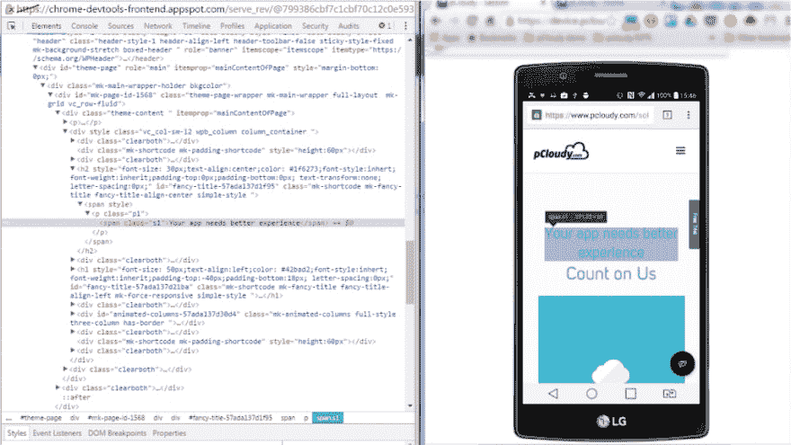
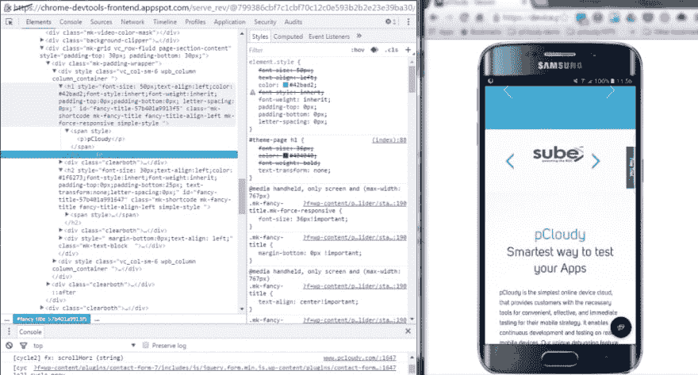
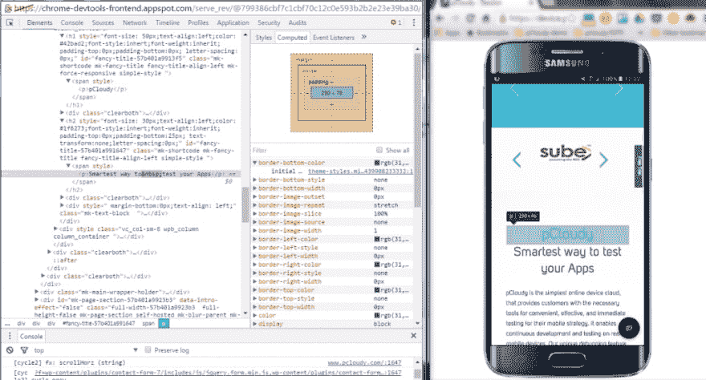
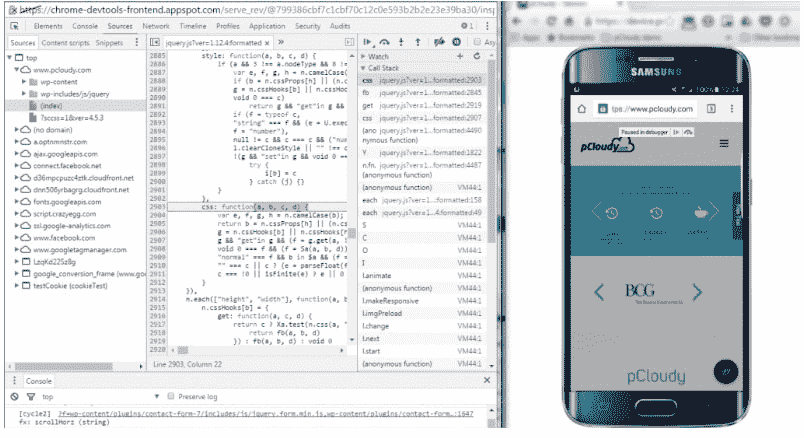
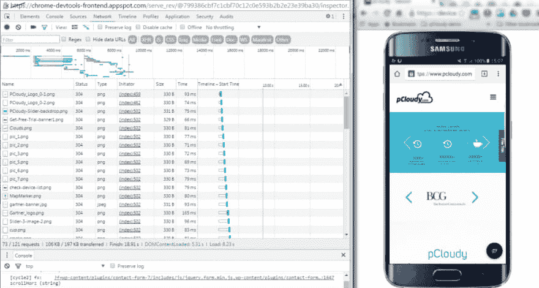
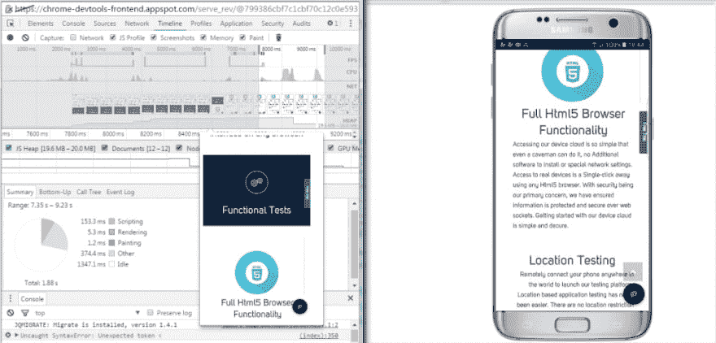

# 真实设备上的移动响应测试和调试

> 原文：<https://dev.to/pcloudy/mobile-responsive-testing-and-debugging-on-real-devices-l7h>

**简介–移动响应测试**

跨一系列移动设备和平台的移动响应测试对于卓越的用户体验极其重要。然而，移动响应测试和调试可能会变得棘手，尤其是当存在诸如混乱的 HTML/CSS/javascript 代码、不正确实现的 HTTPS、浏览器不一致、页面加载性能等问题时。那么，如何克服这些问题呢？使用 web 开发工具或调试扩展可以使 Web 应用程序的调试更加容易。这里我们将谈论最流行的一个——谷歌 Chrome 开发者工具。

谷歌 Chrome 开发者工具是内置于谷歌 Chrome 浏览器的整合环境。它用于 web 创作、调试、监控、优化和理解 web 应用程序或网站。(来源于谷歌 Chrome DevTools)

响应式测试模拟器提供了一个虚拟环境，您可以在其中测试功能，就像在真实设备中一样。还可以在线测试移动设备上的网站，测试不同屏幕尺寸的网站。在模拟器上跨设备执行响应式设计测试很容易。

以下是 Chrome DevTools 的一些关键特性

实时检查和编辑您网站的 DOM 和 CSS
从任何页面运行代码片段
调试混淆代码
设置高级断点并使用图形调试器调试 JavaScript】解决安全问题
分析运行时和页面性能以提高应用速度
在应用加载时跟踪回流并重新绘制

Chrome DevTools 提供了几乎所有检查、调试和监控网络应用/移动网络性能所需的工具。它还提供了模拟移动设备的附加功能，以测试和构建移动优先、响应迅速的网站。您甚至可以从开发机器上调试真实 Android 设备上的 web 内容。但是，在一台或两台设备上执行移动响应测试就足够了吗？

使用 Chrome DevTools 与 pCloudy 的移动设备实验室集成进行远程调试
在真实设备上测试 Web 应用时，设备碎片是一个非常现实的问题，尤其是对于 UI 和功能测试。具有独特规格和专有构造变化的设备的数量已经增加。在高级层面上，要执行移动响应测试并检查 Web 应用在真实设备上的性能，您需要在各种平台上试验您的站点，跨越许多设备外形。pCloudy 的移动设备实验室提供了与 Chrome DevTools 的完全集成，可以在真实设备上测试你的应用。这种集成允许你在无数不同大小和配置的安卓设备(T4)上测试网络应用。

**以下是大多数应用程序开发人员如何测试他们的网络应用程序**

**检查并实时编辑您网站的设计和内容**

通过检查页面中的所有 HTML 和 CSS，在实时模式下测试和编辑您的站点。在“元素”面板中，只需双击选定的元素并进行更改，就可以实时编辑 DOM 节点。

您甚至可以在“样式”面板中实时编辑样式属性的名称和值。检查和编辑盒模型参数。

还可以通过使用“计算”窗格更改当前元素的填充、边框和边距属性的上、下、左、右值来编辑当前元素的框模型参数。

**在真实设备上远程调试，修复代码中的错误**

调试混乱的代码:使你的代码可读，易于调试，即使你已经合并，缩小或编译它。您可以通过单击{ }，轻松更改最小化代码的格式。

**测试并优化 Web 应用的性能**

“网络”面板允许您查看页面如何呈现，以及从头到尾呈现所用的时间。为此，点击“网络”面板，点击相机图标，并刷新设备上的页面。

时间轴面板帮助您记录和分析应用程序运行时的所有活动。这是开始调查应用程序中可察觉的性能问题的最佳地方。

若要录制页面加载，请打开“时间轴”面板，打开要录制的页面，然后重新加载页面。时间轴面板会自动记录页面重新加载。您还可以在页面上记录页面交互，并通过记录的时间线查看性能详细信息。

**您可以使用录制时间线**查看更多细节

记录时间线以分析页面加载或用户交互后发生的每个事件
在概览窗格中查看 FPS、CPU 和网络请求
单击火焰图中的事件以查看其详细信息
放大记录的一部分以使分析更容易

在执行响应测试时，需要记住一些事情:

**设备选择**
最好询问你的业务分析师或经理我们需要哪些设备来执行测试。创建设备矩阵是一项繁琐的工作，因为频繁的浏览器和操作系统更新会导致设备碎片化。即使你花了很多时间制定设备组合的策略，也可能不会得到产品经理或 scrum master 的批准。

自动化测试和手动测试最好同时使用自动化和手动方法来执行测试。基于测试的类型，你可以分担 70%的自动化测试和 30%的手工测试。很明显，有时自动化测试会遗漏一些人眼可以看到的东西。工具点击链接或放大和缩小与手动操作不同。

仿真器、模拟器和真实设备
如果你想在多种设备上测试你的应用，你也可以选择仿真器和模拟器。你不可能建立一个设备实验室，因为它会花费很多。因此，您可以使用市场上流行的真实设备和不太流行的设备的仿真器。

**区分优先顺序**
由于测试是一个耗时的过程，包括移动响应测试在内的移动应用测试需要完全区分优先顺序。[响应测试](https://www.pcloudy.com/mobile-responsive-testing/)应提前与 BA 和产品经理讨论优先级，并听取他们的建议。问题是有太多的设备，在进行优先排序时，最受欢迎的设备将首先用于测试。

**结论**

“为正确的工作使用正确的工具”是一句古老的格言，适用于包括软件开发在内的所有领域。正如我们所看到的，Chrome DevTools 有几个特性可以帮助你更好地开发，更快地调试，并有效地测量你的网站或应用程序的性能。移动响应测试的理想选择。

本博客中讨论的特性是开发者、设计者和测试者在编写、调试、监控和优化网站和 Web 应用时最常用的一些特性。将这些功能与 pCloudy 等移动设备实验室整合使用，可以改变创建、测试和启动网站和 Web 应用程序的整个流程。

[免费获得 180 分钟的设备测试时间](https://www.pcloudy.com)