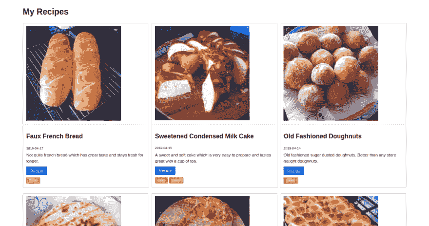
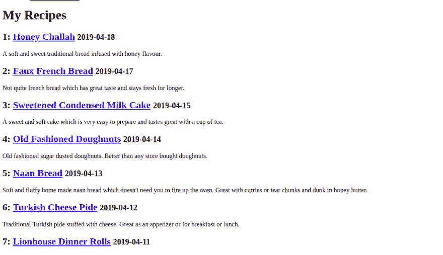
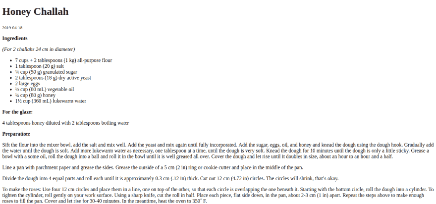
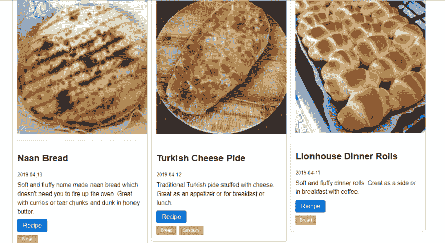

# 用 Python 制作静态站点生成器——第 2 部分

> 原文：<https://dev.to/nqcm/making-a-static-site-generator-with-python-part-2-4al>

> 最初发表于我的博客:[blog.naveeraashraf.com](https://blog.naveeraashraf.com)

在本教程的第一部分中，我们探索了静态站点生成器或 SSG 背后的两个主要组件 Markdown 解析器 Markdown2 和模板引擎 Jinja2。我们看到了如何使用这些组件从 Markdown 文件和预先创建的模板创建 HTML 文件。

在这一部分，我们将创建自己的静态站点生成器。这是最终产品

[](https://res.cloudinary.com/practicaldev/image/fetch/s--siAOcq55--/c_limit%2Cf_auto%2Cfl_progressive%2Cq_auto%2Cw_880/https://thepracticaldev.s3.amazonaws.com/i/h6r4tgv5vcybntgrdkl1.png)

所以让我们开始吧。

## 结构

在本教程中，我将创建一个食谱博客。由于本教程是出于教育目的，我将只创建两个主要视图:食谱博客的主页，上面列出了所有的帖子，以及个人帖子页面。你可以在 [github 库](https://github.com/nqcm/static-site-generator)中找到完整的代码

## 脚手架

创建一个新的文件夹来存放你的代码:

```
mkdir recipe-ssg 
```

在这个文件夹中，创建内容文件夹，我们将在这个文件夹中以 markdown 文件的形式写我们的博客文章:

```
cd recipe-ssg & mkdir content 
```

我们还需要在 markdown 写的职位。如果你想跟着做，你可以从[这里](https://github.com/nqcm/static-site-generator/tree/master/content)复制 markdown 里写的食谱。顺便说一下，这些不仅仅是占位符食谱。这些是我的[屡试不爽的](https://www.instagram.com/niqabi.coder.mum/)食谱。如果你是面包师，一定要试试这些食谱！

我们还需要一些图像。请随意使用我在的[图片。在根项目中创建一个名为`output`的文件夹。在`output`文件夹中创建另一个名为`img`的文件夹，并将所有图像文件添加到这个文件夹中。](https://github.com/nqcm/static-site-generator/tree/master/output/img)

你还需要使用 pip 或 pipenv 安装 [Markdown2](https://github.com/trentm/python-markdown2) 和 [Jinja2](http://jinja.pocoo.org/docs/2.10) ，最好是在[虚拟环境](https://docs.python-guide.org/dev/virtualenvs/)中。

```
pipenv install markdown2
pipenv install jinja2 
```

## 编写 Python 脚本

在项目根目录下创建一个新文件，并将其命名为`main.py`。首先我们将导入所有我们需要的包:

```
import os
from datetime import datetime
from jinja2 import Environment, PackageLoader
from markdown2 import markdown 
```

接下来，我们将解析我们的降价文件。这是我们在[第一部分](https://blog.naveeraashraf.com/posts/make-static-site-generator-with-python/) :
中的做法

```
from markdown2 import markdown

with open('content/turkish-pide.md', 'r') as file:
    parsed_md = markdown(file.read(), extras=['metadata']) 
```

但是因为我们现在有不止一个文件，我们将修改代码来循环内容文件夹中的所有文件，如下所示:

```
POSTS = {}
for markdown_post in os.listdir('content'):
    file_path = os.path.join('content', markdown_post)

    with open(file_path, 'r') as file:
        POSTS[markdown_post] = markdown(file.read(), extras=['metadata']) 
```

接下来，我们将对这些帖子进行逆序排序，这样最新的帖子会显示在最前面，但是日期是字符串格式的。所以我们首先需要将它们转换成`datetime` :

```
POSTS = {
    post: POSTS[post] for post in sorted(POSTS, key=lambda post: datetime.strptime(POSTS[post].metadata['date'], '%Y-%m-%d'), reverse=True)
} 
```

目前为止一切顺利。您可以通过将一些元数据打印到控制台来检查脚本到目前为止是否工作正常。

## 创建模板

接下来我们将编写我们的模板。在项目根目录下创建一个`templates`目录。我们将编写两个模板，一个用于主页，另一个用于个人帖子。先把个人帖子写一个:

```
<!DOCTYPE html>

<html lang="en">
<head>
    <meta charset="UTF-8">
    <meta name="viewport" content="width=device-width, initial-scale=1.0">
    <meta http-equiv="X-UA-Compatible" content="ie=edge">
    {{ post.title }}
</head>
<body>

    <h1>{{ post.title }}</h1>
    <small>{{ post.date }}</small>
    <p>
        {{ post.content }}
    </p>
</body>
</html> 
```

将上述代码保存到 templates 目录下的`post.html`中。在模板目录下创建另一个文件`home.html`并粘贴下面的代码:

```
<!DOCTYPE html>

<html lang="en">
<head>
    <meta charset="UTF-8">
    <meta name="viewport" content="width=device-width, initial-scale=1.0">
    <meta http-equiv="X-UA-Compatible" content="ie=edge">
    My Recipes
</head>
<body>

    <h1>My Recipes</h1>
    
    <p>
        <h2>{{loop.index}}: <a href="posts/{{ post.slug }}/">{{post.title}}</a> <small>{{post.date}}</small></h2>
        {{post.summary}}
    </p>
    
</body>
</html> 
```

这个模板比个人帖子的模板要简单一些。但是我们只是使用 Jinja2 的 for 循环遍历所有的帖子，并用这些帖子的数据填充占位符。数据将以列表的形式传递给这个模板，这样我们就可以很容易地对它进行循环。当我们再次使用`main.py`并编写脚本将数据传递给这些模板时，这将更有意义。

## 使用模板继承

但是在我们这样做之前，你可能已经注意到有相当多的重复。我们必须为两个模板编写相同的搭建 HTML 代码。虽然在这种情况下这没什么大不了的，因为我们只有两个模板，但是想象一下，对于更大的项目，必须重写相同的代码。

对于有导航菜单和页脚的网站，需要一遍又一遍地编写大量代码。如果你不得不做一些改变，比如说在你的导航菜单中，你将需要在每个模板上做一些改变。

这可能会变得非常单调，更不用说增加错误和 bug 的几率了。

幸运的是，所有的模板语言都通过模板继承提供了这个问题的解决方案。你可以从[这里](https://realpython.com/primer-on-jinja-templating/)阅读更多关于 Jinja2 的模板继承。

> 模板通常利用继承，继承包括定义所有后续子模板的基本结构的单个基础模板。您使用标签``和``来实现继承。~ [真正的蟒蛇](https://realpython.com/primer-on-jinja-templating/)

在`templates`目录下创建一个新文件，命名为`layout.html`。在这个文件中，我们将把所有需要在每个模板上重复的代码:

```
<!DOCTYPE html>

<html lang="en">
<head>
    <meta charset="UTF-8">
    <meta name="viewport" content="width=device-width, initial-scale=1.0">
    <meta http-equiv="X-UA-Compatible" content="ie=edge">
    My Recipes
</head>
<body class="container">

     

    <br>

</body>
</html> 
```

现在让我们对其他两个模板进行适当的修改。在`home.html`模板中粘贴以下代码:

```




<h1>My Recipes</h1>

<div>



    <p>
        <h2>{{loop.index}}: <a href="posts/{{ post.slug }}.html">{{post.title}}</a> <small>{{post.date}}</small></h2>
        {{post.summary}}
    </p>



</div>

 
```

并在 post.html 将代码改为:

```




<h1>{{post.title}}</h1>
<p>
    <small>{{post.date}}</small>
    {{post.content}}
</p>

 
```

现在我们有了更干净的代码。现在让我们来渲染这些模板。

## 渲染首页

在你的`main.py`文件中，用 Jinja2 获取模板，就像我们在[第一部分](https://blog.naveeraashraf.com/posts/make-static-site-generator-with-python/)中做的那样。但是这次我们会得到两个模板:

```
env = Environment(loader=PackageLoader('main', 'templates'))
home_template = env.get_template('home.html')
post_template = env.get_template('post.html') 
```

现在让我们将数据从我们的`POSTS`列表传递到我们的主页模板。因为主页只需要元数据，所以我们只传递元数据:

```
posts_metadata = [POSTS[post].metadata for post in POSTS]
home_html = home_template.render(posts=posts_metadata) 
```

这将通过变量`posts`向我们的主页模板传递一个元数据列表。这与我们在模板中循环使用的`posts`变量相同。

我想做的另一件事是将每篇文章的标签放在某种列表中，这样我就可以循环访问它们，因为我可能想将每个标签变成一个可点击的链接。目前，所有的标签都作为一个字符串被传递。

为了改变这一点，我将从`post_metadata['tags']`变量创建一个新的列表，并将它和其他数据一起传递到我的 home 模板。

```
posts_metadata = [POSTS[post].metadata for post in POSTS]
tags = [post['tags'] for post in posts_metadata]
home_html = home_template.render(posts=posts_metadata, tags=tags) 
```

现在让我们把这个 HTML 写到一个文件:

```
with open('output/home.html', 'w') as file:
    file.write(home_html) 
```

运行您的`main.py`,您将在输出目录中获得一个`home.html`。在浏览器中打开该文件，它将如下所示:

[](https://res.cloudinary.com/practicaldev/image/fetch/s--luNsX7J6--/c_limit%2Cf_auto%2Cfl_progressive%2Cq_auto%2Cw_880/https://thepracticaldev.s3.amazonaws.com/i/n78g6ajr71ndhh8308f3.png)

## 渲染单个帖子

如果你在浏览器中点击任何一篇文章的标题，都会出现一个未找到的错误。因为单独的帖子页面还没有被渲染。为此，将以下代码添加到您的`main.py` :

```
for post in POSTS:
    post_metadata = POSTS[post].metadata

    post_data = {
        'content': POSTS[post],
        'title': post_metadata['title'],
        'date': post_metadata['date'],
    }

    post_html = post_template.render(post=post_data)

    post_file_path = 'output/posts/{slug}.html'.format(slug=post_metadata['slug'])

    os.makedirs(os.path.dirname(post_file_path), exist_ok=True)
    with open(post_file_path, 'w') as file:
        file.write(post_html) 
```

现在再次运行`main.py`，现在当你点击一个链接时，它将带你到相应的页面。

[](https://res.cloudinary.com/practicaldev/image/fetch/s--O4cjGS8N--/c_limit%2Cf_auto%2Cfl_progressive%2Cq_auto%2Cw_880/https://thepracticaldev.s3.amazonaws.com/i/ynkbeb9yjfail98zu5xz.png)

## 额外比特

我们的静态站点生成器已经完成了。但是我想给你看一些额外的东西。

假设我们想添加一些 css 来使我们的网站看起来更好。这就是我们感谢模板继承的地方。只需将以下样式添加到模板目录中的`layout.html`中:

```
<style>
    .container {
        width: 80%;
        margin: auto;
        margin-top: 3em;
    }
</style> 
```

再次运行您的`main.py`，您将看到应用于所有页面的样式。太好了！

让我们为我们的站点添加一个轻量级的 css 框架。我在用[野餐](https://picnicss.com/documentation)。

将此链接添加到您的`layout.html` :
的标题中

```
<link rel="stylesheet" href="https://cdn.jsdelivr.net/npm/picnic@6.5.0/picnic.min.css"> 
```

重新运行`main.py`瞧！

还记得我们作为单个列表传递的那些标签吗？使用 Jinja2 的内置过滤器，我们现在可以从模板中迭代这个列表，并将每个标签放入它自己的 span 或 button 元素中。

```


    <button class="shyButton mybutton">{{ tag }}</button>
 
```

在我的代码中添加了一些 CSS 类之后，这就是最终的产品

[](https://res.cloudinary.com/practicaldev/image/fetch/s--siAOcq55--/c_limit%2Cf_auto%2Cfl_progressive%2Cq_auto%2Cw_880/https://thepracticaldev.s3.amazonaws.com/i/h6r4tgv5vcybntgrdkl1.png)

和

[](https://res.cloudinary.com/practicaldev/image/fetch/s--J21aSbk5--/c_limit%2Cf_auto%2Cfl_progressive%2Cq_auto%2Cw_880/https://thepracticaldev.s3.amazonaws.com/i/sapzosnns6d1013i6fij.png)

你可以在 [github 库](https://github.com/nqcm/static-site-generator)中找到完整的代码。

就是这样！我希望你喜欢这个教程。如果你有，不要忘记分享它。

* * *