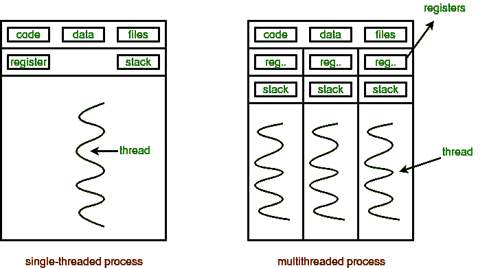
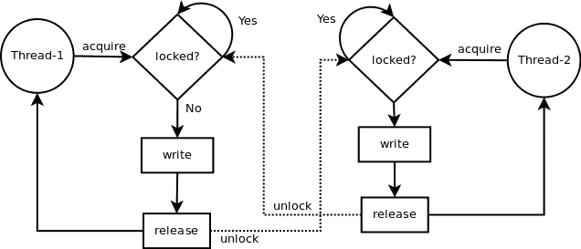

# go 中的流程同步监视器

> 原文：<https://dev.to/l04db4l4nc3r/process-synchronization-monitors-in-go-4g4k>

**简介**

最近，通过利用进程同步结构来实现线程级优化，编程已经进入了第五个阶段。像 Java、python 这样的流行语言都支持多线程。但是在实现最大并发吞吐量的过程中，控制流常常是模糊的。

[](https://res.cloudinary.com/practicaldev/image/fetch/s--jok4RY3U--/c_limit%2Cf_auto%2Cfl_progressive%2Cq_auto%2Cw_880/https://thepracticaldev.s3.amazonaws.com/i/yqpxzuclxgrk59jnehzn.png) 
单线程 v/s 多线程进程

**信号量**

信号量是低级的构造，主要定义了两个方法。`Wait()`和`Signal()`。信号量确保代码的关键部分是原子的。这意味着本质上，当两个线程试图同时访问共享内存时，共享内存的内聚性应该是连续的。

一个线程获取锁，执行其临界区，然后为其他线程释放锁。与此同时，所有其他线程都在队列中等待。

[](https://res.cloudinary.com/practicaldev/image/fetch/s--z_cES9gK--/c_limit%2Cf_auto%2Cfl_progressive%2Cq_auto%2Cw_880/https://thepracticaldev.s3.amazonaws.com/i/5wgksg7hn1rumv5o77lb.png)

**监视器**

监视器是一个高级进程同步结构，它抽象出所有的定时信息。它将条件、共享内存和计时信息都放在同一个罩下。

Monitor 类是一种抽象数据类型，包含共享数据变量和过程。这些变量是私有的，不能从构造外部访问，只有它的过程可以访问这些变量。一次只有一个线程可以访问监视器类对象。

[](https://res.cloudinary.com/practicaldev/image/fetch/s--Wa8SHsOD--/c_limit%2Cf_auto%2Cfl_progressive%2Cq_auto%2Cw_880/https://thepracticaldev.s3.amazonaws.com/i/7ar0fcaqxmxkcun3blch.png)

**监视器进入运行状态**

我们将构建一个具有所有必需功能的监视器界面。随后，我们将创建一个满足 monitor 接口的构造，并在其上定义方法。

创建一个文件`main.go`

```
package main

import (  
 "fmt"  
 "sync"  
)

type Monitor interface {  
 Wait()  
 Signal()  
 GetData() \[\]string  
 PutData(string)  
}

type Words struct {  
 mutex         \*sync.Mutex  
 wordsArray    \[\]string  
 isInitialized bool  
}

func (m \*Words) Init() {  
 m.mutex = &sync.Mutex{}  
 m.wordsArray = \[\]string{}  
 m.isInitialized = true  
} 
```

Enter fullscreen mode Exit fullscreen mode

这里我们的单词 struct 满足了 monitor 接口。所有成员变量都是私有的。我们的任务是在数组中自动追加单词。请注意，这并不是监视器的理想用例，而是一个很好的例子。

因为我们不能访问 Words 类的成员变量，所以我们将在其上定义 fetchers 和 getters。

*   **get data()[]string:**get data 函数简单返回整个单词数组
*   **PutData(string) :** PutData 函数接受一个单词作为参数，然后自动将其追加到数组中。

现在我们将定义剩余的函数

```
func (m \*Words) Wait() {  
 if m.isInitialized {  
  m.mutex.Lock()  
 }  
}

func (m \*Words) Signal() {  
 if m.isInitialized {  
  m.mutex.Unlock()  
 }  
}

func (m \*Words) GetData() \[\]string { return m.wordsArray }

func (m \*Words) PutData(word string) {  
 m.Wait()

// critical section 
 m.wordsArray = append(m.wordsArray, word)  
 // critical section done

m.Signal()  
} 
```

Enter fullscreen mode Exit fullscreen mode

监视器将定时和控制信息结合在一起。这里只有初始化的结构能够获得锁。

*   **Wait() :** 如果定义了成员变量，Wait 函数将获得互斥锁
*   **Signal():**Signal 函数释放获取的锁，以便其他线程可以获取它。

我们的主函数看起来是这样的

```
func main() {  
 m := &Words{}  
 m.Init()

wg := &sync.WaitGroup{}  
 wg.Add(2)  
 go func() {  
  defer wg.Done()  
  m.PutData("Angad")  
 }()  
 go func() {  
  defer wg.Done()  
  m.PutData("Sharma")  
 }()  
 wg.Wait()  
 fmt.Println(m.GetData())  
} 
```

Enter fullscreen mode Exit fullscreen mode

这里我们已经初始化了我们的单词 struct 和其中的所有成员变量。然后我们启动了两个 goroutines 将单词添加到数组中。操作完成后，我们简单地打印出整个数组。

输出:

```
[Sharma Angad] 
```

Enter fullscreen mode Exit fullscreen mode

**监视器的应用**

*   生产者-消费者问题:一个过程产生数据，另一个过程利用这些数据。进程之间需要同步。
*   用餐-哲学家问题:K 个哲学家面前都有筷子。他们需要两根筷子吃饭。他们需要根据同龄人在思考和吃饭之间做出选择。
*   文件读写问题:监视器可以用来防止`read-after-write`、`write-after-read`和`write-after-write`问题。

**结论**

> 监视器是有用的数据结构，用于将所有控制信息、定时信息和共享数据封装在一个屋檐下。它们是信号量的抽象，我们可以通过互斥来定义控制语句。

[](https://res.cloudinary.com/practicaldev/image/fetch/s--vrYFDTux--/c_limit%2Cf_auto%2Cfl_progressive%2Cq_auto%2Cw_880/https://thepracticaldev.s3.amazonaws.com/i/o0ez6rin7gdct4n1uaxb.jpeg)

**延伸阅读**

[**用餐哲学家问题使用旗语**](https://www.geeksforgeeks.org/operating-system-dining-philosopher-problem-using-semaphores/)

[**l 04 db 4 l 4 NC 3r/go-monitors**](https://github.com/L04DB4L4NC3R/go-monitors.git)

[**OS 中信号量和监视器的区别**](https://techdifferences.com/difference-between-semaphore-and-monitor-in-os.html)