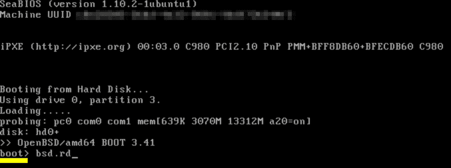
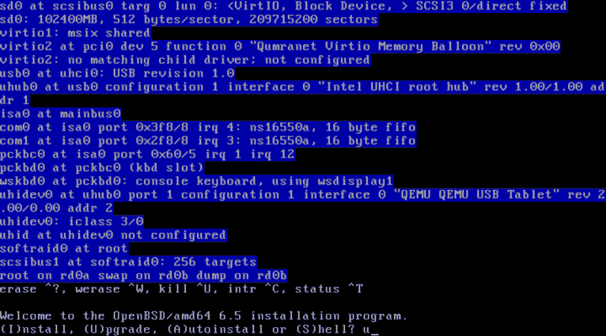

# 将 OpenBSD 从 6.4 升级到 6.5

> 原文：<https://dev.to/nabbisen/upgrading-openbsd-from-6-4-to-6-5-43fa>

# 🌱介绍

作为 OpenBSD 的爱好者之一，上个月对我来说又是一个快乐的月份🙂

OpenBSD [6.5](https://www.openbsd.org/65.html) 于 4 月 24 日发布:

> OpenBSD@ OpenBSDOpenBSD 6.5 现在正式出来了！🐡
> 
> 新增内容:[openbsd.org/65.html](https://t.co/4g8psbCcEI)
> 下载:[cdn.openbsd.org/pub/OpenBSD/6.5](https://t.co/oEbqQF9zAI)
> 升级:[openbsd.org/faq/upgrade65.…](https://t.co/pNBx9qkUYc)2019 年 4 月 13 日下午 13:28[](https://twitter.com/intent/tweet?in_reply_to=1121043182295425024)[](https://twitter.com/intent/retweet?tweet_id=1121043182295425024)[](https://twitter.com/intent/like?tweet_id=1121043182295425024)

Hans Tseng、Efrain Farias 和 Natasha Allegri 共同创作的精美艺术品:

[](https://res.cloudinary.com/practicaldev/image/fetch/s--mDPICoFY--/c_limit%2Cf_auto%2Cfl_progressive%2Cq_66%2Cw_880/https://www.openbsd.oimg/Puffystock-s.gif)

我将在这篇✍️帖子中展示我是如何根据官方升级指南从 6.4 升级到 6.5 的

# 🌳身体

升级 OpenBSD 包括三个步骤:

1.  检查不兼容的更改
    *   升级前
2.  升级系统
3.  更新系统中的包
    *   升级后

## 第一步:检查不兼容的变更

它可能有语法上不兼容的变化。因此，强烈建议在升级前进行验证。OpenBSD 项目在文档和规范方面都非常优秀。
下面列出的两个官方发行说明告诉你有什么变化。
如有必要，在升级后，修改设置等以应用更改[。](#AfterUpgrading)

#### ①系统

检查:[配置和语法变化](https://www.openbsd.org/faq/upgrade65.html#ConfigChanges)，
在使用以下任一情况下:

*   [bgpd.conf(5)](https://man.openbsd.org/OpenBSD-6.5/bgpd.conf.5)
*   [iked.conf(5)](https://man.openbsd.org/OpenBSD-6.5/iked.conf.5)
*   [malloc.conf(5)](https://man.openbsd.org/OpenBSD-6.5/malloc)
*   [sysctl(8)](https://man.openbsd.org/OpenBSD-6.5/sysctl)
*   [tmux(1)](https://man.openbsd.org/OpenBSD-6.5/tmux.1)
*   [vlan(4)](https://man.openbsd.org/OpenBSD-6.5/vlan.4)
*   [Xorg(1)](https://man.openbsd.org/OpenBSD-6.5/startx)

#### ②套餐

检查:[特殊包装](https://www.openbsd.org/faq/upgrade65.html#SpecPkg)、
，如果使用以下任何一种:

*   数据库/ [postgresql](https://www.postgresql.org/)
*   编辑/ [图书馆办公室](https://www.libreoffice.org/)
*   郎/ [鸡](http://www.call-cc.org/)
*   net/ [dnscrypt-proxy](https://dnscrypt.info/)
*   net/ [桑巴](https://www.samba.org/)
*   security/ [opendnssec](http://www.opendnssec.org/)
*   sysutils/ [ansible](https://www.ansible.com/)
*   www/ [gitea](https://gitea.io/)
*   www/ [goaccess](https://goaccess.io/)

**注:运行`pkg_info -Q %PKG_NAME%`通过在每个名字后面打印“`(installed)`”来显示是否安装。*

况且整个详细的 changelog 都是[这里](https://www.openbsd.org/plus65.html)。

## 第二步:升级系统

我们可以分三个部分完成:

1.  准备安装程序
    *   下载安装程序，验证它并将其设置在根目录中
2.  重新启动操作系统并管理手动启动
3.  遵循安装程序

#### 步骤 2-1:准备安装程序

安装程序作为 ramdisk 内核提供，名为`bsd.rd`。
先下载吧。

由于架构的原因，有几个文件。
您需要的文件可以在升级指南的[“获取并验证 BSD . rd”](https://www.openbsd.org/faq/upgrade65.html#BeforeUpdate)中找到。
将链接地址复制到您的剪贴板。

打开终端并运行:

```
$  ftp https://cdn.openbsd.org/pub/OpenBSD/6.5/amd64/bsd.rd 
```

Enter fullscreen mode Exit fullscreen mode

**注:`amd64`是我的 env。这取决于您的架构。*

然后，用`SHA256.sig`(在同一页中找到的加密签名的校验和文件)进行验证:

```
$  ftp https://cdn.openbsd.org/pub/OpenBSD/6.5/amd64/SHA256.sig
  $  signify -C -p /etc/signify/openbsd-65-base.pub -x SHA256.sig bsd.rd
Signature Verified
bsd.rd: OK 
```

Enter fullscreen mode Exit fullscreen mode

如果失败，请下载文件并重试。

**(可选)**谢谢，再见，。签名文件:

```
$  rm SHA256.sig 
```

Enter fullscreen mode Exit fullscreen mode

让我们把它设置在根目录 aka `/`。
预先备份旧安装 ramdisk 内核:

```
#  cp -p /bsd.rd /root/bsd.rd.64 
```

Enter fullscreen mode Exit fullscreen mode

然后，设置新的:

```
#  mv ./bsd.rd / 
```

Enter fullscreen mode Exit fullscreen mode

**(可选)**如果你托管了一些人们使用的服务，你可能需要及时停止它:

```
#  rcctl stop {httpd,smtpd} 
```

Enter fullscreen mode Exit fullscreen mode

#### 步骤 2-2:重新启动操作系统并管理手动启动

在显示器打开的情况下重启操作系统。
这里展示的例子是 [CloudSigma](https://www.cloudsigma.com/) 的 VNC 控制台。

```
#  reboot 
```

Enter fullscreen mode Exit fullscreen mode

一旦显示屏显示“`boot>`”，键入一些内容以停止引导。
然后，运行`bsd.rd`(或`boot /bsd.rd`)。

[](https://res.cloudinary.com/practicaldev/image/fetch/s--1HSZ_Dd6--/c_limit%2Cf_auto%2Cfl_progressive%2Cq_auto%2Cw_880/https://thepracticaldev.s3.amazonaws.com/i/secbbxcpl8ujdu3ychfj.png)

#### 步骤 2-3:遵循安装程序

安装程序将开始。
选择`(U)pgrade`并跟随问题。
升级菜单与安装菜单几乎相同。

[](https://res.cloudinary.com/practicaldev/image/fetch/s--EyA4U5yU--/c_limit%2Cf_auto%2Cfl_progressive%2Cq_auto%2Cw_880/https://thepracticaldev.s3.amazonaws.com/i/f0nz4rsqx7cd0egx5qlu.png)

看 OpenBSD 版本。
已经 6.5 了！

将询问您哪些文件集将照常安装😀完成并重启会给你带来新的操作系统。

## 第三步:更新系统中的包

有[个文件需要删除](https://www.openbsd.org/faq/upgrade65.html#RmFiles) :

```
#  rm /usr/include/openssl/asn1_mac.h
  #  rm /usr/bin/c2ph \
 /usr/bin/pstruct \
    /usr/libdata/perl5/Locale/Codes/API.pod \
    /usr/libdata/perl5/Module/CoreList/TieHashDelta.pm \
    /usr/libdata/perl5/Unicode/Collate/Locale/bg.pl \
    /usr/libdata/perl5/Unicode/Collate/Locale/fr.pl \
    /usr/libdata/perl5/Unicode/Collate/Locale/ru.pl \
    /usr/libdata/perl5/unicore/lib/Sc/Cham.pl \
    /usr/libdata/perl5/unicore/lib/Sc/Ethi.pl \
    /usr/libdata/perl5/unicore/lib/Sc/Hebr.pl \
    /usr/libdata/perl5/unicore/lib/Sc/Hmng.pl \
    /usr/libdata/perl5/unicore/lib/Sc/Khar.pl \
    /usr/libdata/perl5/unicore/lib/Sc/Khmr.pl \
    /usr/libdata/perl5/unicore/lib/Sc/Lana.pl \
    /usr/libdata/perl5/unicore/lib/Sc/Lao.pl \
    /usr/libdata/perl5/unicore/lib/Sc/Talu.pl \
    /usr/libdata/perl5/unicore/lib/Sc/Tibt.pl \
    /usr/libdata/perl5/unicore/lib/Sc/Xsux.pl \
    /usr/libdata/perl5/unicore/lib/Sc/Zzzz.pl \
    /usr/share/man/man1/c2ph.1 \
    /usr/share/man/man1/pstruct.1 \
    /usr/share/man/man3p/Locale::Codes::API.3p 
```

Enter fullscreen mode Exit fullscreen mode

然后，确保所有补丁都应用到系统:

```
#  syspatch 
```

Enter fullscreen mode Exit fullscreen mode

所以，是时候通过`pkg_add -u`更新包了。
负责其日志记录:

*   "`Error ...`"
*   "`Remember to update ...`"
*   "`You should also run ...`"
*   "`You may wish ...`"

```
#  pkg_add -u
The following new rcscripts were installed: /etc/rc.d/php71_fpm
See rcctl(8) for details.
New and changed readme(s):
    /usr/local/share/doc/pkg-readmes/php-7.1
    /usr/local/share/doc/pkg-readmes/php-7.2
    /usr/local/share/doc/pkg-readmes/roundcubemail
--- -certbot-0.27.1 -------------------
You should also run rm -rf /var/log/certbot/*
--- -clamav-0.100.2 -------------------
You should also run rm -fr /var/db/clamav/*
You should also run rm -fr /var/spool/clamav/*
You should also run rm -fr /var/clamav/quarantine/*
You should also run rm -fr /var/clamav/tmp/*
You should also check /etc/clamd.conf (which was modified)
You should also check /etc/freshclam.conf (which was modified)
--- -clamav-unofficial-sigs-4.9.2p2 -------------------
You should also run rm -rf /var/db/clamav-unofficial-sigs/*
--- -cyrus-sasl-2.1.26p25 -------------------
You should also run rm -rf /var/sasl2/*
--- -dkimproxy-1.4.1p1 -------------------
You should also check /etc/dkimproxy_out.conf (which was modified)
--- -dovecot-2.2.36p0 -------------------
You should also run rm -rf /var/dovecot/*
You should also check /etc/dovecot/conf.d/10-auth.conf (which was modified)
You should also check /etc/dovecot/conf.d/10-logging.conf (which was modified)
You should also check /etc/dovecot/conf.d/10-mail.conf (which was modified)
You should also check /etc/dovecot/conf.d/10-ssl.conf (which was modified)
You should also check /etc/dovecot/conf.d/auth-passwdfile.conf.ext (which was modified)
You should also check /etc/dovecot/conf.d/auth-static.conf.ext (which was modified)
You should also check /etc/dovecot/dovecot.conf (which was modified)
Remember to update /etc/ssl/dovecotcert.pem
Remember to update /etc/ssl/private/dovecot.pem
--- -libxml-2.9.8p0 -------------------
Remember to update /var/db/xmlcatalog
--- -php-7.0.32p1 -------------------
You should also run rm -f /etc/php-7.0/php-7.0.sample/*
You should also check /etc/php-fpm.conf (which was modified)
--- -php-7.2.10 -------------------
You should also run rm -f /etc/php-7.2/php-7.2.sample/*
You should also check /etc/php-7.2.ini (which was modified)
--- -roundcubemail-1.3.7p1 -------------------
You should also run rm -rf /var/www/roundcubemail/logs/*
You should also check /var/www/roundcubemail/config/config.inc.php (which was modified)
--- +fish-3.0.0 -------------------
You may wish to add /usr/local/share/fish/man to /etc/man.conf
--- +zip-3.0p1 -------------------
Error deleting directory /etc/php-7.0: Directory not empty
status: Subcommand 'current-command' is not valid 
```

Enter fullscreen mode Exit fullscreen mode

[这么久了，pho-7.0](https://www.php.net/supported-versions.php) ！(谢谢你的 3 年。)

# 🌾结论

于是我把我的 OpenBSD 6.4 升级到了 6.5。✨，今天天气也很好🐡✨

对了，如果需要从 6.3 升级到 6.5，可以先升级 6.3 -> 6.4，再升级 6.4 -> 6.5。

最后，我期待着可能半年后的见面...😊

> <video loop="" controls=""><source src="https://video.twimg.com/ext_tw_video/1121880863686438912/pu/vid/322x180/I-EGvXkT1-XBGIvT.mp4?tag=9" type="video/mp4"></video>OpenBSD@ OpenBSD下面是我们新推出的 sysupgrade 实用程序:只需一条命令即可实现完全无人值守的快照升级。[man.openbsd.org/sysupgrade](https://t.co/wRF8jlHvA6)2019 年 4 月 26 日 21 点 31 分[](https://twitter.com/intent/tweet?in_reply_to=1121889666918227968)[](https://twitter.com/intent/retweet?tweet_id=1121889666918227968)[](https://twitter.com/intent/like?tweet_id=1121889666918227968)

感谢您的阅读。
祝你和毛毛生活愉快😎