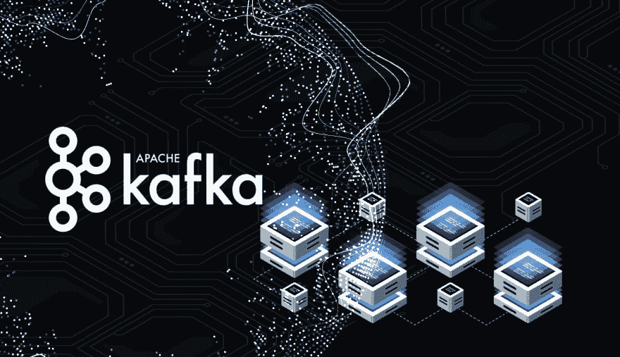
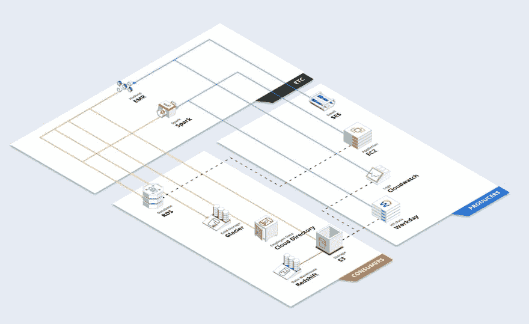
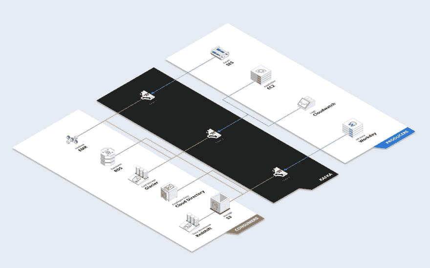
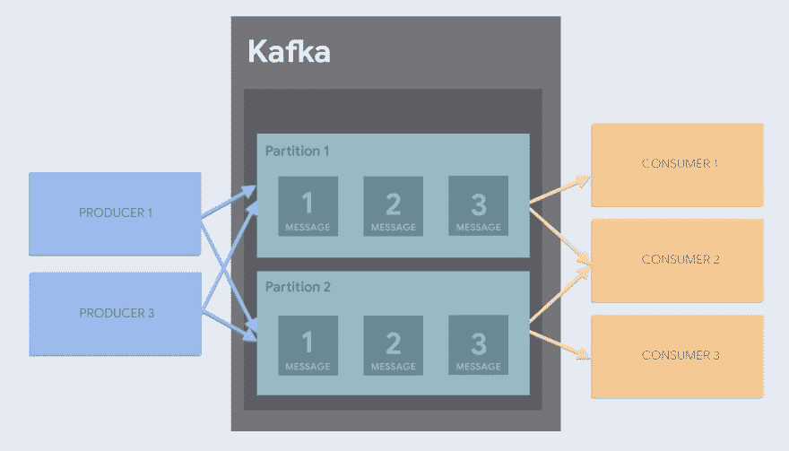

# 熟悉 Apache Kafka 和消息队列

> 原文：<https://dev.to/hackersandslackers/becoming-familiar-with-apache-kafka-and-message-queues-10cb>

数据工程技术栈在不同的公司之间有相当大的差异。根据公司开发人员偏好的技能和语言，数据栈可以是大量使用 Java 的商店，也可以是依赖 PySpark 的 Python 商店。尽管缺乏规定的“行业标准”堆栈，但越来越明显的是，所有高吞吐量的下一代数据组织可能会共享一个东西: **Apache Kafka** 。

Kafka 是实时处理大量数据的组织的首选。Kafka 被设计为每天处理数十亿(甚至数万亿)的数据事件；这一壮举与其处理 LinkedIn 上的每个操作的原始用例非常吻合。Kafka 已经被开源，现在可以被不在 LinkedIn 工作的普通失败者使用...就像你我一样！

## 打倒卡夫卡

Kafka 是一种中间件，数据在其中输入，然后输出...就这么简单！也许可以把它想象成我们数据工作流程的 CPU:它位于我们管道的中心，接收和输出数据到它们所属的最终系统。你可能会想:为什么如此简单的事情会被认为如此重要？

不知何故，在没有人认为将数据流集中在一个地方是个好主意之前，我们已经做到了这一点 Hadoop 发明至今已经 14 年了。

### 卡夫卡术语

是时候熟悉一些卡夫卡的词汇了:

*   **生产者**:“生产者”是入站数据的来源。生产者可能是输出日志的服务器，传输信息的 IOT 设备，转换数据的脚本，或者任何总是产生数据的东西。
*   **主题**:当制作者将数据扔进 Kafka 时，数据属于许多可用“主题”中的一个，这是我们将相关数据分组在一起进行处理的方式。主题本身是不断增长的数据源的日志，其中数据以简单的键/值格式存储。从生产者那里涌入的数据在日志末尾得到附加消息:这被称为*队列*(类似于 Redis 或任何其他队列系统)。
*   **消息**:“消息”是数据的键/值对。这个词有点误导，但是对于基于队列的系统来说是非常标准的。
*   **消费者:**消费者摄取生产者提供的数据。消费者是存储数据的最终目的地，例如数据库或数据仓库。
*   **分区**:主题可以拆分成“分区”。对一个主题进行分区，可以将它拆分到多台机器上，从而使 Kafka 具有惊人的可伸缩性。我们一会儿会深入探讨这个问题。

### Kafka 和/或消息队列的好处

让我们快速比较一下，看看 Kafka 为什么为典型的数据堆栈提供价值。首先，让我们看一个例子，如果没有卡夫卡，一家*公司会发生什么:*

 

<figcaption>多么没用的图。</figcaption>

如果我要你告诉我哪些**制作人**正在写红移，你能回答吗？当然不是！上面的图表不可读，因为上面的架构很乱。我知道以上是一个现实的场景，因为我在发生这种情况的公司工作过。

考虑到绝大多数公司甚至没有像上面那样完整地记录他们的数据流(这是一个可怕的事实)。如果出了问题，你如何诊断发生了什么？您如何知道数据来自哪个来源？如果你是这份工作的新手，当每个人都忙得没有时间和你说话的时候，你如何开始弄清楚到底发生了什么？

让我们用卡夫卡的作品再试一次:

 

<figcaption>现在用卡夫卡管理我们的消息队列。</figcaption>

那更好。现在 Kafka 负责我们的消息队列(主题)，在某些情况下可以整合来自不同来源的信息。我们也可以让 Kafka 处理通知。例如，如果我们想要从我们的 Cloudwatch 日志中获得任何致命崩溃的通知，我们可以完全在 Kafka 中设置这一点，甚至让这触发类似于*page duty*的东西来在狗屎击中风扇时击中我们。

## 卡夫卡簇的兜帽下

像 Hadoop 生态系统中的大多数东西一样，Kafka 的强大之处在于它能够在一个集群中的无限多个节点上扩展。无论您公司的数据负载如何变化，Kafka 都可以处理向其集群添加节点以适应。

在 Kafka 中，通过将**主题**分割成多个**分区**，可以扩展到多个节点。当一个主题被分割成两个分区时，这意味着一个主题的工作负载被分割到集群中的两个节点上。因此，我们不仅能够将节点专用于主题，还可以根据需要将主题拆分到多个节点:

 

<figcaption>卡夫卡中的隔断。</figcaption>

## 用于设置 Kafka(或等效物)的选项

建立卡夫卡有几个选择。Vanilla Kafka 并不完全是一个用户友好的设置，尤其是对于希望在一个集群中设置多个节点的任何人(也就是字面上的每个人)，因此值得考虑哪种实现最适合您的需求，尤其是在考虑您的云提供商时。

### 手动安装卡夫卡

这一点都不好玩，但是任何人都可以通过下载源代码并遵循这些说明来建立一个 Kafka 实例。Kafka 也依赖于 Apache 的 Zookeeper，所以需要相当多的设置。

### 卡夫卡式的服务

如果您正在寻找在云提供商上安装 Kafka 实例的最简单方法，那么只需看看 [confluent.io](https://www.confluent.io/) 。就像拥有 Apache Spark 的 Databricks 一样，Confluent 是由 Kafka 的最初创造者剥离出来的一家私人公司(这显然是向 Apache 基金会捐赠软件的人的一种趋势)。汇流的付费产品是[汇流云](https://www.confluent.io/confluent-cloud/):一个配置很少的托管 Kafka 实例。当然，这并不便宜——下层大约每小时 50 美分，或者一天 12 美元。这不应该是一个惊喜:Kafka 的本质意味着它只有被企业使用才有意义，因此几乎*任何*云 Kafka 提供商都会有商业定价。没有人只是为了好玩而旋转任何东西。

好消息是 Confluent 还允许我们下载 [Confluent 客户端](https://www.confluent.io/download/)用于单节点实例的本地设置。我个人更喜欢建立汇合超过香草卡夫卡。首先，建立要比建立[容易一点。另一个好处是能够实现](https://docs.confluent.io/current/quickstart/ce-quickstart.html#ce-quickstart) [Kafka Connect Datagen](https://www.confluent.io/connector/kafka-connect-datagen/) ，这是一种让有抱负的 Kafka 书呆子将虚拟数据导入实例的方法，以防我们需要帮助。

### 其他发布者/订阅者产品

当谈到消息队列时，Kafka 不是游戏中的唯一玩家。Kafka 有很多替代产品，其中许多更容易安装——尤其是如果你被某个特定的云提供商所束缚的话。以下是一些精选的最爱:

*   亚马逊 SQS :卡夫卡最古老的替代品之一。当吞吐量达到最高点时会遇到问题(像大多数 AWS 服务一样...zing tbh)。
*   **亚马逊 kine sis**:AWS 拥有的最接近“卡夫卡即服务”的东西。Kinesis 支持类似 Kafka 的分区，以及副本。
*   Google PubSub :卡夫卡的一个非常方便的替代品。这可能是任何想要立即投入运行的人的最佳选择之一，因为不需要任何配置。可以扩展到海量。
*   RabbitMQ :一个流行的消息代理，用 Erlang 编写，同样是开源的。RabbitMQ 和[几乎所有能想到的编程语言](https://www.rabbitmq.com/devtools.html)都能很好地兼容。

## 未来是不成文的

这只是探索像卡夫卡一样的信息队列的辉煌奇迹的漫长旅程的开始。我们还有更多的内容要介绍，比如安装、配置和实现。别碰那个拨号盘，我们马上回来播放第二部分！*