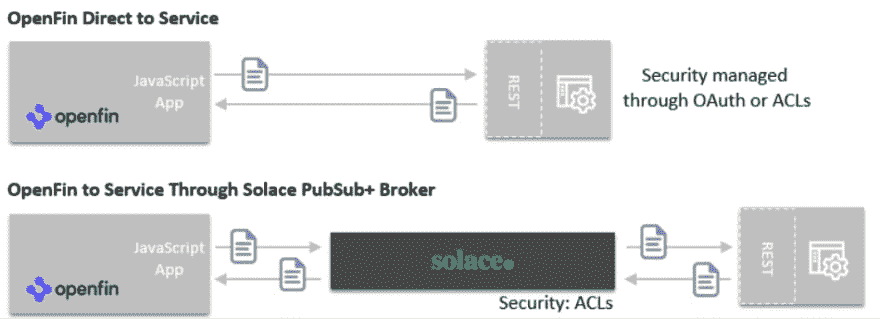
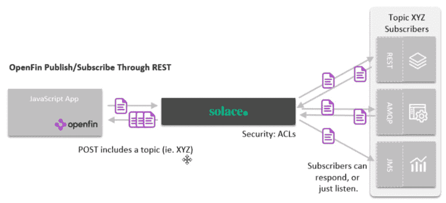
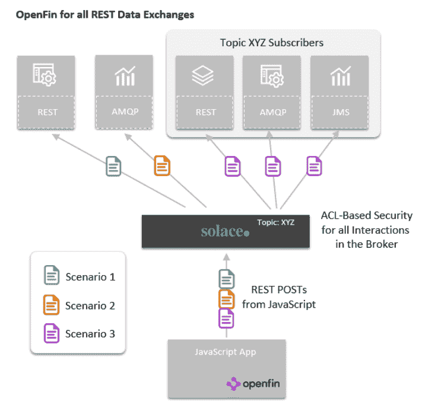

# OpenFin 应用需要的不仅仅是休息

> 原文：<https://dev.to/solacedevs/openfin-apps-need-more-than-just-rest-20gb>

如果您是一名 OpenFin 开发人员，您可能更喜欢尽可能使用 REST 进行远程 API 调用。这对于查询-响应类型的请求非常有用，但是除此之外还有它的局限性，特别是:

*   服务可用性是二元的。如果远程服务不可用或过载，您的应用程序必须处理故障场景。
*   这是一对一的协议。如果你的应用程序设计最适合一对多交换，REST 不是一个好的选择。
*   它只适用于基于网络的服务。许多遗留服务不提供 REST API。
*   使用 REST 会导致应用程序与服务的紧密耦合。端点嵌入到应用程序中。

所有这些限制都可以通过将 REST 与本地支持基于 web 的协议的多协议消息代理相结合来克服。您的应用程序仍然可以使用 web 友好的 API 管理，代理处理服务可靠性问题、发布/订阅和排队语义，以及对非 web 遗留系统的访问。

让我们看一下三个常见的场景，以及如何使用消息代理作为中介来改进 OpenFin REST 交互。

1.  对 RESTful 服务的请求/回复
2.  使用消息传递接口请求/回复遗留服务
3.  REST 作为多个订阅者的发布者

### 场景 1:请求/回复 RESTful 服务

这是 REST 最直接的模式。您只需发布(或上传)并指定您希望交互是同步的还是异步的。

我知道你在想什么:

> 它们都做同样的事情，只是第一个更简单！为什么要增加慰藉？！？"

人们在他们的 REST 帖子和 RESTful 服务之间放置消息代理有三个主要原因:

1.  **对失败的缓冲。**消息代理或队列通常用于简化客户端应用程序中的错误处理。如果远程服务不可用或负载过重，代理将保存消息，直到服务恢复或赶上。可以很容易地对代理进行容错和灾难恢复配置，以提供实例或站点故障恢复。使用直接的 REST 请求，如果您的 POST 失败，您将负责管理重试并处理许多失败场景。
2.  **治理。**如果您有多种类型的消息要跨数据中心、云和 SaaS 服务发送到多种类型的目的地，那么在一个地方管理安全性、日志记录和其他监管操作会非常有用。
3.  **发布/订阅。**有时，消息有效负载去往多个目的地是有用的(参见本文后面的场景 3)。

如果一切都是服务查找，一切都在工作，那么 REST 可能就是您所需要的全部，但是分布式系统会变得混乱，而代理可以提高可靠性和治理。

### 场景 2:使用消息传递接口请求/回复遗留服务

场景 2 仍然是点对点交互，但是这次远程服务不提供 RESTful 接口。我们已经在白皮书【OpenFin 架构师和开发人员连接指南中详细讨论了这种情况下的架构选择。这一次，Solace 充当协议和安全桥梁，终止 REST 请求，将有效负载转发到消息队列或主题，并对响应执行同样的操作。

根据您的 REST 请求的性质，接收响应的方式会有所不同。如果请求是同步的，Solace 将保持连接打开，直到相关的消息交互完成。如果 REST POST 是异步的，那么您需要一种通过回调或者轮询结果来接收消息的方法。有一篇名为[处理来自混合云](https://dev.to/blog/openfin-inbound-events-hybrid-cloud/)的 OpenFin 入站事件的配套博文，涵盖了处理另一个方向的消息流。

### 场景 3: REST 作为发布者发布给多个订阅者

在场景 3 中，客户端应用程序需要向多个远程服务发送信息。如果没有代理，唯一的方法就是让应用程序将消息逐个发送给每个应用程序，或者编写某种中介，在 RESTful 服务中转发消息。

Solace 提供了一个优雅的解决方案，允许您使用 REST 将数据和发布主题一起作为元数据发布。远程服务将自己标识为订阅者，PubSub+将指定主题发布到许多不同的消息传递网络上。最终结果是，你的 OpenFin 应用程序使用 REST，数据自动发送给所有用户，无论他们在哪里。一些订户可以产生响应，而其他订户可以简单地倾听，例如为了记录或存档。

### 包罗万象

当然，许多应用程序会希望包含实现所有这三种场景的交换模式。上述所有场景突出了使用代理的治理和可靠性优势。

如果一个应用程序需要使用我们在这篇博文中讨论的所有消息模式，而没有消息代理，它将需要改变 REST 的使用，可能对每个模式处理不同的安全性，*和*处理所有的失败场景。通过消息代理，它只需将数据发送到 Solace，Solace 充当安全和流量中介，路由到所有数据源。

注意:为了避免上面的图片过于拥挤，我没有显示返回消息。它们的工作方式与前面的场景图中相同。

### 借助企业级弹性和治理支持 REST

现在你知道了，REST 很棒，因为它很简单——但是它有一些严重的限制。如果为了可预测性和高可用性而操作化系统、访问遗留系统或者利用类似消息传递的语义是您的应用程序的需求，那么考虑添加一个多协议代理来将 REST 连接到其他协议，并增强您的系统的弹性。

请务必查看讨论从异步 REST 请求接收通知和响应的配套帖子:[处理来自混合云的 OpenFin 入站事件](https://dev.to/blog/openfin-inbound-events-hybrid-cloud/)。

帖子 [OpenFin 应用程序需要的不仅仅是休息](https://solace.com/blog/openfin-apps-rest/)首先出现在 [Solace](https://solace.com) 上。