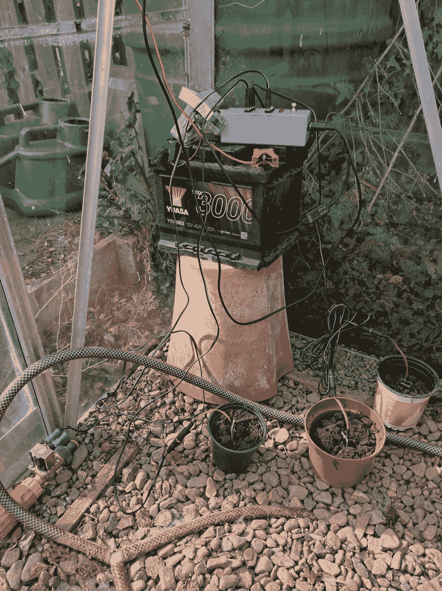

# Pirrigator，第 5 部分。

> 原文：<https://dev.to/neilgall/pirrigator-part-5-41an>

[](https://res.cloudinary.com/practicaldev/image/fetch/s--ckN12tGJ--/c_limit%2Cf_auto%2Cfl_progressive%2Cq_auto%2Cw_880/https://thepracticaldev.s3.amazonaws.com/i/2mdbnxlja9q563f1xbww.jpg)

在我之前的帖子中，我概述了我的计划，用覆盆子 Pi 和 Rust 自动给我温室里的西红柿浇水。前几篇文章主要概述了硬件和我第一次写 Rust 代码时的拖延。但是我们现在已经进入五月，植物很快就会进入，所以我真的需要尽快开始工作。好消息是大部分核心代码概念已经到位。

## 配置

一天早上，我在我的新闻订阅中偶然发现了这个配置箱，它正是我所需要的。它将来自各种来源和格式的内容描述成一个数据结构，因此我可以将硬件配置和细节保留在主代码之外。

```
#[derive(Debug, Deserialize, PartialEq, Eq)]
pub struct Database {
    pub path: String
}

#[derive(Debug, Deserialize, PartialEq, Eq)]
pub struct Settings {
    pub database: Database,
    pub weather: Option<WeatherSensorSettings>,
    pub adc: Option<ADCSettings>,
    pub moisture: Vec<MoistureSensorSettings>,
    pub buttons: Vec<ButtonSettings>,
    pub valves: Vec<ValveSettings>
}

impl Settings {
    pub fn new() -> Result<Self, ConfigError> {
        let mut s = Config::new();

        s.merge(File::with_name("Settings"))?;
        s.merge(Environment::with_prefix("PIRRIGATOR"))?;

        s.try_into()
    }
} 
```

Enter fullscreen mode Exit fullscreen mode

中央设置代码块从文件中读取设置，并构造我需要的各种对象。因此，我可以在我的开发笔记本电脑上进行各种测试，我将所有硬件模块都设为可选，这样我就可以只使用数据库和 web 服务器来配置系统。

```
impl Pirrigator {
    pub fn new(s: settings::Settings) -> Result<Pirrigator, Box<Error>> {
        let (tx, rx) = mpsc::channel();

        let weather = traverse(&s.weather, &|w|
            weather::WeatherSensor::new(&w, tx.clone())
        )?;

        let moisture = traverse(&s.adc, &|adc|
            moisture::MoistureSensor::new(&adc, &s.moisture, tx.clone())
        )?;

        let buttons = button::Buttons::new(&s.buttons, tx.clone())?;
        let valves = valve::Valves::new(&s.valves)?;

        let db = database::Database::new(Path::new(&s.database.path))?;

        let mut controller = Controller {
            database: db.clone(),
            weather,
            moisture,
            buttons,
            valves
        };

        let thread = spawn(move || controller.run(rx));

        return Ok(Pirrigator { 
            thread,
            database: db
        })
    } 
```

Enter fullscreen mode Exit fullscreen mode

`traverse`感觉像是错误的做事方式，但我仍在学习`Option`和`Result`组合子是如何工作的。我会在某个时候解决的。这是一个类似 Haskell 中的标准遍历函数:

```
fn traverse<T, U, E>(t: &Option<T>, f: &Fn(&T) -> Result<U, E>) -> Result<Option<U>, E> {
    match t {
        None => Ok(None),
        Some(t) => f(t).map(Some)
    }
} 
```

Enter fullscreen mode Exit fullscreen mode

## 从传感器发送数据

正如我在以前的帖子中提到的，我的伟大想法是让每个传感器在自己的线程上运行，并将事件发送到控制器，控制器将这些事件分派到它们需要去的地方。现在，我将传感器数据存储在一个 sqlite 数据库中，并按下按钮，这是一个手动的水阀开关。

传感器模块都遵循相似的模式。产生一个线程，该线程大部分时间处于睡眠状态，但会周期性地醒来，从硬件中读取数据，并向多生产者单消费者通道发送一个事件。

```
impl WeatherSensor {
    pub fn new(settings: &WeatherSensorSettings, channel: Sender<Event>) -> Result<Self, Box<Error>> {
        let device = Bme280Device::new(&settings.device, settings.address)?;
        let period = Duration::from_secs(settings.update);
        let thread = spawn(move || { main(device, channel, period) });
        Ok(WeatherSensor { thread })
    }
} 
```

Enter fullscreen mode Exit fullscreen mode

传感器线程的本地`main()`函数只是一个轮询循环:

```
fn main(mut device: Bme280Device, channel: Sender<Event>, period: Duration) {
    loop {
        match device.read() {
            Ok(data) => send_event(data, &channel),
            Err(e) => error(e)
        };
        sleep(period);
    }
} 
```

Enter fullscreen mode Exit fullscreen mode

而`send_event()`只是从硬件模块的数据结构中转换出来，添加一个时间戳，然后通过通道发送出去。

```
fn send_event(data: Bme280Data, channel: &Sender<Event>) {
    let event = WeatherEvent {
        timestamp: SystemTime::now(),
        temperature: data.temperature,
        humidity: data.humidity,
        pressure: data.pressure
    };

     match channel.send(Event::WeatherEvent(event)) {
        Ok(_) => {},
        Err(e) => error(e)
    };
} 
```

Enter fullscreen mode Exit fullscreen mode

## 从传感器接收数据

控制器的`run()`是主调度器回路。不要太花哨。

```
 loop {
            let event = rx.recv()
                .expect("receive error");

            self.database.store_event(&event)
                .expect("database store error");

            match event {
                event::Event::ButtonEvent(b) => self.button_event(&b),
                _ => {}
            }
        } 
```

Enter fullscreen mode Exit fullscreen mode

对于数据库，我选择了 [rusqlite](https://crates.io/crates/rusqlite) 。我不需要 ORM 或任何东西——我的数据中还没有任何关系，所以我只是手工使用 SQL。然而，我确实希望控制器的接收器线程和 web 服务器处理器线程能够访问数据库，所以这里有一个 [r2d2](https://crates.io/crates/r2d2) 连接池。`Database`抽象提供了类似
的方法

```
 fn store_weather(&self, event: &weather::WeatherEvent) -> Result<(), Error> {
        self.conn().execute(
            "INSERT INTO weather (time, temperature, humidity, pressure) VALUES (?1, ?2, ?3, ?4)",
            &[&to_seconds(&event.timestamp) as &ToSql, &event.temperature, &event.humidity, &event.pressure]
        )?;
        Ok(())
    } 
```

Enter fullscreen mode Exit fullscreen mode

日期总是一场噩梦，所以我只是将时间转换成 32 位 Unix 秒。如果 2038 年我还在用这个，我会很惊讶。我不得不交叉编译 ARMv6 的 sqlite C 库，但这非常简单——只需下载 autoconf 包，用`--target=arm-unknown-linux-eabihf`配置，make，并将结果库复制到 Rust `deps`目录。看起来 Cargo 可以配置来完成所有这些，但这不是我现在主要关心的。

## Web 服务器

主要是它是一个自动化系统，但我希望能够检查，当然，与所有收集的数据，我们想要的图表！到目前为止，最后一个组件是一个 web 服务器。我看了几个 Rust web 框架。Rocket 看起来很棒，感觉和 T2 的 Flask 类似，但是我觉得开发者犯了一个巨大的错误，需要 Rust nightly 编译器。在 Swift 的早期，我经历了一段代码无法跨版本编译的可怕时期。也许 Rust 的变更管理在 Swift 的 2 到 3 天内比苹果的要好，但不稳定的语言基础意味着 Rocket 的即时拒绝。

其他一些 web 框架看起来与我以前使用过的任何框架都相去甚远。但是 [Iron](http://ironframework.io/) 似乎很容易上手，也很容易扩展，所以这是我现在的选择。遵循[这个例子](https://github.com/DavidBM/rust-webserver-example-with-iron-diesel-r2d2-serde)，我设法构建了一个中间件，将我的数据库抽象插入到请求中:

```
struct DbMiddleware {
    database: Database
}

impl typemap::Key for DbMiddleware {
    type Value = Database;
}

impl BeforeMiddleware for DbMiddleware {
    fn before(&self, req: &mut Request) -> IronResult<()> {
        req.extensions.insert::<DbMiddleware>(self.database.clone());
        Ok(())
    }
}

pub trait DbRequestExtension {
    fn get_database(&self) -> Database;
}

impl <'a, 'b>DbRequestExtension for Request<'a, 'b> {
    fn get_database(&self) -> Database {
        let database = self.extensions.get::<DbMiddleware>().unwrap();
        database.clone()
    }
} 
```

Enter fullscreen mode Exit fullscreen mode

因此，在任何请求处理程序中，我都可以做`req.get_database()`并调用数据库抽象上的方法。中间件还插入了一个 [JSON 响应处理器](https://crates.io/crates/iron-json-response)和一个[记录器](https://crates.io/crates/logger)。几乎在任何项目中都需要的所有有用的东西。

到目前为止，网络服务器有一条`/status`路线，它只报告应用程序正在运行，还有一条`/weather`路线，它报告最新记录的天气情况。

```
fn status(_: &mut Request) -> IronResult<Response> {
    Ok(Response::with((status::Ok, "running")))
}

fn weather(req: &mut Request) -> IronResult<Response> {
    let weather = req.get_database().get_latest_weather();

    let mut response = Response::new();
    match weather {
        Ok(w) => {
            response.set_mut(JsonResponse::json(w)).set_mut(status::Ok);
            Ok(response)
        }
        Err(e) => {
            let err = IronError::new(e, status::NotFound);
            Err(err)
        }
    }
}

pub fn run(database: Database) {
    let mut router = Router::new();
    router.get("/status", status, "status");
    router.get("/weather", weather, "weather");

    Iron::new(middleware::insert(router, database))
        .http("0.0.0.0:5000")
        .unwrap();
} 
```

Enter fullscreen mode Exit fullscreen mode

同样，我确信在错误类型之间有更简洁和习惯的翻译，但是我将不得不继续学习这些。我在之前的一篇文章中强调过，你只需要做学习时有用的事情，并在学习过程中不断改进。

在所有这些之后，我可以得到一个 JSON blob，其中包含当前的温室天气条件！为了好玩，我暴露了我的路由器上的端口，并拼凑了一个 Alexa 技能来查询天气并读出它。我们很开心地问 Alexa 温室里的天气怎么样。

## 还在做什么

在过去的一两个星期里，有很多事情要做。当然，仍然没有自动化——我需要一个运行状态机的最终线程和一些决定植物何时需要水的逻辑。我还没有真正考虑过这个问题，但是现在可用的基础设施允许它模块化，并给我提供了选择。

我还需要扩展 web 服务器，以显示更多适合绘制图表的数据——例如，最近一小时、一天、一周的天气和湿度数据。由于 Rust 有一个 WebAssembly 目标，我开始考虑是否可以在 Rust 中构建一个前端？

还有其他的零零碎碎的东西——覆盆子 Pi 上挂着一个相机模块，所以我希望至少每隔几个小时就能提供一个静止图像。远程控制水可能是一个想法；如果我不在家，一切看起来都有点干燥，因为自动化不能正常工作，我至少可以手动给植物浇水。

## 体验

我写的第一个 Rust 代码是读取硬件传感器并将数据收集到结构中。感觉大部分都是 C 调。从那时起，我已经进入了访问数据库和提供 web 内容的阶段，Rust 不再像 c 语言了。我很少遇到所有权问题，并且在编程时一直有一个“谁对这个对象负责”的概念，所以我真的很喜欢在 Rust 中明确这一点。没有异常是很好的——我认为它们会导致可怕的代码——但是找到正确的方法来一起使用 Rust 的工具，如`Option`和`Result`,同时保持代码简单和干净是很棘手的。我觉得我做了太多的`unwrap()`,而没有在调用栈中传递足够多的错误。这是学习过程的一部分，也是这个项目的最终目的。如果你想学一门语言，那就用它做些真正的事情。

完整代码一如既往地在 [github](https://github.com/neilgall/pirrigator/) 上。