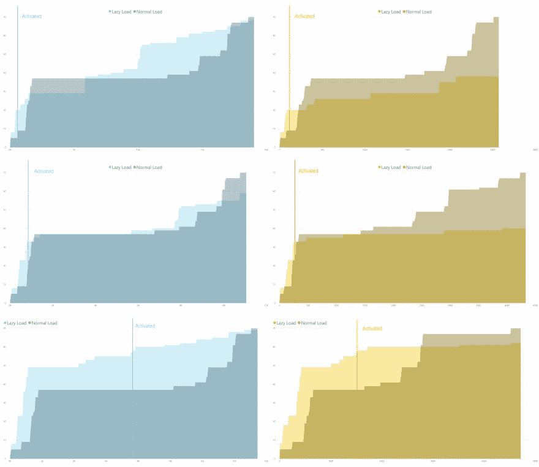
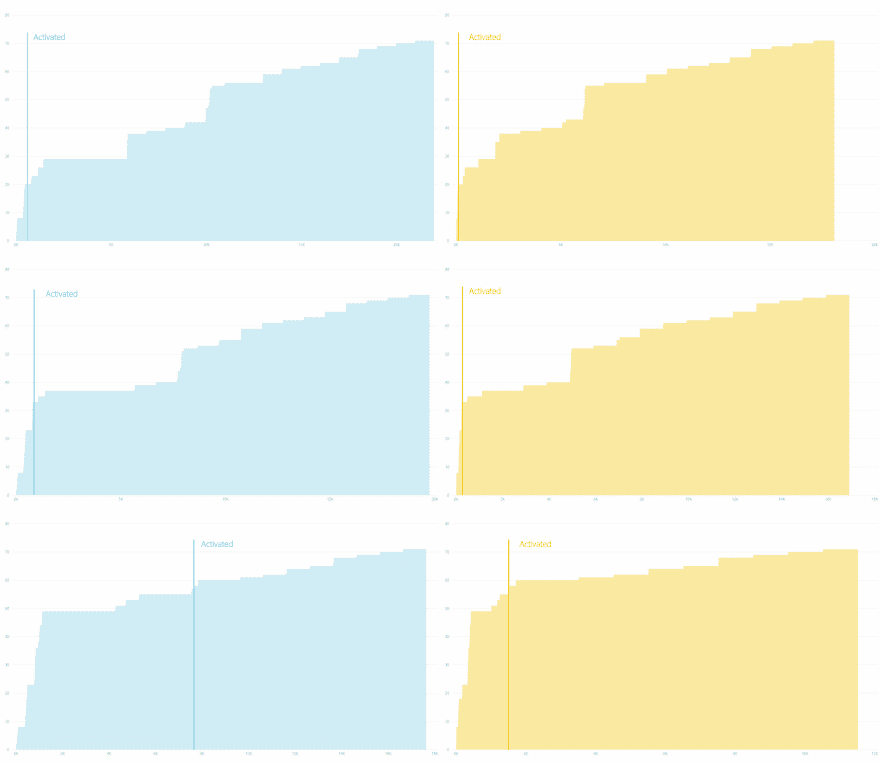
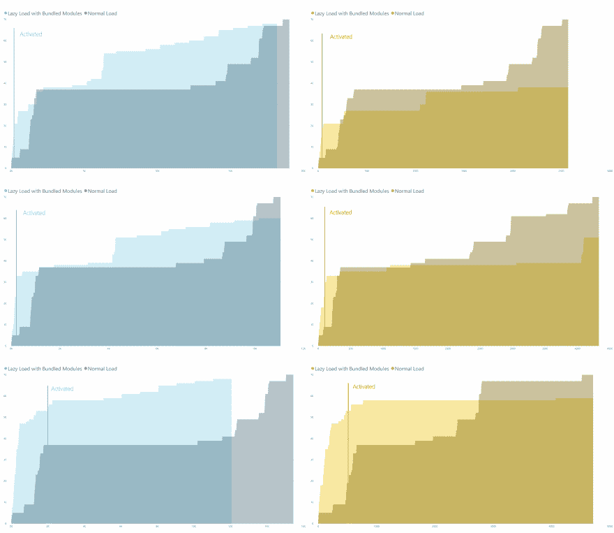

# 如何加速你的 VS 代码扩展——不仅仅是 Webpack

> 原文：<https://dev.to/sneezry/how-to-speed-up-your-vs-code-extension-not-only-webpack-48b5>

# 简介

> 扩展允许用户向 VS 代码中添加语言、调试器和工具，以支持他们的开发工作流。VS 代码具有丰富的可扩展性模型，允许扩展访问 UI 并贡献功能。

通常，在 VS 代码中会安装不止一个扩展，所以作为一个扩展开发者，我们应该总是关心扩展的性能，以避免减慢其他扩展甚至 VS 代码的主进程。

开发扩展时我们应该遵循的一些规则:

1.  避免使用`sync`方法。`sync`方法会阻塞整个节点进程，直到它们返回。相反，你应该尽可能多地使用`async/await`。如果你发现很难用`async`替换`sync`方法，考虑进行一次重构。

2.  只要求你需要的。例如，`lodash`有些依赖项可能非常大。通常，我们不需要所有的`lodash`方法，并且要求整个`lodash`库没有意义。`lodash`的每个方法都有一个独立的模块，你可以只需要你需要的部分。

3.  重视激活规则。在大多数情况下，您扩展可能不需要激活。不要使用`*`作为激活规则。如果你的扩展真的需要总是激活来监听一些事件，考虑在一个`setTimeout`中执行主代码，作为一个低优先级的任务。

4.  按需加载模块。使用`import ... from ...`是要求模块的一种常见方式，然而，有时它可能不是一种好的方式。例如，一个名为`request-promise`的模块可能会花费太多的时间来加载(在我这边是 1 到 2 秒)，但只有当某些条件满足时，我们才可能需要获取远程资源，比如本地缓存过期。

许多开发人员都遵循上面提到的前三条规则。在本文中，我们将讨论一种按需加载模块的方法，这种方法应该满足我们编写 ts 或 JS 导入模块的习惯，并且需要尽可能少的成本来更改现有代码。

# 按需加载模块

## 满足习惯

通常，我们使用`import`语句在脚本顶部加载模块，如下面的代码所示:

```
import * as os from 'os'; 
```

我们一导入特定模块，Node 就同步加载它，并在后面阻塞其余代码。

我们需要的是一个新的方法，比如叫做`impor`来导入模块而不加载它:

```
const osModule = impor('os'); // osModule is unaccessible as os module is not loaded yet 
```

为了达到这个目标，我们需要使用`Proxy`。`Proxy`对象用于定义基本操作的自定义行为。

我们可以定制`get`方法，只在模块被调用时加载。

```
get: (_, key, reciver) => {
    if (!mod) {
        mod = require(id);
    }
    return Reflect.get(mod, key, reciver);
} 
```

通过使用`Proxy` , `osModule`将成为一个`Proxy`实例，并且`os`模块只有在我们调用它的一个方法时才会被加载。

```
const osModule = impor('os'); // os module is not loaded
...
const platform = osModule.platform() // os module loads here 
```

`import {...} for ...`在我们只想使用模块的一部分时被广泛使用。但是，它可能会使节点必须访问该模块以检查其属性。因此，getter 将被执行，模块将在那时被加载。

## 用后台作业加载模块

按需加载仍然不够。我们可以向前迈进一步
来改善用户体验。在扩展启动和用户执行命令时的模块需求之间，我们有足够的时间预先加载模块。

很明显，在后台创建一个任务来装载队列中的模块。

## 计时

我们构建了一个名为 [Azure 物联网设备工作台](https://marketplace.visualstudio.com/items?itemName=vsciot-vscode.vscode-iot-workbench)的扩展，它可以轻松地使用多个 Azure 服务和流行的物联网开发板来编码、构建、部署和调试物联网项目。

由于 [Azure 物联网设备工作台](https://marketplace.visualstudio.com/items?itemName=vsciot-vscode.vscode-iot-workbench)触及的范围大，扩展激活起来很重。此外，当物联网设备连接到计算机时，它需要始终激活以侦听 USB 事件来采取行动。

[](https://res.cloudinary.com/practicaldev/image/fetch/s--FeKw3sRT--/c_limit%2Cf_auto%2Cfl_progressive%2Cq_auto%2Cw_880/https://sneezry.com/lazy-load-blog/activate-time.png) 
**图 1** 惰性负载和正常负载下 Azure 物联网设备工作台的激活时序

我们对 [Azure 物联网设备工作台](https://marketplace.visualstudio.com/items?itemName=vsciot-vscode.vscode-iot-workbench)在不同情况下的惰性负载和正常负载进行了比较。在图 1 中，从上到下，这些图表分别针对未打开工作空间、打开非物联网项目工作空间和打开物联网项目工作空间的启动。左图用于冷启动，右图用于热启动。只有在第一次安装扩展时，才会发生冷启动。VS 代码做了一些缓存后，扩展总是热启动。X-aixs 表示毫秒时间，Y-aixs 表示加载的模块号。

在正常负载下，扩展在图表末尾被激活。我们发现，无论是冷启动还是热启动，该扩展都会在延迟加载的情况下被激活，尤其是当 VS 代码在工作区未打开的情况下启动时。

对于没有打开工作空间的冷启动，延迟加载的启动速度大约是 30 倍，热启动的速度大约是 20 倍。在非物联网项目打开的情况下，延迟加载比冷启动的正常加载快大约 10 倍，比热启动快大约 20 倍。当 VS 代码打开一个物联网项目时， [Azure IoT Device Workbench](https://marketplace.visualstudio.com/items?itemName=vsciot-vscode.vscode-iot-workbench) 需要一定数量的模块来加载项目，然而，我们仍然有大约 2 倍的冷启动速度，以及大约 3 倍的热启动速度。

以下是延迟加载的完整时序图:

[](https://res.cloudinary.com/practicaldev/image/fetch/s--v_saiWAG--/c_limit%2Cf_auto%2Cfl_progressive%2Cq_auto%2Cw_880/https://sneezry.com/lazy-load-blog/lazy-load.png) 
**图 2** 具有惰性负载的 Azure 物联网设备工作台的完整时序

与图 1 相同，图 2 中的图表适用于冷启动和热启动，没有工作区打开、非物联网项目工作区打开以及物联网项目工作区打开。

激活后由后台作业加载的模块的加载时序阶段在图表中显示得非常清楚。用户几乎注意不到这个小动作，扩展启动起来相当流畅。

为了让所有 VS 代码扩展开发者都能获得这种性能提升，我们发布了一个名为 [`impor`](https://www.npmjs.com/package/impor) 的节点模块，并在 [Azure 物联网设备工作台](https://marketplace.visualstudio.com/items?itemName=vsciot-vscode.vscode-iot-workbench)中使用。您可以在项目中应用它，只需很少的代码更改。

# 模块捆绑

几乎所有的 VS 代码扩展都有节点模块依赖。由于节点模块的工作方式，依赖级别的深度可能很深。另外，模块的结构可能很复杂。这就是节点模块黑洞所谈论的。

要清理节点模块，我们需要一个很棒的工具，webpack。

> Webpack 是现代 JavaScript 应用程序的静态模块捆绑器，例如 VS 代码扩展。当 webpack 处理应用程序时，它在内部构建一个依赖图，映射项目需要的每个模块，并生成一个或多个包。

## 树摇晃

> 树抖动是 JavaScript 上下文中常用的一个术语，用于消除死代码。它依赖于 ES2015 模块语法的静态结构，即导入和导出。ES2015 模块捆绑包推广了该名称和概念。

用 webpack 让一棵树摇动是非常容易的。我们唯一需要的是指定一个入口文件和它的输出名称，webpack 会处理剩下的事情。

随着树的晃动，未动过的文件，包括 JavaScript 代码，降价文件等，将被删除。然后 webpack 会将所有代码合并到一个单独的捆绑文件中。

## 代码拆分

将所有代码合并到一个文件中并不是一个好主意。为了按需加载，我们应该将代码分成不同的部分，只加载我们需要的部分。

现在，找到分割代码的方法是我们需要解决的另一个问题。一个可行的解决方案是将每个节点模块分割成一个文件。在 webpack 配置文件中写入每个节点模块路径是不可接受的。幸运的是，我们可以使用 [`npm-ls`](https://docs.npmjs.com/cli/ls.html) 来获取生产模式下使用的所有节点模块。然后，在 webpack 配置的输出部分，我们使用`[name].js`作为输出来编译每个模块。

## 应用捆绑模块

当我们请求加载一个模块时，例如,`happy-broccoli`, Node 会试图在`node_modules`文件夹中找到`happy-broccoli.js`。如果文件不存在，Node 会尝试在`node_modules`的`happy-broccoli`文件夹下找到`index.js`。如果仍然失败，节点在`package.json`中寻找`main`部分。

要应用捆绑的模块，我们可以将它们放在`tsc`输出目录下的`node_modules`文件夹中。

如果一个模块与 webpack bundle 不兼容，可以直接复制到输出目录`node_modules`文件夹中。

下面是一个扩展项目结构的例子:

```
|- src
|  |- extension.ts
|
|- out
|  |- node_modules
|  |  |- happy-broccoli.js
|  |  |- incompatible-with-bundle-module
|  |     |- package.json
|  |
|  |- extension.js
|
|- node_modules
|  |- happy-broccoli
|     |- package.json
|
|  |- incompatible-with-bundle-module
|     |- package.json
|
|- package.json
|- webpack.config.js
|- tsconfig.json 
```

不捆绑节点模块， [Azure 物联网设备工作台](https://marketplace.visualstudio.com/items?itemName=vsciot-vscode.vscode-iot-workbench)中有 4368 个文件，应用捆绑模块后只剩下 343 个文件。

## Webpack 配置示例

```
'use strict';

const cp = require('child_process');
const fs = require('fs-plus');
const path = require('path');

function getEntry() {
  const entry = {};
  const npmListRes = cp.execSync('npm list -only prod -json', {
    encoding: 'utf8'
  });
  const mod = JSON.parse(npmListRes);
  const unbundledModule = ['impor'];
  for (const mod of unbundledModule) {
    const p = 'node_modules/' + mod;
    fs.copySync(p, 'out/node_modules/' + mod);
  }
  const list = getDependeciesFromNpm(mod);
  const moduleList = list.filter((value, index, self) => {
    return self.indexOf(value) === index &&
        unbundledModule.indexOf(value) === -1 &&
        !/^@types\//.test(value);
  });

  for (const mod of moduleList) {
    entry[mod] = './node_modules/' + mod;
  }

  return entry;
}

function getDependeciesFromNpm(mod) {
  let list = [];
  const deps = mod.dependencies;
  if (!deps) {
    return list;
  }
  for (const m of Object.keys(deps)) {
    list.push(m);
    list = list.concat(getDependeciesFromNpm(deps[m]));
  }
  return list;
}

/**@type {import('webpack').Configuration}*/
const config = {
    target: 'node',
    entry: getEntry(),
    output: {
        path: path.resolve(__dirname, 'out/node_modules'),
        filename: '[name].js',
        libraryTarget: "commonjs2",
        devtoolModuleFilenameTemplate: "../[resource-path]",
    },
    resolve: {
        extensions: ['.js']
    }
}

module.exports = config; 
```

## 对比 webpack 经典解决方案

不要捆绑整个扩展，只分别捆绑模块可以获得打包的巨大好处。在 webpacked '之后，扩展很可能抛出几十个错误。将每个模块分割成一个文件使得调试更加容易。此外，按需加载特定的捆绑模块将最小化对性能的影响。

## 实验结果

模块捆绑应用于 [Azure 物联网设备工作台](https://marketplace.visualstudio.com/items?itemName=vsciot-vscode.vscode-iot-workbench)带惰性负载与正常负载对比。

[](https://res.cloudinary.com/practicaldev/image/fetch/s--MnV_7l5V--/c_limit%2Cf_auto%2Cfl_progressive%2Cq_auto%2Cw_880/https://sneezry.com/lazy-load-blog/bundle-activate.png) 
**图 3** 捆绑模块的惰性负载和正常负载下 Azure 物联网设备工作台的激活时序

模块包大大减少了激活时间。对于冷启动，在某些情况下，惰性加载甚至比正常加载花费更少的时间来完全加载所有模块。

|  | 正常负载 | Webpack 经典解决方案* | 懒人加载 | 捆绑模块的延迟加载** |
| --- | --- | --- | --- | --- |
| 没有工作空间，冷启动 | 19474 毫秒 | 1116 毫秒 | 599 毫秒 | **196 毫秒** |
| 没有工作空间，热启动 | 2713 毫秒 | 504 毫秒 | 118 毫秒 | **38 毫秒** |
| 非物联网工作空间，冷启动 | 11188 毫秒 | 1050 毫秒 | 858 毫秒 | **218 毫秒** |
| 非物联网工作空间，热启动 | 4825 毫秒 | 530 毫秒 | 272 毫秒 | **102 毫秒** |
| 物联网工作空间，冷启动 | 15625 毫秒 | **1178 毫秒** | 7629 毫秒 | 2001 年硕士 |
| 物联网工作空间，热启动 | 5186 毫秒 | 588 毫秒 | 1513 毫秒 | **517 毫秒** |

**、* * Azure 物联网设备工作台需要的部分模块与 webpack 不兼容，没有捆绑。*
**表 1** 不同状态下 Azure 物联网设备工作台的激活时间

表 1 中显示的激活时间是从进入分机开始到`activate`功能结束:

```
// start of timing
import * as vscode from 'vscode';
...
export async function activate(context: vscode.ExtensionContext) {
    ...
    // end of timing
}
... 
```

通常，激活前的时间比 VS 代码运行扩展页面中显示的启动时间长。比如用热启动打开物联网工作区时，表中激活时间为 517 ms，但 VS 代码运行扩展页面中启动时间为~200 ms。

经典 webpack 解决方案的激活时间只与引导模式有关，因为所有模块总是以相同的方式加载。当在 [Azure 物联网设备工作台](https://marketplace.visualstudio.com/items?itemName=vsciot-vscode.vscode-iot-workbench)上应用惰性负载时，它在没有打开工作空间的情况下比在物联网工作空间打开的情况下启动得更快，无论是否有捆绑模块。当我们打开一个物联网工作区时，大多数模块都是必需的，从惰性加载中获得的好处并不明显，所以捆绑模块的惰性加载与经典的 webpack 解决方案具有相似的激活时间。

# 结论

本文提出了一种按需加载捆绑模块的方法。一个名为 [Azure IoT Device Workbench](https://marketplace.visualstudio.com/items?itemName=vsciot-vscode.vscode-iot-workbench) 的重磅扩展，采用多案例的方法进行测试，启动速度提升到了几十倍。在某些情况下，这种方法还表现出比经典 webpack 解决方案更好的性能。